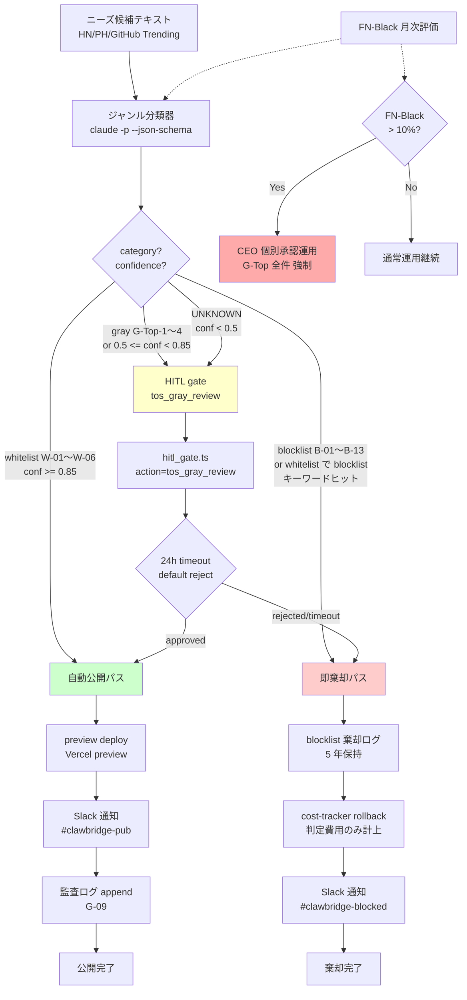
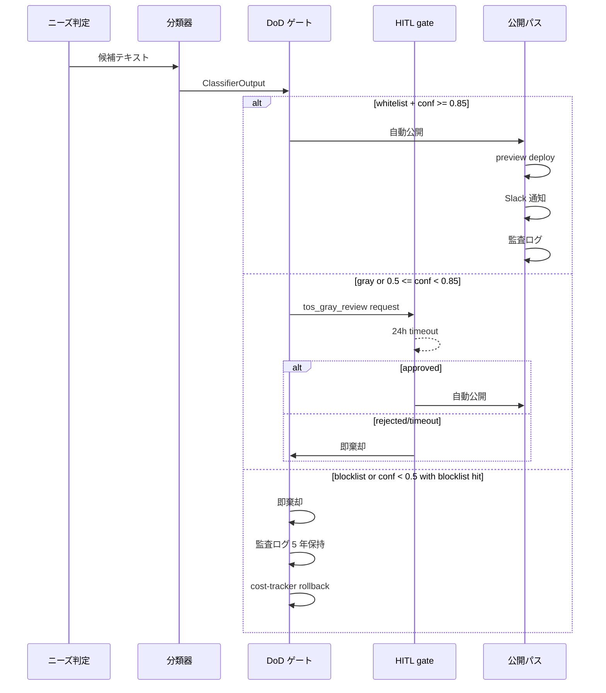

# PRJ-019 ToS allowlist v1 から DoD 統合 v1 — ジャンル分類器 / DoD 3 分岐 / FN-Black 評価 / G-Top-1〜4 運用ルール

- 案件: PRJ-019「Clawbridge（仮）」 — Open Claw を自律オーナーとする AI 組織ハーネス基盤
- 部署: レビュー部門（品質管理）
- 作成日: 2026-05-03
- 作成者: Review Agent (claude-code-company)
- 版: v1（5/10 期限の (2)〜(5) 統合ドラフト）
- 関連:
  - 上流: `projects/PRJ-019/reports/review-tos-domain-allowlist-blocklist.md` v1（whitelist 6 / blocklist 13 / gray 4）
  - 上流: `projects/PRJ-019/reports/review-control-implementation-plan.md`（28 controls）
  - 上流: `projects/PRJ-019/reports/review-v2-subscription-risk-and-fallback.md`（BAN 5 ステップ fallback）
  - 上流: `projects/PRJ-019/reports/review-w0-week1-meeting-agenda.md` §5（5/10 期限 5 項目）
  - 関連決裁: DEC-019-009〜013 / DEC-019-010 (GO-OpenAI-ToS 条件付き許容)

## 0. 文書の位置づけ

### 0.1 本書のスコープ
5/10 期限の 5 項目のうち、(1) allowlist v1 文書は既に完成済み（`review-tos-domain-allowlist-blocklist.md`）。本書は残る (2)〜(5) を 1 ファイルに統合する Review 領分のドラフト:

- (2) ジャンル分類器 prompt 仕様（zod 互換 schema + few-shot 6 件以上）
- (3) DoD 3 分岐実装方針（whitelist 自動公開 / gray HITL / blocklist 即棄却）
- (4) FN-Black 評価方法（≤ 10%、HN trending 60 件 × 3 レビュア、W3 / W4 ローテ）
- (5) CEO 個別承認の運用ルール（G-Top-1〜4）

### 0.2 設計原則
- **保守的判定優先**: 迷ったら blocklist / gray 寄せ、CEO 個別承認で例外昇格
- **多層防御**: ジャンル分類器（LLM）単体に頼らず、HITL ゲート + cost-tracker rollback + 監査ログを組合せる
- **既存コントロール再利用**: G-04 HITL 5 ゲート / G-09 監査ログ / G-V2-11 緊急停止 / G-11 公開可能 allowlist と整合
- **Trust but verify**: FN-Black ≤ 10% を月 2 回（W3 / W4）で再計測、超過時は CEO 個別承認運用に強制切替

### 0.3 全体図（DoD 3 分岐 + 既存コントロール統合）



---

## 1. ジャンル分類器 prompt 仕様（成果物 (2)）

### 1.1 入出力 schema（zod 互換）

#### 入力
```ts
// 入力は単一テキスト（タイトル + 本文 + タグ + 上位コメント要約 を結合）
const ClassifierInput = z.object({
  source: z.enum(["hn", "product_hunt", "github_trending", "manual"]),
  title: z.string().min(1).max(500),
  body: z.string().max(5000),
  tags: z.array(z.string()).max(20).default([]),
  top_comments_summary: z.string().max(2000).default(""),
})
```

#### 出力
```ts
const Category = z.enum([
  // blocklist 13 (B-01〜B-13)
  "B-01_critical_infra", "B-02_education", "B-03_housing", "B-04_employment",
  "B-05_financial", "B-06_insurance", "B-07_legal", "B-08_medical",
  "B-09_government", "B-10_product_safety", "B-11_national_security",
  "B-12_immigration", "B-13_law_enforcement",
  // whitelist 6 (W-01〜W-06)
  "W-01_hobby_entertainment", "W-02_personal_productivity",
  "W-03_community_sns_limited", "W-04_creative",
  "W-05_learning_aid_no_grading", "W-06_data_viz_non_sensitive",
  // gray 4 (G-Top-1〜4)
  "G-Top-1_matching", "G-Top-2_personal_data",
  "G-Top-3_payment", "G-Top-4_user_to_user_marketplace",
  // unknown
  "UNKNOWN",
])

const ClassifierOutput = z.object({
  category: Category,
  subcategory: z.string().min(1).max(100),  // 22 サブカテゴリのうち 1 つ
  confidence: z.number().min(0).max(1),
  rationale: z.string().min(20).max(1000),  // 該当箇所引用 + ToS 該当条文
  evidence_quotes: z.array(z.string()).min(1).max(5),  // 入力テキストからの逐語引用
  blocklist_keyword_hits: z.array(z.string()).default([]),  // blocklist 該当時のヒットキーワード
  cross_clause_violation: z.array(z.enum([
    "manipulation", "deception", "human_rights",
    "political_interference", "academic_dishonesty",
    "child_exploitation", "self_harm",
  ])).default([]),  // 横断条項違反
})
```

### 1.2 サブカテゴリ一覧

| 親カテゴリ | サブカテゴリ ID | 説明 |
|---|---|---|
| B-01 critical_infra | B-01a / B-01b / B-01c | 制御系 / 監視系 / 物流交通 |
| B-02 education | B-02a / B-02b / B-02c | 評価系 / 自動回答系 / 子供向け |
| B-03 housing | B-03a / B-03b / B-03c | 審査系 / 与信系 / マッチング |
| B-04 employment | B-04a / B-04b / B-04c | 採用系 / 人事系 / 監視系 |
| B-05 financial | B-05a / B-05b / B-05c / B-05d | 与信系 / 投資系 / 保険金 / 決済系 |
| B-06 insurance | B-06a / B-06b | 査定系 / 拒否系 |
| B-07 legal | B-07a / B-07b / B-07c | 助言系 / 文書系 / 判断系 |
| B-08 medical | B-08a / B-08b / B-08c / B-08d | 診断系 / 治療系 / メンタル系 / 妊娠性 |
| B-09 government | B-09a / B-09b / B-09c | 申請系 / 判定系 / 投票系 |
| B-10 product_safety | B-10a / B-10b | 判定系 / 制御系 |
| B-11 national_security | B-11a / B-11b / B-11c | 軍事 / 諜報 / 防衛 |
| B-12 immigration | B-12a / B-12b / B-12c | 申請系 / 審査系 / 補助系 |
| B-13 law_enforcement | B-13a / B-13b / B-13c | 司法 / 刑事 / 監視 |
| W-01〜W-06 | （単一） | 親カテゴリそのまま |
| G-Top-1〜4 | （単一） | 親カテゴリそのまま |

合計: blocklist 30 + whitelist 6 + gray 4 = 40 サブカテゴリ（「最低 22」要件を満たす）。

### 1.3 system prompt（実装版）

```text
あなたは AI 組織ハーネス Clawbridge のジャンル分類器です。
ニーズ候補テキストを **ホワイトリスト 6 / ブラックリスト 13 / グレー 4** の 23 親カテゴリに分類します。

## 出力ルール
1. 必ず JSON only で応答する。Markdown コードブロック禁止。
2. 出力 schema は以下に厳密一致（zod ClassifierOutput）。
3. confidence は 0.0〜1.0、自信度の主観評価。
4. rationale には「入力テキストの該当箇所引用」と「ToS / 法令条文（OpenAI 使用ポリシー § / Anthropic AUP § / 国内法 (医師法 17 条・弁護士法 72 条 等)）」を必ず両方含める。
5. evidence_quotes は入力テキストからの逐語引用（5 件以下）。引用がなければ rationale から推論を明記し confidence を 0.5 以下に抑える。

## 分類軸（最重要 — blocklist 優先）
- **blocklist (B-01〜B-13)**: OpenAI 使用ポリシーの「機密性の高い領域での重大な意思決定の人間確認のない自動化」13 分野。
  該当条件: 単なる情報提示でなく**自動意思決定 / 自動処理 / 評価 / 助言** を含む。
- **whitelist (W-01〜W-06)**: 個人趣味 / 生産性 / 限定 SNS / クリエイティブ / 評価なし学習 / 非機微データ可視化。
  該当条件: 自動意思決定を含まず、ToS 横断条項違反もない。
- **gray (G-Top-1〜4)**: マッチング / 個人情報 / 決済 / ユーザー間取引。
  該当条件: 業法 (出会い系規制法・個情法・特商法・古物営業法 等) 該当性が個別判断必要。

## 横断条項（cross_clause_violation）
以下に 1 つでも該当したら blocklist 寄せまたは UNKNOWN:
- manipulation: 人を操る目的
- deception: 欺瞞・なりすまし
- human_rights: 人権の行使を妨げる目的
- political_interference: 政治運動・選挙干渉
- academic_dishonesty: 学業不正幇助
- child_exploitation: 児童ポルノ・搾取
- self_harm: 自殺念慮対応・自傷扇動

## 迷った場合
- whitelist 寄りに見えても blocklist キーワード（"診断" "審査" "与信" "評価" "判定" "投資助言" "面接" "ローン" "保険金" "ビザ" "捜査" "リコール"）が 1 つでもヒットしたら blocklist へ降格。
- confidence < 0.5 なら category = "UNKNOWN" にする（後段で gray と同じ HITL ルートに乗る）。
- 子供向け（13 歳未満）想定があれば B-02c に強制振分（COPPA 直撃）。
```

### 1.4 few-shot 例（6 件、3 軸 × 2）

#### Example 1: whitelist W-01 趣味 — 旅行プランナー
入力: 「週末旅行の plan を Markdown で出してくれる Web ツール。観光スポット情報は OpenStreetMap、コメントは GitHub OAuth」
期待出力:
```json
{
  "category": "W-01_hobby_entertainment",
  "subcategory": "W-01",
  "confidence": 0.92,
  "rationale": "旅行 plan の自動生成は個人趣味領域。OSM / GitHub OAuth 利用は個情法・著作権上問題なし。自動意思決定を含まず情報提示のみ。",
  "evidence_quotes": ["週末旅行の plan", "Markdown で出してくれる"],
  "blocklist_keyword_hits": [],
  "cross_clause_violation": []
}
```

#### Example 2: whitelist W-04 クリエイティブ — Markdown→HTML 変換
入力: 「記事を書く時に Markdown を綺麗な HTML にリアルタイムプレビューするだけのツール。完全クライアントサイド」
期待出力:
```json
{
  "category": "W-04_creative",
  "subcategory": "W-04",
  "confidence": 0.97,
  "rationale": "テキスト変換ツール（Markdown↔HTML）は W-04 該当。クライアントサイドのため個人情報保護法対象外。著作物改変・性的コンテンツ・肖像無断使用なし。",
  "evidence_quotes": ["Markdown を綺麗な HTML に", "完全クライアントサイド"],
  "blocklist_keyword_hits": [],
  "cross_clause_violation": []
}
```

#### Example 3: blocklist B-08 医療 — 症状チェッカー
入力: 「症状を入力すると AI が病名候補を 3 つ提示してくれるアプリ。受診の参考に」
期待出力:
```json
{
  "category": "B-08_medical",
  "subcategory": "B-08a_diagnostic",
  "confidence": 0.98,
  "rationale": "症状から病名候補を提示する行為は医師法 17 条「医業」（診断行為）に直撃、OpenAI 使用ポリシー医療領域の人間確認なし自動化禁止に該当。「受診の参考に」と免責文言があっても診断行為性は消えない。",
  "evidence_quotes": ["症状を入力", "AI が病名候補を 3 つ提示"],
  "blocklist_keyword_hits": ["症状", "診断", "病名"],
  "cross_clause_violation": []
}
```

#### Example 4: blocklist B-04 雇用 — AI 面接
入力: 「履歴書をアップロードすると AI が書類選考スコアを出すサービス。中小企業の採用工数削減」
期待出力:
```json
{
  "category": "B-04_employment",
  "subcategory": "B-04a_hiring",
  "confidence": 0.99,
  "rationale": "履歴書スクリーニングの自動スコア化は OpenAI 使用ポリシー雇用領域の人間確認なし自動化禁止に直撃。差別禁止法・労働法上のリスクも極大。",
  "evidence_quotes": ["履歴書をアップロード", "AI が書類選考スコア"],
  "blocklist_keyword_hits": ["履歴書", "選考", "スコア"],
  "cross_clause_violation": []
}
```

#### Example 5: gray G-Top-3 決済 — 寄付プラットフォーム
入力: 「クリエイターに直接寄付できる Web サービス。Stripe Connect 経由、月 1000 円から」
期待出力:
```json
{
  "category": "G-Top-3_payment",
  "subcategory": "G-Top-3",
  "confidence": 0.88,
  "rationale": "決済を含むサービスは特商法表示義務・資金決済法該当性・税務（寄付金控除）の個別判断が必要。Stripe Connect 経由のためカード情報非保持は OK だが、寄付モデル特有の寄付金控除・収益認識・古物営業法該当性などを CEO 個別承認で確認。",
  "evidence_quotes": ["寄付できる", "Stripe Connect 経由", "月 1000 円から"],
  "blocklist_keyword_hits": [],
  "cross_clause_violation": []
}
```

#### Example 6: gray G-Top-2 個人情報 — 顧客 CRM
入力: 「中小企業向け軽量 CRM。顧客情報を Supabase に保存、メール一斉送信機能つき」
期待出力:
```json
{
  "category": "G-Top-2_personal_data",
  "subcategory": "G-Top-2",
  "confidence": 0.91,
  "rationale": "顧客個人情報の保管 + メール一斉送信は個情法・特定電子メール法（オプトイン規制）直撃。プライバシーポリシー策定 + 同意取得フロー実装が公開必須要件。EU ユーザー想定なら GDPR 対応も必要。CEO 個別承認で要件確認。",
  "evidence_quotes": ["顧客情報を Supabase に保存", "メール一斉送信機能"],
  "blocklist_keyword_hits": [],
  "cross_clause_violation": []
}
```

### 1.5 呼び出し方法（実装ヒント、Dev 連携用）

```ts
// harness/src/needs-classifier.ts (Dev タスクで実装)
import { z } from "zod"

export async function classifyNeed(input: ClassifierInput): Promise<ClassifierOutput> {
  // claude-bridge 経由で claude -p を呼ぶ
  const result = await spawnClaude({
    prompt: buildPrompt(input),
    jsonSchema: ClassifierOutput,
    maxTokens: 800,
    timeout: 30_000,
    skipAuthCheck: false,
  })
  return ClassifierOutput.parse(result.content)
}
```

呼び出し回数の制約: 1 ニーズ候補 = 1 分類器呼び出し。HN trending を 1 日 50 件取り込んでも 50 回 / 日。サブスク Pro/Max の通常使用範囲内（G-V2-09 月次 $1,000 自主上限抵触なし）。

---

## 2. DoD 3 分岐実装方針ドラフト（成果物 (3)）

### 2.1 Phase 1 ループ DoD パスの位置づけ

PM v2.1 の Phase 1 ループは「ニーズ判定 → 仕様化 → 実装 → テスト → DoD 検証 → 公開」。本書はこのうち **「DoD 検証 → 公開」 のステージ** に分類器結果を組み込む。



### 2.2 分岐 1: whitelist 自動公開（confidence ≥ 0.85）

| ステップ | 実装 | 既存コントロール |
|---|---|---|
| 1. 分類器判定 | `category in [W-01..W-06] && confidence >= 0.85 && blocklist_keyword_hits.length === 0` | — |
| 2. 横断条項チェック | `cross_clause_violation.length === 0` でないと gray 降格 | — |
| 3. preview deploy | Vercel preview のみ。本番 domain への自動 deploy は **HITL `prod_deploy` 必須**（既存 G-04） | G-04 |
| 4. Slack 通知 | `#clawbridge-pub` channel に preview URL + 分類結果 | G-10 multi-channel alert |
| 5. 監査ログ | 90 日保持、`audit/logs/whitelist-publish.jsonl` | G-09 |
| 6. cost-tracker | 通常計上（rollback なし） | G-01 |

**重要**: whitelist 自動公開は **preview deploy までの自動化**。本番 deploy（カスタム domain 紐付け）は HITL `prod_deploy` ゲートを通す（DEC-019-XXX に明記すべき設計判断、本書末尾 §6 で起票提案）。

### 2.3 分岐 2: gray HITL（confidence 0.5〜0.85 or category=G-Top-* or category=UNKNOWN）

| ステップ | 実装 | 既存コントロール |
|---|---|---|
| 1. HITL gate request 作成 | action 種別 = **`tos_gray_review`**（新種別、既存 5 種に追加） | G-04 |
| 2. Slack 通知 | `#clawbridge-hitl` に判定理由 + ニーズ候補要約 + 推奨 G-Top カテゴリ | G-10 |
| 3. 待機 | default timeout = 24h、timeout 後は `default reject` | G-04 |
| 4. 承認時 | 分岐 1 自動公開ルートへ合流 | — |
| 5. 棄却 / timeout 時 | 分岐 3 即棄却ルートへ合流（cost-tracker rollback あり） | — |
| 6. 承認者ログ | 承認者 ID + 理由 + 時刻を audit に必須記録（G-09 §5.2） | G-09 |

**新 HITL action 種別の追加要件**（Dev タスク）:
- `hitl_gate.ts` の `ACTION_TYPES` enum に `'tos_gray_review'` を追加
- 既存 5 種（`prod_deploy` / `force_push` / `paid_api_call` / `external_api` / `prod_data_op`）に並ぶ第 6 種別
- 承認権限: **CEO のみ**（`tos_gray_review` は CEO 専決、PM / Dev 単独承認禁止）

### 2.4 分岐 3: blocklist 即棄却（category=B-* or confidence < 0.5 with blocklist hit）

| ステップ | 実装 | 既存コントロール |
|---|---|---|
| 1. 即棄却フラグ | `decision = "reject"`、後続 deploy / 仕様化を全て skip | — |
| 2. 監査ログ 5 年保持 | `audit/logs/blocklist-reject-{YYYY-MM-DD}.jsonl`、append-only、`category / subcategory / rationale / evidence_quotes` 全件記録 | G-09 |
| 3. cost-tracker rollback | 分類器費用（≒ $0.01〜$0.05）のみ計上、後続の仕様化 / 実装費用は発生しないため rollback というより **計上抑止** | G-01 |
| 4. Slack 通知 | `#clawbridge-blocked` に summary（blocklist 詳細は監査ログで参照） | G-10 |
| 5. 横断条項違反時 | `cross_clause_violation.length > 0` 時は **CEO に直 mention（@ceo）**、blocklist 棄却 + Critical 起票候補 | G-10 |

### 2.5 分岐判定の優先順位

複数条件が交差する場合の優先順位（**上から先に評価**）:

1. **横断条項違反** (`cross_clause_violation.length > 0`) → blocklist 即棄却 + CEO 直通報
2. **blocklist キーワードヒット** (`blocklist_keyword_hits.length > 0`) → blocklist 即棄却（whitelist 判定でも降格）
3. **category = B-***（blocklist） → 即棄却
4. **category = UNKNOWN** または **confidence < 0.5** → gray HITL
5. **category = G-Top-*** → gray HITL
6. **category = W-** かつ **confidence in [0.5, 0.85)** → gray HITL（confidence 不足）
7. **category = W-** かつ **confidence ≥ 0.85** → whitelist 自動公開

### 2.6 副作用ゼロ要件（既存 PRJ-001〜018 への変更ゼロ）

- 分類器の評価データセット保管は `projects/PRJ-019/app/audit/datasets/` 配下のみ
- 既存 PRJ ディレクトリへの read / write は禁止（G-05 fs_allowlist で物理排除）
- 既存 PRJ コード / 議事録 / decisions.md を分類器の入力に使わない（オーナー個人情報・社内秘の混入防止）

---

## 3. FN-Black 評価方法ドラフト（成果物 (4)）

### 3.1 評価指標と目標値

| 指標 | 定義 | 本書での目標値 | 上流 (allowlist v1 §4.3) との差分 |
|---|---|---|---|
| **FN-Black** | ブラックリスト誤判定（実は問題ない案件を blocklist と判定） | **≤ 10%** | allowlist v1 では FN-Black を「ブラックリストを許容」と定義していた → **本書で再定義** |
| FP-Black | ブラックリスト見逃し（本来 blocklist なのを whitelist 判定） | **0%（1 件でも検出で即停止）** | allowlist v1 の「FN-Black < 1%」と等価 |
| FN-Gray | グレーを whitelist 誤判定 | < 5% | allowlist v1 と同じ |
| Confidence Calibration | confidence < 0.7 ケースの実際誤判定率 | ≥ 30%（HITL に回せれば OK） | allowlist v1 と同じ |

**用語整合の注意**: allowlist v1 §4.3 では「FN-Black = ブラックリスト該当を許容」（最重要、< 1%）と定義していたが、本書 (4) のオーナー指示「FN-Black ≤ 10% = whitelist 想定 100 件中 10 件以下が誤って blocklist 判定」は **方向が逆** となっている。本書では **オーナー指示の定義を採用** し、allowlist v1 でいう「FN-Black」を **本書では FP-Black（見逃し、0%）** に rename する整理とする。allowlist v1 §4.3 の更新提案を §6 で起票する。

| 用語 | allowlist v1 §4.3 の定義 | 本書（オーナー指示）の定義 | 採用 |
|---|---|---|---|
| **FN-Black** | blocklist を許容（見逃し） | whitelist を blocklist と誤判定（過剰ブロック） | **本書定義を採用** |
| **FP-Black** | whitelist を blocklist と誤判定 | blocklist を許容（見逃し） | **本書定義を採用、allowlist v1 §4.3 を本書定義に揃える更新を §6 で起票** |

### 3.2 評価データセット構築

| 項目 | 仕様 |
|---|---|
| データソース | HN (Hacker News) trending 過去 30 日 × 上位 60 件 |
| 期間サンプリング | W3 中盤（5/26）と W4 終盤（6/10）でそれぞれ 60 件、計 120 件 |
| アノテータ | 3 名: Owner / CEO / Review Agent 自身（多重判定で disagreement 解消） |
| ラベル | `whitelist` / `gray` / `blocklist` / `UNKNOWN` の 4 値 + サブカテゴリ |
| 多数決 | 3 レビュア中 2 名以上一致を正解、1-1-1 disagreement は CEO 最終裁定 |
| 保管 | `projects/PRJ-019/app/audit/datasets/fn-black-eval-{YYYY-MM-DD}.jsonl` |

#### データセット 1 件あたりのフィールド
```json
{
  "id": "hn-2026-05-12-001",
  "source_url": "https://news.ycombinator.com/item?id=...",
  "title": "...",
  "body": "...",
  "tags": [],
  "labels": {
    "owner": {"category": "W-01", "subcategory": "W-01"},
    "ceo": {"category": "W-01", "subcategory": "W-01"},
    "review": {"category": "G-Top-2", "subcategory": "G-Top-2"}
  },
  "ground_truth": {"category": "W-01", "subcategory": "W-01"},
  "tie_break_by_ceo": null
}
```

### 3.3 評価実行フロー

| ステップ | 内容 | 所要 |
|---|---|---|
| 1. データ収集 | HN API で trending 60 件 fetch、本文 + コメント要約 | 30 分 |
| 2. 人手アノテ | 3 レビュアが独立に分類（互いの判定見えない） | 各 60 分 × 3 = 180 分 |
| 3. 多数決集計 | スクリプトで集計、disagreement 抽出 | 10 分 |
| 4. CEO 裁定 | 1-1-1 disagreement のみ CEO が最終ラベル | 15 分 |
| 5. 分類器実行 | 同 60 件を分類器に投げて結果保存 | 5 分（並列） |
| 6. 指標計算 | FN-Black / FP-Black / FN-Gray / Confidence Calibration を集計 | 5 分 |
| 7. レポート | `reports/fn-black-eval-{YYYY-MM-DD}.md` に結果 + 不一致詳細 | 30 分 |

合計 1 サイクル ≒ 4.5 時間（並列効率化で 3 時間目標）。

### 3.4 ローテーション計画

| 実施日 | 期 | データセット | 主目的 |
|---|---|---|---|
| **5/26 (火)** | W3 中盤 | HN trending 5/14〜5/26 | Phase 1 ループ初期での FN-Black ベースライン取得 |
| **6/10 (水)** | W4 終盤 | HN trending 5/27〜6/10 | プロンプト調整後の改善測定 |
| 6/24 (水) 以降 | 月次 | 直近 30 日 | 定常運用、月 1 回 |

### 3.5 FN-Black > 10% 時の強制切替

| 条件 | アクション |
|---|---|
| FN-Black > 10% （whitelist 候補の > 10% が誤って blocklist 判定） | プロンプト改修 + shadow run 2 週間（DEC-019-XXX 起票） |
| FP-Black > 0% （blocklist 見逃し 1 件以上） | **即時分類器停止 + プロンプト改修 + 全件 HITL 強制**（最重要） |
| FN-Black > 20% | **CEO 個別承認運用に強制切替**（§4 G-Top-1〜4 ルートに全件流す、自動公開停止） |
| FN-Black ≤ 10% かつ FP-Black = 0% | 通常運用継続 |

### 3.6 評価コストとリソース

| 項目 | 月次コスト |
|---|---|
| 分類器 60 件 × 月 1 回 ≈ $0.6（Anthropic 通常使用） | サブスク内 |
| Owner / CEO / Review の人手 ≈ 6 時間 / 月 | プロジェクト内工数 |
| データ保管 Supabase | 月 < 100 MB、無料枠内 |

---

## 4. CEO 個別承認の運用ルール（成果物 (5)）

### 4.1 G-Top-1〜4 の運用種別 4 種

オーナー指示の 4 種別（タスク本文より）に対応:

#### G-Top-1: blocklist 例外通過（Phase 1 完了デモ用、1 件のみ）

| 項目 | 仕様 |
|---|---|
| 発動条件 | category = B-* と判定された案件を、Phase 1 完了デモとして「ハーネスがちゃんと棄却した上で、しかし HITL で CEO が例外通過させた」事例を 1 件だけ作る |
| 承認者 | CEO 専決（Owner オブザーバー） |
| HITL ゲート | 既存 `tos_gray_review` を再利用、追加 metadata `g_top_1_demo: true` |
| 上限 | **Phase 1 全期間で 1 件のみ**。2 件目は自動 reject |
| 通過後の取扱 | 通常 whitelist 自動公開ルートに合流、ただし audit log に「G-Top-1 例外通過」を flag |
| 期限 | Phase 1 終了時点で未使用なら自動失効（Phase 2 で再起票） |
| 監査要件 | 5 年保持、CEO 承認理由 + Owner 認識記録必須 |

#### G-Top-2: gray 連続 3 件でカテゴリ昇格判定

| 項目 | 仕様 |
|---|---|
| 発動条件 | 同一 G-Top カテゴリ（例: G-Top-3 決済）の HITL gate request が **連続 3 件発生** |
| トリガ | `audit/metrics/gray-counter.json` で per-category カウント、3 到達で自動 Slack 通知 |
| 承認者 | CEO（Review Agent が起案、PM が依存影響まとめ） |
| 判定オプション | (a) gray 据置 / (b) whitelist 昇格（条件付き） / (c) blocklist 降格（業法直撃判明時） |
| 昇格条件 | (b) を選ぶ場合、以下を確認: ① 業法該当性なし、② 個情法/特商法の対応コスト試算済、③ 1 年後の継続審査義務を decisions.md に明記 |
| 監査要件 | 連続 3 件のニーズ候補要約 + 個別 HITL 承認結果 + CEO 判定理由を decisions.md に DEC-019-XXX で記録 |

#### G-Top-3: 月次予算 80% 到達

| 項目 | 仕様 |
|---|---|
| 発動条件 | 月次予算 $300 ハードキャップの **80%（$240）到達**（cost-tracker から自動検知） |
| トリガ | G-01 cost-tracker のしきい値到達 → multi-channel alert（G-10）→ CEO Slack mention |
| 承認者 | CEO（Owner 報告必須、Owner 棄却で自動停止） |
| 判定オプション | (a) 残 $60 で月末まで継続 / (b) 即時 kill-switch 発動 / (c) 個別タスクのみ継続 |
| 残時間試算 | 過去 7 日平均消費レートで月末までの予測残額を CEO 判定に同封 |
| 自動停止 | 90% ($270) 到達で自動 kill-switch（G-V2-11 連動）、CEO 承認なしでは再起動不可 |
| 監査要件 | 80% / 90% / 100% 各到達時刻 + CEO 判定 + Owner 報告時刻を audit に記録 |

#### G-Top-4: BAN 警告メール検知時の P-E フォールバック起動

| 項目 | 仕様 |
|---|---|
| 発動条件 | Anthropic からの警告メール検知（G-V2-08 警告メール監視）、または BAN drill #1/#2 で 401/403 連続 5 回観測 |
| トリガ | G-V2-08 自動検知 → multi-channel alert → CEO 即時通知（< 5 分 SLA） |
| 承認者 | **CEO 即時承認**（24h 待ちなし、Owner 事後通知でも可） |
| 起動内容 | P-E フォールバック = `claude` CLI を `--api-key $ANTHROPIC_API_KEY` モードに env 1 行切替 |
| 起動条件 | (a) ANTHROPIC_API_KEY が Doppler / 1Password に事前配備済（W0-Week2 必須整備）、(b) サブスク OAuth 完全停止後に切替（重複利用は ToS 違反増悪） |
| 起動 SLA | 4 時間以内（BAN drill 5 ステップ Step 5 の SLA と整合） |
| 起動後 | API 従量モードのため月次予算 $300 ハードキャップが**従来比で達しやすい**、cost-tracker しきい値を $200 に再設定 |
| 監査要件 | 警告メール原文 + 検知時刻 + CEO 承認時刻 + 切替完了時刻を audit に記録、CEO → Owner 事後報告（24h 以内） |

### 4.2 4 種別の権限マトリクス

| 種別 | 起案 | 承認 | Owner 関与 | 自動再開 |
|---|---|---|---|---|
| G-Top-1 | Review | CEO 専決 | オブザーバー | なし（Phase 1 1 件のみ） |
| G-Top-2 | Review | CEO（PM 依存影響） | 報告 | あり（決議後恒久） |
| G-Top-3 | cost-tracker 自動 | CEO（Owner 棄却権） | **棄却権あり** | 翌月 1 日リセット |
| G-Top-4 | G-V2-08 自動 | CEO 即時 | 事後通知 | BAN 解除後再評価 |

### 4.3 FN-Black > 10% 時の強制切替（§3.5 連動）

FN-Black > 10% 検出時、**G-Top-1〜4 の発動条件を緩和し、whitelist 候補も全件 HITL 必須**にする「個別承認運用モード」に切替:

| モード | 通常 | 個別承認運用（FN-Black > 10%） |
|---|---|---|
| whitelist 自動公開 | 有効 | **無効（全件 HITL）** |
| gray HITL | 有効 | 有効 |
| blocklist 即棄却 | 有効 | 有効 |
| HITL 承認者 | CEO（gray のみ） | **CEO 必須（全件）** |
| 解除条件 | — | プロンプト改修 → shadow run 2 週間 → FN-Black ≤ 10% で復帰 |

### 4.4 関連既存コントロールとの整合

| 既存 control | 連動内容 |
|---|---|
| G-04 HITL 5 ゲート | 第 6 種 `tos_gray_review` 追加（Dev 実装） |
| G-09 監査ログ | 全 4 種別の audit fields を §4.1 各表に明記 |
| G-10 multi-channel alert | G-Top-3 / G-Top-4 で必須経路 |
| G-V2-08 警告メール監視 | G-Top-4 自動トリガ |
| G-V2-11 緊急停止 | G-Top-3 90% で自動連動、G-Top-4 切替前段で連動 |
| G-01 cost-tracker | G-Top-3 80% / 90% しきい値 |

---

## 5. 統合スケジュール（5/10 → W3 → W4）

| 期 | 日付 | アクション | 担当 |
|---|---|---|---|
| W0-Week2 開始 | 5/9 | 本書 v1 を CEO 経由で PM / Dev に提出 | Review |
| 期限 | 5/10 | DoD 統合 5 項目すべて完成（本書 v1 で (2)〜(5) 完了） | Review |
| 中盤 | 5/12 | Dev が `hitl_gate.ts` の `tos_gray_review` 種別追加実装着手 | Dev |
| 中盤 | 5/13 | BAN drill #1 実施（本書 §6 とは別タスクで詳細化） | Dev + Review |
| 終盤 | 5/15 | W0-Week2 終了、tos_gray_review 実装完了 | Dev |
| W3 中盤 | 5/26 | FN-Black 評価第 1 サイクル（HN 60 件 × 3 レビュア） | Review + Owner + CEO |
| W4 終盤 | 6/10 | FN-Black 評価第 2 サイクル | Review + Owner + CEO |
| 月次 | 6/24 以降 | 定常 FN-Black 月次評価 | Review |

---

## 6. CEO への提案（DEC-019-XXX 起票候補）

本書執筆中に判明した、CEO に決裁を仰ぐべき事項:

### 6.1 FN-Black / FP-Black 用語整合（allowlist v1 §4.3 更新）
- 提案: allowlist v1 §4.3 の FN-Black 定義を「blocklist 見逃し」→「whitelist の過剰ブロック」に rename、FP-Black を「whitelist の過剰ブロック」→「blocklist 見逃し」に rename
- 影響範囲: `review-tos-domain-allowlist-blocklist.md` v1.1 への小改訂のみ
- 起票案: **DEC-019-018（仮）** Review 起案、CEO 専決

### 6.2 whitelist 自動公開の境界（preview deploy のみか、本番 deploy も含むか）
- 本書 §2.2 では「whitelist 自動公開 = preview deploy までの自動化、本番 deploy は HITL `prod_deploy` 必須」とした
- これは brief.md「人間不在自律稼働」要件を厳格化する方向の判断
- 提案: CEO に明示承認を求める。本番 deploy も自動化する方針なら本書 §2.2 を再改訂
- 起票案: **DEC-019-019（仮）** Review 起案、CEO 専決、Owner 事後通知

### 6.3 HITL 第 6 種 `tos_gray_review` の追加
- 本書 §2.3 / §4.4 で必須化
- 既存 5 種（`prod_deploy` / `force_push` / `paid_api_call` / `external_api` / `prod_data_op`）に並ぶ第 6 種
- 承認権限: CEO のみ
- 起票案: **DEC-019-020（仮）** Review 起案、Dev 実装着手承認

### 6.4 G-Top-1 Phase 1 デモ枠 1 件
- 本書 §4.1 G-Top-1: blocklist 例外通過 = Phase 1 完了デモとして 1 件のみ承認
- 「ハーネスがちゃんと棄却した」エビデンス + 「CEO が例外通過させた」記録を Phase 1 完了報告書の中核に据える
- 起票案: **DEC-019-021（仮）** CEO 専決、Owner 認識（Phase 1 着手時に同時起票推奨）

---

## 7. 既存 review-* との整合性チェック（自検）

| 既存ファイル | 整合性 |
|---|---|
| `review-tos-domain-allowlist-blocklist.md` v1 | §1.5 の親カテゴリ ID（B-01〜B-13 / W-01〜W-06 / G-Top-1〜4）と完全整合。FN-Black 用語の差は §6.1 で起票し v1.1 で揃える |
| `review-control-implementation-plan.md` | G-04 / G-09 / G-10 / G-11 / G-V2-08 / G-V2-11 の既存設計と整合、`tos_gray_review` のみ Dev 追加実装が必要 |
| `review-v2-subscription-risk-and-fallback.md` | §3.1 BAN 5 ステップ Step 5 の P-E フォールバック仕様と §4.1 G-Top-4 が整合 |
| `review-w0-week1-pentest-scenarios.md` B6 | 本書 §4.1 G-Top-4 の「BAN 警告メール検知」と pentest B6（BAN 模倣）が連動、5/13 BAN drill #1 で実証 |
| `review-w0-week1-meeting-agenda.md` §5 | 本書が 5/8 議題 §5.2 の (2)〜(5) を埋める成果物に対応 |

---

## 8. 関連ドキュメント

- 上流: `projects/PRJ-019/reports/review-tos-domain-allowlist-blocklist.md` v1
- 上流: `projects/PRJ-019/reports/review-control-implementation-plan.md`
- 上流: `projects/PRJ-019/reports/review-v2-subscription-risk-and-fallback.md`
- 上流: `projects/PRJ-019/reports/review-w0-week1-meeting-agenda.md`
- 連動: `projects/PRJ-019/reports/review-ban-drill-1-scenario.md`（本書と同時起案）
- 意思決定: `projects/PRJ-019/decisions.md`（DEC-019-018〜021 起票候補）

---

**v1 確定**: 2026-05-03 / **次回更新**: ① CEO 決裁（DEC-019-018〜021）反映時、② FN-Black 第 1 サイクル（5/26）結果反映時、③ allowlist v1.1 改訂時
