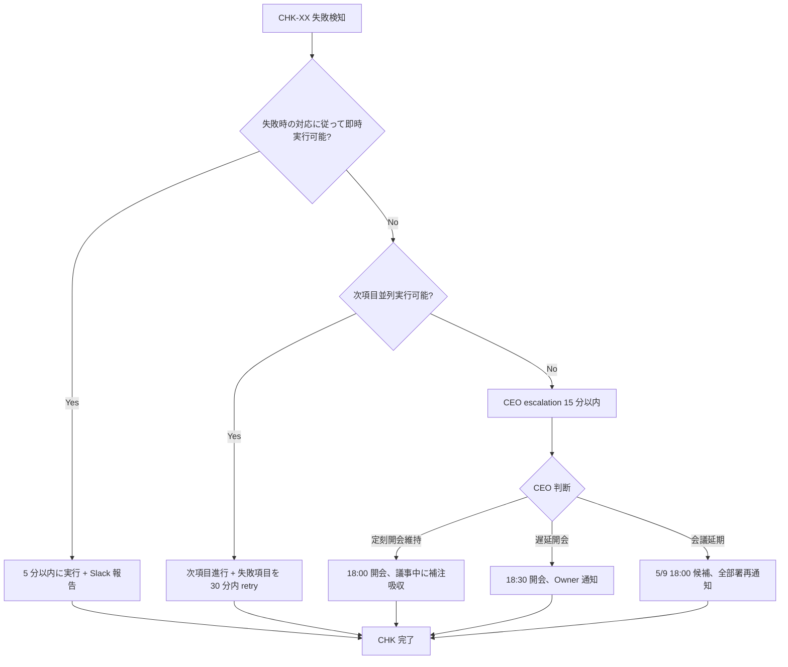

最終更新: 2026-05-04 / 起案: 秘書部門 / 適用: 2026-05-07 EOD 〜 2026-05-08 17:30 JST

# PRJ-019 5/8 W0-Week1 検収会議 開会前チェックリスト

- 案件: PRJ-019「Clawbridge」
- 文書種別: 5/8 18:00 開会前チェックリスト（CEO + 秘書 共同確認）
- 適用期間: 2026-05-07 EOD 〜 2026-05-08 17:59 JST（22h ウィンドウ）
- 親文書: `secretary-5-8-meeting-package-final.md` / `secretary-agenda-v7.md`
- 目的: 5/8 18:00 開会時点で配布物完備 / 部署成果物 cross-reference 整合 / 議事進行準備完了 / Owner 受領完了 を 100% 担保する

---

## §1 概要 + 運用ルール

### §1.1 30 項目構成

5 カテゴリ × 6 項目 = 30 項目を時系列で配列。各項目 = チェック内容 + 担当 + 完了期限 + 失敗時の対応 を明記。

| カテゴリ | 期間 | 件数 | 主要担当 |
|---|---|---|---|
| 5/7 EOD まで（配布最終化） | 5/7 18:00 〜 22:00 | 6 | 秘書 + CEO |
| 5/8 朝（部署最終確認） | 5/8 09:00 〜 12:00 | 6 | CEO（各部署リーダー連携） |
| 5/8 16:00（2h 前、印刷 + 通知） | 5/8 16:00 〜 17:00 | 6 | 秘書 |
| 5/8 17:30（30min 前、Slack + テンプレ起動） | 5/8 17:30 〜 17:55 | 6 | 秘書 + CEO |
| 5/8 18:00（開会直前） | 5/8 17:55 〜 18:00 | 6 | CEO（議事進行） |
| **計** | — | **30** | — |

### §1.2 運用ルール

1. 各項目はチェック完了時に Slack `#prj019-monitor` に「完了 + 担当 + 時刻」を post
2. 失敗時の対応は「即時実行（5 分以内）」「次項目並列実行」「CEO escalation（15 分以内）」の 3 段階
3. 5/8 17:30 時点で未完了項目が 5 件以上ある場合、CEO 判断で開会を 30 分遅延（18:30 開会に変更可）
4. 全 30 項目完了後、CEO + 秘書が同時に「開会準備完了」を Slack に宣言

---

## §2 5/7 EOD まで（6 項目、配布最終化）

### CHK-01: 配布資料パッケージ 8 ファイル完成確認

- **チェック内容**: `secretary-5-8-meeting-package-final.md` §3 の 8 ファイルすべてが `projects/PRJ-019/reports/` 配下に存在し、最終版（v7 / v3.1 / v2.2 / v3）であること
- **担当**: 秘書部門
- **完了期限**: 2026-05-07 18:00 JST
- **失敗時の対応**: 不足ファイルを 5/7 19:00 までに緊急起案（CEO 経由で該当部署へ依頼）。間に合わない場合は CEO 判断で代替版（前版 v6 / v3 / v2.1 / v2）を一時配布

### CHK-02: 8 ファイル Slack DM 配布実行

- **チェック内容**: Owner / CEO / 全部署リーダー 9 名に対し、`#prj019-meeting` post + 個別 DM 配布実施
- **担当**: 秘書部門
- **完了期限**: 2026-05-07 22:00 JST
- **失敗時の対応**: DM 失敗時は Slack `#prj019-monitor` に手動 mention で代替通知。Owner 個別 DM 失敗時は CEO 経由でメール配布

### CHK-03: 1Password Vault PRJ-019 への 8 ファイル store

- **チェック内容**: 1Password TOTP 二要素認証経由（議決-12 既決）で PRJ-019 vault に 8 ファイルを store、Owner / CEO アクセス権限確認
- **担当**: 秘書部門（CEO 立会い）
- **完了期限**: 2026-05-07 21:00 JST
- **失敗時の対応**: TOTP 認証失敗時は Owner に直接 1Password 復旧依頼、5/8 当日朝までに復旧確認。間に合わない場合は Slack 配布のみで運用

### CHK-04: 部署成果物 cross-reference 整合確認

- **チェック内容**: 議題 v7 / Risk Register v3.1 / PM v2.2 / CEO 連結報告 v7 の 4 文書間でのリスク ID（R-019-19/20/21/22）/ 議決番号（議決-20〜24）/ 確度数値（5/22 82% / 5/26 86% / 6/20 77%）の整合性を grep で確認
- **担当**: 秘書部門
- **完了期限**: 2026-05-07 20:00 JST
- **失敗時の対応**: 不整合検知時は CEO escalation、該当部署リーダーに 5/7 21:00 までに修正依頼。間に合わない場合は議事中に補注口頭追加で吸収

### CHK-05: 議題 v7 漏れチェック（議決 20 件 + 既存議題影響補注）

- **チェック内容**: `secretary-agenda-v7.md` §6 議決-1〜15 補注（条件追記 / cap 注記 / 確度上昇）+ §6.2 議決-20〜24 詳細記載 / §10 時間検算 148 分 → 90〜105 分圧縮運用記載 が完備していること
- **担当**: 秘書部門
- **完了期限**: 2026-05-07 19:00 JST
- **失敗時の対応**: 漏れ検知時は秘書部門が 5/7 20:00 までに即時補完。CEO + 秘書で再 review

### CHK-06: cover letter v3 配布 + 事前回答テンプレ受領状況確認

- **チェック内容**: `secretary-cover-letter-v3.md` §6 の事前回答テンプレを Owner + 全部署リーダー 9 名から 5/7 22:00 までに収集（議決 1〜20 賛成/反対/保留）
- **担当**: 秘書部門
- **完了期限**: 2026-05-07 22:30 JST
- **失敗時の対応**: 22:00 時点で未回収 ≥ 3 件の場合、CEO 経由で個別リマインド DM 送付。Owner 未回答時は 5/8 朝に直接 Owner 確認、議事中に口頭で受領

---

## §3 5/8 朝（6 項目、部署最終確認 + インフラ確認）

### CHK-07: PM v2.2 公式承認状態確認

- **チェック内容**: PM 部門 5/6 朝期限の `pm-phase1-plan-v2.2.md` が公式版として decisions.md / dashboard に反映済みであること
- **担当**: CEO + PM 部門リーダー
- **完了期限**: 2026-05-08 09:30 JST
- **失敗時の対応**: 反映漏れ時は秘書が 10:00 までに反映実行。decisions.md footer v11→v12 改版確認

### CHK-08: Dev W0-Week2 WBS 細分化確認

- **チェック内容**: Dev 部門 5/5 朝期限の W0-Week2 5 必須施策 WBS 細分化（SP 配分含む）が完備、Slack `#prj019-dev` で告知済み
- **担当**: CEO + Dev 部門リーダー
- **完了期限**: 2026-05-08 10:00 JST
- **失敗時の対応**: WBS 未完成時は議事中 §3.1 で口頭報告に切替、5/9 朝までに完成期限延期

### CHK-09: Review 部門 acceptance criteria 起案確認

- **チェック内容**: Review 部門 5/9 朝期限の mock-claude 70% 化 acceptance criteria（議決-23 連動）が起案準備中（5/8 議決後 24h 以内に起案開始）であること
- **担当**: CEO + Review 部門リーダー
- **完了期限**: 2026-05-08 10:30 JST
- **失敗時の対応**: 準備未完了時は議事 §6 議決-23 採択時に Review が起案開始日を口頭明示

### CHK-10: Research 部門 5/30 議題追加確認 + mainline status

- **チェック内容**: Research 部門が 5/30 W2 終了時会議用「subscription 主軸での実消費ベースライン」議題追加準備済、上流 OpenClaw / Anthropic changelog 監視が直近 7 日緑であること
- **担当**: CEO + Research 部門リーダー
- **完了期限**: 2026-05-08 11:00 JST
- **失敗時の対応**: changelog に黄/赤検知時は議事 §2.2 で Research が口頭報告、議決-14（DEC-019-035 SOP）の補注追加

### CHK-11: 1Password TOTP / Anthropic Console 設定確認

- **チェック内容**: Owner 1Password TOTP（議決-12）+ Anthropic Console Hard $30 / Soft $25（DEC-019-050、6/1 リセット）+ Slack `#prj019-monitor` / `#prj019-drill` channel 動作確認
- **担当**: 秘書部門 + Dev 部門
- **完了期限**: 2026-05-08 11:30 JST
- **失敗時の対応**: TOTP 失敗時は Owner 復旧依頼、Console 設定失効時は Dev が緊急 setup（5/8 14:00 まで）。間に合わない場合は議事 §6 議決-20/-21/-23 採択時に補注追加

### CHK-12: Slack channel 設定 + bot 通知準備確認

- **チェック内容**: `#prj019-meeting`（議事録同期）/ `#prj019-monitor`（タイムキーピング）/ `#prj019-drill`（HIGH escalation 用）の 3 channel が稼働、cost-watcher.ts cron 通知 + 議事録 bot 設定済み
- **担当**: 秘書部門 + Dev 部門
- **完了期限**: 2026-05-08 12:00 JST
- **失敗時の対応**: channel 失効時は Dev が 5/8 14:00 までに復旧、bot 設定失敗時は秘書が手動議事録運用に切替（議事録 v3 テンプレ手動記入）

---

## §4 5/8 16:00 / 2h 前（6 項目、印刷 + 通知 + 開会挨拶）

### CHK-13: 議題 v7 quick reference card 印刷 / PDF 出力

- **チェック内容**: `secretary-5-8-meeting-package-final.md` §5 議決-20〜24 quick reference card（各 60 字サマリ）を A4 1 枚 PDF 化、Owner 用に Slack DM 送付
- **担当**: 秘書部門
- **完了期限**: 2026-05-08 16:30 JST
- **失敗時の対応**: PDF 出力失敗時は MD のまま Slack DM、Owner にプレビュー画面共有

### CHK-14: Slack `#prj019-meeting` 開会通知 post 準備

- **チェック内容**: 5/8 17:00 / 17:30 / 17:50 / 18:00 の 4 時点で post する開会通知文面（議題 v7 リンク + 議決 20 件サマリ + Zoom URL + 議事録テンプレ v3 リンク）を秘書が下書き完成
- **担当**: 秘書部門
- **完了期限**: 2026-05-08 16:30 JST
- **失敗時の対応**: 文面未完成時は cover letter v3 §1〜§5 を再利用、リンクのみ追加で簡易告知

### CHK-15: CEO 開会挨拶原稿準備

- **チェック内容**: CEO が議題 v7 §1 開催情報 + §2 進捗報告 5 部署サマリ + §6 議決 20 件 CEO 推奨先行宣言（YES 全件）+ Owner への謝意表明 を含む 3 分原稿を準備
- **担当**: CEO
- **完了期限**: 2026-05-08 17:00 JST
- **失敗時の対応**: 原稿未完成時は CEO 連結報告 v7 §1 エグゼクティブサマリ 300 字 + 議題 v7 §0 v6→v7 差分 を即興で読み上げ

### CHK-16: 議事進行 timeline 印刷（CEO 手元用）

- **チェック内容**: パッケージ §9.1 標準運用（実議事 105 分）+ §9.2 圧縮運用（90 分）+ §9.3 タイムキーピング を A4 1 枚に集約、CEO 手元用に印刷 / PDF
- **担当**: 秘書部門
- **完了期限**: 2026-05-08 17:00 JST
- **失敗時の対応**: 印刷失敗時はモバイル PDF で代替、CEO がスマホ参照で運用

### CHK-17: Owner 受領確認再リマインド

- **チェック内容**: 5/7 EOD 配布した 8 ファイルパッケージの Owner 受領確認、未受領時は Slack DM + 1Password Vault リンク再送
- **担当**: 秘書部門
- **完了期限**: 2026-05-08 17:00 JST
- **失敗時の対応**: 受領未確認時は CEO 経由で Owner に直接 Slack DM、5/8 17:30 までに受領確認獲得

### CHK-18: 緊急介入トリガー確認（cap 監視 / drill 体制）

- **チェック内容**: cost-monitor.ts spend ≥ $24 (warn) / ≥ $28.5 (auto_stop) / ≥ $30 (hard_fail) のトリガーが 5/4-5/8 期間中に発火していないこと、drill #2 当日除外（DEC-019-031）が有効であること
- **担当**: 秘書部門 + Dev 部門
- **完了期限**: 2026-05-08 17:00 JST
- **失敗時の対応**: trigger 発火検知時は議事 §6 議決-20/-21/-23 で口頭報告、Owner 即時通知 + CEO 議事順序入れ替え判断

---

## §5 5/8 17:30 / 30min 前（6 項目、Slack 接続 + テンプレ起動 + 議決投票方法確認）

### CHK-19: Zoom / Slack 接続テスト

- **チェック内容**: 全部署リーダー 9 名 + Owner の Zoom / Slack 接続テスト実施、音声 / カメラ動作確認
- **担当**: 秘書部門
- **完了期限**: 2026-05-08 17:40 JST
- **失敗時の対応**: 接続失敗時は該当部署に予備接続経路（電話 / 別 PC）連絡。Owner 接続失敗時は 5/8 18:00 開会を 15 分遅延

### CHK-20: 議事録テンプレ v3 起動 + 共同編集権限確認

- **チェック内容**: `secretary-w0-week1-meeting-minutes-template-v3.md` を Google Docs / Notion 等に複製、書記（秘書）+ 全部署 view 権限 + CEO edit 権限を設定
- **担当**: 秘書部門
- **完了期限**: 2026-05-08 17:45 JST
- **失敗時の対応**: 共同編集設定失敗時は秘書がローカル MD で運用、議事録は会議後 1h 以内に Slack post

### CHK-21: 議決投票方法確認（CEO 推奨 YES 先行 → Owner 賛否確認）

- **チェック内容**: 議決-1〜20 各議決での投票プロトコル「CEO 推奨案提示 → Owner 賛否確認 → 異議受付 30 秒 → 採決」を CEO + 秘書で再確認
- **担当**: CEO + 秘書部門
- **完了期限**: 2026-05-08 17:45 JST
- **失敗時の対応**: プロトコル混乱防止のため、議事録テンプレ v3 §3 投票プロトコル詳細を 5/8 18:00 開会時に口頭再確認

### CHK-22: タイムキーピング bot 起動

- **チェック内容**: `#prj019-monitor` の 5 分単位残り時間アナウンス bot が起動、議題超過時の CEO 通知ロジック動作確認
- **担当**: 秘書部門 + Dev 部門
- **完了期限**: 2026-05-08 17:50 JST
- **失敗時の対応**: bot 起動失敗時は秘書が手動でタイマー運用（5 分単位）、CEO に都度メンション

### CHK-23: Owner 在席確認 + DEC 既決分再確認準備

- **チェック内容**: Owner が 5/8 18:00 在席予定であること、DEC-019-021〜025 / DEC-019-026〜030 / DEC-020-001〜003 計 13 件の Owner 直接面前再確認 / 受領確認準備（議事録テンプレ v2 → v3 の §5 連動）
- **担当**: CEO + 秘書部門
- **完了期限**: 2026-05-08 17:55 JST
- **失敗時の対応**: Owner 在席不可時は 48h 内回付（書面再確認）に切替、議事は CEO 推奨 YES で進行

### CHK-24: Risk Register v3.1 配布完了確認

- **チェック内容**: 5/9 朝までに `secretary-risk-register-v3-1.md` を全部署リーダーに配布する旨を CEO 議事中 §6 議決-21 採択時に告知準備
- **担当**: 秘書部門
- **完了期限**: 2026-05-08 17:55 JST
- **失敗時の対応**: 配布告知漏れ時は議事録 v3 §6 議決-21 採択結果に補注記載

---

## §6 5/8 18:00 開会直前（6 項目、出席確認 + 配布物完備 + Owner 受領）

### CHK-25: 出席確認（9 部署 + Owner = 10 名）

- **チェック内容**: CEO / Dev / Research / Review / PM / Marketing / 秘書 / 広報 Web 運営 / 担当部署リーダー + Owner の出席を Zoom + Slack で確認、議事録テンプレ v3 §1.2 メタ情報セクションに記録
- **担当**: CEO（議長）
- **完了期限**: 2026-05-08 18:02 JST
- **失敗時の対応**: 必須部署（Dev / Research / Review / PM / Owner）欠席時は開会を 15 分遅延、復旧不可なら議事 §6 該当議決を次回会議に持越し

### CHK-26: 配布物完備確認（8 ファイル + 1 quick reference card）

- **チェック内容**: 全出席者が 8 ファイルパッケージ + quick reference card（議決-20〜24 60 字サマリ）にアクセス可能であること、画面共有で 1 ファイルずつ確認
- **担当**: 秘書部門
- **完了期限**: 2026-05-08 18:03 JST
- **失敗時の対応**: アクセス不可者にはその場で Slack DM 再送、Owner アクセス不可時は 5 分内に 1Password 復旧

### CHK-27: Owner 受領確認 + 事前回答収集状況サマリ口頭報告

- **チェック内容**: 秘書部門が Owner + 全部署 9 名の事前回答収集状況（議決-1〜20 の賛成/反対/保留集計）を CEO に口頭報告、議事録 §1 に記録
- **担当**: 秘書部門
- **完了期限**: 2026-05-08 18:04 JST
- **失敗時の対応**: 事前回答未収集 ≥ 3 件の場合、CEO が議事 §7 質疑応答時間を +5 分拡張で吸収

### CHK-28: 議事録テンプレ v3 起動 + 書記体制確認

- **チェック内容**: 議事録テンプレ v3 が共同編集可能状態で起動、書記（秘書部門）が realtime 記録準備完了、CEO が edit 権限確認
- **担当**: 秘書部門 + CEO
- **完了期限**: 2026-05-08 18:05 JST
- **失敗時の対応**: 起動失敗時は v3 ローカル MD を秘書が Slack post で運用、20:30 までに正式版に統合

### CHK-29: タイムキーピング開始宣言

- **チェック内容**: 秘書が「18:00 開会、105 分実議事 / 90 分圧縮運用、5 分単位残り時間アナウンス開始」を Slack `#prj019-monitor` に post
- **担当**: 秘書部門
- **完了期限**: 2026-05-08 18:05 JST
- **失敗時の対応**: 自動 bot 失効時は秘書が手動アラーム（5 分タイマー × 21 回）で運用

### CHK-30: 開会宣言 + 議事進行開始

- **チェック内容**: CEO が「PRJ-019 W0-Week1 検収会議 v7（議決 20 件版）開会」を宣言、§1 開催情報確認 → §2 進捗報告へ移行
- **担当**: CEO（議長）
- **完了期限**: 2026-05-08 18:05 JST
- **失敗時の対応**: 開会遅延時は秘書が議事録に「開会 18:XX、X 分遅延、理由 = ...」と記録、§7 質疑応答を圧縮で吸収

---

## §7 完了確認サマリ表

5/8 17:55 時点で全 30 項目の完了状況を秘書部門が下表で集計、Slack `#prj019-monitor` に post:

| カテゴリ | 完了 / 全 | 達成率 | 失敗時 escalation 件数 |
|---|---|---|---|
| 5/7 EOD まで | _/6 | _% | _ |
| 5/8 朝 | _/6 | _% | _ |
| 5/8 16:00 | _/6 | _% | _ |
| 5/8 17:30 | _/6 | _% | _ |
| 5/8 18:00 開会直前 | _/6 | _% | _ |
| **計** | **_/30** | **_%** | **_** |

**開会判定基準**:
- 達成率 ≥ 95%（28+/30）→ 18:00 定刻開会
- 達成率 90〜94%（27/30）→ CEO 判断で 18:00 開会または 15 分遅延
- 達成率 < 90%（< 27/30）→ 18:30 開会または会議延期（5/9 18:00 候補）

---

## §8 失敗時 escalation フロー

---

## §9 関連資料

- 配布資料パッケージ FINAL: `secretary-5-8-meeting-package-final.md`
- 議題 v7: `secretary-agenda-v7.md`
- Risk Register v3.1: `secretary-risk-register-v3-1.md`
- 議事録テンプレ v3: `secretary-w0-week1-meeting-minutes-template-v3.md`
- CEO 連結報告 v7: `ceo-owner-consolidated-v7.md`
- PM Phase 1 計画 v2.2: `pm-phase1-plan-v2.2.md`
- 配布カバーレター v3: `secretary-cover-letter-v3.md`
- 議事録テンプレ v2 親文書: `secretary-w0-week1-meeting-minutes-template-v2.md`

---

## フッタ

- 文書: `projects/PRJ-019/reports/secretary-5-8-pre-meeting-checklist.md`
- 版: v1.0 (2026-05-04)
- 起案: 秘書部門
- 検収: CEO（5/8 17:55 時点で達成率確認 → 開会判定）
- 次回更新: 2026-05-08 22:00（チェックリスト実績反映 + 失敗 escalation 件数集計）
