# PRJ-019 Clawbridge — Owner W0 4 営業日 進捗トラッカー (2026-05-04 〜 2026-05-07)

**制定日**: 2026-05-03
**制定**: 秘書部門
**経由**: CEO
**宛**: Owner
**対象期間**: 2026-05-04 (月) 〜 2026-05-07 (木) 4 営業日
**前提文書**: `secretary-owner-w0-setup-guide.md` (38 項目を 4 営業日に再分配)
**更新トリガー**: 各日 18:00 CEO 進捗確認時 + Owner セルフチェック完了時

---

## §0 サマリ

### §0.1 200 字サマリ

PRJ-019 W0 期間中に Owner が 4 営業日 (5/4〜5/7) で完遂すべき実務 4 段階 (1Password Vault 構築 2 日 + Spend Cap 設定 + OAuth 隔離検証 + W0 セルフチェック & 5/8 検収会議リハ) を 1 日 8〜10 タスクに圧縮した進捗トラッカーです。Q-Mkt 8 件即決により 5/4 朝 30〜45 分が解放され、4 日合計工数は約 4 時間に収束しました。Owner セルフチェック日次 5 項目 + CEO 進捗確認 18:00 + トラブルシュート 8 件で完遂を担保します。

### §0.2 4 営業日合計工数 (Q-Mkt 解放後の最終見積)

| 日 | 内容 | 工数 (Owner 実機操作) | 備考 |
|---|---|---|---|
| 5/4 (月) | 1Password Vault 構築 1 日目 (Master + Dev) | 約 50 min | Q-Mkt 30〜45 min 解放分を Vault 構築バッファに充当 |
| 5/5 (火) | 1Password Vault 構築 2 日目 + Spend Cap 設定 | 約 70 min | Anthropic + ChatGPT Pro + 月次 $300 |
| 5/6 (水) | OAuth 隔離検証 (Win11 + WSL2 + AppArmor/TCC) | 約 60 min | PowerShell + WSL2 bash コマンド実行 |
| 5/7 (木) | W0 セルフチェック 7 項目 + 5/8 検収会議リハ | 約 60 min | 議事録 v2 印刷 + 議題 v4 一読含む |
| **合計** | — | **約 4 時間 (240 min)** | Q-Mkt 即決前 4.5h → 解放後 4.0h |

### §0.3 進捗ステータスマーカー

| マーカー | 意味 |
|---|---|
| `[ ]` | 未着手 |
| `[~]` | 実施中 |
| `[x]` | 完了 |
| `[!]` | ブロッカー発生 (CEO エスカレーション要) |
| `[/]` | 翌日繰越 (Owner 判断で先送り) |

---

## §1 5/4 (月) — 1Password Vault 構築 1 日目

### §1.1 当日のゴール

| 項目 | 内容 |
|---|---|
| メインタスク | Master Vault + Dev Vault 構築 + Master 3 アイテム格納 |
| サブタスク | Owner セルフチェック 5 項目 + 18:00 CEO 進捗確認 |
| 想定工数 | 約 50 min (午前 30 min + 午後 20 min) |
| 完了基準 | Master / Dev Vault 作成済 + Master Vault に 3 件格納済 |

### §1.2 タスク 8 項目 (午前/午後 振り分け)

| # | 時間帯 | タスク | 想定 (min) | 参照 | ステータス |
|---|---|---|---|---|---|
| T1.1 | 09:00-09:05 | 1Password 8 デスクトップアプリ起動 + ログイン (24 文字以上 Master Password + 2FA) | 5 | §2.2.1 | `[ ]` |
| T1.2 | 09:05-09:15 | Master Vault 作成 (赤アイコン / 機密度 S) | 10 | §2.2.1 | `[ ]` |
| T1.3 | 09:15-09:20 | Dev Vault 作成 (青アイコン / 機密度 A) | 5 | §2.2.1 | `[ ]` |
| T1.4 | 09:20-09:30 | `op` CLI インストール確認 + `op signin` で local 認証 | 10 | §2.2.4 | `[ ]` |
| T1.5 | 14:00-14:05 | Anthropic Max OAuth を Master Vault に格納 (`Anthropic-OAuth-Owner`) | 5 | §2.3 5/4 | `[ ]` |
| T1.6 | 14:05-14:10 | ChatGPT Pro OAuth を Master Vault に格納 (`OpenAI-OAuth-Owner`) | 5 | §2.3 5/4 | `[ ]` |
| T1.7 | 14:10-14:15 | Anthropic 警告メールフィルタ ID を Master Vault に Secure Note 格納 | 5 | §3.4.2 | `[ ]` |
| T1.8 | 14:15-14:20 | Recovery Key を紙印刷 → 物理保管庫へ (耐火金庫推奨) | 5 | §2.2.4 | `[ ]` |

### §1.3 Owner セルフチェック 5 項目 (17:30 実施)

| # | チェック項目 | 期待結果 | ステータス |
|---|---|---|---|
| C1.1 | Master Vault が 1Password サイドバーに表示される | 赤アイコンで「Clawbridge-Master」表示 | `[ ]` |
| C1.2 | Dev Vault が 1Password サイドバーに表示される | 青アイコンで「Clawbridge-Dev」表示 | `[ ]` |
| C1.3 | Master Vault に 3 アイテム格納済 | Anthropic OAuth / OpenAI OAuth / フィルタ ID | `[ ]` |
| C1.4 | `op vault list` で Master / Dev が CLI から見える | 両 Vault 名が標準出力に出現 | `[ ]` |
| C1.5 | Recovery Key 紙印刷 + 物理保管完了 | 耐火金庫または鍵付き引き出しに格納済 | `[ ]` |

### §1.4 18:00 CEO 進捗確認

| 報告項目 | 形式 | 例 |
|---|---|---|
| 完了タスク数 | `T1.x / 8` | `T1.1〜T1.8 完了` |
| ブロッカー | 箇条書き or なし | なし / 1Password 2FA 設定で 10 min 超過 |
| 翌日繰越 | タスク ID | なし / T1.7 を 5/5 朝に繰越 |
| Owner 体感負荷 | 5 段階 | 1 (軽い) 〜 5 (重い) |

---

## §2 5/5 (火) — 1Password Vault 構築 2 日目 + Spend Cap 設定

### §2.1 当日のゴール

| 項目 | 内容 |
|---|---|
| メインタスク | Notify Vault + Public Vault 構築 + Anthropic/ChatGPT Spend Cap + 月次 $300 ハードキャップ |
| サブタスク | Owner セルフチェック 5 項目 + 18:00 CEO 進捗確認 |
| 想定工数 | 約 70 min (午前 35 min + 午後 35 min) |
| 完了基準 | 4 Vault 全構築済 + Anthropic Max extra usage OFF + ChatGPT Pro Codex 5x 確認済 |

### §2.2 タスク 10 項目

| # | 時間帯 | タスク | 想定 (min) | 参照 | ステータス |
|---|---|---|---|---|---|
| T2.1 | 09:00-09:05 | Notify Vault 作成 (緑アイコン / 機密度 B) | 5 | §2.2.1 | `[ ]` |
| T2.2 | 09:05-09:10 | Public Vault 作成 (灰アイコン / 機密度 C) | 5 | §2.2.1 | `[ ]` |
| T2.3 | 09:10-09:25 | GitHub PAT (`GitHub-PAT-clawbridge-prod`) を Dev Vault に格納 | 15 | §2.3 5/5 | `[ ]` |
| T2.4 | 09:25-09:35 | Vercel API Token (`Vercel-Token-clawbridge-prod`) を Dev Vault に格納 (Project-level scope) | 10 | §2.3 5/5 + §6.1 | `[ ]` |
| T2.5 | 14:00-14:10 | Anthropic Console → Billing → Monthly spend limit $200 確認 | 10 | §3.1.2 | `[ ]` |
| T2.6 | 14:10-14:15 | Anthropic「Auto-charge for additional usage」OFF + 確認モーダル承認 | 5 | §3.1.3 (DEC-019-015 H-10) | `[ ]` |
| T2.7 | 14:15-14:25 | Anthropic Usage Alerts に 80% / 95% の 2 段階アラート追加 | 10 | §3.1.5 | `[ ]` |
| T2.8 | 14:25-14:30 | ChatGPT Settings → Subscription で Pro plan ($200/月 + Codex 5x) 確認 | 5 | §3.2.1〜§3.2.2 | `[ ]` |
| T2.9 | 14:30-14:32 | Google Calendar に「Codex 2x ボーナス終了 5/31」を 5/24 / 5/30 リマインダ設定 | 2 | §3.2.4 | `[ ]` |
| T2.10 | 14:32-14:35 | 月次 $300 ハードキャップは W1 cost_check 自動化想定、Owner 側手動週 1 確認の旨をメモ | 3 | §3.3.3 | `[ ]` |

### §2.3 Owner セルフチェック 5 項目 (17:30 実施)

| # | チェック項目 | 期待結果 | ステータス |
|---|---|---|---|
| C2.1 | Notify / Public Vault が 1Password サイドバーに表示される | 緑 + 灰アイコンで両 Vault 表示 | `[ ]` |
| C2.2 | Dev Vault に 2 アイテム (GitHub PAT + Vercel Token) 格納済 | `op item list --vault Clawbridge-Dev` で 2 件 | `[ ]` |
| C2.3 | Anthropic Console で extra usage OFF が反映 | Plan Details に「Auto-charge: Disabled」表示 | `[ ]` |
| C2.4 | Anthropic Usage Alerts に 80% / 95% 2 段階表示 | Usage Alerts 一覧に 2 行表示 | `[ ]` |
| C2.5 | ChatGPT Subscription で Pro ($200/月) 表示 + Codex CLI access 含む | Subscription 画面に「Pro」「$200」表示 | `[ ]` |

### §2.4 18:00 CEO 進捗確認

| 報告項目 | 形式 |
|---|---|
| 完了タスク数 | `T2.x / 10` |
| Vault 累計アイテム数 | 5/5 完了時点で 5 件 (Master 3 + Dev 2) |
| Spend Cap 設定差分 | 想定通り / UI 変更で 1 箇所迷い |
| Owner 体感負荷 | 5 段階 |

---

## §3 5/6 (水) — OAuth 隔離検証 (Windows 11 + WSL2 + AppArmor/TCC 物理確認)

### §3.1 当日のゴール

| 項目 | 内容 |
|---|---|
| メインタスク | `~/.claude/.credentials.json` 権限制限 + WSL2 Ubuntu-OpenClaw 構築 + AppArmor profile + 検証 §4.4.1 §4.4.2 |
| サブタスク | Owner セルフチェック 5 項目 + 18:00 CEO 進捗確認 |
| 想定工数 | 約 60 min (午前 30 min + 午後 30 min) |
| 完了基準 | Open Claw subprocess から `.credentials.json` Permission denied 確認 + dmesg DENIED ログ取得 |

### §3.2 タスク 9 項目 (PowerShell + WSL2 bash 添付)

| # | 時間帯 | タスク | コマンド | ステータス |
|---|---|---|---|---|
| T3.1 | 09:00-09:05 | PowerShell 管理者起動 + 既存 ACL 確認 | `icacls "C:\Users\<Owner>\.claude\.credentials.json"` | `[ ]` |
| T3.2 | 09:05-09:10 | 継承無効化 + Owner Full Control 付与 | `icacls "C:\Users\<Owner>\.claude\.credentials.json" /inheritance:r ; icacls "C:\Users\<Owner>\.claude\.credentials.json" /grant:r "<Owner>:(F)"` | `[ ]` |
| T3.3 | 09:10-09:15 | Everyone Deny + 結果再確認 | `icacls "C:\Users\<Owner>\.claude\.credentials.json" /deny "Everyone:(R)" ; icacls "C:\Users\<Owner>\.claude\.credentials.json"` | `[ ]` |
| T3.4 | 09:15-09:30 | WSL2 Ubuntu-24.04 ベース instance を export → Ubuntu-OpenClaw として import | `wsl --export Ubuntu-24.04 C:\wsl-export\ubuntu-2404.tar ; wsl --import Ubuntu-OpenClaw C:\wsl\Ubuntu-OpenClaw C:\wsl-export\ubuntu-2404.tar` | `[ ]` |
| T3.5 | 14:00-14:05 | Ubuntu-OpenClaw 起動確認 (whoami) | `wsl -d Ubuntu-OpenClaw -- whoami` | `[ ]` |
| T3.6 | 14:05-14:10 | systemd 有効化 + AppArmor インストール (Ubuntu-OpenClaw 内) | `wsl -d Ubuntu-OpenClaw -- bash -c "echo -e '[boot]\nsystemd=true' \| sudo tee /etc/wsl.conf"` → `wsl --shutdown` → 再起動 → `sudo apt install -y apparmor apparmor-utils` | `[ ]` |
| T3.7 | 14:10-14:20 | `/etc/apparmor.d/openclaw` profile 配置 + ロード | `sudo apparmor_parser -r /etc/apparmor.d/openclaw ; sudo aa-status \| grep openclaw` | `[ ]` |
| T3.8 | 14:20-14:25 | §4.4.1 検証: `cat /mnt/c/Users/<Owner>/.claude/.credentials.json` → Permission denied 期待 | `wsl -d Ubuntu-OpenClaw -- cat /mnt/c/Users/<Owner>/.claude/.credentials.json` | `[ ]` |
| T3.9 | 14:25-14:30 | §4.4.2 検証: dmesg で AppArmor DENIED ログ抽出 | `wsl -d Ubuntu-OpenClaw -- sudo dmesg \| grep DENIED \| tail -5` | `[ ]` |

### §3.3 Owner セルフチェック 5 項目 (17:30 実施)

| # | チェック項目 | 期待結果 | ステータス |
|---|---|---|---|
| C3.1 | `.credentials.json` の ACL が Owner Full + Everyone Deny | `icacls` 出力に `Everyone:(DENY)(R)` 表示 | `[ ]` |
| C3.2 | Ubuntu-OpenClaw instance が `wsl -l -v` に表示される | `Ubuntu-OpenClaw Running 2` 行が出る | `[ ]` |
| C3.3 | `aa-status` に `openclaw` profile がロード済 | `enforce mode` に `openclaw` が出現 | `[ ]` |
| C3.4 | `cat .credentials.json` が Permission denied | `cat: ...: Permission denied` 表示 | `[ ]` |
| C3.5 | `dmesg` に AppArmor DENIED が記録されている | `apparmor="DENIED" operation="open"` 行が 1 件以上 | `[ ]` |

### §3.4 18:00 CEO 進捗確認

| 報告項目 | 形式 |
|---|---|
| 完了タスク数 | `T3.x / 9` |
| §4.4.1 §4.4.2 検証 結果 | 両 Pass / 片方 Fail |
| WSL2 起動エラー有無 | なし / Hyper-V 設定 BIOS 確認要 |
| Owner 体感負荷 | 5 段階 |

---

## §4 5/7 (木) — W0 セルフチェック 7 項目 + 5/8 検収会議リハ

### §4.1 当日のゴール

| 項目 | 内容 |
|---|---|
| メインタスク | W0 セルフチェック 7 項目実施 + 5/8 議題 v4 一読 + 議事録 v2 印刷 |
| サブタスク | DEC-019-026〜030 + DEC-020-001〜003 一読 + 5/8 18:00 検収会議直前 30 分チェック |
| 想定工数 | 約 60 min (午前 30 min + 午後 30 min) |
| 完了基準 | W0 セルフチェック 7/7 Pass + 5/8 資料一読完了 + 5/8 18:00 検収会議準備済 |

### §4.2 タスク 10 項目

| # | 時間帯 | タスク | 想定 (min) | 参照 | ステータス |
|---|---|---|---|---|---|
| T4.1 | 09:00-09:05 | W0 セルフチェック (1) 1Password Vault 4 系統作成済 確認 | 5 | §7 (1) | `[ ]` |
| T4.2 | 09:05-09:10 | W0 セルフチェック (2) 必須アイテム 11 件累計確認 (実 5 件 + 補完予定 6 件は W1 計上) | 5 | §7 (2) | `[ ]` |
| T4.3 | 09:10-09:15 | W0 セルフチェック (3) Anthropic extra usage OFF 確認 | 5 | §7 (3) | `[ ]` |
| T4.4 | 09:15-09:20 | W0 セルフチェック (4) ChatGPT Pro Codex 5x 確認 | 5 | §7 (4) | `[ ]` |
| T4.5 | 09:20-09:25 | W0 セルフチェック (5) §4.4.1 §4.4.2 検証 Pass 確認 | 5 | §7 (5) | `[ ]` |
| T4.6 | 09:25-09:28 | W0 セルフチェック (6) BAN 警告メール フィルタ動作確認 (テストメール) | 3 | §7 (6) | `[ ]` |
| T4.7 | 09:28-09:30 | W0 セルフチェック (7) Marketing 8 件返答済 (Q-Mkt 即決済のためスキップ可) | 2 | §7 (7) | `[ ]` |
| T4.8 | 14:00-14:15 | 5/8 議題 v4 一読 + DEC-019-026〜030 + DEC-020-001〜003 一読 | 15 | 5/8 検収会議資料 | `[ ]` |
| T4.9 | 14:15-14:25 | 5/8 議事録 v2 印刷 (A4 / 部数 1) + 5/8 配布リスト確認 | 10 | 5/8 検収会議資料 | `[ ]` |
| T4.10 | 14:25-14:30 | 5/8 18:00 検収会議直前 30 分チェック準備 (議題 v4 / 議事録 v2 / W0 セルフチェック結果 3 点を 5/8 17:30 に再確認する旨を Calendar 登録) | 5 | — | `[ ]` |

### §4.3 Owner セルフチェック 5 項目 (17:30 実施)

| # | チェック項目 | 期待結果 | ステータス |
|---|---|---|---|
| C4.1 | W0 セルフチェック 7 項目 全 Pass (またはパスライン 5/7 以上) | チェックリスト 7 マス全 `[x]` | `[ ]` |
| C4.2 | 5/8 議題 v4 が物理 / 電子で手元にある | PDF or 印刷物 確認 | `[ ]` |
| C4.3 | 5/8 議事録 v2 印刷物が手元にある | A4 1 部 確認 | `[ ]` |
| C4.4 | DEC-019-026〜030 + DEC-020-001〜003 の論点を 30 秒で口頭説明できる | リハーサル 1 回完了 | `[ ]` |
| C4.5 | 5/8 17:30 直前チェックが Google Calendar に登録済 | 通知アラーム 30 min 前 設定済 | `[ ]` |

### §4.4 18:00 CEO 進捗確認

| 報告項目 | 形式 |
|---|---|
| W0 セルフチェック合格率 | `7/7 Pass` / `6/7 Pass + 残 1 項目` |
| 5/8 検収会議準備状態 | Ready / 1 件未消化 |
| 残タスクの 5/8 朝への繰越 | なし / 1 件 |
| Owner 体感負荷 | 5 段階 |

---

## §5 進捗ダッシュボード (Mermaid)

### §5.1 4 営業日 × 4 タスクカテゴリ = 16 マス チェックリスト

```mermaid
graph TB
    subgraph DAY54["5/4 (月)"]
        D54_V["Vault 構築<br/>T1.1-1.4<br/>[ ]"]
        D54_S["Spend Cap<br/>(該当なし)<br/>[—]"]
        D54_O["OAuth 隔離<br/>(該当なし)<br/>[—]"]
        D54_C["セルフチェック<br/>C1.1-1.5<br/>[ ]"]
    end
    subgraph DAY55["5/5 (火)"]
        D55_V["Vault 構築<br/>T2.1-2.4<br/>[ ]"]
        D55_S["Spend Cap<br/>T2.5-2.10<br/>[ ]"]
        D55_O["OAuth 隔離<br/>(該当なし)<br/>[—]"]
        D55_C["セルフチェック<br/>C2.1-2.5<br/>[ ]"]
    end
    subgraph DAY56["5/6 (水)"]
        D56_V["Vault 構築<br/>(該当なし)<br/>[—]"]
        D56_S["Spend Cap<br/>(該当なし)<br/>[—]"]
        D56_O["OAuth 隔離<br/>T3.1-3.9<br/>[ ]"]
        D56_C["セルフチェック<br/>C3.1-3.5<br/>[ ]"]
    end
    subgraph DAY57["5/7 (木)"]
        D57_V["Vault 構築<br/>(完遂確認)<br/>[ ]"]
        D57_S["Spend Cap<br/>(完遂確認)<br/>[ ]"]
        D57_O["OAuth 隔離<br/>(完遂確認)<br/>[ ]"]
        D57_C["W0 セルフチェック<br/>T4.1-4.10<br/>[ ]"]
    end
    DAY54 --> DAY55 --> DAY56 --> DAY57
    DAY57 --> ACCEPT["5/8 18:00<br/>検収会議"]
    style DAY54 fill:#fde
    style DAY55 fill:#dfe
    style DAY56 fill:#def
    style DAY57 fill:#fed
    style ACCEPT fill:#fdd
```

### §5.2 全体進捗率 (5/7 23:59 時点想定)

| カテゴリ | 5/4 | 5/5 | 5/6 | 5/7 | 完了率 |
|---|---|---|---|---|---|
| Vault 構築 | 50% | 100% | — | (確認) | 100% |
| Spend Cap | — | 100% | — | (確認) | 100% |
| OAuth 隔離 | — | — | 100% | (確認) | 100% |
| セルフチェック (日次) | C1 | C2 | C3 | C4 + W0 | 100% |

---

## §6 トラブルシュート 8 件

| # | 想定問題 | 発生想定日 | 一次対応 (Owner) | エスカレーション (CEO) |
|---|---|---|---|---|
| TS-1 | 1Password 同期失敗 (Vault が他デバイスに反映されない) | 5/4 | アプリ再起動 → アカウント Sign Out → Sign In → 5 min 待機 | 30 min 以上未解決 → CEO Slack DM + Master Vault のローカル CSV エクスポートを CEO に共有 |
| TS-2 | Spend Cap 警告誤発火 (実 usage 0 で 80% 警告メール着信) | 5/5 〜 5/8 | Anthropic Console → Usage で実値確認 → Anthropic Support にチケット起票 | 24h 以内に Anthropic 返答ない → CEO 召集 → P-E fallback 検討 |
| TS-3 | OAuth ループ (Anthropic / ChatGPT 再ログインを永遠に求められる) | 5/4 〜 5/7 | ブラウザ Cookie 全削除 → 1Password から OAuth 再投入 → 別ブラウザで再試行 | 2 回失敗 → CEO Slack DM + 該当 OAuth を Master Vault から取り直し |
| TS-4 | WSL2 起動失敗 (`wsl --import` で Hyper-V エラー) | 5/6 | BIOS 起動 → CPU Virtualization (VT-x / SVM) Enable 確認 → Windows 機能で「Hyper-V」「仮想マシン プラットフォーム」「WSL」3 つ ON → 再起動 | BIOS 設定後も失敗 → CEO Slack DM + Phase 2 RAs-15 の WDAG 案に切替検討 |
| TS-5 | セルフチェック失敗 (5/7 W0 セルフチェック 7 項目で 4/7 以下 Pass) | 5/7 | §7.1 セルフチェック合格時の次アクション参照 → 残項目を 5/8 朝に繰越し可否を即判断 | 4/7 以下 → 5/7 18:00 CEO 緊急召集 → 5/8 検収会議の開催可否を判定 |
| TS-6 | 検収会議資料未着 (5/8 議題 v4 / 議事録 v2 が 5/7 14:00 までに手元にない) | 5/7 | 秘書部門に Slack DM (`#prj-019-secretariat`) → ファイルパス再共有依頼 | 1h 以内に届かない → CEO Slack DM + 議事録 v1 を仮代用 |
| TS-7 | Microsoft Authenticator 競合 (1Password 2FA と Microsoft Authenticator のコード重複/競合) | 5/4 | 1Password 内蔵 TOTP を優先使用 → Microsoft Authenticator 側の同名エントリを削除 → 動作確認 | 削除後も競合 → CEO Slack DM + Authy 等の第 3 アプリへの一時退避検討 |
| TS-8 | Anthropic Max 即時反映遅延 (extra usage OFF 設定が即時反映されず Plan Details に旧値表示) | 5/5 | ブラウザ強制リロード (Ctrl+Shift+R) → 別ブラウザで再確認 → 1h 待機 → スクリーンショットで証跡保存 | 24h 経過後も旧値 → Anthropic Support 起票 + CEO に証跡共有 |

### §6.1 トラブルシュート発動時の記録

すべての TS-x 発動時は以下を `decisions.md` ではなく `projects/PRJ-019/reports/secretary-owner-w0-incident-log-2026-05-04-07.md` (発生時に新規作成) に記録します。

| 記録項目 | 形式 |
|---|---|
| 発生日時 | YYYY-MM-DD HH:MM |
| TS 番号 | TS-1 〜 TS-8 |
| 一次対応結果 | 解決 / エスカレーション |
| 工数追加 | min |
| Owner 負荷 (5 段階) | 1 〜 5 |

---

## §7 関連ファイル + 緊急時 CEO 連絡先

### §7.1 関連ファイル

| 文書 | 役割 |
|---|---|
| `projects/PRJ-019/reports/secretary-owner-w0-setup-guide.md` | 本トラッカーの上位ガイド (38 項目の元データ) |
| `projects/PRJ-019/reports/ceo-q-mkt-01-08-formal-adoption-2026-05-03.md` | Q-Mkt 8 件即決の決定経緯 (5/4 朝 30〜45 min 解放の根拠) |
| `projects/PRJ-019/reports/secretary-w0-week2-kickoff-checklist.md` | W0 後半 (5/8〜5/18) の追加 Owner 作業 |
| `projects/PRJ-019/reports/pm-cost-and-controls-plan-v4.md` | Spend Cap 関連 (§2 Spend Cap タスクの上位設計) |
| `projects/PRJ-019/reports/research-w0-supplement-pd-modified-revalidation.md` | OAuth 隔離 (§3 §4.4 の上位設計) |
| `projects/PRJ-019/decisions.md` | DEC-019-005 / 006 / 008 / 012 / 015 / 026〜030 |
| `projects/PRJ-019/reports/secretary-owner-w0-incident-log-2026-05-04-07.md` | TS-x 発動時に新規作成 (§6.1) |
| 5/8 議題 v4 (TBD パス) | 5/8 18:00 検収会議資料 |
| 5/8 議事録 v2 (TBD パス) | 5/8 18:00 検収会議議事録ドラフト |

### §7.2 緊急時 CEO 連絡先

| 想定状況 | 連絡経路 | レスポンス SLA |
|---|---|---|
| TS-1 / TS-3 (Vault / OAuth 系) 30 min 未解決 | Slack DM `#clawbridge-alerts` で `@ceo` mention | 1h 以内 |
| TS-4 (WSL2 起動失敗) BIOS 設定後も失敗 | Slack DM `@ceo` + 5/6 18:00 進捗確認に組込 | 当日 18:00 |
| TS-5 (W0 セルフチェック 4/7 以下) | Slack DM `@ceo` で「緊急召集」と明記 | 30 min 以内に Zoom URL 共有 |
| TS-6 (検収会議資料未着) | Slack DM `@ceo` + 秘書部門にも CC | 1h 以内 |
| BAN 警告メール着信 (1h 以内 Slack 転送義務) | Slack `#clawbridge-alerts` 転送 → `@ceo` mention | T+2h 以内に CEO 緊急召集 |

### §7.3 5/8 検収会議への引継

| 引継項目 | 形式 | 期限 |
|---|---|---|
| W0 セルフチェック 7/7 結果 | スクリーンショット + 口頭報告 | 5/8 17:55 |
| TS-x 発動有無 | インシデントログ写し | 5/8 17:55 |
| 4 営業日 実工数集計 (想定 4h vs 実績) | 表形式 | 5/8 17:55 |
| 5/4-7 Owner 体感負荷 平均値 | 5 段階平均 | 5/8 17:55 |

---

**制定**: 秘書部門
**経由**: CEO
**宛**: Owner
**対象期間**: 2026-05-04 〜 2026-05-07
**次回更新**: 各日 18:00 CEO 進捗確認後 (4 回更新予定)
**関連 DEC**: DEC-019-005 / 006 / 008 / 012 / 015 / 026〜030 / DEC-020-001〜003
