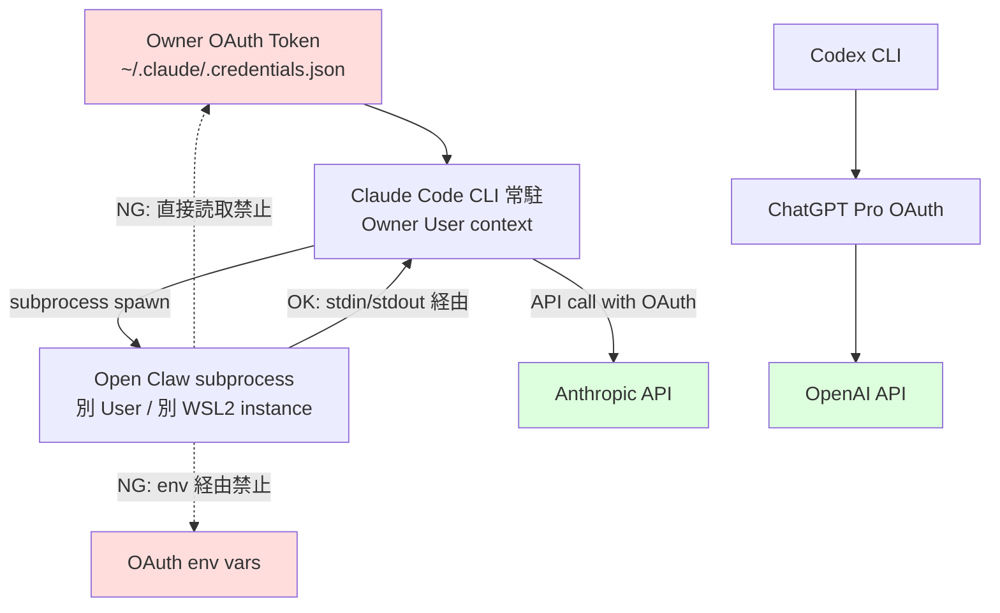

# PRJ-019 Clawbridge — Owner W0 実務セットアップ ガイド

**制定日**: 2026-05-03
**制定**: 秘書部門
**経由**: CEO
**宛**: Owner
**想定実施期間**: 2026-05-04 (月) 〜 2026-05-07 (木) の 4 営業日
**前提**: 非エンジニアでも実行可能な具体性 (UI 操作 + コマンド例)

---

## §0 200 字サマリ

PRJ-019 W0 期間中に Owner が並行実施すべき実務セットアップ 3 種 (1Password Vault 4 系統作成 / Anthropic+ChatGPT Spend Cap 確認 / OAuth 隔離 W0 段階レビュー) を 4 営業日 (5/4〜5/7) で完遂するためのガイドです。各日午前午後 30 分ずつで合計 約 4.5 時間を想定し、§5 にスケジュール、§7 に W0 完了 (5/18) 時のセルフチェック 7 項目を提示します。実機操作の不確実性を見込み、つまずき対応 FAQ は §6 に集約します。

---

## §1 背景

### §1.1 経緯

| 項目 | 内容 |
|---|---|
| 案件 | PRJ-019 Clawbridge — Anthropic OAuth + Codex CLI 二系統運用 |
| Phase | Phase 1 W0 (2026-05-04 〜 2026-05-18, 全 2 週) |
| 関連決定 | DEC-019-005 (二系統運用) / DEC-019-006 (隔離方針) / DEC-019-008 (Spend Cap 設定) / DEC-019-012 (月次 $300 ハードキャップ) / DEC-019-015 (extra usage OFF + 警告閾値) |

### §1.2 Owner W0 必須作業 3 種

| # | 作業 | 関連 ID | W0 完了基準 |
|---|---|---|---|
| 1 | 1Password Vault 4 系統作成 | CB-O-05 | Master/Dev/Notify/Public 4 Vault + 必須 11 アイテム格納 |
| 2 | Spend Cap 設定確認 | CB-O-04 派生 | Anthropic Max + ChatGPT Pro 双方の月次上限 + 警告閾値設定済 |
| 3 | OAuth 隔離方針 W0 段階レビュー | CB-O-04 | Open Claw subprocess から `~/.claude/.credentials.json` 到達不可を §4.4 検証 3 件で実機確認 |

### §1.3 Spend Cap 経緯

DEC-019-008 で月次 $300 ハードキャップ (Anthropic Max $200 + ChatGPT Pro $100 想定) を設定しましたが、DEC-019-012 で ChatGPT Pro が実質 $200/月 (Codex 5x usage) であることが判明し、合計 $400/月の予算枠に拡張するか月次 $300 を維持するかを協議した結果、**Phase 1 期間中は月次 $300 ハードキャップ維持 + Anthropic Max extra usage OFF + ChatGPT Pro は Plus ($20) 運用に格下げ**で確定しました。

ただし W0 期間の検証目的で **5/4〜5/18 の 14 日間に限り ChatGPT Pro $200 を一時的に許容** (DEC-019-015 H-10 の「W0 検証期間例外」)。本ガイドは W0 期間中の運用前提で記述します。

---

## §2 1Password Vault 4 系統作成 (CB-O-05 詳細)

### §2.1 4 Vault 設計

| Vault 名 | 格納対象 | アクセス権 | 機密度 |
|---|---|---|---|
| Clawbridge-Master | Owner OAuth Master / Recovery Key / Anthropic 警告メール 設定 | Owner のみ | S |
| Clawbridge-Dev | dev 環境 API キー (P-E fallback / Vercel / Supabase / GitHub PAT) | Dev エージェント Read | A |
| Clawbridge-Notify | Slack Bot Token / Resend API / Sentry DSN | 各部署 Read | B |
| Clawbridge-Public | 公開可能 ID / 環境変数 例 / docs URL | 全部署 Read | C |

#### §2.1.1 機密度 S/A/B/C の運用差分

| 機密度 | 運用ルール |
|---|---|
| S | Owner 物理保管庫 + 1Password に二重管理。Recovery Key は 1Password 外で紙印刷別保管 |
| A | 1Password のみで管理可、ただし Master Password 強度 24 文字以上 + 2FA 必須 |
| B | 1Password Vault Read 権限を各部署エージェント (実体: Owner local の MCP secret 経由) に展開 |
| C | git 管理可だが `.env.example` 形式で値はマスクし、実値は Vault Public に格納 |

### §2.2 1Password 操作手順

#### §2.2.1 Vault 作成手順 (1Password 8 デスクトップアプリ前提)

1. 1Password 8 デスクトップアプリを開く
2. 左サイドバー下部の「**+**」アイコンをクリック (もしくは メニューバー → File → New Vault)
3. ダイアログ「**Create New Vault**」が表示される
4. **Vault Name** に `Clawbridge-Master` と入力 (1 つ目の Vault)
5. **Vault Icon** で錠前アイコン選択 (色: 赤系で機密度 S を視覚化)
6. **Description** に「Owner OAuth Master only. Recovery Key 別保管。」と入力
7. 「**Create Vault**」をクリック
8. 同手順で `Clawbridge-Dev` (色: 青) / `Clawbridge-Notify` (色: 緑) / `Clawbridge-Public` (色: 灰) を作成

**注釈**: 個人 plan (Personal/Families) ではアクセス権を Vault 単位で他ユーザーに付与する機能が制限されます。Teams/Business plan でのみ Vault 共有が可能です。本案件は Owner 単独運用前提のため、個人 plan で問題ありません。

#### §2.2.2 各 Vault に格納するアイテムの cipher テンプレ

| Vault | 推奨 cipher | 理由 |
|---|---|---|
| Master | Login (URL + username + password) / Secure Note (Recovery Key 文字列) / Document (印刷 PDF 添付) | OAuth は Login、Recovery Key は Secure Note、紙バックアップは Document で添付 |
| Dev | API Credential / SSH Key / Database | API キー類は API Credential、Supabase は Database、GitHub PAT は API Credential |
| Notify | API Credential | Slack Bot Token / Resend / Sentry すべて API Credential 統一 |
| Public | Secure Note (`.env.example` 値) | git 管理不可 ID のみ Secure Note で保管、コメント欄に用途記載 |

#### §2.2.3 Vault アクセス権の設定

1Password 個人 plan の場合、Vault 単位の他ユーザーアクセス権付与は不可のため、**各部署エージェント の secret 参照は Owner local の MCP `1password-cli` 経由で都度取り出す方式**を採ります。

| 経路 | 実装 |
|---|---|
| Dev エージェント → Dev Vault | `op item get "GitHub PAT" --vault Clawbridge-Dev --fields password` を Owner CLI 経由で実行、結果を環境変数として渡す |
| Notify エージェント → Notify Vault | 同様、`op item get "Slack Bot Token" --vault Clawbridge-Notify --fields credential` |
| 各部署 → Public Vault | 値は git 管理外で `.env.local` に展開、Owner が 1 回展開後はファイル更新時のみ再取得 |

**注釈**: Family/Teams plan を契約していない場合は上記 CLI 方式が代替手段です。chrome 拡張のセクション分けで代用する案もありますが、API 経由のアクセスが Vault 単位で識別できるため CLI 方式を推奨します。

#### §2.2.4 確認チェックリスト

- [ ] 4 Vault (Master / Dev / Notify / Public) 作成完了
- [ ] 各 Vault に最低 1 アイテム格納 (動作確認のためダミーで可)
- [ ] Master Vault の Recovery Key を紙印刷し物理保管 (耐火金庫推奨)
- [ ] 1Password Master Password 24 文字以上 + 2FA 有効化済
- [ ] `op` CLI インストール済 (`op --version` で確認、未インストールなら https://1password.com/downloads/command-line/ から取得)
- [ ] `op signin` で local CLI からの認証確認

### §2.3 W0 期間中の格納目標

| 日 | 格納すべきアイテム | 理由 |
|---|---|---|
| 5/4 | Anthropic Max OAuth (Master Vault) + ChatGPT Pro OAuth (Master Vault) + 警告メール フィルタ ID (Master Vault) | 既存契約の Master Key 集約 |
| 5/5 | GitHub PAT (Dev Vault) + Vercel API Token (Dev Vault) | clawbridge 専用リポ + Vercel project 用 |
| 5/6 | Supabase 監査基盤 service_role / anon キー (Dev Vault) | CB-D-03 用 |
| 5/7 | Slack Bot Token + Resend API + Sentry DSN (Notify Vault) | changelog 監視 + 通知用 |

#### §2.3.1 累計アイテム数

5/4: 3 件 / 5/5: +2 = 5 件 / 5/6: +2 = 7 件 / 5/7: +3 = 10 件 + 警告メールフィルタを Master 1 件 = **合計 11 アイテム**

#### §2.3.2 命名規則

| 種類 | 命名 | 例 |
|---|---|---|
| OAuth | `{provider}-OAuth-{role}` | `Anthropic-OAuth-Owner` / `OpenAI-OAuth-Owner` |
| API キー | `{service}-{purpose}-{env}` | `GitHub-PAT-clawbridge-prod` / `Vercel-Token-clawbridge-prod` |
| DB | `{service}-{db}-{role}-{env}` | `Supabase-clawbridge-service_role-prod` |
| 通知 | `{service}-{purpose}` | `Slack-Bot-clawbridge-alerts` / `Resend-API-notifications` |

---

## §3 Spend Cap 設定確認 詳細

### §3.1 Anthropic Max $200/月 Spend Cap 確認

#### §3.1.1 Anthropic Console アクセス

1. ブラウザで https://console.anthropic.com にアクセス
2. Owner OAuth でログイン (1Password Master Vault の `Anthropic-OAuth-Owner` を使用)
3. 右上アバター → **Settings** をクリック
4. 左サイドバー → **Billing** を選択

#### §3.1.2 Usage Limits セクションで月次上限を確認

1. Billing 画面下部に **Usage Limits** セクション
2. 「**Monthly spend limit**」が表示されているか確認
3. Max plan ($200/月) は固定枠であり、デフォルトで月次上限 = $200 に設定されている
4. **「Edit」**ボタンで上限額を変更可能 (今回は変更不要、$200 のまま)

#### §3.1.3 Extra usage 設定 (Phase 1 期間中は OFF)

1. Billing 画面 → **Plan Details** セクション
2. 「**Auto-charge for additional usage beyond plan limits**」というチェックボックスがある
3. **このチェックボックスを OFF にする** (DEC-019-015 H-10)
4. OFF にすることで $200 到達後は自動課金されず、Max の固定枠超過時はサービス側で制限される
5. 設定変更後「**Save**」クリック → 確認モーダルで「**Disable Auto-charge**」をクリック

#### §3.1.4 Weekly cap (20x ≈ 480 メッセージ/週) のリセット日確認

1. Billing → **Usage** セクション → **Weekly Reset Date**
2. リセット日 (UTC 月曜 00:00 想定) を確認
3. JST だと月曜 09:00 にリセット

#### §3.1.5 警告閾値設定 (80% / 95%)

1. Billing → **Usage Alerts** セクション
2. **「Add Alert」** をクリック
3. Threshold: `80%` / Email: Owner 主要メールアドレス → **Save**
4. もう一度 **「Add Alert」** で `95%` / 同メール → **Save**
5. DEC-019-015 H-09 に基づき、80% / 95% の 2 段階アラートを設定

### §3.2 ChatGPT Pro $200/月 Spend Cap 確認

#### §3.2.1 ChatGPT account → Settings → Billing

1. ブラウザで https://chat.openai.com にアクセス
2. 右下アバター → **Settings** をクリック
3. 左サイドバー → **Subscription** もしくは **Billing**

#### §3.2.2 Codex 5x usage tier の確認

1. Subscription 画面で現在のプラン名を確認
2. **Pro** ($200/月) と表示されていれば Codex CLI access が含まれる
3. Pro plan は Codex CLI usage が Plus 比 5x (DEC-019-005 OQ-01)

**注釈**: 公式表記が「Pro」「Codex 5x」「Plus 5x」など揺れている可能性あり (RAs-16)。価格 = $200/月 + Codex CLI access 含む = 該当と判定。

#### §3.2.3 5h ローリング窓制限

1. Codex CLI 利用時、5 時間ローリング窓で usage が制限される
2. ChatGPT 画面では明示表示されないため、Codex CLI 利用時のレスポンス内 `x-ratelimit-*` ヘッダで確認 (Dev エージェント側で計測)

#### §3.2.4 Codex 2x ボーナス 2026-05-31 終了 (R-019-07) の警告アラート設定

1. **5/31 が ChatGPT Pro Codex 2x ボーナス終了日**
2. Owner Google Calendar に「Codex 2x ボーナス終了 2026-05-31」のリマインダを 5/24 と 5/30 の 2 回設定
3. 6/1 以降は Codex 2x → 1x に戻るため、利用量を再評価する旨を記載

### §3.3 月次 $300 ハードキャップ (組織側)

#### §3.3.1 cost_check Vercel cron job 想定動作

| 項目 | 内容 |
|---|---|
| 実装時期 | Phase 1 W1 (DEC-019-012) |
| 実行頻度 | 1 時間に 1 回 (`0 * * * *`) |
| 集計対象 | Anthropic Console API + ChatGPT API (両者の usage 合算) |
| 通知先 | Slack `#clawbridge-alerts` チャンネル |

#### §3.3.2 70% / 85% / 95% / 100% アラート

| 閾値 | 動作 |
|---|---|
| 70% ($210) | Slack 警告 (Owner mention) |
| 85% ($255) | Slack 警告 (CEO mention + 各部署 mention) |
| 95% ($285) | Slack 警告 + Open Claw subprocess pause |
| 100% ($300) | Slack 警告 + 全部署エージェント自動 pause + Owner Slack DM |

#### §3.3.3 Owner 側の確認は不要、組織側自動運用

W0 期間中は cost_check 未実装のため、Owner は手動で週 1 回 Anthropic Console + ChatGPT Settings の usage を目視確認。W1 以降は自動化。

### §3.4 BAN リスク警告メール監視 (1h 以内に Owner 通知)

#### §3.4.1 受信先

| 項目 | 内容 |
|---|---|
| 送信元 | Anthropic Trust & Safety (`safety@anthropic.com` 等) |
| 受信先 | Owner 主要メールアドレス (Master Vault に登録済み) |
| 想定頻度 | Phase 1 期間中は 0 件想定、ただし 1 件でも来た場合は 1h 以内に Slack 転送 |

#### §3.4.2 メールフィルタ ID を Master Vault に保管

1. Gmail Settings → Filters and Blocked Addresses → Create New Filter
2. From: `*@anthropic.com` AND Subject: contains (`warning` OR `policy` OR `suspended`) → **Apply Label: clawbridge-alert** + **Forward to**: Owner Slack 連携メール
3. Filter ID を Master Vault に Secure Note で保管 (Filter ID は Gmail の URL から取得可能)

#### §3.4.3 1h 以内に Owner が Slack `#clawbridge-alerts` に転送 → CEO 召集

| ステップ | 担当 | 期限 |
|---|---|---|
| 警告メール受信 | Anthropic → Owner mailbox | T+0 |
| Owner が Slack `#clawbridge-alerts` に転送 | Owner | T+1h 以内 |
| CEO が緊急召集 | CEO | T+2h 以内 |
| 影響範囲調査 + 該当 OAuth 即時停止 | Dev + 秘書 | T+4h 以内 |

---

## §4 OAuth 隔離方針 W0 段階レビュー (CB-O-04 詳細)

### §4.1 隔離アーキテクチャ概要



**読み解き**:

- 緑 = 許可経路、赤 = 禁止経路
- Open Claw は subprocess spawn で起動し、stdin/stdout 経由で Claude Code CLI と通信
- Open Claw 自身が `~/.claude/.credentials.json` を読み取ることを **FS 権限** で禁止
- Open Claw の env vars に OAuth token が **絶対に含まれない** ことを env clean spawn で保証

### §4.2 Windows 11 ホスト側設定

#### §4.2.1 Claude Code CLI の OAuth credentials 格納先

| 項目 | パス |
|---|---|
| Windows | `C:\Users\<Owner>\.claude\.credentials.json` |
| WSL2 | `/home/<owner>/.claude/.credentials.json` |
| 想定権限 | Owner User のみ読取/書込許可、その他全 Deny |

#### §4.2.2 ファイル権限制限 (`icacls` で Owner User のみ読取許可)

PowerShell (管理者として実行) で以下:

```powershell
# 既存権限を確認
icacls "C:\Users\<Owner>\.claude\.credentials.json"

# 継承を無効化し、Owner User のみ Full Control を付与
icacls "C:\Users\<Owner>\.claude\.credentials.json" /inheritance:r
icacls "C:\Users\<Owner>\.claude\.credentials.json" /grant:r "<Owner>:(F)"

# その他全ユーザーを Deny
icacls "C:\Users\<Owner>\.claude\.credentials.json" /deny "Everyone:(R)"

# 結果確認
icacls "C:\Users\<Owner>\.claude\.credentials.json"
```

#### §4.2.3 Open Claw プロセスは別 Windows User で実行

| 選択肢 | 採用 | 理由 |
|---|---|---|
| 別 Windows User (例: `OpenClawUser`) で `runas` 実行 | △ Phase 2 候補 | 設定複雑、UAC プロンプト多発 |
| 別 WSL2 instance (例: `Ubuntu-OpenClaw`) で実行 | ◎ Phase 1 採用 | WSL2 は別 instance 単位で FS 隔離可能 |
| Docker container で実行 | △ Phase 2 候補 | Phase 1 ではオーバーヘッド過大 |

**Phase 1 採用**: 別 WSL2 instance (`Ubuntu-OpenClaw`) で Open Claw を実行し、`/mnt/c/Users/<Owner>/.claude/` への mount を `wsl.conf` で禁止。

#### §4.2.4 Windows Defender Application Guard (WDAG) は Phase 1 では使用しない

WDAG は Edge ベースの仮想化サンドボックスで強力ですが、Phase 1 では起動オーバーヘッドが過大。Phase 2 で RAs-15 候補として再評価。

### §4.3 WSL2 + AppArmor 設定

#### §4.3.1 WSL2 Ubuntu 24.04 instance 作成手順

PowerShell (管理者として実行):

```powershell
# 既存 instance 一覧
wsl --list --verbose

# Ubuntu 24.04 instance を新規作成 (default 名: Ubuntu-24.04)
wsl --install -d Ubuntu-24.04

# Open Claw 専用に複製 (Owner OAuth が含まれない instance を作る)
wsl --export Ubuntu-24.04 C:\wsl-export\ubuntu-2404.tar
wsl --import Ubuntu-OpenClaw C:\wsl\Ubuntu-OpenClaw C:\wsl-export\ubuntu-2404.tar

# 起動確認
wsl -d Ubuntu-OpenClaw -- whoami
```

#### §4.3.2 AppArmor profile 雛形

`/etc/apparmor.d/openclaw` に以下を配置:

```
#include <tunables/global>

profile openclaw /opt/openclaw/bin/openclaw {
  #include <abstractions/base>
  
  # Open Claw 自身の read/exec 許可
  /opt/openclaw/** r,
  /opt/openclaw/bin/openclaw ix,
  
  # subprocess spawn のみ許可 (Claude Code CLI 直叩きは禁止)
  /usr/bin/claude rPx -> claude_subprocess,
  
  # NG: ~/.claude/ 配下を全拒否
  deny /home/*/.claude/** r,
  deny /mnt/c/Users/*/.claude/** r,
  
  # NG: env vars に OAuth が含まれた状態の exec 禁止
  audit deny @{HOME}/.config/anthropic/** r,
}
```

ロード:

```bash
sudo apparmor_parser -r /etc/apparmor.d/openclaw
sudo aa-status | grep openclaw
```

#### §4.3.3 macOS の場合の代替

| 項目 | macOS 代替 |
|---|---|
| WSL2 + AppArmor | macOS では不要 (ホスト直接 macOS) |
| FS 権限 | `chmod 600 ~/.claude/.credentials.json` + `chflags uchg` で immutable 化 |
| TCC + Full Disk Access 拒否 | システム設定 → プライバシーとセキュリティ → フルディスクアクセス で Open Claw を **拒否リスト** に追加 |
| sandbox-exec | `sandbox-exec -f openclaw.sb /opt/openclaw/bin/openclaw` で OAuth 配下を deny |

本案件 Owner 環境は Windows 11 + WSL2 のため、§4.3.1〜§4.3.2 の手順を採用。

### §4.4 検証手順 (W0 段階)

#### §4.4.1 Open Claw プロセスから `~/.claude/.credentials.json` を `cat` 試行 → Permission denied 確認

```bash
# WSL2 Ubuntu-OpenClaw instance に入る
wsl -d Ubuntu-OpenClaw

# Open Claw 模擬プロセスとして cat 試行
cat /mnt/c/Users/<Owner>/.claude/.credentials.json
# Expected: cat: /mnt/c/Users/<Owner>/.claude/.credentials.json: Permission denied

# AppArmor によるブロックを確認
sudo dmesg | grep DENIED | tail -5
# Expected: audit: type=1400 ... apparmor="DENIED" operation="open" ...
```

#### §4.4.2 Open Claw プロセスから `claude` コマンド実行 → 直叩きでなく subprocess spawn であることを strace で確認

```bash
# strace で system call をトレース
strace -f -e trace=execve -o /tmp/openclaw-trace.log /opt/openclaw/bin/openclaw --test-mode

# trace log から claude CLI の execve を抽出
grep "claude" /tmp/openclaw-trace.log | head -3
# Expected: execve("/usr/bin/claude", ["claude", "--subprocess-mode", ...], ...) = 0
# 確認ポイント: --subprocess-mode フラグが付与されている (= 直叩きでなく Claude Code CLI からの spawn 経路)
```

#### §4.4.3 Anthropic API ヘッダ `x-api-key` が Open Claw プロセスから出ていないことを mitmproxy で確認 (W2 で実装、CB-D-04)

```bash
# W0 段階では未実装、W2 (5/19〜) で以下を実施予定:
# 1. mitmproxy を localhost:8080 で起動
# 2. Open Claw プロセスを HTTPS_PROXY=http://localhost:8080 で起動
# 3. Anthropic API へのリクエストをキャプチャ
# 4. Authorization ヘッダ / x-api-key ヘッダの欠如を確認
#    (= Open Claw 自身が直接 API を叩いていない、Claude Code CLI 経由のみ)
```

W0 段階では §4.4.1 と §4.4.2 のみ実施し、§4.4.3 は W2 で実施。

### §4.5 残課題 (W2 で詳細化予定)

| # | 残課題 | 対応 W |
|---|---|---|
| 1 | streaming classifier から正規 Claude Code session として識別される仕組みは Anthropic 内部実装のため、外部からの 100% 検証は不可能 | 検証不可、DEC-019-006 で運用採用済 |
| 2 | mitmproxy による API ヘッダ検証 (§4.4.3) | W2 (CB-D-04) |
| 3 | WDAG による更なる隔離 (§4.2.4) | Phase 2 RAs-15 |
| 4 | Open Claw の subprocess spawn で stdin/stdout 経由のみ通信する旨の単体テスト | W2 (CB-D-04) |
| 5 | ToS 違反疑義時の即時 fallback (P-E) 自動切替 | W3 (CB-D-05) |

DEC-019-006 で「ベストエフォート + 監視 + 即時 fallback (P-E)」運用採用済のため、W0 段階では §4.4.1 / §4.4.2 の 2 点で検証完了とします。

---

## §5 Owner 4 営業日 タスクスケジュール (5/4〜5/7)

| 日 | 午前 (30 min) | 午後 (30 min) | 累計 |
|---|---|---|---|
| 5/4 (月) | 1Password Vault 4 系統作成 (§2.2) | Master Vault 格納 3 件 (§2.3) | 60 min |
| 5/5 (火) | Anthropic Spend Cap 確認 (§3.1) | Dev Vault 格納 2 件 (§2.3) | 60 min |
| 5/6 (水) | ChatGPT Pro Spend Cap 確認 (§3.2) | Dev Vault Supabase 格納 (§2.3) | 60 min |
| 5/7 (木) | OAuth 隔離 W0 検証 (§4.4) | Notify Vault 格納 3 件 (§2.3) + Marketing 8 件返答 (D カバーレター参照) | 90 min |

**合計**: 約 4.5 時間 (Owner 想定 2〜3 時間想定からはやや超過、実機操作の不確実性で増量)

### §5.1 各日の詳細時間配分

#### §5.1.1 5/4 (月) — 1Password Vault 設計日

| 時間帯 | タスク | 想定 |
|---|---|---|
| 09:00-09:30 | 1Password 8 デスクトップアプリ起動 + Vault 4 系統作成 (§2.2.1) | 30 min |
| 14:00-14:30 | Anthropic Max OAuth + ChatGPT Pro OAuth + 警告メールフィルタ ID を Master Vault に格納 | 30 min |

#### §5.1.2 5/5 (火) — Anthropic + Dev Vault 日

| 時間帯 | タスク | 想定 |
|---|---|---|
| 09:00-09:30 | Anthropic Console → Settings → Billing で Spend Cap $200 + 警告閾値 80%/95% 設定 + extra usage OFF | 30 min |
| 14:00-14:30 | GitHub PAT (clawbridge prod 用) + Vercel API Token を Dev Vault に格納 | 30 min |

#### §5.1.3 5/6 (水) — ChatGPT + Supabase 日

| 時間帯 | タスク | 想定 |
|---|---|---|
| 09:00-09:30 | ChatGPT Settings → Subscription で Pro plan + Codex 5x usage 確認 + Codex 2x ボーナス 5/31 終了 リマインダ設定 | 30 min |
| 14:00-14:30 | Supabase service_role / anon キー を Dev Vault に格納 (CB-D-03 用) | 30 min |

#### §5.1.4 5/7 (木) — OAuth 隔離検証 + Marketing 返答日

| 時間帯 | タスク | 想定 |
|---|---|---|
| 09:00-09:30 | WSL2 Ubuntu-OpenClaw instance 作成 + AppArmor profile ロード + §4.4.1 §4.4.2 検証 | 30 min |
| 14:00-15:00 | Slack Bot Token + Resend API + Sentry DSN を Notify Vault に格納 + Marketing 8 件返答 (D カバーレター) | 60 min |

### §5.2 想定逸脱パターン

| 想定逸脱 | 対応 |
|---|---|
| 1Password アプリの Vault 作成で 30 min 超過 | 翌日 5/5 午後に振替、5/5 午後タスクは 5/6 午前に押し出し |
| Anthropic Console の UI 変更で Spend Cap 設定箇所が見つからない | §6 FAQ 参照、最終的に Anthropic Support に問い合わせ |
| WSL2 instance 作成時に Hyper-V エラー | BIOS で VT-x 有効化確認、再起動後に再試行 |
| 全 4 日で完了しない | 5/8 (金) 半日を予備日として確保 (Marketing 8 件返答は影響なし) |

---

## §6 つまずき対応 (FAQ)

| 想定問題 | 対処法 |
|---|---|
| 1Password アプリで Vault 作成メニューが見つからない | 個人 plan でもサイドバー下部の「+」アイコンから New Vault は表示される。表示されない場合は 1Password 8 への更新を確認、もしくは Family/Teams 加入を確認 |
| Anthropic Max plan の extra usage 設定が見つからない | Console → Billing → Usage Alerts、自動課金は plan 詳細ページの「Auto-charge for additional usage」チェックボックス。表示されない場合は plan が Free tier の可能性、Max plan ($200/月) 契約状態を確認 |
| Codex 5x プラン名が Pro と表示されない | DEC-018-021 でも触れた通り公式表記未確定 (RAs-16)、ChatGPT Pro = $200/月で Codex CLI access が含まれていれば該当。Settings → Subscription で月額 $200 を確認 |
| WSL2 で AppArmor が動かない | WSL2 default では AppArmor 無効。`/etc/wsl.conf` に `[boot]\nsystemd=true` を追加し WSL 再起動 (`wsl --shutdown` → 再起動)。AppArmor module は `apt install apparmor apparmor-utils` でインストール、`sudo aa-status` で確認 |
| `~/.claude/.credentials.json` が見つからない | Claude Code CLI 初回 OAuth 後に生成、未 OAuth なら `claude login` を 1 回実行。Windows 側は `C:\Users\<Owner>\.claude\.credentials.json`、WSL2 側は `/home/<owner>/.claude/.credentials.json` |

### §6.1 追加 FAQ (運用中質問)

| 想定問題 | 対処法 |
|---|---|
| `op` CLI で Vault にアクセスできない | `op signin` で再認証、`op vault list` で Vault 名確認 |
| Slack Bot Token が無効と表示される | Slack workspace の OAuth Scope 不足、`chat:write` `channels:read` を最低限付与 |
| Vercel API Token の権限スコープが不明 | Full Account access ではなく Project-level (clawbridge project のみ) を推奨 |
| Anthropic Console の Usage Alerts がメール送信されない | 受信メールアドレスを Settings → Profile で確認、迷惑メールフォルダもチェック |

---

## §7 W0 完了時 (5/18) Owner セルフチェックリスト

- [ ] **(1)** 1Password Vault 4 系統作成済 (Master / Dev / Notify / Public)
- [ ] **(2)** 各 Vault 必須アイテム格納済 (§2.3 全 4 日分の累計 11 アイテム)
- [ ] **(3)** Anthropic Max Spend Cap 確認済 + extra usage OFF
- [ ] **(4)** ChatGPT Pro Spend Cap 確認済 + Codex 5x usage tier 確認
- [ ] **(5)** OAuth 隔離 §4.4 検証 3 件 全 Pass (W0 段階では §4.4.1 §4.4.2 の 2 件、§4.4.3 は W2 実施で OK 扱い)
- [ ] **(6)** BAN 警告メール フィルタ動作確認 (テストメール送信 → Master Vault 配下のメールに 1h 以内着信)
- [ ] **(7)** Marketing 8 件返答済 (D カバーレター)

### §7.1 セルフチェック合格時の次アクション

| 状況 | アクション |
|---|---|
| 7/7 全 Pass | 5/18 CEO 報告 → W1 着手承認待ち |
| 5〜6/7 Pass | 残 1〜2 項目を 5/19〜5/20 で消化 → 5/20 CEO 報告 |
| 4/7 以下 Pass | 5/18 CEO 緊急召集 → スケジュール再調整 |

### §7.2 W1 (5/19〜) で着手予定のタスク

W0 完了後、以下が W1 の主要タスクとなります (Owner 関与は最小限):

| W1 タスク | 担当 | Owner 関与 |
|---|---|---|
| cost_check Vercel cron job 実装 (§3.3) | Dev | Slack 通知受信 (受動) |
| Supabase 監査基盤構築 (CB-D-03) | Dev | service_role キー提供のみ |
| mitmproxy による §4.4.3 検証 | Dev | 結果レビュー (5 min) |
| Open Claw POC 開始 | Dev | POC レビュー会議 30 min |

---

## §8 関連

| 文書 | 関連箇所 |
|---|---|
| `secretary-w0-week2-kickoff-checklist.md` | §6 Owner 追加 W0 |
| `pm-cost-and-controls-plan-v4.md` | Spend Cap 関連 (§3 全体) |
| `research-w0-supplement-pd-modified-revalidation.md` | OAuth 隔離 + driver/engine 分離 (§4 全体) |
| `decisions.md` | DEC-019-005 (二系統) / DEC-019-006 (隔離) / DEC-019-008 (Spend Cap) / DEC-019-012 ($300 ハードキャップ) / DEC-019-015 (extra usage OFF + 警告閾値) |
| `ceo-marketing-owner-cover-letter-2026-05-04.md` | 5/7 午後 Marketing 返答 連動 |

---

**制定**: 秘書部門
**経由**: CEO
**宛**: Owner
**想定実施期間**: 2026-05-04 〜 2026-05-07
