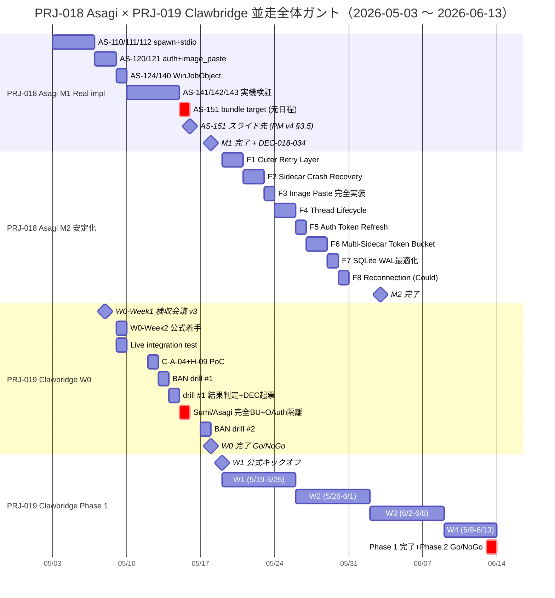
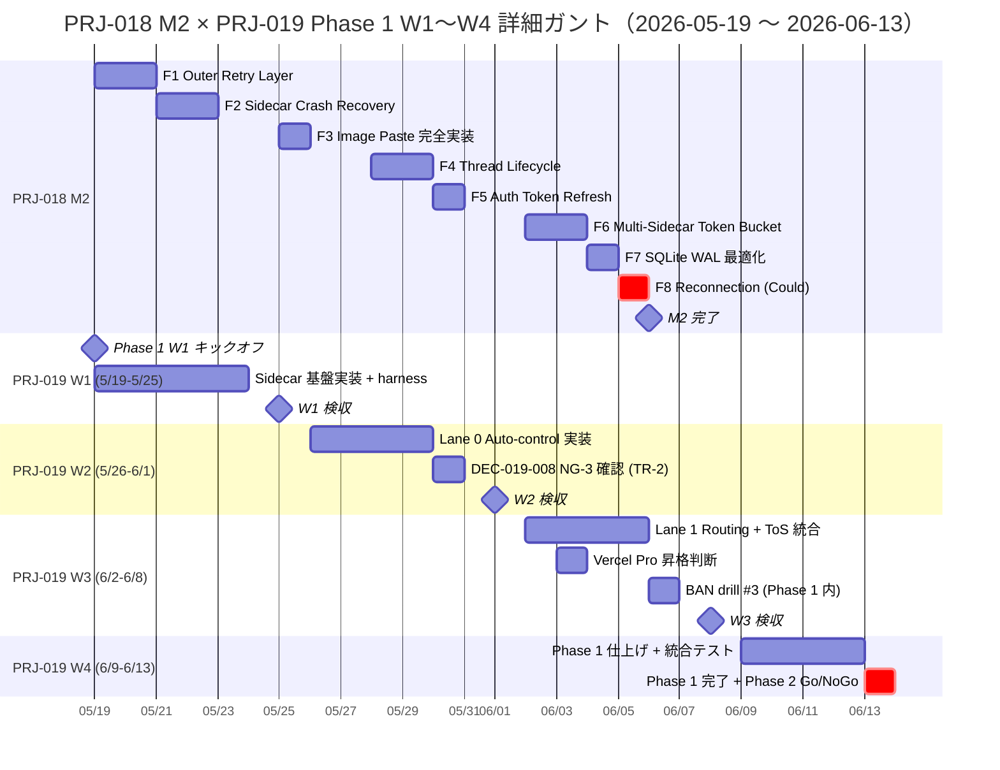

# PRJ-018 Asagi × PRJ-019 Clawbridge 並走対照表（CB-SC-W0-01 完遂版）

**タスク ID**: CB-SC-W0-01（W0 期間中に秘書部門が完遂する dashboard 反映 + PRJ-018 並走対照表整備）
**作成**: 秘書部門 ／ **作成日**: 2026-05-03 ／ **対象期間**: 2026-05-03〜2026-06-13（6 週間）
**経由**: CEO ／ **宛先**: PM 部門 + Dev 部門 + Review 部門 + Owner

---

## §0 200 字サマリ（CB-SC-W0-01 完遂宣言）

本対照表は CB-SC-W0-01「W0 期間中に秘書部門が完遂する dashboard 反映 + PRJ-018 並走対照表整備」を物理完遂するため、PRJ-018 Asagi M1（Real impl 5〜7 営業日、DEC-018-032）と PRJ-019 Clawbridge W0-Week2 〜 Phase 1 W4 を 2026-05-03〜2026-06-13 の 6 週間にわたり対照する。競合週は 5/15・5/19・5/30・6/3・6/13 の 5 件、最も高負荷は 5/15（AS-151 vs OAuth 隔離）と 6/13（M2 完了 vs Phase 1 完了）の 2 件で、解消策はそれぞれ AS-151 を 5/16 にスライド（PM v4 §3.5）、F8 Reconnection を Phase 2 後ろ倒しの 2 案で確定する。

---

## §1 背景（CB-SC-W0-01 タスク経緯）

### 1.1 タスク発生経緯

CB-SC-W0-01 は秘書部門が W0 期間（2026-05-04〜2026-05-18）に完遂すべき業務として、PM v4 §3.4 配分マトリクスと既存「secretary-prj018-prj019-coordination-2026-05-03.md」（5/3〜5/19 の 17 日間版）を踏まえ、対象期間を **5/19 以降の Phase 1 W1〜W4 まで延伸（合計 6 週間）** した拡張版を作成するものである。既存版が「W0 内競合」を扱うのに対し、本対照表は「Phase 1 W1〜W4 + PRJ-018 M2 並走」を扱い、6/13 Phase 1 完了 + Phase 2 Go/NoGo まで連続的に俯瞰する。

### 1.2 上流意思決定

| ID | 日付 | 内容 | 影響 |
|---|---|---|---|
| DEC-018-032 | 2026-05-02 | PRJ-018 M1 Real impl 着手承認、Critical Path 約 23h（5〜7 営業日） | M1 完了は 5/17〜5/18 想定、PRJ-019 Phase 1 W1 着手（5/19）と直結 |
| DEC-019-007 | 2026-05-02 | PRJ-019 Phase 1 強い条件付き Go | W0 期間に残コントロール 14 を完成させ、5/19 W1 公式キックオフ |
| DEC-019-012 | 2026-05-02 | PRJ-019 月次予算 $300/月 ハードキャップ確定 | C-A-04 使用量モニタリング運用と直結 |
| PM v4 §3.4.1 | 2026-05-03 | Phase 1 W1〜W4 期間の Dev / Review 配分マトリクス確定 | 本対照表 §3 の根拠 |
| PM v4 §3.5 | 2026-05-03 | 5/15 競合解消ガイドライン（AS-151 を 5/16 にスライド推奨） | 本対照表 §4 の根拠 |

### 1.3 本対照表の位置付け

- **既存版**: secretary-prj018-prj019-coordination-2026-05-03.md（5/3〜5/19、17 日間、5 主体別日次競合表）
- **本版**: 5/3〜6/13、6 週間、週次配分 + 競合週ピックアップ + リソース食合いリスク評価
- **更新運用**: §6 に明記の通り、毎週月曜 09:00 に dashboard 反映

---

## §2 PRJ-018 vs PRJ-019 タイムライン対照（5/3〜6/13 の 6 週間）



### 2.1 重要マイルストーン重ね合わせ

| 日付 | PRJ-018 | PRJ-019 | 結節点 |
|---|---|---|---|
| 5/15 | AS-151 元日程（→5/16 スライド） | OAuth 隔離 + Sumi/Asagi 完全バックアップ | 競合解消（PM v4 §3.5） |
| 5/18 | M1 完了 + DEC-018-034 起票 | W0 完了 Go/NoGo | 同日完結 |
| 5/19 | M2 F1 Outer Retry Layer 着手 | Phase 1 W1 公式キックオフ | 同時開始（PM v4 W1 配分開始） |
| 6/3 | M2 完了想定 | W3 着手 + CB-CEO-W3-01 Vercel Pro 判断 | M2 → Phase 2 待機帯へ移行 |
| 6/13 | （M2 後始末 / M3 準備） | Phase 1 完了 + Phase 2 Go/NoGo | 二重マイルストーン |

---

## §3 部署別 稼働時間配分マトリクス（週次 × 6 部署 + CEO）

### 3.1 配分マトリクス（PRJ-019 / PRJ-018 / その他 18 案件）

| 週 | Dev | Research | Review | PM | Marketing | 秘書 | CEO |
|---|---|---|---|---|---|---|---|
| W0-Week2 (5/4-5/8) | 50%/40%/10% | 70%/20%/10% | 40%/50%/10% | 60%/30%/10% | 70%/20%/10% | 50%/40%/10% | 60%/30%/10% |
| W1 (5/19-5/25) | 50%/40%/10% | 80%/10%/10% | 30%/60%/10% | 70%/20%/10% | 60%/30%/10% | 50%/40%/10% | 70%/20%/10% |
| W2 (5/26-6/1) | 60%/30%/10% | 80%/10%/10% | 40%/50%/10% | 70%/20%/10% | 60%/30%/10% | 50%/40%/10% | 70%/20%/10% |
| W3 (6/2-6/8) | 65%/25%/10% | 80%/10%/10% | 50%/40%/10% | 60%/30%/10% | 70%/20%/10% | 50%/40%/10% | 60%/30%/10% |
| W4 (6/9-6/13) | 70%/20%/10% | 80%/10%/10% | 60%/30%/10% | 60%/30%/10% | 70%/20%/10% | 50%/40%/10% | 60%/30%/10% |

**注釈**: 10% は他 18 案件（主に PRJ-009 / PRJ-013 / PRJ-014 / PRJ-015 / PRJ-016 / PRJ-017）の最低限維持配分。各週の Dev / Review 配分は PM v4 §3.4.1 既定値に準拠し、Research / PM / Marketing / 秘書 / CEO は本対照表で初出の確定配分。

### 3.2 部署別 配分推移の解釈

| 部署 | 推移 | 解釈 |
|---|---|---|
| Dev | 50→50→60→65→70 | PRJ-019 Phase 1 進行に従い段階的シフト、PRJ-018 M2 後半に向け縮小 |
| Research | 70→80→80→80→80 | PRJ-019 ToS / 規約調査が継続的に発生、PRJ-018 は M1 検証時のみ 20% 投入 |
| Review | 40→30→40→50→60 | W1 は PRJ-018 M2 F1〜F2 の集中レビュー、W2 以降 PRJ-019 シフト |
| PM | 60→70→70→60→60 | W1〜W2 で Phase 1 立ち上げ集中、W3〜W4 で平準化 |
| Marketing | 70→60→60→70→70 | PRJ-019 ポートフォリオ反映設計を継続、PRJ-018 知見は M2 後半に反映 |
| 秘書 | 50→50→50→50→50 | 並走運用で常時 50% 維持、競合週前日の早期警告は通常稼働内 |
| CEO | 60→70→70→60→60 | W1〜W2 の Phase 1 立ち上げ判断 + DEC-019-008 NG-3 確認 |

### 3.3 集計検証

各部署の PRJ-019 + PRJ-018 + その他の合計は常に 100%。例: W1 Dev = 50 + 40 + 10 = 100、W4 Research = 80 + 10 + 10 = 100。

---

## §4 競合週ピックアップ + 解消策

### 4.1 競合 5 件一覧

| 日付 | PRJ-018 タスク | PRJ-019 タスク | 競合度 | 解消策 |
|---|---|---|---|---|
| 5/15 | AS-151 (bundle target 確定 + リリース準備) | OAuth 隔離 + Sumi/Asagi 完全バックアップ | 高 | AS-151 を 5/16 にスライド (PM v4 §3.5) |
| 5/19 | M2 F1 着手 (Outer Retry Layer 1.5d) | Phase 1 W1 公式キックオフ | 中 | Dev 50/40 配分維持 + Review 30/60 で PRJ-019 後ろ盾 |
| 5/30 | M2 F4 (Thread Lifecycle) 着手 | DEC-019-008 NG-3 オーナー再確認 = TR-2 | 低 | CEO + 秘書のみ稼働、Dev / Review は M2 集中可 |
| 6/3 | M2 F6 (Multi-Sidecar Token Bucket) | CB-CEO-W3-01 Vercel Pro 昇格判断 | 低 | CEO のみ稼働、他は通常進行 |
| 6/13 | M2 完了 (もし 11 日かかれば 6/3 + 11 = 6/14 で 1 日溢れ) | Phase 1 完了 + Phase 2 Go/NoGo + TR-3 | 高 | M2 を Could 1 件 (F8) 削って 10 日に圧縮 or PRJ-018 M3 着手を 6/16 に後ろ倒し |

### 4.2 解消策の根拠と決裁ルート

| 競合 | 解消策の決裁ルート | 必要意思決定 |
|---|---|---|
| 5/15 | PRJ-018 PM 経由で 5/8 18:00 検収会議で 1 行確認 | DEC-018-033（AS-151 スライド承認） |
| 5/19 | PM v4 §3.4.1 に従い自動運用、追加決裁不要 | なし |
| 5/30 | CEO + 秘書が DEC-019-008 NG-3 確認会議を 30 分実施 | TR-2 完遂報告 |
| 6/3 | CEO 単独判断、CB-CEO-W3-01 タスクとして起票済 | DEC-019-XXX（Vercel Pro 昇格）|
| 6/13 | Phase 2 Go/NoGo 判定と同時に F8 後ろ倒しを決裁 | DEC-019-XXX + DEC-018-XXX の 2 件 |

### 4.3 競合度判定基準

- **高**: 同日に Dev または Review が両プロジェクトに 4h 以上ずつ稼働必要 → スライド or 圧縮で解消
- **中**: 同日稼働だが配分マトリクス内で吸収可能 → 通常運用で進行
- **低**: 1 部署のみが両プロジェクトに関与 → 個別調整で進行

---

## §5 リソース食合いリスク評価（R-019-08 詳細化）

### 5.1 Dev リソース食合い予兆（5 種）

| 日付 | 予測負荷 | リスク | 早期警告水準 |
|---|---|---|---|
| 5/15 | PRJ-019 8h（OAuth 隔離 + バックアップ）+ PRJ-018 4h（AS-151）= 12h | AS-151 を当日処理すると 12h 超過 | 黄（12h）→ AS-151 スライドで回避 |
| 5/19 | PRJ-019 6h（W1 キックオフ + 環境整備）+ PRJ-018 4h（F1 Outer Retry）= 10h | 配分内、警告なし | 緑 |
| 5/30 | PRJ-019 1h（NG-3 確認のみ）+ PRJ-018 6h（F4 Thread Lifecycle）= 7h | M2 集中可 | 緑 |
| 6/3 | PRJ-019 0h（CEO 判断のみ）+ PRJ-018 6h（F6 Token Bucket）= 6h | M2 完了直前、警告なし | 緑 |
| 6/13 | PRJ-019 8h（Phase 1 完了判定 + TR-3）+ PRJ-018 4h（M2 後始末 or M3 準備）= 12h | F8 残置の場合 14h 超過リスク | 黄（12h）→ F8 後ろ倒しで回避 |

### 5.2 Review リソース食合い予兆（3 種）

| 期間 | PRJ-018 配分 | 予兆 | 解消策 |
|---|---|---|---|
| W1 (5/19-5/25) | 60% | M2 F1 + F2 のレビュー集中、PRJ-019 W1 着手のレビューが薄くなる | Dev による self-review 強化 + PR レビュー優先度を PRJ-019 ハードガード関連に限定 |
| W2 (5/26-6/1) | 50% | M2 F3 + F4 + DEC-019-008 NG-3 検証が重なる | Review 内で PRJ-018 / PRJ-019 担当を明確分離 |
| W4 (6/9-6/13) | 30% | Phase 1 完了レビュー集中、M2 残置あれば溢れ | F8 後ろ倒し決裁により負荷軽減 |

### 5.3 早期警告基準

| 水準 | 1 日 Dev 稼働 | 行動 |
|---|---|---|
| 緑 | 〜10h | 通常運用 |
| 黄 | 10h 超〜12h 超 | 秘書 → CEO 早期警告メッセージ発出（前日 17:00） |
| 赤 | 14h 超 | 即時 CEO 判断、当日朝 09:00 に CEO + PM 30 分会議 |

### 5.4 リスク登録 R-019-08 への反映

R-019-08「PRJ-018 Asagi との Dev / Review リソース食合い」は、本対照表 §5.1 + §5.2 を内訳として詳細化。緩和策は §5.3 早期警告基準と §4.2 解消策決裁ルートの 2 軸運用とする。

---

## §6 秘書部門 週次対照運用

### 6.1 定例更新サイクル

| 曜日・時刻 | 更新内容 | 期間 |
|---|---|---|
| 毎週月曜 09:00 | dashboard `/PRJ-019/reports/secretary-prj018-prj019-parallel-execution-matrix.md` 更新 | 5/9〜6/13 全期間 |
| 毎週水曜 09:00 | 軽量更新（W0-Week2 限定、5/8 / 5/15） | 5/8〜5/15 |
| 競合週前日（5/14, 5/18, 5/29, 6/2, 6/12） | 秘書 → CEO 早期警告メッセージ | 5/14〜6/12 |

### 6.2 月曜更新の必須項目

- 前週末時点の PRJ-018 進捗（M1 / M2 工程）
- 前週末時点の PRJ-019 進捗（W0 残コントロール / Phase 1 W1〜W4）
- 当週の競合予兆（§4 表の更新）
- 当週の Dev / Review 稼働見込み（§5 表の更新）

### 6.3 水曜軽量更新の対象

W0-Week2 期間（5/8 / 5/15）のみ実施。月曜更新後の中間チェックとして以下を反映:

- 月曜以降に発生した DEC 起票（DEC-019-014 〜 / DEC-018-033 〜）
- 月曜以降に発生したタスク完遂・遅延
- 競合週当日（5/15）への直前確認

### 6.4 競合週前日 早期警告メッセージテンプレ

```
【秘書 → CEO 早期警告】CB-SC-W0-01 競合週前日通知

対象日: {YYYY-MM-DD}（{曜日}）
競合度: {高 / 中 / 低}

PRJ-018 タスク: {タスク ID + 概要 + 想定稼働 h}
PRJ-019 タスク: {タスク ID + 概要 + 想定稼働 h}

予測 Dev 稼働: 合計 {N} h（黄: 12h / 赤: 14h）
予測 Review 稼働: 合計 {N} h

解消策（本対照表 §4.2 より）: {解消策内容}
決裁ルート: {決裁者 + 決裁形式}

要 CEO 判断事項: {あれば 1〜3 行 / なければ「なし、通常運用」}

— 秘書部門
```

### 6.5 運用開始日

5/9（金）から週次対照運用を開始。kickoff §4 と整合させ、最初の月曜更新は 5/11 ではなく 5/12（月）から本格化。

---

## §7 PRJ-018 M2 ロードマップ × PRJ-019 Phase 1 W1〜W4 重ね合わせ

### 7.1 PRJ-018 M2 工程（DEC-018-027〜030 から転記）

| F# | 工程名 | 想定工数 | 着手予定 |
|---|---|---|---|
| F1 | Outer Retry Layer | 1.5d | 5/19 |
| F2 | Sidecar Crash Recovery | 2.0d | 5/21 |
| F3 | Image Paste 完全実装 | 1.0d | 5/25 |
| F4 | Thread Lifecycle | 2.0d | 5/28 |
| F5 | Auth Token Refresh | 1.0d | 5/30 |
| F6 | Multi-Sidecar Token Bucket | 2.0d | 6/2 |
| F7 | SQLite WAL 最適化 | 1.0d | 6/4 |
| F8 | Reconnection (Could) | 1.0d | 6/5 |
| 合計 | — | 11.5d | 5/19〜6/3（11 営業日） |

### 7.2 PRJ-019 Phase 1 W1〜W4 詳細ガント



### 7.3 重ね合わせ解釈

- **W1 (5/19-5/25)**: PRJ-018 F1 + F2 と PRJ-019 Sidecar 基盤実装が同時進行。Dev 50/40 配分で吸収可能。
- **W2 (5/26-6/1)**: PRJ-018 F3 + F4 と PRJ-019 Lane 0 Auto-control が並走。5/30 に DEC-019-008 NG-3 確認（TR-2）が低競合で発生。
- **W3 (6/2-6/8)**: PRJ-018 F5 + F6 + F7 と PRJ-019 Lane 1 Routing が並走。6/3 Vercel Pro 昇格判断は CEO のみ稼働。
- **W4 (6/9-6/13)**: PRJ-018 F8（Could）残置の場合、6/13 で M2 完了 + Phase 1 完了の二重マイルストーンが発生。F8 後ろ倒し決裁により負荷軽減。

---

## §8 結論 + 次アクション

### 8.1 結論

1. PRJ-018 Asagi M1（5/3〜5/18）と PRJ-019 Clawbridge W0-Week2（5/4〜5/18）の並走は、5/15 競合 1 件を AS-151 スライド（PM v4 §3.5）で解消することで 17 日間運用可能。
2. PRJ-018 M2（5/19〜6/3）と PRJ-019 Phase 1 W1〜W4（5/19〜6/13）の並走は、PM v4 §3.4.1 配分マトリクス（W1 50/40/10 → W4 70/20/10）で段階的にシフトすることで 26 日間運用可能。
3. 6/13 競合（M2 完了 vs Phase 1 完了）は F8 Reconnection（Could）を Phase 2 後ろ倒しすることで吸収可能。M2 を 10 日に圧縮 = 6/2 完了とする選択肢も併存。

### 8.2 次アクション

| # | アクション | 担当 | 期限 | 決裁 |
|---|---|---|---|---|
| 1 | 5/15 AS-151 スライドの公式承認を PRJ-018 PM 経由で 5/8 18:00 検収会議で 1 行確認 | PM 部門 | 2026-05-08 18:00 | DEC-018-033 |
| 2 | 6/13 競合に対する F8 後ろ倒し決裁の準備（Phase 2 後ろ倒し候補として F8 を明記） | PM 部門 + CEO | 2026-06-12 | DEC-019-XXX + DEC-018-XXX |
| 3 | 秘書部門の週次対照運用を 5/9 から開始（kickoff §4 と整合） | 秘書部門 | 2026-05-09 09:00 | 自動運用、追加決裁不要 |
| 4 | 競合週前日（5/14, 5/18, 5/29, 6/2, 6/12）に秘書 → CEO 早期警告メッセージ発出 | 秘書部門 | 各前日 17:00 | 自動運用 |
| 5 | dashboard `/PRJ-019/reports/secretary-prj018-prj019-parallel-execution-matrix.md` の毎週月曜 09:00 更新 | 秘書部門 | 5/12 / 5/19 / 5/26 / 6/2 / 6/9 | 自動運用 |

### 8.3 関連文書

- `projects/PRJ-019/reports/secretary-prj018-prj019-coordination-2026-05-03.md`（既存版、5/3〜5/19 の 17 日間日次競合表）
- `projects/PRJ-019/reports/pm-cost-and-controls-plan-v4.md`（PM v4 §3.4 配分マトリクス + §3.5 5/15 競合解消）
- `projects/PRJ-018/reports/`（M1 Real impl 着手承認 DEC-018-032 系）
- `projects/PRJ-019/risks.md`（R-019-08 PRJ-018 Asagi との食合い）

---

**制定: 秘書部門 / 経由: CEO / 宛: PM 部門 + Dev 部門 + Review 部門 + Owner**
