# PRJ-019 Clawbridge — W0-Week1 検収会議 公式配布資料 v5 確定版（120 分版、DEC-019-031 連動）

| 項目 | 内容 |
|---|---|
| 文書 ID | secretary-w0-week1-meeting-agenda-v5 |
| 制定日 | 2026-05-03 |
| 対象案件 | PRJ-019 Clawbridge（主） / PRJ-020 ClawDialog（従、§5.5 参照） |
| 関連決裁 | **DEC-019-031**（5/4-5/7 4 部署並列発注事後追認 + 議題 v5 改訂 + 5/30 NG-3 議題追加、本書根拠決裁）／ DEC-019-025（Agent tool 権限 SOP）／ DEC-019-021〜024（W0-Week2 前倒し並列成果）／ DEC-019-026〜030（Q-Mkt + G-Top-1）／ DEC-020-001〜003（PRJ-020 起案） |
| 親文書（archive 扱い） | `projects/PRJ-019/reports/secretary-w0-week1-meeting-agenda-v4.md`（v4、441 行、本書発行後も残置） |
| 制定主体 | 秘書部門（CEO 経由配布） |
| 配布範囲 | Owner + 7 部署（CEO / Dev / Research / Review / PM / 秘書 / Marketing） |
| 配布媒体 | Markdown 文書、印刷可能体裁 |
| 版 | **v5 確定版（FINAL）** — v4 を本日 5/3 オーナー「全 OK」明示承認受領 + DEC-019-031 起票（納品 7 ファイル / 5,038 行 / [ODR] 39 件）反映で再構成 |

---

## §0. 200 字 サマリ + v4 → v5 主要変更点

### §0.1 200 字 サマリ

5/8 18:00〜20:00（**120 分**、Owner + 7 部署出席、議題 §1〜§5 + 開会／閉会）。**§1 開会 10 → §2 必須コントロール 25 → §3 Go/NoGo 20 → §4 BAN drill 20（25→20 圧縮）→ §5 拡張 40（30→40 拡張、§5.1〜§5.4 新規 4 件追加）→ 閉会 5**。最終 Go/NoGo 着地予測「**5 完全 Pass + 2 条件付き Pass**」維持、Phase 1 着手 5/19 確度「強い条件付き Go」継続。DEC-019-031 連動 7 ファイル / 5,038 行を事前配布資料として §1 冒頭に明記、Owner 5/7 セルフチェック中の事前読込を要請。当日 17:30 に CEO + 秘書のみで 30 分リハーサル枠を物理確保。

### §0.2 v4 → v5 主要変更点（5 件サマリ）

| # | 変更点 | v4（基準） | v5（本書） | 理由 |
|---|---|---|---|---|
| **1** | **§4 BAN drill #1/#2 セクション** | drill #1 シナリオ確認 + drill #2 リハ確認、25 分 | **20 分に圧縮**（SLA 確認のみ、詳細は手順書 2 件参照） | drill #1 詳細手順書 / drill #2 Sumi/Asagi 同居手順書 が並列発注で完成、議事内では SLA 確認のみで足りる |
| **2** | **§5 PM 追加議題** | 30 分（§5.1〜§5.3 + §5(c) + §5(d)） | **40 分に拡張**（§5.1〜§5.4 新規 4 件 + §5(c)〜(e) 既存 3 件再分配） | DEC-019-031 で 7 件納品物追加（CW3-01 テンプレ / Marketing Runbook / PM v5 テンプレ等）に伴う議題追加 |
| **3** | **DEC-019-031 関連 7 ファイル / 5,038 行 = 事前配布資料化** | 該当なし | **§1 冒頭で明記、Owner 5/7 セルフチェック中の事前読込要請** | 当日読込時間を圧縮、議事内は判定のみで足りる構造化 |
| **4** | **5/8 当日 17:30 リハーサル枠（CEO + 秘書のみ、30 分）** | 該当なし | **物理確保（リハ運用書を併記）** | DEC-019-031 で議題拡張に伴い、当日進行品質を担保するための事前確認 |
| **5** | **5/30 NG-3 議題拡張** | DEC-019-008 暫定値再確認のみ（15 分予定） | **NG-3 上方修正候補追加（$1,200/月 + Stage 1 15h/日）、5/30 議題 25 分に拡張** | Research レポート §3 推奨に基づく Phase 1 W3-W4 余力評価、別本書 `secretary-w2-end-owner-review-2026-05-30.md` で詳述 |

---

## §1. 会議メタ情報（v4 §1 を改訂）

### §1.1 メタ情報表

| 項目 | 内容 |
|---|---|
| **日時** | 2026-05-08 (木) 18:00〜20:00 JST |
| **所要** | 120 分（v4 と同じ全体時間、内訳再分配） |
| **形式** | オンライン（既定の社内会議システム） |
| **議事録担当** | 秘書部門（議事中に DEC-019-XXX 起票同時進行） |
| **録画方針** | 全議題録画、録画ファイルは `projects/PRJ-019/reports/meetings/2026-05-08-w0-week1-review.mp4`（命名規則準拠） |
| **議題公開先** | 第一階層: Owner 直配布 ／ 第二階層: 各部署内（CEO 経由） |
| **出席者** | Owner（決裁者）／ CEO（議事進行）／ Dev / Research / Review / PM / 秘書 / Marketing（各部署 1 名以上） |
| **欠席時運用** | Owner 欠席なら全議題持帰り。各部署欠席なら録画 + 議事録 24h 内回付 + 持帰り承認 |
| **公開リードタイム** | 5/7 22:00 までに各部署最終資料提出、5/8 12:00 までに本資料 v5 + 添付物一式を CEO 経由配布 |
| **当日リハーサル** | **5/8 17:30〜18:00 CEO + 秘書のみ（30 分）、§1.5 リハ運用書参照（v5 新規）** |

### §1.2 事前配布資料一覧（DEC-019-031 連動 7 ファイル / 5,038 行）

DEC-019-031 で本日 5/3 公式起票された **5/4-5/7 4 部署並列発注事後追認** の納品物を、Owner の 5/7 セルフチェック中に事前読込みいただくことを **§1.2 で明記**。当日 18:00〜の議事内では **判定のみ** で足りる構造化を行った。

| # | ファイルパス | 行数 | 部署 | 議題内での参照位置 | Owner 事前読込必要度 |
|---|---|---|---|---|---|
| **(1)** | `projects/PRJ-019/reports/dev-w0-week2-mid-detailed-design.md` | 1,079 | Dev | §2 必須コントロール / §5.2 DEC-019-021〜024 再確認 | **必須**（§5.2 DEC-019-022 changelog-monitor 詳細設計の根拠） |
| **(2)** | `projects/PRJ-019/reports/research-ng3-revalidation-and-codex-bonus-impact.md` | 544 | Research | §5.2 DEC-019-021〜024 再確認 / §5.4 Marketing Runbook 影響 / 5/30 議題 | **必須**（5/30 NG-3 上方修正候補議論の根拠、本書別添 `secretary-w2-end-owner-review-2026-05-30.md` 連動） |
| **(3)** | `projects/PRJ-020/reports/research-prj020-poc-llm-prompt.md` | 980 | Research | §5.5 PRJ-020 Phase 0 報告 | **推奨**（PRJ-020 Phase 1 PoC LLM prompt 雛形、6/13 PoC Go/NoGo の判断材料） |
| **(4)** | `projects/PRJ-019/reports/pm-v5-template-and-meeting-runbook.md` | 818 | PM | §5.1 PM v4 公式承認 / §5.2 TR-1〜TR-3 再確認 | **必須**（PM v5 起案テンプレ 4 種 / 当日運用 Runbook の根拠） |
| **(5)** | `projects/PRJ-019/reports/pm-cb-ceo-w3-01-decision-template.md` | 423 | PM | §5.3 CW3-01 テンプレ | **必須**（6/3 当日 worksheet + DEC-019-XXX 起票テンプレ 3 案の根拠） |
| **(6)** | `projects/PRJ-019/reports/marketing-launch-runbook-2026-06-20.md` | 660 | Marketing | §5.4 Marketing Runbook プレビュー | **推奨**（6/20 公開逆算 + 3 段階管理 + Asagi 同時広報 3 シナリオの根拠） |
| **(7)** | `projects/PRJ-019/reports/marketing-techblog-toc-and-lp-wireframe.md` | 534 | Marketing | §5.4 Marketing Runbook プレビュー | **推奨**（LP wireframe 概要 + 13 章技術ブログ目次の根拠） |
| **計** | — | **5,038 行** | 4 部署 | — | — |

**事前読込のお願い**: Owner におかれては、5/7 セルフチェック中（Owner Daily Tracker 参照）に上記 (1)(2)(4)(5) の **必須** 4 件（合計 2,864 行）を、(3)(6)(7) の **推奨** 3 件（合計 2,174 行）よりも優先して通読いただくことを CEO 経由でお願い申し上げる。当日議事内では各議題でファイルパスと §番号で referent 化し、再読込時間を最小化する。

### §1.3 [OWNER-DECISION-REQUIRED] サマリ（DEC-019-031 連動 7 ファイル合計 39 件）

DEC-019-031 で起票された 7 ファイルに含まれる **[OWNER-DECISION-REQUIRED]**（以下 [ODR]）タグは合計 **39 件**。本書では §3〜§5 の各議題内で必要なものを inline 引用し、当日判断の即決 / 持帰り運用を §6 投票手順で規定する。各ファイル内訳は CEO 補佐レポート参照（本書 §X 通知文案 §6 末尾の集計表に記載）。

### §1.4 議題 v5 構造（時間配分表）

| § | 議題 | 担当 | 時間 | v4 比 | アウトプット |
|---|---|---|---|---|---|
| §1 | **開会、目的確認、3 大ハイリスク確認、事前配布資料 7 件確認** | CEO | **10 分** | +5（v4 = 5 分） | DEC-019-031 起票確認 / Owner 事前読込状況確認 |
| §2 | **必須コントロール（Dev エビデンス + Review 検収）統合** | Dev / Review | **25 分** | -25（v4 = 25+25 別議題） | 5 完全 Pass + 2 条件付き Pass 着地予測 / 検収 Go 仮判定 |
| §3 | **W0 完了 13 基準 + Go/NoGo 仮判定** | CEO + Owner | **20 分** | ±0 | 仮 Go / 仮 NoGo（最終は 5/18） |
| §4 | **BAN drill #1 / #2 SLA 確認（圧縮）** | Review | **20 分** | -5（v4 = 25 分相当を圧縮） | drill #1 (5/13) / drill #2 (5/17) SLA 5 件再確認のみ |
| §5 | **PM 追加議題 拡張（§5.1〜§5.4 新規 + §5(c)〜(e) 既存）** | PM + 秘書 | **40 分** | +10（v4 = 30 分） | DEC-019-030 公式承認 / PM v5 テンプレ確認 / CW3-01 テンプレ確認 / Marketing Runbook 受領 / PRJ-020 Phase 0 報告 / Q-Mkt 事後承認 |
| 閉会 | 決議内容の `decisions.md` 反映確認 | 秘書 | 5 分 | ±0 | DEC-019-032 起票準備 |
| **合計** | — | — | **120 分** | **±0** | — |

### §1.5 当日リハーサル枠（5/8 17:30〜18:00、CEO + 秘書のみ、30 分、v5 新規）

**目的**: DEC-019-031 起票で議題拡張（§5 30→40 分 / §1 5→10 分）に伴う進行品質担保。

**アジェンダ（30 分配分）**:
- (1) 17:30〜17:35 議題 v5 § 番号順の口頭読み上げ確認（時計計測、CEO 担当）
- (2) 17:35〜17:45 §5 内訳（§5.1〜§5.4 + §5(c)〜(e) の 8 サブ項目）の時間配分シミュレーション（秘書がストップウォッチ計測、超過時の圧縮ルール再確認）
- (3) 17:45〜17:55 [ODR] 39 件のうち 5/8 即決対象を CEO/秘書で 1 件ずつ確認（[ODR] 39 件全件は持帰り運用、5/8 即決は §5.1 Vercel Pro 昇格 + §5(c) G-Top-1 + §5(d) PRJ-020 Phase 0 受領 + §5(e) Q-Mkt 事後承認の合計 4 件のみ）
- (4) 17:55〜18:00 議事録雛形（v4 §8.1 を v5 用に拡張済）の最終確認 + DEC-019-032 起票文言ドラフト確認

**リハ運用書配布**: `projects/PRJ-019/reports/secretary-w0-week1-meeting-agenda-v5.md`（本書）+ `projects/PRJ-019/reports/secretary-w0-week1-meeting-minutes-template-v2.md`（議事録 v2、archive 扱いで残置）+ `projects/PRJ-019/reports/ceo-w0-week1-meeting-speech-and-qa-2026-05-08.md`（CEO 発言原稿）の 3 点を CEO 机上配布。

**リハ完了基準**: (1)(2)(3)(4) 全件 ✓、120 分内収束見込み確認、超過リスクが見えた場合は秘書部門が直前 10 分（17:50〜18:00）で §5(c) を 8→7 分にさらに圧縮する代替案を提示。

---

## §2. 議題 §1〜§5 タイムボックス（120 分配分、v5 再計算）

### §2.1 全体タイムテーブル（Mermaid gantt 可視化）

```mermaid
gantt
    title 5/8 W0-Week1 検収会議 v5 タイムテーブル（120 分）
    dateFormat HH:mm
    axisFormat %H:%M

    section 開会
    §1 開会 + 3 大ハイリスク + 事前配布資料 7 件確認 :a1, 18:00, 10m

    section 必須コントロール
    §2 Dev エビデンス + Review 検収（統合）         :a2, 18:10, 25m

    section W0 完了
    §3 W0 完了 13 基準 + Go/NoGo 仮判定             :a3, 18:35, 20m

    section BAN drill
    §4 drill #1/#2 SLA 確認（圧縮）                  :a4, 18:55, 20m

    section §5 PM 拡張
    §5.1 PM v4 承認 + Vercel Pro 昇格（統合）       :a5_1, 19:15, 5m
    §5.2 DEC-019-021〜024 再確認                     :a5_2, 19:20, 5m
    §5.3 CW3-01 テンプレ                              :a5_3, 19:25, 5m
    §5.4 Marketing Runbook プレビュー                 :a5_4, 19:30, 5m
    §5(b) Codex 2x ボーナス終了                       :a5_b, 19:35, 5m
    §5(c) G-Top-1 採用案（圧縮）                      :a5_c, 19:40, 8m
    §5(d) PRJ-020 Phase 0 報告                        :a5_d, 19:48, 5m
    §5(e) Q-Mkt 事後承認                              :a5_e, 19:53, 2m

    section 閉会
    閉会 + decisions.md 反映確認                      :a6, 19:55, 5m
```



### §2.2 §5 内訳タイムテーブル（40 分の v5 拡張）

| 時刻 | サブ議題 | 所要 | v4 比 | 主な判定 |
|---|---|---|---|---|
| 19:15–19:20 | **§5.1 PM v4 公式承認 + Vercel Pro 昇格（v4 §5(a) 統合）** | **5 分** | -5（v4 = 5+5 別） | DEC-019-022〜024 公式報告 + Vercel Pro 昇格は CB-CEO-W3-01（6/3）に委任確認 |
| 19:20–19:25 | **§5.2 DEC-019-021〜024 再確認（R-019-12 + changelog + TR-1〜TR-3 + CW3-01）** | **5 分** | ±0 | Owner 直接面前で再確認、議事録に「Owner 再確認済」明記 |
| 19:25–19:30 | **§5.3 CW3-01 テンプレ（`pm-cb-ceo-w3-01-decision-template.md` 概要 + 6/3 当日運用）** | **5 分** | +5（v5 新規） | 6/3 worksheet + DEC-019-XXX 起票テンプレ 3 案の Owner 事前確認 |
| 19:30–19:35 | **§5.4 Marketing Runbook プレビュー（6/20 公開逆算 + LP wireframe 概要 + Asagi 同時広報 3 シナリオ）** | **5 分** | +5（v5 新規） | M2 (5/26) / M3 (6/12) / 6/20 公開 3 段階の Owner 事前確認 |
| 19:35–19:40 | **§5(b) Codex 2x ボーナス終了 5/31 影響（既存）** | **5 分** | +5（v4 = §5(a) 内含） | 6/1 Pro $200 維持 vs $100 ダウングレード判断は Phase 1 W3-W4 消化実績ベースで 6/1 Owner 判断 |
| 19:40–19:48 | **§5(c) G-Top-1 採用案 (a)+(e) ハイブリッド (DEC-019-030) 公式承認（v4 §5(c) 圧縮）** | **8 分** | -2（v4 = 10 分） | DEC-019-030 既決済の正式承認、Phase 1 デモ DoD 確認は Q-Mkt 連動で簡略化 |
| 19:48–19:53 | **§5(d) PRJ-020 ClawDialog Phase 0 結果報告（v4 §5(d) 同）** | **5 分** | ±0 | Phase 0 4 並列成果受領 + 6/13 Phase 1 PoC Go/NoGo 議題追加同意 |
| 19:53–19:55 | **§5(e) Q-Mkt 8 件 事後承認モード（v4 §5 後半相当）** | **2 分** | -3（v4 = 5 分相当） | 議事録 1 行記録のみ、DEC-019-026〜029 既決済の確認 |
| **計** | — | **40 分** | **+10**（v4 = 30 分） | — |

**注**: 上記 §5(c) を 10 → 8 分に圧縮、§5(e) を 5 → 2 分に圧縮することで、§5.1〜§5.4 新規 4 件（5+5+5+5 = 20 分）+ §5(b) 5 分（既存）+ §5(c) 8 分（圧縮）+ §5(d) 5 分（既存）+ §5(e) 2 分（圧縮）= **40 分着地**。

### §2.3 議題サマリ表（v5）

| 議題 | 時間 | 担当 | 内容 | 期待アウトプット |
|---|---|---|---|---|
| §1 開会 | 10 分 | CEO | 開会、目的、3 大ハイリスク、事前配布資料 7 件 / 5,038 行確認 | DEC-019-031 起票確認 / 事前読込状況確認 |
| §2 必須コントロール | 25 分 | Dev / Review | 95 tests 緑 / 11 controls evidence / mock-claude / TimeSource / W0-W2 prep + Review 一次検収（チェックリスト 7 項目 + ペネトレ B1〜B6） | 5 完全 + 2 条件付き Pass 着地予測 / 検収 Go 仮判定 |
| §3 W0 完了 13 基準 + Go/NoGo | 20 分 | CEO + Owner | Dev 13 基準達成度確認 → W1 着手 (5/19) Go/NoGo 仮判定 | 仮 Go / 仮 NoGo（最終は 5/18） |
| §4 BAN drill SLA 確認 | 20 分 | Review | drill #1 (5/13) / drill #2 (5/17) の **SLA 5 件再確認のみ**（detection time / RTO / 副作用件数 / shutoff 時間 / 通知 SLA） | drill 着手 Go / SLA 修正要請 |
| §5 PM 追加議題 拡張 | 40 分 | PM + 秘書 | §5.1〜§5.4 新規 4 件 + §5(b)〜(e) 既存 4 件 = 8 サブ議題 | DEC-019-030 公式承認 / PM v5 テンプレ受領 / CW3-01 テンプレ受領 / Marketing Runbook 受領 / PRJ-020 Phase 0 報告 / Q-Mkt 事後承認 |
| 閉会 | 5 分 | 秘書 | 決議内容の `decisions.md` 反映確認 + DEC-019-032 起票準備 | DEC-019-032 文言ドラフト確認 |

---

## §3. §4 BAN drill SLA 確認（圧縮、v5 改訂）

### §3.1 圧縮の根拠

v4 では BAN drill #1（5/13）/ drill #2（5/17）の **シナリオ確認 25 分**を計上していたが、本日 5/3 に Review 部門から **drill #1 詳細手順書** + **drill #2 Sumi/Asagi 同居手順書** が並列発注で完成済（DEC-019-031 連動以外の独立納品）のため、議事内では **SLA 確認のみ 20 分** に圧縮可能。詳細は手順書を参照。

### §3.2 SLA 5 件の再確認項目（20 分内訳）

| # | SLA 項目 | drill #1 (5/13) 目標 | drill #2 (5/17) 目標 | 確認内容 | 所要 |
|---|---|---|---|---|---|
| 1 | **detection time**（異常検知時間） | ≤ 60 秒 | ≤ 60 秒（Sumi/Asagi 同居） | dump 形式 / log 形式の確認、warning メール発火条件確認 | 4 分 |
| 2 | **RTO**（復旧時間目標） | ≤ 4 時間（API 換算切替） | ≤ 4 時間（同居プール → 分離） | runbook 手順書の最新版確認、Doppler / 1Password Vault 連携 | 4 分 |
| 3 | **副作用件数**（PRJ-001〜018 への write/delete） | 0 件 | 0 件 | `scripts/verify-zero-side-effect.sh` 検証実行確認 | 4 分 |
| 4 | **shutoff 時間**（emergency_stop 発火 → SIGKILL） | ≤ 30 秒 | ≤ 30 秒 | `claude-bridge stop` + Slack `/clawbridge-stop` 両経路確認 | 4 分 |
| 5 | **通知 SLA**（Slack / Email / 計 3 チャネル） | 即時（< 30 秒） | 即時（< 30 秒） | multi-channel alert mock 緑、failover 3 回 retry 後 escalation 確認 | 4 分 |
| **計** | — | — | — | — | **20 分** |

### §3.3 SLA 詳細手順書 referent

- **drill #1 詳細手順書**: `projects/PRJ-019/reports/review-ban-drill-1-detailed-procedure.md`（Review 部門納品、5/13 当日運用 + B-1〜B-6 シナリオ詳細）
- **drill #2 Sumi/Asagi 同居手順書**: `projects/PRJ-019/reports/review-ban-drill-2-sumi-asagi-coexistence-procedure.md`（Review 部門納品、5/17 当日運用 + Sumi/Asagi 退避リハ）

**議事内では SLA 5 件のみ確認、シナリオ詳細は議題外** とすることで 25 → 20 分圧縮を実現。

### §3.4 NoGo / Conditional Go 判定基準（v4 §5.1 を継承）

| 結果 | drill #1 / drill #2 各々の判定 |
|---|---|
| **完全 Pass** | SLA 5 件すべて達成 + 副作用 0 件 + 通知 3 チャネル即時 |
| **Conditional Go** | SLA 1〜2 件で目標値の +20% 以内超過 + 副作用 0 件（runbook 改訂で対応可能と Review 判断） |
| **NoGo** | SLA 3 件以上超過 / 副作用 1 件以上 / 通知 unreachable | 

---

## §4. §5 PM 追加議題 拡張（40 分、v5 改訂）

### §4.1 議題 §5.1 — PM v4 公式承認 + Vercel Pro 昇格（5 分、v4 §5(a) 統合）

**主担当**: PM 部門（CEO 補佐、Owner 承認）

**統合根拠**: v4 では §5(a) Vercel Pro 昇格 5 分 + §5.1 PM v4 承認 5 分 を別議題として計上していたが、Vercel Pro 昇格判断は CB-CEO-W3-01（6/3）に正式委任済（DEC-019-024）であるため、5/8 議事内では **「PM v4 承認時点で Vercel Pro 昇格を 6/3 CW3-01 へ委任することを Owner 確認」のみ** で足りる。これにより 5+5 = 10 分 → 5 分統合に圧縮、§5.3 / §5.4 新規 2 件分の時間を捻出。

**承認核心 6 点（v4 §3.1 同）**:
1. 必須コントロール **28 → 34 項目**（H-09 / H-10 / HITL 第 6 種 `tos_gray_review` / G-Top-1〜4、純増 6）
2. Phase 1 月次追加発生コスト 中央値 **$13 → $33** / 上限 **$73 → $93**（Vercel Sandbox $26 + Hosting Pro $20 上方修正反映）
3. 月次ハードキャップ **$300 維持**（DEC-019-012）
4. PM v5 起案トリガー **TR-1〜TR-3** 公式組込（DEC-019-023 / `pm-v5-template-and-meeting-runbook.md` で詳述）
5. HITL 種別 **5 → 6 種**（DEC-019-018）+ HITL 第 7 種 `external_api` 追加（DEC-019-022）+ **第 8 種 `owner_input_review` は PRJ-020 で追加予定**（§5(d) 報告、`dev-w0-week2-mid-detailed-design.md` §2 で詳述）= **計 8 種** 
6. **Vercel Pro 昇格は 6/3 CB-CEO-W3-01 に委任**（DEC-019-024、§5.3 で詳細説明、本議題内では Owner 確認のみ）

**Q&A 想定**: 「Vercel Pro 昇格を 5/8 で前倒し決裁する選択肢はないか？」→ 回答「Hobby 5h CPU/月の実消費データが W2 期間（5/9〜5/30）で集積されてから判断するのが合理、6/3 CW3-01 を維持」（Research レポート §2.5 / §3 推奨）

**判定方式**: CEO 仮承認 → Owner 即決 or 持帰り

### §4.2 議題 §5.2 — DEC-019-021〜024 再確認（5 分、v4 §5.2 同）

**主担当**: 秘書部門（読み上げ）+ CEO（再確認）+ Owner（最終承認）

| 決裁 | 内容 | 5/3 即決状況 | 5/8 公式承認の意義 | DEC-019-031 連動納品物 |
|---|---|---|---|---|
| **DEC-019-021** | R-019-12 を「赤」→「黄」降格、新規 R-019-12-A（赤）/ R-019-12-B（黄）に分割再格付け、C-OC-01〜05 発令 | 即決済 | Owner 直接面前で再確認、Phase 1 リスクポートフォリオ過大評価防止 | — |
| **DEC-019-022** | 4 系統 changelog 監視運用採用、Dev W2 中盤実装発令、HITL 第 7 種 `external_api` 追加 | 即決済 | 5/19〜5/25 監視空白期間（v4 §7.2）の手動 fallback 運用を Owner と確認 | **`dev-w0-week2-mid-detailed-design.md` §3** で `changelog-monitor.ts` 詳細設計（220 行 + テスト 320 行）確定、5/26 着手準拠に更新 |
| **DEC-019-023** | PM v5 起案トリガー **TR-1**（5/13 BAN drill #1 Fail）/ **TR-2**（5/30 NG-3 暫定値変更）/ **TR-3**（6/13 Phase 2 Go）正式確定 | 即決済 | 各 TR の Phase 1 期間中分岐点を Owner と再確認、PM 起案期日明示 | **`pm-v5-template-and-meeting-runbook.md` §3〜§5** で TR-1/TR-2/TR-3 起案テンプレ完成、5/8 議事内で Owner に概要紹介 |
| **DEC-019-024** | Vercel Hobby→Pro 昇格判断を W3 中盤（2026-06-03）公式 CEO 決裁タスク **CB-CEO-W3-01** として確定 | 即決済 | dashboard カラム化 + CEO 決裁マイルストン明示 | **`pm-cb-ceo-w3-01-decision-template.md`** で CW3-01 worksheet + 起票テンプレ 3 案（A/B/C 案）完成、§5.3 で詳述 |

**判定方式**: 5/3 即決済の 4 件を Owner 直接面前で再確認し、議事録に「Owner 再確認済」を明記

**[ODR] 関連**: TR-1 の §3.8 [ODR] TR-1-1〜TR-1-4（4 件）/ TR-2 の §4.8 [ODR] TR-2-1〜TR-2-4（4 件）/ TR-3 は §5 にて [ODR] 集約（推定 5 件）= 計 13 件は **持帰り運用**、5/8 議事内では「テンプレ受領 + 5/30 / 6/3 / 6/13 当日に [ODR] 単位判断」で運用合意のみ確認。

### §4.3 議題 §5.3 — CW3-01 テンプレ（5 分、v5 新規）

**主担当**: PM 部門（読み上げ）+ CEO（補足）+ Owner（受領確認）

**承認対象**: `projects/PRJ-019/reports/pm-cb-ceo-w3-01-decision-template.md`（423 行）

**5 分内訳**:
- (1) 0:00〜0:30（30 秒）秘書部門による文書 ID + DEC-019-024 連動の読み上げ
- (2) 0:30〜2:00（90 秒）PM による §3 worksheet 構造（Cell A 入力欄 / Cell B 計算欄 / Cell C CEO 即決欄）の口頭概要
- (3) 2:00〜3:30（90 秒）PM による §6 起票テンプレ 3 案（A 案 = 昇格 Go / B 案 = 据置 / C 案 = 条件付き昇格 6/10 後ろ倒し）の口頭概要
- (4) 3:30〜4:30（60 秒）CEO による 6/3 当日運用フロー（Dev 集計 6:00 → PM 計算 8:00 → CEO 即決 9:00 → 秘書起票 22:00 → Owner 24h 内承認）の補足
- (5) 4:30〜5:00（30 秒）Owner 受領確認（議事録に「Owner CW3-01 テンプレ受領済」明記）

**Q&A 想定**: 「6/3 09:00 CEO 即決の前夜（6/2）に Owner が事前 review する経路はあるか？」→ 回答「Research が `research-ng3-revalidation-and-codex-bonus-impact.md` §2.5 で示した通り、6/2 までに Mid/Worst 判定指標を CEO がまとめ Owner に事前共有する経路を W2-PM-CW3-Pre-01 / W3-R-Pre-01 として W0-Week2 タスク台帳 v2 に記載済」（本書 §X 通知文案で台帳 v2 ファイルパスを併記）

**判定方式**: PM 提案 → CEO 仮承認 → Owner 受領確認（即決不要、持帰り判断）

### §4.4 議題 §5.4 — Marketing Runbook プレビュー（5 分、v5 新規）

**主担当**: Marketing 部門（読み上げ）+ CEO（補足）+ Owner（受領確認）

**承認対象**: 
- `projects/PRJ-019/reports/marketing-launch-runbook-2026-06-20.md`（660 行、6/20 公開逆算 + 3 段階管理 + Asagi 同時広報 3 シナリオ）
- `projects/PRJ-019/reports/marketing-techblog-toc-and-lp-wireframe.md`（534 行、技術ブログ 13 章目次 + LP wireframe）

**5 分内訳**:
- (1) 0:00〜1:00（60 秒）Marketing による 3 段階管理（M2 = 5/26 中間納品 / M3 = 6/12 最終締切 / M4 = 6/20 公開）の口頭概要
- (2) 1:00〜2:30（90 秒）Marketing による LP wireframe Hero セクション + Heading A コピー 3 案の口頭概要
- (3) 2:30〜4:00（90 秒）Marketing による Asagi 同時広報 3 シナリオ（シナリオ 1 = 同時公開 / シナリオ 2 = PRJ-019 単独先行 / シナリオ 3 = Asagi 単独先行）の口頭概要
- (4) 4:00〜4:30（30 秒）CEO による 6/19 Asagi シナジーシナリオ確定の運用フロー補足
- (5) 4:30〜5:00（30 秒）Owner 受領確認（議事録に「Owner Marketing Runbook 受領済 / 6/19 シナリオ確定経路同意」明記）

**[ODR] 関連**: Marketing Runbook 内に [ODR] 約 8 件（Heading A 修正 / 公開日スライド許諾 / OG image 制作リソース / Asagi シナリオ選定 等）含有。すべて **持帰り運用**、5/8 議事内では「Runbook 受領 + 中間納品 5/26 / 最終締切 6/12 / 公開 6/20 のスケジュール承認」のみ確認。

**判定方式**: Marketing 提案 → CEO 仮承認 → Owner 受領確認（即決不要、持帰り判断）

### §4.5 議題 §5(b) — Codex 2x ボーナス終了 5/31 影響（5 分、既存）

**主担当**: Research 部門（読み上げ）+ CEO（補足）+ Owner（受領確認）

**承認対象**: `projects/PRJ-019/reports/research-ng3-revalidation-and-codex-bonus-impact.md` §2 全体（Codex 2x ボーナス終了 5/31 の Phase 1 W3-W4 実質枠定量化）

**5 分内訳**:
- (1) 0:00〜1:30（90 秒）Research による §2.1 ChatGPT Pro $200 サブスク 2x ボーナス仕様の口頭概要
- (2) 1:30〜3:00（90 秒）Research による §2.2 終了後の枠（通常 5x = 80-400 msgs/5h）+ §2.3 W3-W4 期間別 cap 残量試算の口頭概要
- (3) 3:00〜4:30（90 秒）Research による §2.4 不足発生時の対応案 3 件（① Pro $300 上方契約は採用パスなし / ② Anthropic Claude Max 比重シフト / ③ Phase 1 後半ループ削減）の口頭概要
- (4) 4:30〜5:00（30 秒）CEO による 6/1 Pro $200 維持 vs $100 ダウングレード判断の Owner 提案（W3-W4 消化実績ベースで 6/1 Owner 判断）

**Q&A 想定**: 「6/1 自動更新時に決断していい時間枠は？」→ 回答「OpenAI 自動更新は 6/1 0:00 UTC（日本時間 9:00）想定、それまでに CEO + Owner で 5/31 22:00〜23:00 の電話会議を行う案を秘書部門で日程予約推奨」

**[ODR] 関連**: §2.2 [ODR-OPENAI-1] / §2.4.1 [ODR-OPENAI-2] / §2.5 [ODR-OPENAI-3] = 計 3 件は **持帰り運用 + 6/1 Owner 判断**、5/8 議事内では受領のみ。

**判定方式**: Research 提案 → CEO 仮承認 → Owner 受領確認

### §4.6 議題 §5(c) — G-Top-1 採用案 (a)+(e) ハイブリッド (DEC-019-030) 公式承認（8 分、v5 圧縮）

**主担当**: CEO 公式承認 + Owner 直接面前で再確認

**v4 → v5 変更**: v4 = 10 分 → v5 = 8 分に圧縮（§5.1〜§5.4 新規 4 件分の時間捻出のため、Phase 1 デモ DoD 詳細議論は省略、Q-Mkt 連動で簡略化）

**承認対象**: **DEC-019-030**（本日 5/3 公式起票済、(a)+(e) ハイブリッド採用）

**8 分内訳**:
- (1) 0:00〜1:00（60 秒）秘書部門 DEC-019-030 読み上げ
- (2) 1:00〜3:30（150 秒）CEO による (a)+(e) ハイブリッド採用根拠 6 点説明（v4 §3.4 から踏襲、圧縮版）
- (3) 3:30〜5:30（120 秒）Phase 1 デモ DoD 確認（HN/IH trending → /new-project → Next.js 雛形 → Vercel Sandbox → Review 合格 → preview deploy → Slack 通知 < 60 min/件、< $5/件、10 連続成功率 ≥ 80%）
- (4) 5:30〜7:00（90 秒）Dev W2-R-04 FN-Black アノテ 60 件 + IH 補正データ統合計画確認（HN 60 件 + IH 30 件追加で計 90 件、ジャンル偏重補正は W3 中盤 5/26 と W4 終盤 6/9 の 2 回再評価）
- (5) 7:00〜8:00（60 秒）Owner 最終確認（異議なき場合は議事録に「Owner 再確認済」明記、異議あれば持帰り判断）

**判定方式**: CEO 公式承認 → Owner 直接面前で再確認 → DEC-019-030 公式確定（5/3 起票済を 5/8 で正式承認）

### §4.7 議題 §5(d) — PRJ-020 ClawDialog Phase 0 結果報告（5 分、v4 §5(d) 同）

**主担当**: 秘書部門（読み上げ）+ CEO（補足）+ Owner（受領確認）

**報告対象**: PRJ-020 Phase 0 の 4 並列発注成果（5/3 完遂）+ DEC-019-031 連動 PRJ-020 Phase 1 PoC LLM prompt 雛形

**5 分内訳**:
- (1) 0:00〜1:30（90 秒）秘書部門 DEC-020-001〜003 読み上げ + Phase 0 4 並列成果サマリ
  - CEO スコープ定義書 `ceo-prj020-scope-definition.md`
  - Research 接続方式調査 `research-prj020-connection-method.md`
  - Dev 実装 skeleton `dev-prj020-implementation-skeleton.md`
  - Review セキュリティリスク評価 `review-prj020-security-risk.md`
- (2) 1:30〜3:30（120 秒）秘書部門 DEC-019-031 連動納品物 `research-prj020-poc-llm-prompt.md`（980 行）の口頭概要 = Phase 1 PoC LLM prompt 雛形 + 5 軸採否判定 + confidence 換算式
- (3) 3:30〜4:30（60 秒）CEO による HITL 第 8 種 `owner_input_review` 仕様の補足（`dev-w0-week2-mid-detailed-design.md` §2 連動）
- (4) 4:30〜5:00（30 秒）Owner 受領確認（議事録に「Owner Phase 0 結果受領済 / 6/13 Phase 1 PoC Go/NoGo 議題追加同意」明記）

**[ODR] 関連**: `dev-w0-week2-mid-detailed-design.md` §2.8 [ODR-01]〜[ODR-03]（LLM 判定モデル選定 / raw_input 最大文字数 / `[critical]` prefix 運用）= 計 3 件は **持帰り運用 + 6/13 PoC Go/NoGo 時に Owner 判断**、5/8 議事内では受領のみ。

**判定方式**: CEO 提案 → Owner 受領確認

### §4.8 議題 §5(e) — Q-Mkt 8 件 事後承認モード（2 分、v5 圧縮）

**主担当**: 秘書部門（読み上げ）

**v4 → v5 変更**: v4 = 5 分（議事録 1 行記録のみ）→ v5 = 2 分（読み上げ + 議事録 1 行）に圧縮、§5.1〜§5.4 新規 4 件分の時間捻出

**2 分内訳**:
- (1) 0:00〜1:00（60 秒）秘書部門 DEC-019-026〜029 + 議事録扱い 4 件（Q-Mkt-01/03/07/08）の事後承認読み上げ
- (2) 1:00〜2:00（60 秒）Owner 異議確認（異議なき場合は議事録に「事後承認モード 8 件 Owner 確認済」明記）

**判定方式**: 秘書部門読み上げ → Owner 異議確認のみ（オーナー一任承認済）

---

## §5. 投票 / 承認手順（v5 改訂）

### §5.1 各議題の Pass/Fail 判定方式

| 議題 | 判定主体 | 判定方式 | 持帰り運用 |
|---|---|---|---|
| §1 開会 | CEO | 事前配布資料 7 件 / 5,038 行の Owner 事前読込状況確認 | 未読時は §2 議事内で簡略読み上げ追加 |
| §2 必須コントロール（Dev + Review 統合） | Review 一次検収 → CEO 仮判定 | 7 項目 × Pass / Fail / Critical / Major / Minor | Critical 1+ なら NoGo、Major 5 件以下なら Conditional Go |
| §3 W0 完了 13 基準 + Go/NoGo | CEO 仮判定 → Owner 仮承認 | 9 基準（v3 拡張版）すべて Y で仮 Go | 5/18 W0 完了報告で最終 Go 判定 |
| §4 BAN drill SLA 確認 | Review 一次判定 → CEO 仮判定 | SLA 5 件すべて達成で完全 Pass、1〜2 件 +20% 以内超過で Conditional Go | drill #1/#2 着手 Go / SLA 修正要請 |
| §5.1 PM v4 公式承認 + Vercel Pro 昇格 | CEO 提案 → Owner 承認 | 承認 / 持帰り | Vercel Pro 昇格は 6/3 CW3-01 委任で確定 |
| §5.2 DEC-019-021〜024 再確認 | CEO 即決済の追認 | Owner 直接面前で再確認 | 異議なき場合は議事録に「Owner 再確認済」明記 |
| §5.3 CW3-01 テンプレ | PM 提案 → CEO 仮承認 → Owner 受領確認 | 受領（即決不要） | [ODR] 5 件は 6/3 当日判断 |
| §5.4 Marketing Runbook プレビュー | Marketing 提案 → CEO 仮承認 → Owner 受領確認 | 受領（即決不要） | [ODR] 8 件は 5/26 / 6/12 / 6/19 当日判断 |
| §5(b) Codex 2x ボーナス終了 | Research 提案 → CEO 仮承認 → Owner 受領確認 | 受領（即決不要） | [ODR] 3 件は 6/1 当日判断 |
| §5(c) G-Top-1 (DEC-019-030) | CEO 公式承認 → Owner 再確認 | DEC-019-030 既決済の正式承認 | 異議なき場合は議事録に「Owner 再確認済」明記、異議あれば 5/12 までに修正決裁 |
| §5(d) PRJ-020 Phase 0 報告 | CEO 報告 → Owner 受領確認 | Phase 0 4 並列成果受領 | 異議なき場合は議事録に「Owner Phase 0 結果受領済 / 6/13 Phase 1 PoC Go/NoGo 議題追加同意」明記 |
| §5(e) Q-Mkt 8 件 | 事後承認モード（議事録 1 行記録のみ） | DEC-019-026〜029 既決 + 議事録扱い 4 件読み上げ | オーナー一任承認済（CEO 推奨採択 5/3）、異議なし運用 |

### §5.2 当日 5/8 即決対象の絞り込み（[ODR] 39 件中）

DEC-019-031 連動 7 ファイル合計 [ODR] 39 件のうち、**5/8 当日即決対象は 4 件のみ**、残 35 件は **持帰り運用** とする。

| 即決対象 | 議題 | 件数 | 即決根拠 |
|---|---|---|---|
| 1. **Vercel Pro 昇格 6/3 CW3-01 委任** | §5.1 | 1 | 5/3 即決済 DEC-019-024 の追認のみ |
| 2. **G-Top-1 (a)+(e) ハイブリッド DEC-019-030 公式承認** | §5(c) | 1 | 5/3 即決済 DEC-019-030 の追認のみ |
| 3. **PRJ-020 Phase 0 結果受領 + 6/13 Phase 1 PoC Go/NoGo 議題追加同意** | §5(d) | 1 | 受領確認のみ、6/13 当日に DEC-020-XXX 別決裁 |
| 4. **Q-Mkt 8 件 事後承認モード追認** | §5(e) | 1 | 5/3 即決済 DEC-019-026〜029 の追認のみ |
| **計** | — | **4 件** | — |

**残 35 件 [ODR] の運用**:
- TR-1 [ODR] 4 件 → drill #1 Fail 時に発火、5/13〜5/15 当日判断
- TR-2 [ODR] 4 件 → 5/30 NG-3 暫定値再確認時に発火、別本書 `secretary-w2-end-owner-review-2026-05-30.md` で詳述
- TR-3 [ODR] 5 件 → 6/13 Phase 2 Go 時に発火、6/13 当日判断
- CW3-01 [ODR] 5 件 → 6/3 当日判断
- Marketing Runbook [ODR] 8 件 → 5/26 / 6/12 / 6/19 当日判断
- Codex 2x [ODR] 3 件 → 6/1 当日判断
- PRJ-020 PoC [ODR] 3 件 → 6/13 PoC Go/NoGo 時に判断
- changelog-monitor [ODR] 3 件 → 5/26 Dev 着手前に判断

### §5.3 DEC-019-XXX 起票が必要な場合の即時起票ルート

1. **議事中起票**（推奨）: 秘書部門が議事進行と並行して `decisions.md` の DEC-019-XXX 行ドラフトを起こし、議題終了時点で CEO + Owner に画面共有して即決
2. **持帰り起票**: Owner 即決不可の場合、5/8 22:00 までに秘書部門が起案、CEO 経由で Owner に回付、48h 内 Owner 承認 → DEC-019-XXX 確定
3. **本会議で確実に新規起票が想定される DEC**:
   - **DEC-019-032**: §1〜§4 統合の W0-Week1 検収結果総括（CEO 起票、5/8 22:00 まで）+ 5/19 Phase 1 W1 着手 Go/NoGo 議決
   - **DEC-020-XXX**（5/8 後 PRJ-020 Phase 1 PoC 着手判断は 6/13 検収会議で別決裁起票）

---

## §6. リスク事前共有（v4 §7 を継承）

### §6.1 3 大ハイリスク（冒頭 §1 開会 10 分内で確認）

v4 §7.1 の R-019-06 / R-019-10 / R-019-12-A の 3 大ハイリスクを継承。本書では割愛、v4 §7.1 を referent。

### §6.2 5/19〜5/25 changelog 監視空白期間（Dev 着手 5/26）

v4 §7.2 を継承、本書では割愛。秘書手動 fallback 運用は **`projects/PRJ-019/reports/secretary-changelog-manual-monitoring-2026-05-19_05-25.md`** に日次追記（5/19〜5/25 期間中）で記録。

### §6.3 PRJ-020 起案で発生する追加リスク

v4 §7.3 の R-020-01 / R-PRJ-019-distract を継承、本書では割愛。

### §6.4 DEC-019-031 連動の追加リスク（v5 新規）

| リスク ID | リスク名 | 格付 | 5/8 時点状況 | 対応 |
|---|---|---|---|---|
| **R-DEC031-01** | 議題 v5 拡張で会議時間オーバーラン（120 分超過） | 中 | 5/8 17:30 リハーサルで超過リスク事前検出 | §1.5 リハ運用書 (4) で §5(c) を 8→7 分にさらに圧縮する代替案を秘書部門が用意 |
| **R-DEC031-02** | 事前配布資料 5,038 行の Owner 未読時の議事品質低下 | 中 | 5/7 セルフチェック中の Owner 事前読込要請 | §2 議事内で簡略読み上げ追加（必須 4 件 / 2,864 行を 5 分内で要点抽出） |
| **R-DEC031-03** | [ODR] 39 件のうち 5/8 即決 4 件以外の持帰り 35 件管理失念 | 低 | 本書 §5.2 で運用ルール明記 | secretary-w0-week2-task-ledger-v2.md で各 [ODR] の判断期日を W2 タスク台帳化 |

---

## §7. 議事録テンプレ + 次回マイルストン

### §7.1 議事録項目（v5 で §5 構造を反映）

```markdown
# 2026-05-08 PRJ-019 W0-Week1 検収会議 議事録（v5 ベース、DEC-019-031 連動）

## 出席
- Owner / CEO / Dev / Research / Review / PM / 秘書 / Marketing
- （欠席者があれば明記）

## 事前配布資料 7 件確認
- (1) dev-w0-week2-mid-detailed-design.md（1,079 行）: Owner 事前読込 [ ]
- (2) research-ng3-revalidation-and-codex-bonus-impact.md（544 行）: Owner 事前読込 [ ]
- (3) research-prj020-poc-llm-prompt.md（980 行）: Owner 事前読込 [ ]
- (4) pm-v5-template-and-meeting-runbook.md（818 行）: Owner 事前読込 [ ]
- (5) pm-cb-ceo-w3-01-decision-template.md（423 行）: Owner 事前読込 [ ]
- (6) marketing-launch-runbook-2026-06-20.md（660 行）: Owner 事前読込 [ ]
- (7) marketing-techblog-toc-and-lp-wireframe.md（534 行）: Owner 事前読込 [ ]

## 議題ごとの判定
- §1 開会 + 3 大ハイリスク + 事前配布資料確認: [完了]
- §2 必須コントロール（Dev + Review 統合）: [Pass 完全 / Pass 条件付き / NoGo] — Critical X 件 / Major Y 件 / Minor Z 件
- §3 W0 完了 13 基準 + Go/NoGo: [仮 Go / 仮 NoGo] — 5/18 で最終確定
- §4 BAN drill SLA 確認: [drill #1 / drill #2 着手 Go / SLA 修正要請]
- §5.1 PM v4 公式承認 + Vercel Pro 昇格 6/3 CW3-01 委任: [承認 / 持帰り]
- §5.2 DEC-019-021〜024 再確認: [Owner 再確認済 / 異議]
- §5.3 CW3-01 テンプレ受領: [受領 / 異議]
- §5.4 Marketing Runbook プレビュー受領: [受領 / 異議]
- §5(b) Codex 2x ボーナス終了 受領: [受領 / 異議]
- §5(c) G-Top-1 (a)+(e) ハイブリッド DEC-019-030 公式承認: [Owner 再確認済 / 異議 / 持帰り]
- §5(d) PRJ-020 Phase 0 結果報告: [Owner 受領済 / 6/13 Phase 1 PoC Go/NoGo 議題追加同意 / 異議]
- §5(e) Q-Mkt 8 件 事後承認モード: [Owner 確認済]

## DEC-019-XXX 起票内容
- DEC-019-032（条件付き）: §1〜§4 統合 W0-Week1 検収結果総括 + 5/19 Phase 1 W1 着手 Go/NoGo 議決

## 持帰り事項（[ODR] 35 件のうち判断期日が近いもの）
- TR-1 [ODR] 4 件 → 5/13 drill #1 Fail 時発火
- TR-2 [ODR] 4 件 → 5/30 NG-3 暫定値再確認
- CW3-01 [ODR] 5 件 → 6/3 当日判断
- Codex 2x [ODR] 3 件 → 6/1 当日判断

## 次回アクション
- 5/9 Live integration test（Dev + Owner）
- 5/12 H-09 PoC（Dev、scrape PoC + /usage parse PoC）
- 5/13 BAN drill #1（Dev + Review）
- 5/14 結果判定（秘書 W2-S-02 = DEC-019-XXX 起票）
- 5/15 Live integration test 切替判定 + smoke 5 件 + abnormal 3 件（Dev 詳細設計準拠）
- 5/15 OAuth 物理隔離（Dev、AS-151 5/16 スライド済前提）
- 5/17 副作用ゼロ証明 + drill #2 リハ（Dev）
- 5/18 W0 完了 Go/NoGo（CEO + Owner、最終決裁）
- 5/22 changelog-monitor.ts 実装着手前 PR review（W2-D-CL-Detail-01）
- 5/26 changelog-monitor 4 系統自動監視稼働開始 + Marketing 中間納品 v2 検収（W2-S-Marketing-Sync-01）
- 5/30 W2 終了 + NG-3 暫定値再確認 + $1,200 上方修正候補議論（別本書 `secretary-w2-end-owner-review-2026-05-30.md`）
- 6/2 CW3-01 worksheet データ収集完了確認（W3-R-Pre-01 + W2-PM-CW3-Pre-01）
- 6/3 三件同時判断（Vercel Pro 昇格 + NG-3 Stage 移行 + Codex 6/1 移行確認）
- 6/13 Phase 1 完了レビュー + PRJ-020 Phase 1 PoC Go/NoGo（DEC-020-XXX 起票）
- 6/20 Phase 1 公開（LP / 技術ブログ / HP 反映 / 社内ナレッジ K1〜K10）
```

### §7.2 次回マイルストン（5/9〜6/27、v4 §8.2 を踏襲 + DEC-019-031 連動追加）

| 日付 | マイルストン | 主担当 | 結果報告先 |
|---|---|---|---|
| **5/9 (金)** | Live integration test（オーナー OAuth、$0.10 上限、stream-json schema 実証） | Dev + Owner | CEO（同日 22:00 まで） |
| **5/12 (月)** | H-09 PoC | Dev | CEO（同日 22:00 まで） |
| **5/13 (水)** | **BAN drill #1**（review-ban-drill-1-detailed-procedure.md 準拠） | Dev + Review | CEO（同日 22:00 まで） |
| **5/14 (木)** | 結果判定 + DEC-019-XXX 起票 | 秘書 + CEO | Owner（5/15 09:00 まで） |
| **5/15 (金)** | Live integration test 切替判定 + smoke 5 + abnormal 3（W2-D-Live-01）/ OAuth 物理隔離 / AS-151 が 5/16 スライド済前提 | Dev | CEO（同日 22:00 まで） |
| **5/17 (日)** | 副作用ゼロ自動検証本番版 + BAN drill #2 リハ（review-ban-drill-2-sumi-asagi-coexistence-procedure.md 準拠） | Dev + Review | CEO（5/18 09:00 まで） |
| **5/18 (月)** | **W0 完了 Go/NoGo 最終判定** | CEO + Owner | 全部署（同日 22:00 まで） |
| 5/19 (火) | **Phase 1 着手** | 全部署 | DEC-019-007 |
| 5/22 (金) | changelog-monitor.ts 実装着手前 PR review（W2-D-CL-Detail-01） | Dev | CEO（同日 22:00 まで） |
| 5/26 (月) | 4 系統 changelog 自動監視稼働開始（dev-w0-week2-mid-detailed-design.md §3 準拠） | Dev | DEC-019-022 |
| 5/26 (月) | Marketing 中間納品 v2 検収（Q-Mkt 反映後）+ 6/12 最終締切リマインダ送信（W2-S-Marketing-Sync-01） | Marketing + 秘書 | DEC-019-026〜029 |
| 5/30 (土) | **NG-3 暫定値再確認 + $1,200 上方修正候補議論**（25 分、別本書 secretary-w2-end-owner-review-2026-05-30.md） | CEO + Owner + Research | DEC-019-008 / TR-2 |
| 6/2 (火) | CW3-01 worksheet データ収集完了確認（W3-R-Pre-01 + W2-PM-CW3-Pre-01） | Research + PM | CEO（同日 22:00 まで） |
| 6/3 (水) | **三件同時判断（Vercel Pro 昇格 + NG-3 Stage 移行 + Codex 6/1 移行確認）** | CEO + Owner | DEC-019-024 / pm-cb-ceo-w3-01-decision-template.md |
| 6/12 (金) | Marketing / Web 運営 最終締切（M3） | Marketing + Web 運営 | DEC-019-026 / marketing-launch-runbook-2026-06-20.md §1.2 |
| **6/13 (金)** | **Phase 1 完了レビュー + PRJ-020 Phase 1 PoC Go/NoGo** | CEO + Owner | DEC-019-007 + DEC-020-XXX |
| 6/14 (土) | PRJ-020 Phase 1 PoC 着手（Go 判定時） | Dev + Research | DEC-020-XXX |
| 6/19 (金) | Asagi 同時広報シナリオ確定（Marketing Runbook §1.3） | CEO + Marketing | marketing-launch-runbook-2026-06-20.md §1.3 |
| **6/20 (土)** | **Phase 1 公開（LP / 技術ブログ / HP 反映 / 社内ナレッジ K1〜K10）** | Marketing + Web 運営 | DEC-019-026 |
| 6/27 (金) | PRJ-020 Phase 1 PoC 完了（Go 時） | Dev | DEC-020-XXX |
| 6/28 (土) | PRJ-020 Phase 2 本実装着手（Go 時） | Dev | DEC-020-XXX |

---

## §8. v4 → v5 主要差分（再確認）

| 項目 | v4 | v5（本書） | 増減 |
|---|---|---|---|
| 総所要時間 | 120 分 | **120 分** | ±0（維持） |
| 議題数 | 5 議題（§5 内訳 = 5 サブ議題） | **5 議題（§5 内訳 = 8 サブ議題）** | +3（§5 内訳） |
| §1 開会 | 5 分 | **10 分**（事前配布資料 7 件確認 5 分追加） | +5 |
| §2 + §3 + §4（必須コントロール / Research / Review） | 25+20+25 = 70 分 | **§2 統合 25 分**（v5 で Dev + Review 統合） | -45（§2/§3 を §3 へ統合 + 移動） |
| §3 W0 完了 13 基準 + Go/NoGo | 20 分 | **20 分** | ±0 |
| §4 BAN drill | 25 分（v4 では §4 が W0 完了議題、drill は §3 内含） | **20 分**（SLA 確認のみに圧縮） | -5（圧縮） |
| §5 PM 議題 | 30 分（5 サブ） | **40 分（8 サブ）** | +10 |
| 閉会 | 5 分 | **5 分** | ±0 |
| 添付資料件数 | 20 件 | **20 件 + DEC-019-031 連動 7 件追加** | +7 |
| 関連 DEC | DEC-019-021〜024 + DEC-019-026〜030 + DEC-020-001〜003（計 12 件） | **計 12 件 + DEC-019-031**（計 13 件） | +1 |
| 3 大ハイリスク | R-019-06 / R-019-10 / R-019-12-A | **+ R-DEC031-01〜03（v5 §6.4 新規）** | +3 リスク |
| [OWNER-DECISION-REQUIRED] | 0 件（v4 では未集計） | **39 件（DEC-019-031 連動 7 ファイル合計）** | +39 |
| 当日リハーサル枠 | なし | **17:30〜18:00 CEO + 秘書 30 分（v5 §1.5 新規）** | +1 枠 |

---

## §9. 関連ドキュメント

- 親文書（v1）: `projects/PRJ-019/reports/review-w0-week1-meeting-agenda.md`
- 親文書（v2 ドラフト）: `projects/PRJ-019/reports/review-w0-week1-meeting-agenda-v2-draft.md`
- 親文書（v3）: `projects/PRJ-019/reports/secretary-w0-week1-meeting-agenda-v3-final.md`（409 行）
- **親文書（v4、archive 扱い）**: `projects/PRJ-019/reports/secretary-w0-week1-meeting-agenda-v4.md`（441 行、v5 発行後も残置、削除しない）
- 連動: `projects/PRJ-019/reports/ceo-q-mkt-01-08-formal-adoption-2026-05-03.md`（DEC-019-026〜029 + DEC-019-030 起票根拠）
- 連動: `projects/PRJ-019/reports/secretary-marketing-owner-questions-2026-05-03.md`（Q-Mkt-01〜08 詳細）
- 連動: `projects/PRJ-019/reports/marketing-portfolio-reflection-design.md` / `marketing-knowledge-reflection-design.md`
- 連動: `projects/PRJ-019/reports/marketing-portfolio-reflection-design-v2.md` / `marketing-knowledge-reflection-design-v2.md`
- 連動: `projects/PRJ-020/reports/ceo-prj020-scope-definition.md`（DEC-020-001〜003 起票根拠）
- 連動: `projects/PRJ-020/reports/research-prj020-connection-method.md`（5/3 着地）
- 連動: `projects/PRJ-020/reports/dev-prj020-implementation-skeleton.md`（5/3 着地）
- 連動: `projects/PRJ-020/reports/review-prj020-security-risk.md`（5/3 着地）
- 連動: `projects/PRJ-020/decisions.md`（DEC-020-001〜003 起案）
- 連動: `projects/PRJ-019/reports/secretary-prj020-dashboard-and-meeting-integration.md`（dashboard 反映 + 5/8 §5(d) 議事メモ雛形 + 6/13 Phase 1 PoC 議題追加予告）
- **DEC-019-031 連動納品物 7 件（事前配布資料、§1.2 で詳述）**: 
  - (1) `projects/PRJ-019/reports/dev-w0-week2-mid-detailed-design.md`（1,079 行）
  - (2) `projects/PRJ-019/reports/research-ng3-revalidation-and-codex-bonus-impact.md`（544 行）
  - (3) `projects/PRJ-020/reports/research-prj020-poc-llm-prompt.md`（980 行）
  - (4) `projects/PRJ-019/reports/pm-v5-template-and-meeting-runbook.md`（818 行）
  - (5) `projects/PRJ-019/reports/pm-cb-ceo-w3-01-decision-template.md`（423 行）
  - (6) `projects/PRJ-019/reports/marketing-launch-runbook-2026-06-20.md`（660 行）
  - (7) `projects/PRJ-019/reports/marketing-techblog-toc-and-lp-wireframe.md`（534 行）
- 連動: `projects/PRJ-019/reports/secretary-w0-week2-task-ledger-v2.md`（W0-Week2 タスク台帳 v2、DEC-019-031 反映、本書姉妹文書）
- 連動: `projects/PRJ-019/reports/secretary-w2-end-owner-review-2026-05-30.md`（5/30 W2 終了時 Owner 再確認議題拡張、本書姉妹文書）
- 上流 SOP: `organization/rules/agent-tool-permission-sop.md`（DEC-019-025、本資料の物理書込発注根拠）
- 意思決定: `projects/PRJ-019/decisions.md`（DEC-019-001〜031、本会議で参照）

---

## §X. 関係者通知文案（5/3 中送付想定、サブタスク (d) 統合）

### §X.1 通知文案ヘッダ

| 項目 | 内容 |
|---|---|
| 件名 | **【秘書部門】5/8 W0-Week1 検収会議 議題 v5 改訂のご連絡（DEC-019-031 連動）** |
| 送付者 | 秘書部門（CEO 経由） |
| 宛先 | Owner / CEO / PM / Dev / Research / Review / Marketing（7 名） |
| 送付日 | 2026-05-03（5/4 朝 Owner 受領タイミング前提） |
| 送付媒体 | Markdown 文書（社内グループウェア + メール） |

### §X.2 通知文案本文

```markdown
# 5/8 W0-Week1 検収会議 議題 v5 改訂のご連絡（DEC-019-031 連動）

## 1. 概要

本日 2026-05-03 に **DEC-019-031**（5/4-5/7 4 部署並列発注事後追認 + 議題 v5 改訂 + 5/30 NG-3 議題追加）が公式起票されました。これに伴い、5/8 W0-Week1 検収会議の議題を **v4 → v5 に改訂** し、配布資料一式を更新します。

## 2. 主要変更点 5 件サマリ

| # | 変更点 | 詳細 |
|---|---|---|
| 1 | §4 BAN drill #1/#2 セクション | **25 分 → 20 分に圧縮**（SLA 確認のみ、詳細手順書 2 件参照） |
| 2 | §5 PM 追加議題 | **30 分 → 40 分に拡張**（§5.1〜§5.4 新規 4 件追加 + §5(c) 8 分圧縮 + §5(e) 2 分圧縮で着地） |
| 3 | DEC-019-031 連動 7 ファイル / 5,038 行 = 事前配布資料 | §1 冒頭で明記、Owner 5/7 セルフチェック中の事前読込要請 |
| 4 | 5/8 当日 17:30 リハーサル枠 | CEO + 秘書のみ 30 分、リハ運用書併記 |
| 5 | 5/30 NG-3 議題拡張 | NG-3 上方修正候補追加（$1,200/月 + Stage 1 15h/日）、別本書で詳述 |

## 3. 添付ファイル一覧（DEC-019-031 連動 + v5 連動）

### 3.1 v5 議題本体
- `projects/PRJ-019/reports/secretary-w0-week1-meeting-agenda-v5.md`（本日付発行、本通知の根拠）

### 3.2 W0-Week2 タスク台帳 v2（DEC-019-031 反映）
- `projects/PRJ-019/reports/secretary-w0-week2-task-ledger-v2.md`（5 件追加タスク + 既存 2 件調整）

### 3.3 5/30 W2 終了時 Owner 再確認議題拡張
- `projects/PRJ-019/reports/secretary-w2-end-owner-review-2026-05-30.md`（NG-3 上方修正候補議論 25 分）

### 3.4 DEC-019-031 連動納品物 7 件（事前配布資料）
1. `projects/PRJ-019/reports/dev-w0-week2-mid-detailed-design.md`（1,079 行、Dev）
2. `projects/PRJ-019/reports/research-ng3-revalidation-and-codex-bonus-impact.md`（544 行、Research）
3. `projects/PRJ-020/reports/research-prj020-poc-llm-prompt.md`（980 行、Research）
4. `projects/PRJ-019/reports/pm-v5-template-and-meeting-runbook.md`（818 行、PM）
5. `projects/PRJ-019/reports/pm-cb-ceo-w3-01-decision-template.md`（423 行、PM）
6. `projects/PRJ-019/reports/marketing-launch-runbook-2026-06-20.md`（660 行、Marketing）
7. `projects/PRJ-019/reports/marketing-techblog-toc-and-lp-wireframe.md`（534 行、Marketing）
- 合計 5,038 行

### 3.5 archive 扱い（残置、削除しない）
- `projects/PRJ-019/reports/secretary-w0-week1-meeting-agenda-v4.md`（v4、441 行）
- `projects/PRJ-019/reports/secretary-w0-week2-task-ledger.md`（v1、200 行相当）

## 4. Owner への事前読込お願い

Owner 各位におかれましては、5/7 セルフチェック中（Owner Daily Tracker 参照）に上記 3.4 の納品物のうち **必須 4 件**（合計 2,864 行、(1)(2)(4)(5)）を **推奨 3 件**（合計 2,174 行、(3)(6)(7)）よりも優先して通読いただけますと、5/8 議事内の判定が円滑に進みます。

## 5. 各部署への要請事項

| 部署 | 要請事項 | 期限 |
|---|---|---|
| CEO | 5/8 17:30〜18:00 リハーサル枠の物理確保 + リハ運用書（v5 §1.5）の事前確認 | 5/7 22:00 |
| PM | §5.1 PM v4 公式承認 + §5.3 CW3-01 テンプレ + §5.2 DEC-019-021〜024 再確認の口頭原稿準備 | 5/7 22:00 |
| Dev | §2 Dev エビデンス（25 分、Review 検収統合）+ dev-w0-week2-mid-detailed-design.md §2 §3 の口頭原稿準備 | 5/7 22:00 |
| Research | §5(b) Codex 2x ボーナス終了 + research-ng3-revalidation-and-codex-bonus-impact.md §1 §2 の口頭原稿準備 | 5/7 22:00 |
| Review | §4 BAN drill SLA 5 件確認の口頭原稿準備 + §2 Dev エビデンス検収（Dev 統合） | 5/7 22:00 |
| Marketing | §5.4 Marketing Runbook プレビュー（5 分）の口頭原稿準備 + LP wireframe / 13 章目次 / 3 シナリオの要約準備 | 5/7 22:00 |
| 秘書 | 議事録 v2 雛形の v5 反映 + 当日 17:30 リハ運用 + 12:00 配布物最終確認 | 5/8 12:00 |

## 6. DEC-019-031 連動 [OWNER-DECISION-REQUIRED] 39 件運用

5/8 当日即決対象は **4 件のみ**（v5 §5.2 参照）、残 35 件は持帰り運用とし、判断期日を W0-Week2 タスク台帳 v2 で個別管理します。

| 即決対象 | 議題 | 件数 |
|---|---|---|
| Vercel Pro 昇格 6/3 CW3-01 委任 | §5.1 | 1 |
| G-Top-1 (a)+(e) ハイブリッド DEC-019-030 公式承認 | §5(c) | 1 |
| PRJ-020 Phase 0 結果受領 + 6/13 議題追加同意 | §5(d) | 1 |
| Q-Mkt 8 件 事後承認モード追認 | §5(e) | 1 |
| **計** | — | **4 件** |

持帰り 35 件の判断期日サマリ:
- 5/13 drill #1 Fail 時: TR-1 [ODR] 4 件
- 5/26 Marketing 中間納品検収: Marketing [ODR] 一部
- 5/30 NG-3 再確認: TR-2 [ODR] 4 件
- 6/1 Codex 自動更新: Codex [ODR] 3 件
- 6/3 三件同時判断: CW3-01 [ODR] 5 件
- 6/12 Marketing 最終締切: Marketing [ODR] 残り
- 6/13 PRJ-020 PoC Go/NoGo: PRJ-020 [ODR] 3 件
- 6/19 Asagi シナジー確定: Marketing [ODR] 一部
- その他: changelog-monitor [ODR] 3 件 / TR-3 [ODR] 5 件

## 7. ご質問・修正要請

本通知への質問・修正要請は **5/4 22:00 まで** に CEO 経由で秘書部門にお寄せください。CEO + 秘書部門で 5/5 朝までに対応方針を回答します。

---
**送付**: 秘書部門 ／ **経由**: CEO ／ **送付日**: 2026-05-03 ／ **DEC-019-031 連動**
```

### §X.3 通知運用 SOP

- **5/3 22:00 まで**: 秘書部門が本書 §X.2 通知文案を CEO 経由で送付（Owner + 6 部署 = 7 名）
- **5/4 朝**: Owner 受領、5/4 中の自由読込
- **5/4 22:00 まで**: 7 名から修正要請受付期限
- **5/5 朝**: CEO + 秘書部門で修正対応方針回答
- **5/5 中**: 修正版（v5.1）が必要な場合のみ発行、不要なら本 v5 で確定

---

## §11. 配布履歴と承認

| 版 | 日付 | 状態 | 備考 |
|---|---|---|---|
| v1 | 2026-05-02 | Review 起案 | 議題 6 構成、所要 90 分 |
| v2 ドラフト | 2026-05-03 | Review 差分パッチ | §5 / §6 / §7 への進捗反映 |
| v3 確定版 | 2026-05-03 | 秘書部門制定（CEO 経由配布） | 120 分版、§5 PM 議題追加、添付 18 件 |
| v4 確定版 | 2026-05-03 | 秘書部門制定（CEO 経由配布） | 120 分版維持、§5 後半 Q-Mkt 事後承認モード、§5(c) G-Top-1 +5 分、§5(d) PRJ-020 +5 分、添付 20 件、DEC-019-026〜030 + DEC-020-001〜003 公式起票反映 |
| **v5 確定版** | **2026-05-03** | **秘書部門制定（CEO 経由配布、本書）** | **120 分版維持、DEC-019-031 連動、§4 BAN drill 25→20 分圧縮、§5 30→40 分拡張（§5.1〜§5.4 新規 4 件追加 + §5(c) 10→8 分圧縮 + §5(e) 5→2 分圧縮）、事前配布資料 7 件 / 5,038 行、5/8 17:30 リハーサル枠新規、[ODR] 39 件運用、5/30 NG-3 議題拡張別本書連動** |

---

**制定**: 秘書部門 ／ **経由**: CEO ／ **宛**: Owner + 7 部署（CEO / Dev / Research / Review / PM / 秘書 / Marketing）

**制定日**: 2026-05-03 ／ **会議実施日**: 2026-05-08 18:00〜20:00 JST（リハーサル 17:30〜18:00） ／ **議事録確定**: 2026-05-08 22:00 まで（DEC-019-032 起票同時 / DEC-020-XXX は 6/13 検収会議で別決裁）

**archive 扱い**: v1〜v4 は本書発行後も残置、削除しない（DEC-019-031 §3.2 v5 改訂運用ルール準拠）
