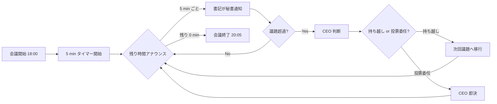

# PRJ-019 Clawbridge W0-Week1 検収会議 v4 当日運用キット v2 (議事録テンプレ + 投票プロトコル + 集計シート + DEC 起票補助 + Q-Mkt 事後承認 + PRJ-020 §5(d) 報告メモ)

制定: 秘書部門 / 経由: CEO / 宛: 5/8 検収会議参加者全員 / 当日記録運用基盤
発行日: 2026-05-03
適用日: 2026-05-08 18:00〜20:00
親版: v1 `secretary-w0-week1-meeting-minutes-template.md`（745 行）
基準議題版: v4 `secretary-w0-week1-meeting-agenda-v4.md`

---

## §0 200 字サマリ + v1 → v2 主要変更点

### §0.1 200 字サマリ

5/8 18:00〜20:00 (120 分) 開催の W0-Week1 検収会議 v4 における当日記録運用基盤を秘書部門が物理整備します。本キット v2 は v1 (745 行) を基に Q-Mkt 8 件オーナー一任受領 (5/3) を反映し、§4 起票補助を「DEC-019-026〜030 公式起票済前提」、§5 議事メモ 4 件を「Owner 一任承認済」記録形式に整理、§3.2 投票集計を 17 議題から DEC 既決分除外で 8 議題に圧縮、§2.6 §5(d) PRJ-020 Phase 0 報告メモを新規追加します。会議後 22:00 までの dashboard 反映 / decisions.md 反映 / 第 4 弾連結報告起票までの一気通貫運用を担保します。

### §0.2 v1 → v2 主要変更点

| 変更点 | v1（基準） | v2（本書） | 理由 |
|---|---|---|---|
| **§4 DEC 起票補助** | DEC-019-021〜030 計 10 件の fillable テンプレ（全件 5/8 起票前提） | **DEC-019-026〜030 + DEC-020-001〜003 + DEC-019-050/-051 計 12 件を「公式起票済」前提で再構成**（fillable は撤去、確定値転記＋ Owner 再確認チェック欄のみ、議決-20〜24 = DEC-019-050/-051 採択用議決を含む） | オーナー「CEO 推奨で進めて下さい」明示指示 (5/3) で DEC-019-026〜030 公式起票済 + DEC-019-050（5/3）/-051（5/4）追加起票で計 12 件、起票補助 → 公式承認確認に変容 |
| **§5 議事メモ 4 件** | Q-Mkt-01/03/07/08 を CEO 推奨方針で議事メモ記録（理由穴埋め） | **「Owner 一任承認済（CEO 推奨採択 5/3）」記録形式に整理**（穴埋め撤去、確定値記載） | 5/3 オーナー一任受領で全件確定済、議事録は事後承認形態 |
| **§3.2 投票集計** | 17 議題比較表（投票形式 = 7 部署 × Approve/Conditional/Reject） | **22 議題（議決-7〜24 + Phase 1 着手判定 / scaffold 等別カウント、議決-20〜24 = 5 件 = DEC-019-050/-051 採択を含む）に拡張**（DEC 既決分は事後承認、議決-20〜24 は YES 採決必要） | 議題 v7（20 議決）+ Phase 1 Conditional Go 別カウント + scaffold 別カウント = 22 議題、DEC-019-050（$30 cap）/-051（subscription 主軸）採択受け |
| **§2.6 §5(d) PRJ-020 Phase 0 報告** | 未含有 | **新規セクション追加**（5 分、Phase 0 4 並列成果サマリ + 6/13 Phase 1 PoC Go/NoGo 議題追加予告 + Owner 受領確認） | DEC-020-001〜003 起案で Phase 0 結果報告枠を §5(d) 5 分追加 |
| **§2.6 §5 後半 Q-Mkt** | 前半 4 件投票（10 分）+ 後半 4 件議事メモ | **事後承認モード（議事録 1 行記録のみ）**（実時間ゼロ、§5(c) 開始 1 分で読み上げ） | Q-Mkt 8 件全件オーナー一任承認済 |

---

## §1 背景 (5/8 検収会議 v4 当日運用基盤の必要性)

5/8 18:00 から開催される W0-Week1 検収会議 v4 は、PRJ-019 Clawbridge プロジェクトの W0 フェーズ (W0-Week1) を正式に検収し、続く W0-Week2 への着手判断および本日 5/3 オーナー指示で公式起票済の DEC-019-026〜030 + DEC-020-001〜003 計 8 件の Owner 直接面前再確認を行う重要会議です。会議中の進行は CEO が議長として担い、書記は秘書部門が務めます。120 分という限られた時間内で 5 大議題を扱い、Owner 再確認 / 受領 / 議事録 1 行記録の各形態に応じた記録を抜け漏れなく遂行するためには、当日運用キット v2 (穴埋め式議事録 + 投票プロトコル + 集計シート + DEC 起票補助 + Q-Mkt 事後承認 + PRJ-020 §5(d) 報告メモ) を事前整備しておく必要があります。

本キット v2 は下記 5 点を解決します。

1. **議事進行の標準化**: 全議題に統一された穴埋め欄を提供し、書記負担を削減する。
2. **投票結果の透明性**: §3.2 圧縮版集計シートで合意形成プロセスを可視化する（DEC 既決分は投票不要）。
3. **DEC 公式承認の即応性**: DEC-019-026〜030 + DEC-020-001〜003 の事後承認確認を §4 で実施。
4. **Q-Mkt 事後承認モードの記録**: §5 議事メモで「Owner 一任承認済」を確実に記録。
5. **PRJ-020 §5(d) Phase 0 報告**: §2.6 §5(d) で PRJ-020 Phase 0 4 並列成果を Owner に報告し受領確認。

---

## §2 議事録テンプレート (穴埋め式、v4 議題対応)

### §2.1 メタ情報セクション

```
- 開催日時: 2026-05-08 18:00〜20:00 (120 分)
- 場所: ChatGPT Pro セッション (Owner) + Claude Code セッション (CEO + 各部署)
- 議長: CEO
- 書記: 秘書部門
- 参加: [CEO / Dev / Research / Review / PM / Marketing / 秘書 / 広報 Web 運営 / Owner (任意)]
- 議題版: v4 (`secretary-w0-week1-meeting-agenda-v4.md`)
- 関連 DEC（5/3 公式起票済、本会議で Owner 再確認）:
  - DEC-019-021〜025（W0-Week2 前倒し並列成果 + Agent tool 権限 SOP）
  - DEC-019-026〜029（Q-Mkt-02 公開 6/20 / Q-Mkt-04 Heading A / Q-Mkt-05 部分開示 / Q-Mkt-06 HP 配置）
  - DEC-019-030（G-Top-1 (a)+(e) ハイブリッド採用、§5(c) で正式承認）
  - DEC-020-001〜003（PRJ-020 ClawDialog 起案 + Phase 0 + 同居実装、§5(d) で報告）
- 通算 DEC 件数（5/3 時点）: DEC-019-001〜030 計 30 件 + DEC-020-001〜003 計 3 件
- 想定議題数: 8 議題（投票必要分）+ Q-Mkt 議事録 1 行記録 1 件 + PRJ-020 §5(d) 受領確認 1 件
```

参加者出席チェック (会議開始時に書記が記録):

| 参加者 | 出席 (Y/N) | 備考 |
|---|---|---|
| CEO (議長) | _ | 必須 |
| Dev エージェント | _ | 必須 |
| Research エージェント | _ | 必須 |
| Review エージェント | _ | 必須 |
| PM エージェント | _ | 必須 |
| Marketing エージェント | _ | 必須 |
| 秘書部門 (書記) | _ | 必須 |
| 広報 Web 運営エージェント | _ | 必須 |
| Owner | _ | 任意（DEC 再確認時に在席必須） |

### §2.2 §1 Dev エビデンス検収 (穴埋め欄)

```
時間: 18:05〜18:30 (25 min)
発表者: Dev エージェント
配布資料: architecture-w0.md / security-w0.md / 95 tests pnpm test 結果

評価項目:
- [ ] DoD 13 完了基準への充足度 (現時点 _/13)
- [ ] 95 tests 全緑 (Y/N)
- [ ] HITL 第6種 tos_gray_review 雛形完成 (Y/N)
- [ ] openclaw-runtime ラッパ skeleton 完成 (Y/N)
- [ ] architecture/security-w0.md Mermaid 6 枚 (Y/N)
- [ ] 95 tests 内訳 (harness 38 / claude-bridge 29 / tos_gray 11 / openclaw-runtime 6 / mock-claude 5 / time-source 11) 全緑確認 (Y/N)

質疑応答 (3 件想定、1 件 2 min):
Q1: ___________
A1: ___________
Q2: ___________
A2: ___________
Q3: ___________
A3: ___________

CEO 評価: [Pass / Conditional Pass / Fail]
理由: ___________

書記メモ: ___________
```

### §2.3 §2 Research 検証 (穴埋め欄)

```
時間: 18:30〜18:50 (20 min)
発表者: Research エージェント
配布資料: research-changelog-monitoring-runbook.md / research-w0-supplement-op1-op5.md / research-w0-supplement-pd-modified-revalidation.md

評価項目:
- [ ] 4 系統 changelog 監視運用ランブック完成 (Y/N)
- [ ] OP1〜OP5 補足検証完了 (Y/N)
- [ ] PD-Modified 再検証エビデンス完備 (Y/N)
- [ ] HITL 第7種 external_api 設計妥当性 (Y/N)
- [ ] R-019-12 リスク再格付け根拠提示 (赤→黄 + A 赤 / B 黄 分割) (Y/N)

質疑応答 (3 件想定、1 件 2 min):
Q1: ___________
A1: ___________
Q2: ___________
A2: ___________
Q3: ___________
A3: ___________

CEO 評価: [Pass / Conditional Pass / Fail]
理由: ___________

書記メモ: ___________
```

### §2.4 §3 Review 検収 (穴埋め欄)

```
時間: 18:50〜19:15 (25 min)
発表者: Review エージェント
配布資料: review-ban-drill-1-scenario.md / review-tos-allowlist-dod-integration-v1.md / review-w0-week1-pentest-scenarios.md

評価項目:
- [ ] BAN ドリル 1 シナリオ通過 (Y/N)
- [ ] ToS allowlist DoD 統合 v1 完成 (Y/N)
- [ ] ペネトレーション B1〜B6 シナリオ完成 (Y/N)
- [ ] Agent tool 権限 SOP との整合性 (Y/N)
- [ ] 95 tests 全緑のレビュー側確認 (Y/N)

質疑応答 (3 件想定、1 件 2 min):
Q1: ___________
A1: ___________
Q2: ___________
A2: ___________
Q3: ___________
A3: ___________

CEO 評価: [Pass / Conditional Pass / Fail]
理由: ___________

書記メモ: ___________
```

### §2.5 §4 W0 完了 13 基準 + Go/NoGo + DEC-019-021〜024 公式承認 (穴埋め欄)

```
時間: 19:15〜19:35 (20 min)
進行: CEO
配布資料: ceo-w0-week1-consolidation.md / ceo-w0-week2-prep-consolidation.md / pm-cost-and-controls-plan-v4.md / agent-tool-permission-sop.md

総合判定:
- [ ] §1 Dev エビデンス Pass 判定 (Y/N)
- [ ] §2 Research 検証 Pass 判定 (Y/N)
- [ ] §3 Review 検収 Pass 判定 (Y/N)
- [ ] W0-Week1 総合 Go/NoGo: [Go / Conditional Go / NoGo]
- [ ] W0-Week2 着手承認 (Y/N)

DEC 公式承認 5 件（v1 比、4 件公式承認 + 1 件は事前 5/3 即決の Owner 直接面前再確認）:
- [ ] DEC-019-021 R-019-12 リスク再格付け（Owner 再確認: Y/N）
- [ ] DEC-019-022 4 系統 changelog 監視運用 + HITL 第7種（Owner 再確認: Y/N）
- [ ] DEC-019-023 PM v5 起案トリガー TR-1/2/3 確定（Owner 再確認: Y/N）
- [ ] DEC-019-024 Vercel Hobby→Pro 昇格判断 CB-CEO-W3-01 化（Owner 再確認: Y/N）
- [ ] DEC-019-025 Agent tool 権限 SOP 制定（Owner 再確認: Y/N）

質疑応答 (5 件想定、1 件 2 min):
Q1: ___________
A1: ___________
Q2: ___________
A2: ___________
Q3: ___________
A3: ___________
Q4: ___________
A4: ___________
Q5: ___________
A5: ___________

CEO 総合判定: [Go / Conditional Go / NoGo]
理由: ___________

書記メモ: ___________
```

### §2.6 §5 PM 追加議題 + Q-Mkt 事後承認 + PRJ-020 報告 (穴埋め欄、v4 再分配版)

```
時間: 19:35〜20:05 (30 min、§5.1〜§5.3 各 5 min + §5(c) 10 min + §5(d) 5 min)
進行: PM エージェント (前半) / CEO + 秘書 (後半)
配布資料: pm-cost-and-controls-plan-v4.md / pm-w0-week2-execution-plan.md / ceo-q-mkt-01-08-formal-adoption-2026-05-03.md / projects/PRJ-020/reports/ceo-prj020-scope-definition.md
```

#### §2.6.1 §5.1 PM v4 起案承認 (5 min)

```
評価項目:
- [ ] PM v4 cost and controls plan の妥当性 (Y/N)
- [ ] DEC-019-021〜024 のロールアップ整合性 (Y/N)
- [ ] W3 昇格判断条件 (CB-CEO-W3-01) 妥当性 (Y/N)
- [ ] HITL 計 7 種 + PRJ-020 第 8 種 (DEC-020-001) 追加予告整合 (Y/N)

質疑応答 (1 件想定):
Q1: ___________
A1: ___________

CEO 判定: [Approve / Conditional / Reject]
理由: ___________
```

#### §2.6.2 §5.2 DEC-019-021〜024 Owner 再確認 (5 min、5/3 即決済 4 件)

```
- [ ] DEC-019-021 Owner 再確認 (Y/N)
- [ ] DEC-019-022 Owner 再確認 (Y/N)
- [ ] DEC-019-023 Owner 再確認 (Y/N)
- [ ] DEC-019-024 Owner 再確認 (Y/N)

異議内容: ___________ (異議なき場合は「異議なし、Owner 再確認済」と記載)

書記メモ: ___________
```

#### §2.6.3 §5.3 5/15 競合解消承認 + W0-W2 タスク台帳 29 件統合承認 (5 min、v4 で統合)

```
評価項目:
- [ ] AS-151 を 5/16 (土) にスライド調整可能 (Y/N、Owner 確認)
- [ ] 5/15 PRJ-019 Dev タスク 5 件以下に圧縮可能 (Y/N、PM 確認)
- [ ] W0-Week2 実行計画 29 タスク × 6 部署の DoD 整合 (Y/N)
- [ ] 6 部署キックオフ通知配布計画妥当性 (Y/N)

質疑応答 (1 件想定):
Q1: ___________
A1: ___________

CEO 判定: [Approve / Conditional / Reject]
理由: ___________

書記メモ: ___________
```

#### §2.6.4 §5(c) G-Top-1 (a)+(e) ハイブリッド採用 (DEC-019-030) 公式承認 (10 min、v4 +5 分)

```
評価項目（DEC-019-030 を 5/3 既起票、本議題で正式承認）:
- [ ] (a) HN trending → 開発者向け CLI ツールの whitelist confidence ≥ 0.85 確認 (Y/N)
- [ ] (e) Indie Hackers → microSaaS の whitelist 内収束見込確認 (Y/N)
- [ ] (a)+(e) ハイブリッドの Phase 1 デモ DoD 整合性 (< 60 min/件 / < $5/件 / 10 連続 ≥ 80%) (Y/N)
- [ ] FN-Black ≤ 10% 評価の HN 60 件 + IH 30 件 = 計 90 件アノテ計画整合 (Y/N)
- [ ] HP 事例ページに 2 ジャンル × 各 1 件のデモ事例配置整合 (Q-Mkt-06 / DEC-019-029) (Y/N)
- [ ] microSaaS payment processing 関与時 HITL 第 7 種除外運用 (Y/N)

10 分内訳:
1. 秘書 DEC-019-030 読み上げ (1 min)
2. CEO 採用根拠 6 点説明 (3 min)
3. Phase 1 デモ DoD 詳細確認 (3 min)
4. Dev W2-R-04 FN-Black アノテ 90 件 + 補正計画確認 (2 min)
5. Owner 最終確認 (1 min)

質疑応答 (1 件想定):
Q1: ___________
A1: ___________

Owner 再確認: [Approve / 異議 / 持帰り]
持帰り時の修正期限: 2026-05-12 までに別決裁起票
理由: ___________

書記メモ: ___________
```

#### §2.6.5 §5(d) PRJ-020 ClawDialog Phase 0 結果報告 (5 min、v4 新規追加)

```
評価項目（DEC-020-001〜003 を 5/3 既起票、本議題で Owner 受領確認）:
- [ ] DEC-020-001 PRJ-020 起案承認 (Owner 受領確認 Y/N)
- [ ] DEC-020-002 Phase 0 スコープ + 4 並列発注 (Owner 受領確認 Y/N)
- [ ] DEC-020-003 同居実装方針 (PRJ-019 app/clawdialog/) (Owner 受領確認 Y/N)

5 分内訳:
1. 秘書 DEC-020-001〜003 読み上げ (1.5 min)
2. Phase 0 4 並列成果サマリ:
   - CEO スコープ定義書 (256 行) — `ceo-prj020-scope-definition.md`
   - Research 接続方式調査 — `research-prj020-connection-method.md` (5/3 着地)
   - Dev 実装 skeleton — `dev-prj020-implementation-skeleton.md` (5/3 着地)
   - Review セキュリティリスク評価 — `review-prj020-security-risk.md` (5/3 着地)
   (2.5 min)
3. Phase 1 PoC Go/NoGo 判定議題追加予告:
   - 6/13 検収会議で PRJ-020 Phase 1 PoC (6/14〜6/27、2 週間、PoC DoD: 1 件 Owner 投入 → Open Claw 判定 → Owner フィードバック e2e 動作確認) の Go/NoGo を別決裁 DEC-020-XXX で判定
   (1 min)

質疑応答 (1 件想定):
Q1: ___________
A1: ___________

Owner 受領確認: [受領済 / 異議 / 持帰り]
6/13 Phase 1 PoC Go/NoGo 議題追加同意: [同意 / 異議]
理由: ___________

書記メモ: ___________
```

#### §2.6.6 §5 後半 Q-Mkt 8 件 = 事後承認モード（議事録 1 行記録のみ、§5(c) 開始 1 分で実施）

```
時間: §5(c) 開始 1 分内に秘書が 1 行ずつ読み上げ報告（実時間 0 分）
進行: 秘書部門
配布資料: ceo-q-mkt-01-08-formal-adoption-2026-05-03.md

DEC-019-026〜029 既決報告（Owner 直接面前で再確認、異議なき場合「Owner 一任承認済」記録）:
- [ ] Q-Mkt-02 公開タイミング 6/20 確定 (DEC-019-026): Owner 一任承認済 (Y/N)
- [ ] Q-Mkt-04 Heading A 採用 (DEC-019-027): Owner 一任承認済 (Y/N)
- [ ] Q-Mkt-05 部分開示 (DEC-019-028): Owner 一任承認済 (Y/N)
- [ ] Q-Mkt-06 HP トップ + 事例ページ両方 (DEC-019-029): Owner 一任承認済 (Y/N)

議事録扱い 4 件（投票不要、Owner 一任承認済 (CEO 推奨採択 5/3) 記録）:
- [ ] Q-Mkt-01 PATTERN-006/007 番号衝突 → PM 棚卸し結果に従って自動採番。衝突時は PATTERN-008/009 にスライド。Owner 一任承認済。
- [ ] Q-Mkt-03 表現比重 40-25-20-15 → Marketing / CEO 推奨のまま採用。CEO Heading A 採用と整合。Owner 一任承認済。
- [ ] Q-Mkt-07 プレス静観、SNS は X 1 投稿のみ。Phase 1 直後の取材依頼は Phase 2 完了後 (Q3) に再評価。Owner 一任承認済。
- [ ] Q-Mkt-08 K8/K9 anti-pattern は PRJ ID 伏字 + 教訓全面公開。社内学習価値 + 公開価値の両立。Owner 一任承認済。

異議内容: ___________ (異議なき場合は「異議なし、Owner 一任承認済 (CEO 推奨採択 5/3)」と記載)

書記メモ: ___________
```

---

## §3 投票プロトコル詳細（v2 改訂）

### §3.1 投票形式

- 各議題ごとに 7 部署 (Dev / Research / Review / PM / Marketing / 秘書 / 広報 Web 運営) + 議長 (CEO) + Owner で投票します。
- 投票形式: **Approve / Conditional / Reject + 理由 1 行** (絵文字禁止)。
- 過半数で議決成立とします。CEO は決裁権を持ち、tied case は CEO 判断で確定します。
- Conditional は理由を満たした上で再投票するか、議事録に条件を記載した上で承認とします。
- Reject が 1 票でも出た場合は §7.5 のルールに従い Conditional 扱いで再協議を行います。
- **DEC 既決分（DEC-019-026〜030 + DEC-020-001〜003）は投票不要、Owner 再確認 / 受領確認のみ実施。**

### §3.2 集計テンプレ（v2 圧縮版、計 8 議題）

v1 17 議題比較表 → v2 8 議題（DEC 既決分除外）:

| # | 議題 ID | 議題名 | 投票結果 (A/C/R) | CEO 判断 | Owner 再確認 | DEC 起票 |
|---|---|---|---|---|---|---|
| 1 | §1 | Dev エビデンス検収 | _/_ / _/_ / _/_ | Pass/Cond/Fail | — | — |
| 2 | §2 | Research 検証 | _/_ / _/_ / _/_ | Pass/Cond/Fail | — | — |
| 3 | §3 | Review 検収 | _/_ / _/_ / _/_ | Pass/Cond/Fail | — | — |
| 4 | §4 | W0 完了 13 基準 + Go/NoGo + DEC-019-021〜025 Owner 再確認 | _/_ / _/_ / _/_ | Go/Cond/NoGo | _ | DEC-019-031（条件付き、§1〜§4 統合総括） |
| 5 | §5.1 | PM v4 起案承認 | _/_ / _/_ / _/_ | Approve/Reject | — | — |
| 6 | §5.3 | 5/15 競合解消 + W0-W2 台帳 29 件統合 | _/_ / _/_ / _/_ | Approve/Reject | — | — |
| 7 | §5(c) | G-Top-1 (a)+(e) ハイブリッド DEC-019-030 公式承認 | — | — | _ | DEC-019-030（5/3 起票済、5/8 正式承認） |
| 8 | §5(d) | PRJ-020 Phase 0 結果報告（受領確認） | — | — | _ | DEC-020-001〜003（5/3 起票済、Owner 受領） |

**注**: §5.2 DEC-019-021〜024 Owner 再確認は §4 に統合（5/3 即決済 4 件 + DEC-019-025 = 5 件を Owner 直接面前で一括再確認）

投票理由 1 行記録欄（各議題 1 行 × 8 議題）:

```
[議題 1 §1 Dev エビデンス]   理由: ___________
[議題 2 §2 Research 検証]   理由: ___________
[議題 3 §3 Review 検収]   理由: ___________
[議題 4 §4 Go/NoGo + DEC-019-021〜025 Owner 再確認]   理由: ___________
[議題 5 §5.1 PM v4]   理由: ___________
[議題 6 §5.3 5/15 競合 + W0-W2 台帳]   理由: ___________
[議題 7 §5(c) G-Top-1 DEC-019-030 Owner 再確認]   理由: ___________
[議題 8 §5(d) PRJ-020 Phase 0 受領]   理由: ___________
```

### §3.3 議事録 1 行記録扱い 8 件 (Q-Mkt-01〜08) は投票不要、Owner 一任承認済記録形式

| # | 議題 ID | 議題名 | 扱い | DEC ID | 記録先 |
|---|---|---|---|---|---|
| A | Q-Mkt-01 | PATTERN-006/007 番号衝突 → PM 棚卸し / 衝突時 PATTERN-008/009 スライド | Owner 一任承認済（議事メモ） | — | §5.1 |
| B | Q-Mkt-02 | 公開タイミング 6/20 確定 | DEC 既決 | **DEC-019-026** | §5.5 |
| C | Q-Mkt-03 | 表現比重 40-25-20-15 承認 | Owner 一任承認済（議事メモ） | — | §5.2 |
| D | Q-Mkt-04 | Heading A 採用 | DEC 既決 | **DEC-019-027** | §5.5 |
| E | Q-Mkt-05 | 部分開示 | DEC 既決 | **DEC-019-028** | §5.5 |
| F | Q-Mkt-06 | HP トップ + 事例ページ両方 | DEC 既決 | **DEC-019-029** | §5.5 |
| G | Q-Mkt-07 | プレス静観 + X 1 投稿のみ | Owner 一任承認済（議事メモ） | — | §5.3 |
| H | Q-Mkt-08 | K8/K9 anti-pattern 部分匿名化 | Owner 一任承認済（議事メモ） | — | §5.4 |

---

## §4 DEC 起票補助（v2 改訂、本日 5/3 公式起票済前提）

v1 では DEC-019-021〜030 計 10 件の fillable テンプレを用意していたが、本日 2026-05-03 に下記が公式起票済となったため、v2 では「公式承認確認」形式に変容する。各 DEC につき確定値転記 + Owner 再確認チェック欄のみを残す。

### §4.1 DEC-019-021〜025（5/3 即決済、§4 議題で Owner 再確認）

| DEC | 内容 | 起票日 | 主要根拠資料 | Owner 再確認 |
|---|---|---|---|---|
| DEC-019-021 | R-019-12 リスク再格付け（赤→黄 + A 赤 / B 黄 分割）+ C-OC-01〜05 発令 | 2026-05-03 | `research-w0-supplement-pd-modified-revalidation.md` §1〜§5、`dev-w0-week2-prep-report.md` | _ (Y/N) |
| DEC-019-022 | 4 系統 changelog 監視運用 + HITL 第 7 種 `external_api` | 2026-05-03 | `research-changelog-monitoring-runbook.md` §1〜§7、`pm-cost-and-controls-plan-v4.md` §5 / §6 | _ (Y/N) |
| DEC-019-023 | PM v5 起案トリガー TR-1〜TR-3 確定 | 2026-05-03 | `pm-cost-and-controls-plan-v4.md` §7、`research-w0-supplement-pd-modified-revalidation.md` §7、`review-ban-drill-1-scenario.md` §6 | _ (Y/N) |
| DEC-019-024 | Vercel Hobby→Pro 昇格判断 W3 中盤 (2026-06-03) CB-CEO-W3-01 公式タスク化 | 2026-05-03 | `pm-cost-and-controls-plan-v4.md` §3.4、DEC-019-016 / DEC-019-017 | _ (Y/N) |
| DEC-019-025 | Agent tool 権限 SOP 制定 (`organization/rules/agent-tool-permission-sop.md`) | 2026-05-03 | 本連結報告 §8、`ceo-w0-week2-prep-consolidation.md` §0 / §8 | _ (Y/N) |

### §4.2 DEC-019-026〜029（Q-Mkt 4 件、5/3 公式起票済、§5 後半 §5(c) 開始 1 分で議事録 1 行記録）

| DEC | 議題 | 確定内容 | 起票日 | 根拠資料 | Owner 一任承認確認 |
|---|---|---|---|---|---|
| DEC-019-026 | Q-Mkt-02 公開タイミング | **2026-06-20 (土) 朝に Phase 1 完了レポート + LP + 技術ブログ + 自社 HP + 社内ナレッジ K1〜K10 同時公開** | 2026-05-03 | `ceo-q-mkt-01-08-formal-adoption-2026-05-03.md` §2.1 | _ (Y/N) |
| DEC-019-027 | Q-Mkt-04 Heading | **A 案「AI 組織が AI 組織を運営する」採用** | 2026-05-03 | `ceo-q-mkt-01-08-formal-adoption-2026-05-03.md` §2.2 | _ (Y/N) |
| DEC-019-028 | Q-Mkt-05 開示範囲 | **部分開示モード（harness 80% / org 50% / cost 100% / ToS 概要）** | 2026-05-03 | `ceo-q-mkt-01-08-formal-adoption-2026-05-03.md` §2.3 | _ (Y/N) |
| DEC-019-029 | Q-Mkt-06 HP 配置 + リード導線 | **HP トップ + 事例ページ両方 + Contact form のみ** | 2026-05-03 | `ceo-q-mkt-01-08-formal-adoption-2026-05-03.md` §2.4 | _ (Y/N) |

### §4.3 DEC-019-030（G-Top-1、5/3 公式起票済、§5(c) で正式承認）

| DEC | 議題 | 確定内容 | 起票日 | 根拠資料 | Owner 再確認 |
|---|---|---|---|---|---|
| DEC-019-030 | G-Top-1 Phase 1 デモ枠 1 件ジャンル | **(a) HN trending → 開発者向け CLI ツール + (e) Indie Hackers → microSaaS のハイブリッド採用** | 2026-05-03（5/8 §5(c) で正式承認） | `ceo-q-mkt-01-08-formal-adoption-2026-05-03.md` §1 注記、`secretary-w0-week1-meeting-agenda-v4.md` §6、`review-tos-allowlist-dod-integration-v1.md` §1.5 | _ (Y/N) |

### §4.4 DEC-020-001〜003（PRJ-020、5/3 公式起票済、§5(d) で報告 + Owner 受領確認）

| DEC | 内容 | 起票日 | 根拠資料 | Owner 受領確認 |
|---|---|---|---|---|
| DEC-020-001 | PRJ-020 ClawDialog 起案承認（Owner ↔ Open Claw 双方向対話環境） | 2026-05-03 | `projects/PRJ-020/reports/ceo-prj020-scope-definition.md` §0〜§10、Owner 指示原文（5/3） | _ (Y/N) |
| DEC-020-002 | Phase 0 スコープ + 4 並列発注（秘書 / Research / Dev / Review）+ Phase 1 PoC 6/13 後判定 | 2026-05-03 | `projects/PRJ-020/reports/ceo-prj020-scope-definition.md` §6.1 | _ (Y/N) |
| DEC-020-003 | 同居実装方針（PRJ-019 `app/clawdialog/` サブディレクトリ + HITL Gate / Spend Cap / 監査ログ共有） | 2026-05-03 | `projects/PRJ-020/reports/ceo-prj020-scope-definition.md` §4.1〜§4.3 / §9 | _ (Y/N) |

### §4.5 DEC-019-031（5/8 議事中起票候補、条件付き）

```
- 議題 ID: DEC-019-031
- 議題名: §1〜§4 統合 W0-Week1 検収結果総括
- 議決日: 2026-05-08
- 起案者: CEO
- 賛同者: ___________
- 反対者: ___________
- 決定内容 (要約 1〜3 行):
  W0-Week1 検収結果（Dev / Research / Review 全 Pass）+ DEC-019-021〜025 Owner 再確認済 + DEC-019-026〜030 既決 + DEC-020-001〜003 受領済を統合し、5/19 Phase 1 着手の最終 Go/NoGo 判定材料を確定。
  ___________
  ___________
- 根拠資料: ceo-w0-week1-consolidation.md / pm-cost-and-controls-plan-v4.md / 本議事録
- 起票期限: 5/8 22:00 まで
```

### §4.6 DEC-020-XXX（6/13 検収会議で別決裁起票予定、本会議では起票せず）

```
- 議題 ID: DEC-020-XXX
- 議題名: PRJ-020 Phase 1 PoC Go/NoGo 判定
- 議決日: 2026-06-13
- 起案者: CEO（PRJ-019 Phase 1 完了レビュー + PRJ-020 Phase 0 結果統合判断）
- 内容（予告）: PoC 期間 6/14〜6/27（2 週間）、DoD「PoC 1 件 Owner 投入 → Open Claw 判定 → Owner フィードバック e2e 動作確認」の Go/NoGo
```

DEC 公式承認確認サマリ表（v2 圧縮版）:

| # | DEC ID | 議題名（要約） | 起票状況 | 5/8 議題 |
|---|---|---|---|---|
| 1 | DEC-019-021 | R-019-12 リスク再格付け | 5/3 既決 | §4 Owner 再確認 |
| 2 | DEC-019-022 | 4 系統 changelog 監視 + HITL 第 7 種 | 5/3 既決 | §4 Owner 再確認 |
| 3 | DEC-019-023 | PM v5 起案トリガー TR-1/2/3 | 5/3 既決 | §4 Owner 再確認 |
| 4 | DEC-019-024 | Vercel Hobby→Pro 昇格 CB-CEO-W3-01 化 | 5/3 既決 | §4 Owner 再確認 |
| 5 | DEC-019-025 | Agent tool 権限 SOP 制定 | 5/3 既決 | §4 Owner 再確認 |
| 6 | DEC-019-026 | Q-Mkt-02 公開 6/20 確定 | 5/3 公式起票済 | §5 後半 1 行記録 |
| 7 | DEC-019-027 | Q-Mkt-04 Heading A 採用 | 5/3 公式起票済 | §5 後半 1 行記録 |
| 8 | DEC-019-028 | Q-Mkt-05 部分開示 | 5/3 公式起票済 | §5 後半 1 行記録 |
| 9 | DEC-019-029 | Q-Mkt-06 HP トップ + 事例ページ両方 | 5/3 公式起票済 | §5 後半 1 行記録 |
| 10 | DEC-019-030 | G-Top-1 (a)+(e) ハイブリッド採用 | 5/3 公式起票済 | §5(c) 公式承認 |
| 11 | DEC-020-001 | PRJ-020 起案承認 | 5/3 公式起票済 | §5(d) Owner 受領 |
| 12 | DEC-020-002 | Phase 0 スコープ + 4 並列発注 | 5/3 公式起票済 | §5(d) Owner 受領 |
| 13 | DEC-020-003 | 同居実装方針 | 5/3 公式起票済 | §5(d) Owner 受領 |
| 14 | DEC-019-031（候補） | §1〜§4 統合 W0-Week1 検収結果総括 | 5/8 議事中起票候補 | §4 終了時 |

---

## §5 議事メモ（議決外事項、v2 で「Owner 一任承認済」記録形式）

投票対象外の 4 件は本日 5/3 オーナー一任受領（CEO 推奨採択）に基づき確定済。議事メモとして公式記録します。

### §5.1 Q-Mkt-01 PATTERN-006/007 番号衝突 → PM 棚卸し結果従順 + 衝突時スライド方針 (Owner 一任承認済 [CEO 推奨採択 5/3])

```
- 議題 ID: Q-Mkt-01
- 確定方針: PM 部門が EXTRACTION-ROADMAP の予約番号棚卸しを 5/8 までに実施し、衝突あれば PATTERN-008/009 にスライド
- 確定根拠: Owner 一任承認済（CEO 推奨採択 5/3）、PM 棚卸し結果は §5.3 議題で口頭報告
- 議事録記載: 「Q-Mkt-01: PATTERN-006/007 番号衝突回避は PM 棚卸し結果に従って自動採番。衝突時は PATTERN-008/009 にスライド。Owner 一任承認済 (CEO 推奨採択 5/3)。」
- 関連資料: `secretary-marketing-owner-questions-2026-05-03.md`、`ceo-q-mkt-01-08-formal-adoption-2026-05-03.md` §3.1
```

### §5.2 Q-Mkt-03 表現比重 40-25-20-15 (Owner 一任承認済 [CEO 推奨採択 5/3])

```
- 議題 ID: Q-Mkt-03
- 確定方針: harness 40% / org 25% / cost 20% / ToS 15% の比率で公式採用
- 確定根拠: Owner 一任承認済（CEO 推奨採択 5/3）、CEO Heading A 採用（DEC-019-027）と整合
- 議事録記載: 「Q-Mkt-03: 表現比重 40-25-20-15 を Marketing / CEO 推奨のまま採用。CEO Heading A 採用と整合。Owner 一任承認済 (CEO 推奨採択 5/3)。」
- 関連資料: `secretary-marketing-owner-questions-2026-05-03.md`、`marketing-knowledge-reflection-design.md`、`ceo-q-mkt-01-08-formal-adoption-2026-05-03.md` §3.2
```

### §5.3 Q-Mkt-07 プレス静観・SNS X 1 投稿のみ (Owner 一任承認済 [CEO 推奨採択 5/3])

```
- 議題 ID: Q-Mkt-07
- 確定方針: 静観方針（プレスリリース・SNS 配信は Phase 1 直後 NG）、SNS は X (Twitter) 1 投稿のみ（Heading A + LP リンク + 部分開示モードの注記 1 行）
- 確定根拠: Owner 一任承認済（CEO 推奨採択 5/3）、Phase 1 直後の取材依頼は Phase 2 完了後 (Q3) に再評価
- 議事録記載: 「Q-Mkt-07: プレス静観、SNS は X 1 投稿のみ。Phase 1 直後の取材依頼は Phase 2 完了後 (Q3) に再評価。Owner 一任承認済 (CEO 推奨採択 5/3)。」
- 関連資料: `secretary-marketing-owner-questions-2026-05-03.md`、`ceo-q-mkt-01-08-formal-adoption-2026-05-03.md` §3.3
```

### §5.4 Q-Mkt-08 K8/K9 anti-pattern 部分匿名化 (Owner 一任承認済 [CEO 推奨採択 5/3])

```
- 議題 ID: Q-Mkt-08
- 確定方針: 部分匿名化（PRJ ID = PRJ-001〜018 は伏字「PRJ-XXX」記載、教訓 = Lessons Learned は全面公開）
- 確定根拠: Owner 一任承認済（CEO 推奨採択 5/3）、社内学習価値 + 公開価値の両立
- 議事録記載: 「Q-Mkt-08: K8/K9 anti-pattern は PRJ ID 伏字 + 教訓全面公開。社内学習価値 + 公開価値の両立。Owner 一任承認済 (CEO 推奨採択 5/3)。」
- 関連資料: `secretary-marketing-owner-questions-2026-05-03.md`、`marketing-knowledge-reflection-design.md`、`ceo-q-mkt-01-08-formal-adoption-2026-05-03.md` §3.4
```

### §5.5 DEC-019-026〜029 既決 4 件（議事録 1 行記録）

```
- DEC-019-026 (Q-Mkt-02): 「公開 6/20 (土) 朝に PRJ-019 Phase 1 完了レポート + LP + 技術ブログ + HP + 社内ナレッジ K1〜K10 同時公開。Owner 一任承認済 (CEO 推奨採択 5/3)、5/3 DEC 公式起票済、5/8 Owner 直接面前再確認済。」
- DEC-019-027 (Q-Mkt-04): 「Heading A「AI 組織が AI 組織を運営する」採用。Owner 一任承認済 (CEO 推奨採択 5/3)、5/3 DEC 公式起票済、5/8 Owner 直接面前再確認済。」
- DEC-019-028 (Q-Mkt-05): 「部分開示モード（harness 80% / org 50% / cost 100% / ToS 概要）採用。Owner 一任承認済 (CEO 推奨採択 5/3)、5/3 DEC 公式起票済、5/8 Owner 直接面前再確認済。」
- DEC-019-029 (Q-Mkt-06): 「HP トップ + 事例ページ両方 + Contact form のみリード導線採用。Owner 一任承認済 (CEO 推奨採択 5/3)、5/3 DEC 公式起票済、5/8 Owner 直接面前再確認済。」
```

---

## §6 アクションアイテム (会議後)

会議終了 (20:05) 後の同日アクションを下記スケジュールで実行します。

| # | 期限 | 担当 | 内容 | 完了確認 (Y/N) |
|---|---|---|---|---|
| §6.1 | 5/8 22:00 | 秘書部門 | 6 部署キックオフ通知配布 (`pm-w0-week2-department-kickoff-templates.md` 参照) | _ |
| §6.2 | 5/8 22:00 | 秘書部門 | dashboard 5/8 22:00 反映 (`dashboard/active-projects.md`、PRJ-019 + PRJ-020 同居実装表記方針反映) | _ |
| §6.3 | 5/8 22:00 | 秘書部門 | decisions.md 確認（DEC-019-026〜030 + DEC-020-001〜003 5/3 起票済を 5/8 Owner 再確認 / 受領確認の追記）+ DEC-019-031 起票（条件付き） | _ |
| §6.4 | 5/8 22:00 | CEO | 第 4 弾連結報告起票 | _ |
| §6.5 | 5/8 22:00 | 秘書部門 | PRJ-018 PM 経由で AS-151 → 5/16 スライド調整依頼起票 | _ |
| §6.6 | 5/9 09:00 | 全部署 | W0-Week2 公式着手 | _ |
| §6.7 | 5/9 09:00 | Marketing | Q-Mkt 反映 v2（`marketing-portfolio-reflection-design-v2.md` / `marketing-knowledge-reflection-design-v2.md`）作業着手 | _ |

---

## §7 会議運用ガイドライン

### §7.1 タイムキーピング (秘書部門が 5 min ごとに残り時間アナウンス)

書記 (秘書部門) が会議開始から 5 min 単位で残り時間をアナウンスします。各議題の超過時には CEO へ通知し、§7.2 ルールに従い対応します。



### §7.2 議題超過時の対応 (CEO 判断で持ち越し or 投票委任)

各議題が想定時間を超過した場合、CEO が下記いずれかを判断します。

- **持ち越し**: 次回会議 (5/15 競合解消 + AS-151 スライド会議など) へ議題を持ち越す。
- **投票委任**: CEO が即決判断し、議事録に判断根拠を記載した上で全部署同意とみなす。
- **§5(c) 超過時**: G-Top-1 (a)+(e) ハイブリッド DEC-019-030 は 5/3 既決のため、超過時は議事録に「Owner 再確認の口頭異議なし」を記載して即決完了とする。
- **§5(d) 超過時**: PRJ-020 Phase 0 結果報告は 5/8 で受領確認のみ、Phase 1 PoC Go/NoGo は 6/13 検収会議に別決裁送りとし、超過議論は持ち越し。

### §7.3 オーナー任意参加時の発言フロー (CEO 経由で集約 → ChatGPT Pro セッション内で確認)

Owner は ChatGPT Pro セッション内で任意参加します。発言が必要な場合は下記フローを取ります。

1. Owner が ChatGPT Pro セッションで発言・コメントを記録。
2. CEO が Claude Code セッション内に Owner コメントを集約・転送。
3. 部署エージェントは CEO 経由でのみ Owner と通信 (CLAUDE.md ルール準拠)。
4. 議決時の Owner 投票は任意とし、Owner 不参加でも過半数成立で議決可能。
5. **DEC 既決分の Owner 再確認 / 受領確認は Owner 在席必須**（在席不可なら 48h 内回付で書面再確認）。

### §7.4 絵文字禁止徹底

CLAUDE.md ルールに従い、議事録・投票理由・DEC 起票内容のいずれにも絵文字を使用しません。書記は記録時に絵文字混入をチェックし、混入あれば即時除去します。

### §7.5 投票拒否権 (Reject) の閾値 (1 票でも Reject なら Conditional 扱いで再協議)

Reject が 1 票でも出た場合、議題は自動的に Conditional 扱いとなり、Reject 理由を踏まえた再協議を行います。再協議後に再投票を実施し、過半数 Approve で議決成立とします。CEO は tied case で決裁権を行使します。

### §7.6 DEC 既決分への異議申立て運用（v2 新規）

DEC-019-026〜030 + DEC-020-001〜003 計 8 件は本日 5/3 公式起票済のため、5/8 検収会議では Owner 直接面前再確認 / 受領確認の形態を取ります。Owner から異議が出た場合の運用:

- **DEC 撤回**: CEO 即決で当該 DEC を撤回し、別決裁 DEC-019-XXX で再起票（持帰り 48h 内回付）
- **DEC 修正**: 部分修正なら議事録に「Owner 異議による部分修正」を記載し、修正版 DEC-019-XXX で別起票（持帰り 5/12 までに完了）
- **DEC 維持**: 異議の根拠が薄い場合は CEO が説得し、Owner 同意で維持（議事録に「Owner 異議解消」記載）

---

## §8 関連

- v1 親文書: `secretary-w0-week1-meeting-minutes-template.md`（745 行）
- v4 議題: `secretary-w0-week1-meeting-agenda-v4.md`（本キット v2 の基準議題）
- DEC-019-026〜030 起票根拠: `ceo-q-mkt-01-08-formal-adoption-2026-05-03.md`、`secretary-marketing-owner-questions-2026-05-03.md`
- DEC-020-001〜003 起票根拠: `projects/PRJ-020/reports/ceo-prj020-scope-definition.md`、`projects/PRJ-020/decisions.md`
- PRJ-020 Phase 0 4 並列成果: `research-prj020-connection-method.md` / `dev-prj020-implementation-skeleton.md` / `review-prj020-security-risk.md`（5/3 着地予定）
- PRJ-020 dashboard 反映: `secretary-prj020-dashboard-and-meeting-integration.md`（本キット v2 と同時発行）
- DEC-019-021〜024 起票根拠: `pm-cost-and-controls-plan-v4.md`、`research-changelog-monitoring-runbook.md`、`research-w0-supplement-pd-modified-revalidation.md`、`review-ban-drill-1-scenario.md`
- DEC-019-025 起票根拠: `organization/rules/agent-tool-permission-sop.md`
- 5/8 会議準備: `pm-w0-week2-department-kickoff-templates.md`、`pm-w0-week2-execution-plan.md`
- 連結報告: `ceo-w0-week1-consolidation.md`、`ceo-w0-week2-prep-consolidation.md`
- §1〜§3 検収根拠: `dev-w0-week1-evidence-and-mockclaw.md`、`research-changelog-monitoring-runbook.md`、`review-control-implementation-plan.md`
- §5 後半 Marketing 根拠: `marketing-portfolio-reflection-design.md`、`marketing-knowledge-reflection-design.md`

---

制定: 秘書部門 / 経由: CEO / 宛: 5/8 検収会議参加者全員 / 当日記録運用基盤 v2
