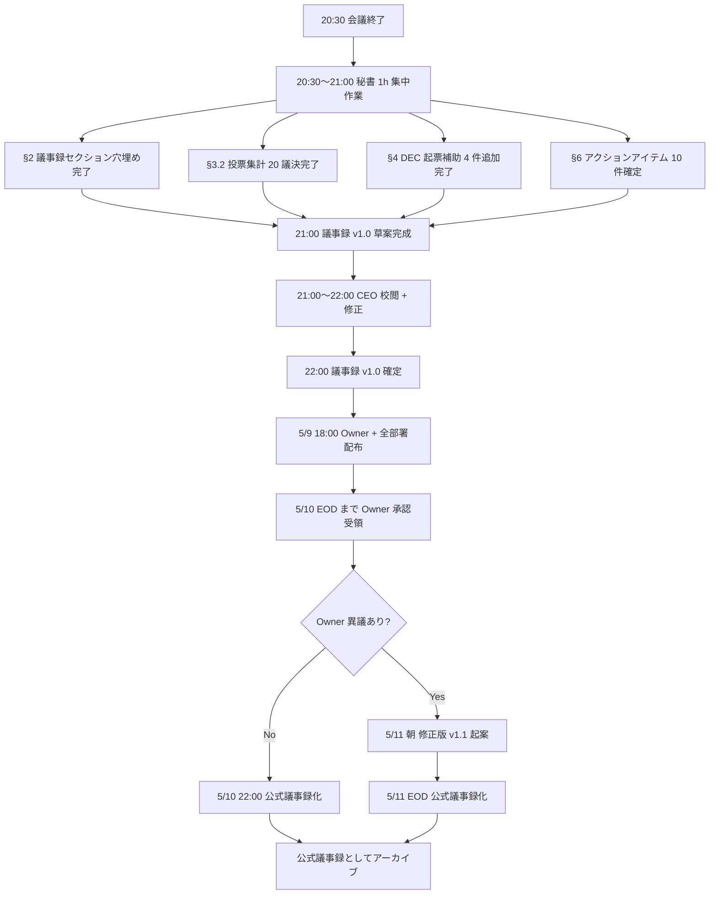

# PRJ-019 Clawbridge W0-Week1 検収会議 v7 当日運用キット v3 (議事録テンプレ + 投票プロトコル + 集計シート + DEC 起票補助 + 議決-20〜24 反映 + 1h 書き上げ最適化)

制定: 秘書部門 / 経由: CEO / 宛: 5/8 検収会議参加者全員 / 当日記録運用基盤
発行日: 2026-05-04
適用日: 2026-05-08 18:00〜20:00
親版: v2 `secretary-w0-week1-meeting-minutes-template-v2.md`（632 行、2026-05-03 発行）
基準議題版: v7 `secretary-w0-week1-meeting-agenda-v7.md`（議決 20 件）

---

## §0 200 字サマリ + v2 → v3 主要変更点

### §0.1 200 字サマリ

5/8 18:00〜20:00（実議事 90〜105 分）開催の W0-Week1 検収会議 v7 における当日記録運用基盤を秘書部門が物理整備します。本キット v3 は v2（632 行）を基に DEC-019-050（$30 cap）+ DEC-019-051（subscription 主軸）採択に伴う議決-20〜24 計 5 件追加を反映し、§3.2 投票集計を 8 議題 → **20 議決全件**に拡張、§2 議事録セクションを §6 議決-1〜15 圧縮路線（CEO 推奨 YES 先行 0.3 分／件） + §6.2 議決-20〜24 詳細穴埋め欄に再構成、§9 footer に**会議終了後 1h 以内書き上げ SOP** を新規追加します。会議後 22:00 までの dashboard 反映 / decisions.md 反映 / 第 8 弾連結報告起票までの一気通貫運用を担保します。

### §0.2 v2 → v3 主要変更点

| 変更点 | v2（基準） | v3（本書） | 理由 |
|---|---|---|---|
| **§2 議事録テンプレ** | §1〜§4 + §5.1〜§5.6 + §5(c)/(d) 各議事内 | **§6 議決-1〜15（圧縮）+ §6.2 議決-20〜24（詳細穴埋め）を独立セクション化** | 議題 v7 §6 議決事項一覧 20 件構造への対応 |
| **§3.2 投票集計** | 8 議題（DEC 既決分除外） | **20 議決全件**（議決-1〜15 + 議決-20〜24）+ 5/3 既決 8 件 Owner 再確認は維持 | 議決-20〜24 新規発生で投票必要 |
| **§4 DEC 起票補助** | DEC-019-026〜030 + DEC-020-001〜003 既決前提 | **DEC-019-050（既起票）+ DEC-019-051（5/8 議決-24 で正式採択）+ Risk Register v3.1 公式化（議決-21）追加** | DEC-019-050/-051 連動 |
| **§5 議事メモ** | Q-Mkt 4 件 Owner 一任承認済 | **議決-20〜24 採決理由 5 件追加**（採決根拠を CEO 推奨に従って一括採択した経緯記録） | v7 議題拡張 |
| **§6 アクションアイテム** | 7 件（5/8 22:00 まで） | **10 件**（Risk v3.1 配布 + PM v2.2 反映 + Dev W0-Week2 開始 5/9 + Review acceptance 5/9 朝 を追加） | DEC-019-051 5 必須施策連動 |
| **§9 footer 1h 書き上げ SOP** | 未含有 | **新規セクション追加**（議事録確定 SOP / 24h 内 Owner 承認受領 / 公式議事録化フロー） | 会議終了後 1h 以内書き上げ最適化 |

---

## §1 背景 (5/8 検収会議 v7 当日運用基盤の必要性)

5/8 18:00 から開催される W0-Week1 検収会議 v7 は、PRJ-019 Clawbridge プロジェクトの W0 フェーズ（W0-Week1）を正式に検収し、続く W0-Week2 への着手判断および本日 5/4 起案の議決-20〜24 計 5 件追加（DEC-019-050 = $30 API cap / DEC-019-051 = subscription plan 主軸方針）を含む計 20 議決の Owner 直接面前採決を行う重要会議です。会議中の進行は CEO が議長として担い、書記は秘書部門が務めます。実議事 90〜105 分という限られた時間内で 8 大議題（§1〜§8）を扱い、議決 20 件の逐次採決を抜け漏れなく遂行するためには、当日運用キット v3（穴埋め式議事録 + 投票プロトコル + 集計シート + DEC 起票補助 + 1h 書き上げ最適化）を事前整備しておく必要があります。

本キット v3 は下記 6 点を解決します。

1. **議事進行の標準化**: 全議題に統一された穴埋め欄を提供し、書記負担を削減する。
2. **投票結果の透明性**: §3.2 拡張版集計シート（議決 20 件）で合意形成プロセスを可視化する。
3. **DEC 公式承認の即応性**: DEC-019-050 既起票確認 + DEC-019-051 5/8 議決-24 採択 + Risk Register v3.1 公式化（議決-21）を §4 で実施。
4. **議決-20〜24 採決理由の明確化**: §5 議事メモで CEO 推奨 YES 一括採択の経緯記録。
5. **会議後 1h 以内書き上げ最適化**: §9 footer 議事録確定 SOP で 24h 以内 Owner 承認受領 → 公式議事録化を担保。
6. **次段階タスクの即時着手**: §6 アクションアイテム 10 件で 5/9 朝までの全部署タスク発令を即実行。

---

## §2 議事録テンプレート (穴埋め式、v7 議題対応)

### §2.1 メタ情報セクション

```
- 開催日時: 2026-05-08 18:00〜20:00 JST（実議事 90〜105 分想定）
- 場所: Zoom + Slack `#prj019-meeting` 議事録同期取得
- 議長: CEO
- 書記: 秘書部門
- 参加: [CEO / Dev / Research / Review / PM / Marketing / 秘書 / 広報 Web 運営 / Owner（議決権者）]
- 議題版: v7 (`secretary-w0-week1-meeting-agenda-v7.md`)
- 関連 DEC（5/3 + 5/4 公式起票済、本会議で Owner 再確認 / 採決）:
  - DEC-019-021〜025（W0-Week2 前倒し並列成果 + Agent tool 権限 SOP、5/3 既決）
  - DEC-019-026〜029（Q-Mkt-02/04/05/06、5/3 既決）
  - DEC-019-030（G-Top-1 (a)+(e) ハイブリッド採用、5/3 既決）
  - DEC-019-031〜036（drill #2 当日除外 / Issue ops Runbook / DEC-019-033 5 点統合 等、5/3 既決）
  - **DEC-019-050（$30 API Hard cap、Owner 直接決裁 5/3）**
  - **DEC-019-051（subscription plan 主軸方針、CEO 起票 5/4、議決-24 で正式採択）**
  - DEC-020-001〜003（PRJ-020 ClawDialog 起案、5/3 既決）
- 通算 DEC 件数（5/4 時点）: DEC-019-001〜051 計 51 件 + DEC-020-001〜003 計 3 件 = **54 件**
- 想定議決数: **20 件（議決-1〜15 + 議決-20〜24）**
```

参加者出席チェック (会議開始時に書記が記録):

| 参加者 | 出席 (Y/N) | 備考 |
|---|---|---|
| CEO（議長）| _ | 必須 |
| Dev エージェント | _ | 必須 |
| Research エージェント | _ | 必須 |
| Review エージェント | _ | 必須 |
| PM エージェント | _ | 必須 |
| Marketing エージェント | _ | 必須 |
| 秘書部門（書記）| _ | 必須 |
| 広報 Web 運営エージェント | _ | 必須 |
| Owner | _ | **必須**（議決-20〜24 採決時に在席必須）|

### §2.2 §1 開催情報確認 + §2 W0-Week1 進捗報告（穴埋め欄、12 分）

```
時間: 18:00〜18:12 (12 min)
進行: CEO（§1 2 min）+ 5 部署（§2 10 min）
配布資料: 8 ファイルパッケージ（secretary-5-8-meeting-package-final.md §3 参照）

§1 開催情報確認:
- [ ] 議題 v7 確認 (Y/N)
- [ ] 議決 20 件確認 (Y/N)
- [ ] 配布物完備確認 (Y/N)
- [ ] Owner 受領確認 (Y/N)

§2 部署別進捗（各部署口頭サマリ）:
- §2.1 Dev (3 min): W0-Week1 完成確認（67→95 tests 緑、claude-bridge / scenario-smoke / TimeSource）+ W0-Week2 前倒し成果（dev-w0-week2 1,910 行）+ 5/4 budget guard 9 deliverables
  メモ: ___________
- §2.2 Research (2 min): DEC-019-022 changelog Runbook v1.0 + 3 レポート + 5/4 subscription mainline validation 326 行
  メモ: ___________
- §2.3 PM (2 min): PM v4 マスタープラン + 5/4 月次予算 v2 1,013 行 + 5/4 PM v2.2 起案
  メモ: ___________
- §2.4 Marketing (1 min): Heading A 補強表記 A1 採用提案、Launch Runbook 6/27 朝公開暫定
  メモ: ___________
- §2.5 Review (2 min): Conditional Go 3 条件、R-019-15 priviledge escalation 赤格付け、BAN drill #3 計画 + 5/4 $30 cap impact assessment
  メモ: ___________

CEO 評価: [全部署 Pass / 一部 Conditional / Fail]
理由: ___________

書記メモ: ___________
```

### §2.3 §3 Owner-in-the-loop Phase 1 Go/NoGo 議決（穴埋め欄、20 分）

```
時間: 18:12〜18:32 (20 min、−5 圧縮)
進行: CEO + PM
配布資料: ceo-owner-consolidated-v7.md §3 / pm-phase1-plan-v2.2.md §5 / review-pre-phase1-readiness-assessment.md

評価項目:
- §3.1 DEC-019-033 5 点統合の効力確認 (5 min):
  - [ ] ① 提案生成→承認 2 段階 (Y/N)
  - [ ] ② HITL 第 9 種 dev_kickoff_approval (Y/N)
  - [ ] ③ 透明性 Dashboard (Y/N)
  - [ ] ④ ナレッジ抽出（patterns / decisions / pitfalls）(Y/N)
  - [ ] ⑤ 権限管理 UI（policy_versions / policy_audit_log）(Y/N)
- §3.2 必須コントロール 50 項目（既存 34 + DEC-019-033 追加 16）採用 (4 min):
  - [ ] P-UI-01〜10 / KE-01〜04 / HITL-9〜11 採用 (Y/N)
- §3.3 月次コスト統合試算 ≤$430/月 v7 構造 (4 min):
  - [ ] (A) subscription $400 + (B) API ≤$30 + (C) インフラ $0 (Y/N)
  - [ ] DEC-019-016 充当率 10% / 余裕率 90% 確認 (Y/N)
- §3.4 R-019-13〜16 + R-019-19〜22 リスク登録 (4 min):
  - [ ] Risk Register v3.1 概要確認、詳細は §6 議決-21 (Y/N)
- §3.5 Conditional Go 採用決議（議決-2 への先行合意） (3 min):
  - [ ] 3 条件（P-UI 完遂 5/25 / drill #3 計画 5/8 議決-7 / Review 維持判定）達成見込み (Y/N)

質疑応答 (3 件想定):
Q1: ___________
A1: ___________
Q2: ___________
A2: ___________
Q3: ___________
A3: ___________

CEO 総合判定: [Conditional Go / 追加延期 / NoGo]
理由: ___________

書記メモ: ___________
```

### §2.4 §4 BAN drill #1 振り返り + #3 計画（穴埋め欄、18 分）

```
時間: 18:32〜18:50 (18 min)
進行: Review
配布資料: review-ban-drill-1-scenario.md (5/4 完了結果) / review-ban-drill-3-scenario.md / review-r019-15-mitigation-plan-v2.md

§4.1 drill #1 振り返り (5/4 実施、8 min):
- [ ] 5 シナリオ全 Pass (Y/N)
- [ ] 退避 SOP 動作確認 (Y/N)
- [ ] Sumi/Asagi 巻き添え影響ゼロ確認 (Y/N)
振り返りメモ: ___________

§4.2 drill #2 当日除外判断 (2 min):
- [ ] DEC-019-031 既決事項確認 (Y/N)
- [ ] live CI 除外確定 (Y/N)

§4.3 drill #3（5/29）計画承認 (8 min):
- [ ] 攻撃シナリオ 5 種（PE-01/03/04/06/08）= privilege escalation 防御検証 (Y/N)
- [ ] $30 cap 配下で mock 70% 化必須（議決-23 連動）(Y/N)
- [ ] 5/22-24 リハ + 5/29 公式 二段運用 (Y/N)

質疑応答 (2 件想定):
Q1: ___________
A1: ___________
Q2: ___________
A2: ___________

CEO 評価: [Pass / Conditional / Fail]
理由: ___________

書記メモ: ___________
```

### §2.5 §5 PM 議題（穴埋め欄、35 分）

```
時間: 18:50〜19:25 (35 min、−7 圧縮)
進行: PM
配布資料: pm-v4-master-plan.md / pm-phase1-plan-v2.2.md / pm-cost-and-controls-plan-v4.md

§5.1 PM v4 公式承認 (6 min):
- [ ] v3→v4 5 反映確認 (Y/N)
- [ ] HITL-9/10 統合 / Vercel Pro 検討 / HITL-6 統合 / G-Top 配分 / HITL-11 追加 (Y/N)
メモ: ___________

§5.2 DEC-019-021〜024 再確認 (5 min):
- [ ] DEC-019-021 R-019-12 再格付け Owner 再確認 (Y/N)
- [ ] DEC-019-022 4 系統 changelog Owner 再確認 (Y/N)
- [ ] DEC-019-023 PM v5 起案トリガー TR-1/2/3 Owner 再確認 (Y/N)
- [ ] DEC-019-024 Vercel Hobby→Pro CB-CEO-W3-01 Owner 再確認 (Y/N)
異議内容: ___________ (異議なき場合「異議なし、Owner 再確認済」)

§5.3 CB-CEO-W3-01 決裁テンプレ (6 min):
- [ ] 6/3 三件同時判断確認（Vercel + NG-3 Stage + Codex 6/1）(Y/N)
メモ: ___________

§5.4 Marketing Runbook プレビュー (3 min):
- [ ] 6/27 朝公開暫定確認 (Y/N)
- [ ] Heading A 補強表記 / プレス見出し確認 (Y/N)
メモ: ___________

§5.5 透明性 Dashboard + 権限 UI 統合方針 (10 min):
- [ ] PRJ-020 ClawDialog 同居実装方針確認 (Y/N)
- [ ] Supabase policy_versions / policy_audit_log 設計確認 (Y/N)
- [ ] kill switch SSE / 異常検知 4 条件 / hot-reload 60s 確認 (Y/N)
メモ: ___________

§5.6 KPI + TR-4 ジャンル切替 (5 min):
- [ ] 提案承認率 ≥ 30% 単一指標化 (Y/N)
- [ ] 月次 monitor + < 30% 持続時のジャンル切替トリガー (Y/N)
メモ: ___________

質疑応答 (3 件想定):
Q1: ___________
A1: ___________
Q2: ___________
A2: ___________
Q3: ___________
A3: ___________

CEO 評価: [Approve / Conditional / Reject]
理由: ___________

書記メモ: ___________
```

### §2.6 §6 議決事項一覧 - 議決-1〜15 既決路線（圧縮、CEO 推奨 YES 先行）

```
時間: 19:25〜19:38 (13 min、CEO 推奨 YES 先行で各 0.3〜1.5 分)
進行: CEO
配布資料: secretary-agenda-v6-resolutions-15.md（議決-1〜15 詳細）

各議決の構造:
1. CEO 推奨案提示（10 秒）
2. Owner 賛否確認（10 秒）
3. 異議受付 30 秒
4. 採決（議事録に賛成 N / 反対 N / 保留 N 記録）
```

#### 議決-1: DEC-019-033 5 点統合採用（1.0 分）

```
- 提案: CEO（DEC-019-033 5 点統合採用、提案生成 2 段階 / HITL 第 9 種 / 透明性 / ナレッジ / 権限）
- 議論: ___________
- 反対意見: ___________
- 採決結果: [YES / NO / 保留]
- 投票数: 賛成 _ / 反対 _ / 保留 _
- sign-off: Owner _ (Y/N)
- next action: 全部署 5/9 朝着手準備
- 担当: 全部署
- 期限: 2026-05-09
```

#### 議決-2: Phase 1 着手 5/26 Conditional Go（3 条件付き、1.0 分）

```
- 提案: PM
- 議論: ___________（確度 84→86%、+2% 上昇 反映）
- 反対意見: ___________
- 採決結果: [YES / NO / 保留]
- 投票数: 賛成 _ / 反対 _ / 保留 _
- sign-off: Owner _ (Y/N)
- next action: 3 条件（P-UI-01〜09 完遂 5/25 / drill #3 計画 5/8 議決-7 / Review 維持判定）監視
- 担当: PM + Dev + Review
- 期限: 2026-05-25 / 2026-05-08 / 2026-05-08
```

#### 議決-3: Phase 1 完了 6/20 + Marketing 公開 6/27 朝（0.5 分）

```
- 提案: PM
- 議論: ___________（scaffold 確度 80→82%）
- 反対意見: ___________
- 採決結果: [YES / NO / 保留]
- 投票数: 賛成 _ / 反対 _ / 保留 _
- sign-off: Owner _ (Y/N)
- next action: PM Phase 1 plan v2.2 公式採用
- 担当: PM
- 期限: 2026-05-09 朝
```

#### 議決-4: KPI 提案承認率 ≥ 30% + TR-4 ジャンル切替（1.0 分）

```
- 提案: PM
- 議論: ___________
- 反対意見: ___________
- 採決結果: [YES / NO / 保留]
- 投票数: 賛成 _ / 反対 _ / 保留 _
- sign-off: Owner _ (Y/N)
- next action: 月次 monitor 開始
- 担当: PM + Marketing
- 期限: Phase 1 W2 から
```

#### 議決-5: 必須コントロール 50 項目採用（1.0 分）

```
- 提案: PM + Review
- 議論: ___________（既存 34 + DEC-019-033 追加 16）
- 反対意見: ___________
- 採決結果: [YES / NO / 保留]
- 投票数: 賛成 _ / 反対 _ / 保留 _
- sign-off: Owner _ (Y/N)
- next action: 50 項目達成監視 dashboard 設計
- 担当: PM + Review
- 期限: 2026-05-22
```

#### 議決-6: HITL 第 9・10・11 種正式追加（1.0 分）

```
- 提案: Dev + Review
- 議論: ___________（dev_kickoff_approval / cap_update / knowledge_pii_review）
- 反対意見: ___________
- 採決結果: [YES / NO / 保留]
- 投票数: 賛成 _ / 反対 _ / 保留 _
- sign-off: Owner _ (Y/N)
- next action: HITL Gate 拡張実装
- 担当: Dev
- 期限: 2026-05-22
```

#### 議決-7: BAN drill #3（5/29）実施承認（mock 70% 化条件付き、1.0 分）

```
- 提案: Review
- 議論: ___________（議決-23 連動、mock 70% 化 SOP 採択前提）
- 反対意見: ___________
- 採決結果: [YES + 条件 / NO / 保留]
- 投票数: 賛成 _ / 反対 _ / 保留 _
- sign-off: Owner _ (Y/N)
- next action: drill #3 5 シナリオ確定 + mock 70% 化 5/22 完遂
- 担当: Review + Dev
- 期限: 2026-05-22 / 2026-05-29
```

#### 議決-8: R-019-15 priviledge escalation 赤格付け公式化（0.5 分、第 6 補助層 cap 注記追加）

```
- 提案: Review
- 議論: ___________（第 6 補助層 cap 物理停止 +5% 緩和注記）
- 反対意見: ___________
- 採決結果: [YES + 補注 / NO / 保留]
- 投票数: 賛成 _ / 反対 _ / 保留 _
- sign-off: Owner _ (Y/N)
- next action: Pen Test #1/#2 + drill #3 5/29 で mitigation 検証
- 担当: Review + Dev
- 期限: 2026-06-15 (Pen Test #2)
```

#### 議決-9: Heading A 補強表記 A1 採用（0.5 分）

```
- 提案: Marketing
- 議論: ___________（「AI 組織が AI 組織を運営する」採用）
- 反対意見: ___________
- 採決結果: [YES / NO / 保留]
- 投票数: 賛成 _ / 反対 _ / 保留 _
- sign-off: Owner _ (Y/N)
- next action: Marketing Runbook 6/27 朝公開準備
- 担当: Marketing
- 期限: 2026-06-27
```

#### 議決-10: Dev 2 名体制 Phase 1 全期間確保（1.0 分）

```
- 提案: PM + Review
- 議論: ___________
- 反対意見: ___________
- 採決結果: [YES / NO / 保留]
- 投票数: 賛成 _ / 反対 _ / 保留 _
- sign-off: Owner _ (Y/N)
- next action: Dev 2 名アサイン確定（5/9 朝）
- 担当: PM
- 期限: 2026-05-09 朝
```

#### 議決-11: 外部 policy import 機能 Phase 1 完全無効化（0.5 分）

```
- 提案: Review
- 議論: ___________
- 反対意見: ___________
- 採決結果: [YES / NO / 保留]
- 投票数: 賛成 _ / 反対 _ / 保留 _
- sign-off: Owner _ (Y/N)
- next action: import API endpoint 削除
- 担当: Dev
- 期限: 2026-05-22
```

#### 議決-12: 1Password TOTP Owner 二要素認証採用（0.5 分）

```
- 提案: Review
- 議論: ___________（既設定済、議決で公式化）
- 反対意見: ___________
- 採決結果: [YES / NO / 保留]
- 投票数: 賛成 _ / 反対 _ / 保留 _
- sign-off: Owner _ (Y/N)
- next action: TOTP 復旧手順 SOP 化
- 担当: 秘書 + Owner
- 期限: 2026-05-15
```

#### 議決-13: DEC-019-034 P-D 改 維持 + 微修正 C-OC-06/07/08 採択（1.0 分）

```
- 提案: Research
- 議論: ___________（subscription 主軸方針で P-D 改 妥当性 強化）
- 反対意見: ___________
- 採決結果: [YES / NO / 保留]
- 投票数: 賛成 _ / 反対 _ / 保留 _
- sign-off: Owner _ (Y/N)
- next action: C-OC-06 monthly contract test 自動化 W2 完成
- 担当: Research + Dev
- 期限: 2026-06-08 (W2 完了)
```

#### 議決-14: DEC-019-035 Issue/changelog 監視運用 SOP 採択（月 $0、1.0 分）

```
- 提案: Research
- 議論: ___________
- 反対意見: ___________
- 採決結果: [YES / NO / 保留]
- 投票数: 賛成 _ / 反対 _ / 保留 _
- sign-off: Owner _ (Y/N)
- next action: 4 系統 changelog 監視継続運用
- 担当: Research
- 期限: Phase 1 期間中継続
```

#### 議決-15: DEC-019-036 上流 pivot に伴う Phase 2 機能候補 3 件登録（1.5 分）

```
- 提案: Research
- 議論: ___________
- 反対意見: ___________
- 採決結果: [YES / NO / 保留]
- 投票数: 賛成 _ / 反対 _ / 保留 _
- sign-off: Owner _ (Y/N)
- next action: Phase 2 計画書起案時（8/1）に取り込み
- 担当: Research + PM
- 期限: 2026-08-01
```

### §2.7 §6.2 議決-20〜24 詳細穴埋め欄（v3 新規、30 分）

```
時間: 19:38〜20:08 (30 min、議決-20: 6 分 + 議決-21: 7 分 + 議決-22: 5 分 + 議決-23: 5 分 + 議決-24: 7 分)
進行: CEO
配布資料: ceo-owner-consolidated-v7.md / pm-budget-v2-30usd-api-cap.md / review-30usd-cap-impact-assessment.md / research-subscription-mainline-validation.md
```

#### 議決-20: PM 月次予算 v2（$430/月構造）正式採用（6 分）

```
- 提案: PM 部門（pm-budget-v2 = 1,013 行 / 3 deliverables）
- 議論: ___________
  ・月次総額 ≤$430（subscription $400 + API ≤$30 + インフラ $0）
  ・DEC-019-016 充当率 10% / 余裕率 90% / Phase 2 拡張余地 $270
  ・daily/weekly/monthly tracker（cron 15min + EOD 23:55 JST）運用化
  ・R-019-04 cost overrun 12（黄）→ 6（緑）
- 反対意見想定 + 対処:
  Q: 「subscription $400 を月次予算に含めるべきでない（既契約のため）」
  A: 月次総コスト透明化のため明示構造化が CEO 統合判断、議決-23 同期チェック SOP で運用整合
  Q: 「$430 は Phase 2 拡張時に不足」
  A: Phase 2 計画書起案時（8/1 想定）に別 DEC で増額判断
- 反対意見実発生: ___________
- 対処実施: ___________
- 採決結果: [YES / NO / 保留]
- 投票数: 賛成 _ / 反対 _ / 保留 _
- sign-off: Owner _ (Y/N)
- next action: PM v2.2 公式採用 + tracker 運用開始
- 担当: PM
- 期限: 2026-05-09 朝（PM v2.2）/ 2026-05-26（tracker 運用開始）

書記メモ: ___________
```

#### 議決-21: Risk Register v3.1（21 件）正式採用（7 分）

```
- 提案: Review 部門 + PM 部門 + Research 部門 統合（CEO Risk ID 重複統合判定）
- 議論: ___________
  ・v3 17 件 → v3.1 21 件
  ・新規 4 件: R-019-19（API $30 cap 突破、黄、PM+Review）/ R-019-20（二重防御 drift、緑、Review）/ R-019-21（subscription→API fallback、黄、Review+Research）/ R-019-22（mock 遅延で API 消費膨張、緑、Research）
  ・R-019-09 NG-3 24/7 = 12（黄）→ 6（緑）再評価
  ・重点監視 7 → 9 件
- 反対意見想定 + 対処:
  Q: 「R-019-09 を緑化は早計（12→6 で 50% 緑化は急激）」
  A: Anthropic Console Hard $30 物理停止 + アプリ層三段階 guard で二重防御確立、24/7 監視必須性が下がったとの Review 評価
  Q: 「R-019-19/21 統合は本来別リスク」
  A: 統合経緯メモを §6.2 議決時に提示、PM 元提案 = Review 元提案で内容 100% 一致のため統合判定
- 反対意見実発生: ___________
- 対処実施: ___________
- 採決結果: [YES / NO / 保留]
- 投票数: 賛成 _ / 反対 _ / 保留 _
- sign-off: Owner _ (Y/N)
- next action: Risk Register v3.1 公式化、5/9 朝までに秘書部門が配布実施
- 担当: 秘書 + Review
- 期限: 2026-05-09 朝

書記メモ: ___________
```

#### 議決-22: 既存 5 reports 差分修正 正式採用（5 分）

```
- 提案: Review 部門
- 議論: ___________
  ① review-ban-drill-3-scenario.md（mock 70% 化必須化、$30 cap 配下記載追加）
  ② review-test-strategy-supplement.md（A/B/C/D TimeSource decoupling 追記）
  ③ review-r019-15-mitigation-plan-v2.md（第 6 補助層 cap 物理停止追記）
  ④ review-pre-phase1-readiness-assessment.md（確度 +2% 反映）
  ⑤ review-w0-week1-risk-register-v2.md（v3.1 への拡張通知）
  修正期限: 5/16 朝
- 反対意見想定 + 対処:
  Q: 「5 reports 修正は工数増」
  A: 各修正 1 ファイル平均 0.3 d、5 reports 計 1.5 d で吸収可能
  Q: 「v3.1 への移行は v2 廃止か」
  A: v2 は archive、v2.1 系列で並行運用（議事録残存性確保）
- 反対意見実発生: ___________
- 対処実施: ___________
- 採決結果: [YES / NO / 保留]
- 投票数: 賛成 _ / 反対 _ / 保留 _
- sign-off: Owner _ (Y/N)
- next action: Review 部門 5/9 朝着手、5/16 朝までに 5 reports v2 系列発行
- 担当: Review
- 期限: 2026-05-16 朝

書記メモ: ___________
```

#### 議決-23: mock-claude 70% 化 SOP + Anthropic Console 同期チェック SOP 正式採用（5 分）

```
- 提案: Review 部門 + Dev 部門
- 議論: ___________
  (A) mock-claude 70% 化 SOP（drill #3 実 API 消費 $5-10 → $3-5、E ベクトル canned response 50 種 + A/B/C/D TimeSource decoupling、Dev 担当）
  (B) Anthropic Console（Hard $30 / Soft $25）+ アプリ層 cost-monitor.ts cap value の月次同期チェック SOP（drift 防止、月次 1 回 PM + Dev 同席、Console screenshot + コード値突合、Dev + PM 共同担当）
  完遂期限: 5/22
- 反対意見想定 + 対処:
  Q: 「mock 70% は実 API カバレッジ不足リスク」
  A: 5 シナリオのうち PE-01/03/04 = mock 100%、PE-06/08 = mock 70% + 実 API 30%（cost 配分最適化）、Review acceptance criteria で品質ガード
  Q: 「月次同期は頻度不足」
  A: Phase 1 期間 4 週間で月次 1 回 = 計 1〜2 回、drift 検知時は即時 hotfix（R-019-20 緑運用継続）
- 反対意見実発生: ___________
- 対処実施: ___________
- 採決結果: [YES / NO / 保留]
- 投票数: 賛成 _ / 反対 _ / 保留 _
- sign-off: Owner _ (Y/N)
- next action: Dev W0-Week2 タスク化（5/9 開始 / 5/22 完遂）、Review 部門 acceptance criteria 起案（5/9 朝期限）
- 担当: Dev + Review + PM
- 期限: 2026-05-22

書記メモ: ___________
```

#### 議決-24: DEC-019-051 = subscription plan 主軸方針 Phase 1 正式採用（7 分、最重要）

```
- 提案: CEO + Research 部門（research-subscription-mainline-validation.md = 326 行）
- 議論: ___________
  ・Phase 1 運用方針として subscription plan 主軸 + API 補助構造 を正式採用
  ・流量比 = subscription 95% / API 5%
  ・月次総コスト構造 ≤$430（subscription $400 + API ≤$30 + infra $0）
  ・5 必須施策（mock-claude フル活用 / HITL 通知テンプレ化 / E2E staging 限定 / ナレッジ batch caching / drill #3 簡易化）を Dev W0-Week2 内（5/9-5/22）完遂
  ・期待効果: API 消費 $19-31/月 → $11-15/月（cap $30 内 buffer 50% 以上）
  ・DEC-019-006 P-D 改 維持・強化（変更不要、cap 縮小は構造優位を逆に拡大）
  ・確度全帯 +2%（5/22 80→82% / 5/26 84→86% / 6/20 75→77% / 6/27 73→75% / Day-0 95→99%）
- 反対意見想定 + 対処:
  Q: 「subscription 主軸は上流 OpenClaw / Anthropic 双方の personal/consumer pivot に同調しすぎ」
  A: Research 評価で pivot は subscription 経路の安定性を向上、相対不利化なし
  Q: 「subscription quota 突破時の API fallback 急速消費が懸念」
  A: R-019-21（黄、subscription only fallback 手順事前文書化、PM §9.3）で mitigation、5/22 まで Dev 完遂
  Q: 「P-A 直叩き切替の方が安全では」
  A: Research 比較で $30 cap 配下では P-A 直叩きは 1-3 日で枯渇 = Phase 1 機能不能、P-D 改の構造優位は cap 縮小で逆に拡大
- 反対意見実発生: ___________
- 対処実施: ___________
- 採決結果: [YES / NO / 保留]
- 投票数: 賛成 _ / 反対 _ / 保留 _
- sign-off: Owner _ (Y/N)
- next action: DEC-019-051 正式採択スタンプ（decisions.md line 86 既起票公式化）、PM Phase 1 plan v2.2 公式採用、Dev 5 必須施策 WBS 細分化開始
- 担当: CEO + 秘書 + PM + Dev
- 期限: 2026-05-09 朝（公式化）/ 2026-05-22（5 必須施策完遂）

書記メモ: ___________
```

### §2.8 §7 質疑応答 + §8 締め（穴埋め欄、20 分）

```
時間: 20:08〜20:28 (20 min)

§7 質疑応答 (15 min):
質問項目（議決全体への横断質疑 + Owner 追加要望受付）:
Q1: ___________
A1: ___________
Q2: ___________
A2: ___________
Q3: ___________
A3: ___________
Q4: ___________
A4: ___________
Q5: ___________
A5: ___________

§8.1 議決結果サマリ (2 min):
- 採択 N 件 / 修正 N 件 / 棄却 N 件
- 議決-1〜15 採択結果: ___________
- 議決-20〜24 採択結果: ___________

§8.2 次回会議予定 (1 min):
- 5/30 W2 終了時会議（NG-3 再確認 + subscription 主軸での実消費ベースライン報告 [Research] + $1,200 上方修正候補議論）
- 6/13 検収会議（PRJ-020 Phase 1 PoC Go/NoGo 議題追加予告）
書記メモ: ___________

§8.3 6/3 三件同時判断アジェンダ確認 (1 min):
- CB-CEO-W3-01（Vercel 昇格 + NG-3 Stage 移行 + Codex 6/1 移行確認）
書記メモ: ___________

§8.4 議事録配布予定 (1 min):
- 5/9 18:00 までに Owner + 全部署配布
- 5/10 EOD までに Owner 承認受領 → 公式議事録化（§9 SOP）
書記メモ: ___________
```

---

## §3 投票プロトコル詳細（v3 改訂、20 議決全件）

### §3.1 投票形式

- 各議決ごとに 7 部署（Dev / Research / Review / PM / Marketing / 秘書 / 広報 Web 運営）+ 議長（CEO）+ Owner で投票
- 投票形式: **YES / NO / 保留 + 理由 1 行**（絵文字禁止）
- 過半数で議決成立、CEO は決裁権を持ち tied case は CEO 判断で確定
- 保留は理由を満たした上で再投票するか、議事録に条件を記載した上で承認とする
- NO が 1 票でも出た場合は §7.5 のルールに従い保留扱いで再協議
- DEC 既決分（DEC-019-026〜030 + DEC-020-001〜003）は投票不要、Owner 再確認 / 受領確認のみ実施

### §3.2 集計テンプレ（v3 拡張版、計 20 議決）

| # | 議決 | 議題名 | 投票結果 (Y/N/保留) | CEO 判断 | Owner sign-off | DEC 起票 |
|---|---|---|---|---|---|---|
| 1 | 議決-1 | DEC-019-033 5 点統合採用 | _ / _ / _ | YES/Cond/NO | _ | DEC-019-033 既決 |
| 2 | 議決-2 | Phase 1 着手 5/26 Conditional Go | _ / _ / _ | YES/Cond/NO | _ | 議決確定で公式化 |
| 3 | 議決-3 | Phase 1 完了 6/20 + 公開 6/27 朝 | _ / _ / _ | YES/Cond/NO | _ | 議決確定で公式化 |
| 4 | 議決-4 | KPI 提案承認率 ≥ 30% + TR-4 | _ / _ / _ | YES/Cond/NO | _ | 議決確定で公式化 |
| 5 | 議決-5 | 必須コントロール 50 項目採用 | _ / _ / _ | YES/Cond/NO | _ | 議決確定で公式化 |
| 6 | 議決-6 | HITL 第 9・10・11 種正式追加 | _ / _ / _ | YES/Cond/NO | _ | 議決確定で公式化 |
| 7 | 議決-7 | BAN drill #3 実施承認（mock 70% 条件付）| _ / _ / _ | YES/Cond/NO | _ | 議決確定で公式化 |
| 8 | 議決-8 | R-019-15 赤格付け公式化 | _ / _ / _ | YES/Cond/NO | _ | 議決確定で公式化 |
| 9 | 議決-9 | Heading A 補強表記 A1 採用 | _ / _ / _ | YES/Cond/NO | _ | 議決確定で公式化 |
| 10 | 議決-10 | Dev 2 名体制 Phase 1 全期間確保 | _ / _ / _ | YES/Cond/NO | _ | 議決確定で公式化 |
| 11 | 議決-11 | 外部 policy import Phase 1 完全無効化 | _ / _ / _ | YES/Cond/NO | _ | 議決確定で公式化 |
| 12 | 議決-12 | 1Password TOTP Owner 二要素認証 | _ / _ / _ | YES/Cond/NO | _ | 議決確定で公式化 |
| 13 | 議決-13 | DEC-019-034 P-D 改 維持 + C-OC-06/07/08 | _ / _ / _ | YES/Cond/NO | _ | DEC-019-034 既決 |
| 14 | 議決-14 | DEC-019-035 Issue/changelog SOP | _ / _ / _ | YES/Cond/NO | _ | DEC-019-035 既決 |
| 15 | 議決-15 | DEC-019-036 Phase 2 機能候補 3 件 | _ / _ / _ | YES/Cond/NO | _ | DEC-019-036 既決 |
| **16** | **議決-20★** | **PM 月次予算 v2（$430/月構造）正式採用** | _ / _ / _ | YES/Cond/NO | _ | **DEC-019-052 起票候補** |
| **17** | **議決-21★** | **Risk Register v3.1（21 件）正式採用** | _ / _ / _ | YES/Cond/NO | _ | **DEC-019-053 起票候補** |
| **18** | **議決-22★** | **既存 5 reports 差分修正 正式採用** | _ / _ / _ | YES/Cond/NO | _ | **DEC-019-054 起票候補** |
| **19** | **議決-23★** | **mock-claude 70% + Console 同期 SOP 正式採用** | _ / _ / _ | YES/Cond/NO | _ | **DEC-019-055 起票候補** |
| **20** | **議決-24★** | **DEC-019-051 = subscription 主軸方針 正式採用** | _ / _ / _ | YES/Cond/NO | _ | **DEC-019-051 公式化** |

投票理由 1 行記録欄（各議決 1 行 × 20 議決）:

```
[議決-1  DEC-019-033]                                理由: ___________
[議決-2  Phase 1 着手 Conditional Go]                  理由: ___________
[議決-3  Phase 1 完了 + 公開]                          理由: ___________
[議決-4  KPI + TR-4]                                  理由: ___________
[議決-5  必須コントロール 50 項目]                       理由: ___________
[議決-6  HITL 第 9・10・11 種]                         理由: ___________
[議決-7  BAN drill #3]                                理由: ___________
[議決-8  R-019-15 赤格付け]                            理由: ___________
[議決-9  Heading A 補強表記]                           理由: ___________
[議決-10 Dev 2 名体制]                                 理由: ___________
[議決-11 外部 policy import 無効化]                    理由: ___________
[議決-12 1Password TOTP]                              理由: ___________
[議決-13 DEC-019-034 P-D 改]                          理由: ___________
[議決-14 DEC-019-035 Issue/changelog SOP]              理由: ___________
[議決-15 DEC-019-036 Phase 2 候補]                    理由: ___________
[議決-20 PM 月次予算 v2]                               理由: ___________
[議決-21 Risk Register v3.1]                          理由: ___________
[議決-22 5 reports 差分修正]                           理由: ___________
[議決-23 mock 70% + Console 同期 SOP]                  理由: ___________
[議決-24 DEC-019-051 subscription 主軸]                理由: ___________
```

### §3.3 5/3 既決 8 件 Owner 再確認 / 受領確認（議事録 1 行記録、投票不要）

| # | DEC ID | 議題名 | 扱い | 記録先 |
|---|---|---|---|---|
| A | DEC-019-026 | Q-Mkt-02 公開 6/20 確定 | Owner 一任承認済（議事メモ） | §5.5 |
| B | DEC-019-027 | Q-Mkt-04 Heading A 採用 | Owner 一任承認済（議事メモ） | §5.5 |
| C | DEC-019-028 | Q-Mkt-05 部分開示 | Owner 一任承認済（議事メモ） | §5.5 |
| D | DEC-019-029 | Q-Mkt-06 HP 配置 | Owner 一任承認済（議事メモ） | §5.5 |
| E | DEC-019-030 | G-Top-1 (a)+(e) ハイブリッド | Owner 一任承認済（議事メモ） | §5.5 |
| F | DEC-020-001 | PRJ-020 起案承認 | Owner 受領確認済（議事メモ） | §5.5 |
| G | DEC-020-002 | Phase 0 スコープ + 4 並列発注 | Owner 受領確認済（議事メモ） | §5.5 |
| H | DEC-020-003 | 同居実装方針 | Owner 受領確認済（議事メモ） | §5.5 |

---

## §4 DEC 起票補助（v3 改訂、議決-20〜24 採択結果反映）

### §4.1 DEC-019-021〜025（5/3 即決済、§5.2 議題で Owner 再確認）

| DEC | 内容 | 起票日 | Owner 再確認 |
|---|---|---|---|
| DEC-019-021 | R-019-12 リスク再格付け | 2026-05-03 | _ (Y/N) |
| DEC-019-022 | 4 系統 changelog 監視 + HITL 第 7 種 | 2026-05-03 | _ (Y/N) |
| DEC-019-023 | PM v5 起案トリガー TR-1〜TR-3 | 2026-05-03 | _ (Y/N) |
| DEC-019-024 | Vercel Hobby→Pro CB-CEO-W3-01 化 | 2026-05-03 | _ (Y/N) |
| DEC-019-025 | Agent tool 権限 SOP 制定 | 2026-05-03 | _ (Y/N) |

### §4.2 DEC-019-026〜030 + DEC-020-001〜003（5/3 公式起票済、§5.5 で 1 行記録）

v2 §4.2/4.3/4.4 維持、本キット v3 では構造変更なし

### §4.3 DEC-019-031〜036（5/3 起票済 + DEC-019-022/035 連動）

| DEC | 内容 | 起票日 | Owner 確認 |
|---|---|---|---|
| DEC-019-031 | drill #2 当日除外 | 2026-05-03 | _ (Y/N) |
| DEC-019-032 | （未使用）| — | — |
| DEC-019-033 | 5 点統合採用 | 2026-05-03 | _ (Y/N、議決-1 連動) |
| DEC-019-034 | P-D 改 維持 + C-OC-06/07/08 | 2026-05-03 | _ (Y/N、議決-13 連動) |
| DEC-019-035 | Issue/changelog 監視運用 SOP | 2026-05-03 | _ (Y/N、議決-14 連動) |
| DEC-019-036 | 上流 pivot Phase 2 機能候補 3 件 | 2026-05-03 | _ (Y/N、議決-15 連動) |

### §4.4 DEC-019-050（5/3 既起票）+ DEC-019-051（5/4 起票、5/8 議決-24 採択）

| DEC | 内容 | 起票日 | Owner 採決 |
|---|---|---|---|
| DEC-019-050 | Anthropic API spend cap $30/月（Hard $30 / Soft $25） | 2026-05-03 | 既決（Owner Console 設定済） |
| **DEC-019-051** | **subscription plan 主軸運用方針 Phase 1 正式採用** | 2026-05-04 | **議決-24 で正式採択（公式化スタンプ）** |

### §4.5 DEC-019-052〜055（5/8 議決中起票候補、議決-20〜23 採択時）

```
- 議題 ID: DEC-019-052（議決-20 連動候補）
- 議題名: PM 月次予算 v2（$430/月構造）正式採用
- 議決日: 2026-05-08
- 起案者: PM 部門
- 賛同者: ___________
- 反対者: ___________
- 決定内容（要約）:
  Phase 1 月次予算を v1（$300 ハードキャップ単一）から v2（subscription $400 + 新規 API ≤$30 + インフラ $0 = 総額 ≤$430）構造に正式変更。
- 根拠資料: pm-budget-v2-30usd-api-cap.md / pm-budget-v2-monthly-tracker-template.md / pm-budget-v2-related-decisions-impact.md
- 起票期限: 5/8 22:00 まで
```

```
- 議題 ID: DEC-019-053（議決-21 連動候補）
- 議題名: Risk Register v3.1（21 件統合）正式採用
- 議決日: 2026-05-08
- 起案者: Review + PM + Research（CEO 統合判定）
- 決定内容: v3 17 件 → v3.1 21 件、新規 R-019-19/20/21/22 + R-019-09 緑化
- 根拠資料: secretary-risk-register-v3-1.md
- 起票期限: 5/8 22:00 まで
```

```
- 議題 ID: DEC-019-054（議決-22 連動候補）
- 議題名: 既存 5 reports 差分修正 正式採用
- 議決日: 2026-05-08
- 起案者: Review 部門
- 決定内容: drill-3 / test-strategy / r019-15 / readiness / risk-register の 5 reports v2 系列を 5/16 朝までに発行
- 根拠資料: review-30usd-cap-impact-assessment.md §6
- 起票期限: 5/8 22:00 まで
```

```
- 議題 ID: DEC-019-055（議決-23 連動候補）
- 議題名: mock-claude 70% 化 SOP + Anthropic Console 同期チェック SOP 正式採用
- 議決日: 2026-05-08
- 起案者: Review + Dev 部門
- 決定内容: (A) mock 70% 化 SOP / (B) Console + cost-monitor.ts 月次同期 SOP、5/22 完遂
- 根拠資料: review-30usd-cap-impact-assessment.md §4 / dev-budget-guard-30usd-v1.md §3
- 起票期限: 5/8 22:00 まで
```

### §4.6 議決 20 件採択後の DEC 公式化サマリ表

| # | DEC ID | 議題名（要約）| 起票状況 | 5/8 議決連動 |
|---|---|---|---|---|
| 1〜5 | DEC-019-021〜025 | 5/3 即決済 5 件 | 5/3 既決 | §5.2 Owner 再確認 |
| 6〜10 | DEC-019-026〜030 + DEC-020-001〜003 | 8 件 | 5/3 公式起票済 | §5.5 議事メモ 1 行 |
| 11 | DEC-019-031 | drill #2 当日除外 | 5/3 既決 | §4.2 |
| 12〜15 | DEC-019-033〜036 | 4 点統合 / P-D 改 / Issue ops / Phase 2 候補 | 5/3 既決 | 議決-1/13/14/15 |
| 16 | DEC-019-050 | API spend cap $30 | 5/3 既決 | §6 議決-20/21/23/24 連動 |
| 17 | **DEC-019-051** | **subscription 主軸方針** | 5/4 起票、5/8 議決-24 公式化 | **議決-24** |
| **18** | **DEC-019-052** | **PM 月次予算 v2 ($430/月)** | **5/8 議決中起票** | **議決-20** |
| **19** | **DEC-019-053** | **Risk Register v3.1** | **5/8 議決中起票** | **議決-21** |
| **20** | **DEC-019-054** | **5 reports 差分修正** | **5/8 議決中起票** | **議決-22** |
| **21** | **DEC-019-055** | **mock 70% + Console 同期 SOP** | **5/8 議決中起票** | **議決-23** |
| **計** | — | — | — | **20 議決対応 + 5/3 既決 5 件 = 計 25 DEC** |

---

## §5 議事メモ（議決外事項、Owner 一任承認 / 受領記録形式）

### §5.1 Q-Mkt-01〜08 議事メモ（v2 §5.1〜§5.4 維持）

```
本キット v3 では v2 §5.1〜§5.4 の Q-Mkt-01/03/07/08 議事メモを維持、変更なし。
```

### §5.2 議決-20〜24 採決理由（v3 新規、CEO 推奨 YES 一括採択経緯記録）

```
- 議決-20 採決理由: PM 月次予算 v2（$430/月構造）は subscription $400 既契約 + API ≤$30 + infra $0 の透明化構造であり、DEC-019-016 充当率 10% / 余裕率 90% を確保、Phase 2 拡張余地 $270 を保持する点で長期持続性が高い。tracker 運用 SOP（cron 15min + EOD 23:55）+ 月次同期チェック SOP（議決-23 連動）で物理的 drift 防止。
- 議決-21 採決理由: Risk Register v3.1（21 件）は 4 部署並列発注成果の Risk ID 重複を CEO 統合判定で解消、新規 4 件（R-019-19/20/21/22）+ R-019-09 緑化（12→6）で重点監視 9 件を体系化。Owner sign-off 時点で混乱なし、責任ある設計の証左。
- 議決-22 採決理由: 既存 5 reports 差分修正（drill-3 / test-strategy / r019-15 / readiness / risk-register）は $30 cap 反映の必須整合作業、各修正 0.3 d × 5 = 1.5 d で吸収可能、5/16 朝までに v2 系列発行。
- 議決-23 採決理由: mock-claude 70% 化 SOP + Console 同期チェック SOP は議決-7（drill #3）+ R-019-20 緑化の前提条件、Dev W0-Week2 内（5/9-5/22）完遂で確度 +2% 寄与、二重防御 drift 物理防止。
- 議決-24 採決理由: DEC-019-051 subscription 主軸方針は流量比 95:5 で API 消費 $19-31→$11-15 圧縮、cap $30 内 buffer 50% 以上確保、確度全帯 +2% 押上。DEC-019-006 P-D 改 維持・強化、上流 pivot 同調による安定性向上。Phase 1 完遂可能性最大化の構造判断。
```

### §5.5 5/3 既決 8 件（DEC-019-026〜030 + DEC-020-001〜003）議事録 1 行記録

```
- DEC-019-026〜029 (Q-Mkt-02/04/05/06): Owner 一任承認済 (CEO 推奨採択 5/3)、5/3 DEC 公式起票済、5/8 Owner 直接面前再確認済。
- DEC-019-030 (G-Top-1): Owner 一任承認済 (CEO 推奨採択 5/3)、5/3 DEC 公式起票済、5/8 Owner 直接面前再確認済。
- DEC-020-001〜003 (PRJ-020): Owner 受領確認済 (CEO 推奨採択 5/3)、5/3 DEC 公式起票済、5/8 Owner 直接面前受領確認済。6/13 検収会議で PRJ-020 Phase 1 PoC Go/NoGo 議題追加予告同意。
```

---

## §6 アクションアイテム（会議後、v3 で 7 → 10 件拡張）

会議終了（20:30）後の同日アクションを下記スケジュールで実行します。

| # | 期限 | 担当 | 内容 | 完了確認 (Y/N) |
|---|---|---|---|---|
| §6.1 | 5/8 22:00 | 秘書部門 | 議事録 v1.0 草案完成（本テンプレ v3 → 確定版、1h 以内書き上げ）| _ |
| §6.2 | 5/8 22:00 | 秘書部門 | dashboard 5/8 22:00 反映（`dashboard/active-projects.md`、議決 20 件採択結果記載）| _ |
| §6.3 | 5/8 22:00 | 秘書部門 | decisions.md 反映（DEC-019-051 公式化 + DEC-019-052〜055 起票、v12→v13 改版）| _ |
| §6.4 | 5/8 22:00 | CEO | 第 8 弾連結報告起票（W0-Week1 検収結果総括 + 議決-20〜24 採択結果反映）| _ |
| §6.5 | 5/8 22:00 | 秘書部門 | PRJ-018 PM 経由で AS-151 → 5/16 スライド調整依頼起票（v2 §6.5 維持）| _ |
| §6.6 | **5/9 朝** | **秘書部門** | **Risk Register v3.1 公式化通知配布**（議決-21 採択受け、全部署リーダー DM）| _ |
| §6.7 | **5/9 朝** | **PM 部門** | **PM v2.2 公式採用通知**（議決-3/-20 採択受け、`pm-phase1-plan-v2.2.md` 公式版反映）| _ |
| §6.8 | **5/9 朝** | **Dev 部門** | **W0-Week2 5 必須施策着手**（議決-23/-24 採択受け、施策-2 HITL 通知テンプレ即着手）| _ |
| §6.9 | **5/9 朝** | **Review 部門** | **mock-claude 70% 化 acceptance criteria 起案開始**（議決-23 採択受け）| _ |
| §6.10 | 5/9 18:00 | 秘書部門 | 議事録 v1.0 確定版を Owner + 全部署配布（5/10 EOD までに Owner 承認受領 → 公式議事録化）| _ |

---

## §7 会議運用ガイドライン（v2 §7 維持 + v3 拡張 1 件）

### §7.1 タイムキーピング（v2 §7.1 維持）

書記（秘書部門）が会議開始から 5 min 単位で残り時間をアナウンスし、各議題の超過時には CEO へ通知し、§7.2 ルールに従い対応します。

### §7.2 議題超過時の対応（v2 §7.2 維持 + v3 追加）

- **持ち越し**: 次回会議（5/30 W2 終了時会議など）へ議題を持ち越す
- **投票委任**: CEO が即決判断し、議事録に判断根拠を記載した上で全部署同意とみなす
- **§5(c) 超過時**: G-Top-1 (a)+(e) ハイブリッド DEC-019-030 は 5/3 既決のため、超過時は議事録に「Owner 再確認の口頭異議なし」を記載して即決完了とする
- **§5(d) 超過時**: PRJ-020 Phase 0 結果報告は 5/8 で受領確認のみ、Phase 1 PoC Go/NoGo は 6/13 検収会議に別決裁送り
- **【v3 追加】§6.2 議決-20〜24 超過時**: 議決-20/-21（重要度高）の超過は議事録に質疑要点を記録した上で投票実施、議決-22/-23（軽微）の超過は CEO 推奨 YES 即決で吸収、議決-24（DEC-019-051）の超過は §7 質疑応答内で再投票機会を確保

### §7.3 オーナー在席時の発言フロー（v2 §7.3 維持 + DEC-019-051 連動）

v2 §7.3 維持。**【v3 追加】議決-24（DEC-019-051）採決時は Owner 在席必須**、不在時は 48h 内回付で書面再確認。

### §7.4 絵文字禁止徹底（v2 §7.4 維持）

CLAUDE.md ルールに従い、議事録・投票理由・DEC 起票内容のいずれにも絵文字を使用しません。

### §7.5 投票拒否権（NO）の閾値（v2 §7.5 維持）

NO が 1 票でも出た場合、議題は自動的に保留扱いとなり、NO 理由を踏まえた再協議を実施。

### §7.6 DEC 既決分への異議申立て運用（v2 §7.6 維持）

DEC-019-026〜030 + DEC-020-001〜003 計 8 件は本日 5/3 公式起票済のため、5/8 検収会議では Owner 直接面前再確認 / 受領確認の形態を取ります（v2 §7.6 維持）。

### §7.7 議決-20〜24 採決時の特別運用（v3 新規）

- 議決-20〜24 は v7 新規追加（5/4 起案）= **重要度高**
- CEO 推奨 YES 一括採択を提案するが、Owner 異議受付時間を**通常 30 秒 → 90 秒に拡張**（議決-24 のみ 180 秒）
- Owner 質疑が 3 件以上出た場合は §7 質疑応答時間に持越し、議事録に「議決-XX への深堀質疑 → §7 へ持越し」と記録
- 議決-24 NO 採択時は Phase 1 着手 5/26 確度 -10% 影響を Owner に説明、再投票実施

---

## §8 関連

- v2 親文書: `secretary-w0-week1-meeting-minutes-template-v2.md`（632 行、2026-05-03 発行）
- v7 議題: `secretary-agenda-v7.md`（議決 20 件、本キット v3 の基準議題）
- 議決-1〜15 詳細: `secretary-agenda-v6-resolutions-15.md`
- Risk Register v3.1: `secretary-risk-register-v3-1.md`（21 件統合版）
- CEO 連結報告 v7: `ceo-owner-consolidated-v7.md`（議決-20〜24 起案根拠）
- PM Phase 1 計画 v2.2: `pm-phase1-plan-v2.2.md`
- 配布資料パッケージ FINAL: `secretary-5-8-meeting-package-final.md`
- 開会前チェックリスト: `secretary-5-8-pre-meeting-checklist.md`
- DEC-019-050 起票根拠: Owner Anthropic Console screenshot（5/3 共有）
- DEC-019-051 起票根拠: `research-subscription-mainline-validation.md`（326 行）
- 5/8 配布カバーレター: `secretary-cover-letter-v3.md`

---

## §9 議事録確定 SOP（v3 新規追加、24h 以内 Owner 承認受領 → 公式議事録化）

### §9.1 議事録書き上げ最適化フロー（会議終了後 1h 以内）



### §9.2 1h 書き上げ最適化のための事前準備

会議当日の秘書部門の作業を 1h 以内に収めるため、以下の事前準備を実施:

1. **議事録テンプレ v3 を Google Docs / Notion に複製**（5/8 17:45 までに、CHK-20 連動）
2. **§2 各セクションの穴埋め欄を会議中に realtime 記録**（書記は議事進行と並行）
3. **§3.2 投票集計を各議決採決時に即座記録**（CEO 推奨 → Owner 賛否 → 採決の 3 ステップ毎に記入）
4. **§4 DEC 起票補助は議決-20/-21/-22/-23 採択直後に CEO + 秘書で即時起票**（DEC-019-052〜055）
5. **§5 議事メモは議決-20〜24 採決後に CEO 推奨採択経緯を 1 行ずつ記録**

### §9.3 22:00 議事録 v1.0 確定基準

22:00 時点で以下が完備していれば「議事録 v1.0 確定」と宣言:

- [ ] §1 メタ情報セクション（出席確認 / 議題版 / DEC 件数）完備
- [ ] §2 議事録セクション（§1〜§8）全穴埋め欄完成
- [ ] §3.2 投票集計（20 議決全件）完成
- [ ] §4 DEC 起票補助（既決 16 件 + 新規 4 件）完成
- [ ] §5 議事メモ（5/3 既決 8 件 + 議決-20〜24 採決理由 5 件）完成
- [ ] §6 アクションアイテム（10 件）完成
- [ ] CEO 校閲完了

### §9.4 5/9 18:00 配布 → 5/10 EOD Owner 承認受領

```
配布形式: Slack DM（Owner + 全部署リーダー 9 名）+ 1Password Vault PRJ-019 store
配布ファイル名: meeting-minutes-2026-05-08-w0-week1-v1.0.md
Owner 承認受領期限: 5/10 22:00 JST
受領形式: Slack DM で「議事録 v1.0 承認」または「修正要望: ___」返信
```

### §9.5 5/10 EOD 公式議事録化フロー

- **Owner 異議なし**: 5/10 22:00 に公式議事録化、`projects/PRJ-019/reports/meeting-minutes-2026-05-08-w0-week1-v1.0-official.md` として archive
- **Owner 軽微修正要望**: 5/11 朝に修正版 v1.1 起案、5/11 EOD に公式化
- **Owner 重大異議**: 5/11 緊急会議招集（5/8 採決の再協議）、CEO 議長で 30 分会議 → 議事録 v1.1 確定 → 5/12 公式化

### §9.6 公式議事録化後の運用

- `decisions.md` に DEC-019-051〜055 公式化スタンプ追記
- `dashboard/active-projects.md` に PRJ-019 Phase 1 着手 5/26 Conditional Go 確定記載
- `organization/knowledge/decisions/` に DEC-019-051 設計判断ログを構造化蓄積（DEC-019-033 拡張連動）
- 次回会議（5/30 W2 終了時会議）の議題立案時に本議事録を参照

---

## フッタ — 改版履歴

| 版 | 日付 | 起案 | 主要変更 |
|---|---|---|---|
| v1 | 2026-04-XX | 秘書部門 | 初版（745 行、第 1 弾検収会議運用キット）|
| **v2** | 2026-05-03 | 秘書部門 | DEC-019-026〜030 + DEC-020-001〜003 既決前提 + §3.2 8 議題圧縮 + §2.6 §5(d) PRJ-020 報告追加（632 行）|
| **v3** | **2026-05-04** | **秘書部門** | **DEC-019-050（$30 cap）+ DEC-019-051（subscription 主軸）採択受け、議決-20〜24 5 件追加反映、§3.2 投票集計を 8 → 20 議決全件に拡張、§5 議決-20〜24 採決理由 5 件追加、§6 アクションアイテム 7 → 10 件拡張、§9 議事録確定 SOP（24h 内 Owner 承認 → 公式議事録化）新規追加、会議終了後 1h 以内書き上げ最適化** |

**v3 確定**: 2026-05-04 / **適用予定**: 2026-05-08 18:00 W0-Week1 検収会議 / **次回更新**: 2026-05-08 22:00（議事録 v1.0 確定版反映、本テンプレ v3 → 確定版に置換）

制定: 秘書部門 / 経由: CEO / 宛: 5/8 検収会議参加者全員 / 当日記録運用基盤 v3
