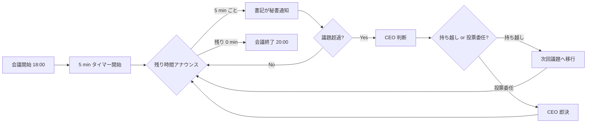

# PRJ-019 Clawbridge W0-Week1 検収会議 v3 当日運用キット (議事録テンプレ + 投票プロトコル + 集計シート + DEC 起票補助)

制定: 秘書部門 / 経由: CEO / 宛: 5/8 検収会議参加者全員 / 当日記録運用基盤
発行日: 2026-05-03
適用日: 2026-05-08 18:00〜20:00

---

## §0 200 字サマリ

5/8 18:00〜20:00 (120 分) 開催の W0-Week1 検収会議 v3 における当日記録運用基盤を秘書部門が物理整備します。本キットは穴埋め式議事録テンプレ (§1 Dev / §2 Research / §3 Review / §4 Go/NoGo + DEC 公式承認 5 件 / §5 PM 追加議題 5 サブ + 後半 Marketing 4 件) に投票プロトコル (Approve / Conditional / Reject + 理由 1 行)、集計シート (議題 17 件比較表)、DEC-019-021〜030 計 10 件の起票補助テンプレを統合し、会議後 22:00 までの dashboard 反映 / decisions.md 公式記載 / 第 4 弾連結報告起票までの一気通貫運用を担保します。

---

## §1 背景 (5/8 検収会議 v3 当日運用基盤の必要性)

5/8 18:00 から開催される W0-Week1 検収会議 v3 は、PRJ-019 Clawbridge プロジェクトの W0 フェーズ (W0-Week1) を正式に検収し、続く W0-Week2 への着手判断および 10 件の意思決定 (DEC-019-021〜030) を公式記録する重要会議です。会議中の進行は CEO が議長として担い、書記は秘書部門が務めます。120 分という限られた時間内で 5 大議題と 9 小議題を扱い、計 17 件以上の議題に対する投票・採決・記録を抜け漏れなく遂行するためには、当日運用キット (穴埋め式議事録 + 投票プロトコル + 集計シート + DEC 起票補助) を事前整備しておく必要があります。

本キットは下記 4 点を解決します。

1. **議事進行の標準化**: 全議題に統一された穴埋め欄を提供し、書記負担を削減する。
2. **投票結果の透明性**: Approve / Conditional / Reject + 理由 1 行プロトコルで合意形成プロセスを可視化する。
3. **DEC 起票の即応性**: DEC-019-021〜030 計 10 件の fillable テンプレを事前用意し、議決後の即時記載を実現する。
4. **会議後アクションの確実性**: 5/8 22:00 までの dashboard 反映 / decisions.md 公式記載 / 第 4 弾連結報告起票までを連動運用する。

---

## §2 議事録テンプレート (穴埋め式)

### §2.1 メタ情報セクション

```
- 開催日時: 2026-05-08 18:00〜20:00 (120 分)
- 場所: ChatGPT Pro セッション (Owner) + Claude Code セッション (CEO + 各部署)
- 議長: CEO
- 書記: 秘書部門
- 参加: [CEO / Dev / Research / Review / PM / Marketing / 秘書 / 広報 Web 運営 / Owner (任意)]
- 議題版: v3 (`secretary-w0-week1-meeting-agenda-v3-final.md`)
- 関連 DEC: DEC-019-021〜025 公式承認 + DEC-019-026〜030 新規起票候補
- 通算 DEC 件数: 10 件
- 想定総議題数: 17 件 (投票) + 4 件 (議事メモ扱い)
```

参加者出席チェック (会議開始時に書記が記録):

| 参加者 | 出席 (Y/N) | 備考 |
|---|---|---|
| CEO (議長) | _ | 必須 |
| Dev エージェント | _ | 必須 |
| Research エージェント | _ | 必須 |
| Review エージェント | _ | 必須 |
| PM エージェント | _ | 必須 |
| Marketing エージェント | _ | 必須 |
| 秘書部門 (書記) | _ | 必須 |
| 広報 Web 運営エージェント | _ | 必須 |
| Owner | _ | 任意 |

### §2.2 §1 Dev エビデンス検収 (穴埋め欄)

```
時間: 18:00〜18:25 (25 min)
発表者: Dev エージェント
配布資料: architecture-w0.md / security-w0.md / 95 tests pnpm test 結果 / harness 38 + claude-bridge 29 + tos_gray 11 + openclaw-runtime 6 + mock-claude 5 + time-source 11

評価項目:
- [ ] DoD 13 完了基準への充足度 (現時点 _/13)
- [ ] 95 tests 全緑 (Y/N)
- [ ] HITL 第6種 tos_gray_review 雛形完成 (Y/N)
- [ ] openclaw-runtime ラッパ skeleton 完成 (Y/N)
- [ ] architecture/security-w0.md Mermaid 6 枚 (Y/N)
- [ ] 95 tests 内訳 (harness 38 / claude-bridge 29 / tos_gray 11 / openclaw-runtime 6 / mock-claude 5 / time-source 11) 全緑確認 (Y/N)

質疑応答 (3 件想定、1 件 2 min):
Q1: ___________
A1: ___________
Q2: ___________
A2: ___________
Q3: ___________
A3: ___________

CEO 評価: [Pass / Conditional Pass / Fail]
理由: ___________

書記メモ: ___________
```

評価チェック比較表:

| チェック項目 | 結果 (Y/N/数値) | エビデンス参照先 |
|---|---|---|
| DoD 13 充足度 | _/13 | dev-w0-week1-evidence-and-mockclaw.md |
| 95 tests 全緑 | _ | pnpm test ログ |
| HITL 第6種 雛形 | _ | tos_gray_review.ts |
| openclaw-runtime skeleton | _ | openclaw-runtime ラッパ |
| Mermaid 6 枚 | _ | architecture-w0.md / security-w0.md |

### §2.3 §2 Research 検証 (穴埋め欄)

```
時間: 18:25〜18:45 (20 min)
発表者: Research エージェント
配布資料: research-changelog-monitoring-runbook.md / research-openclaw-harness-investigation.md / research-supplement-tos-and-subscription-paths.md / research-w0-supplement-op1-op5.md / research-w0-supplement-pd-modified-revalidation.md

評価項目:
- [ ] 4 系統 changelog 監視運用ランブック完成 (Y/N)
- [ ] OP1〜OP5 補足検証完了 (Y/N)
- [ ] PD-Modified 再検証エビデンス完備 (Y/N)
- [ ] HITL 第7種 external_api 設計妥当性 (Y/N)
- [ ] R-019-12 リスク再格付け根拠提示 (赤→黄 + A 赤 / B 黄 分割) (Y/N)

質疑応答 (3 件想定、1 件 2 min):
Q1: ___________
A1: ___________
Q2: ___________
A2: ___________
Q3: ___________
A3: ___________

CEO 評価: [Pass / Conditional Pass / Fail]
理由: ___________

書記メモ: ___________
```

評価チェック比較表:

| チェック項目 | 結果 (Y/N) | エビデンス参照先 |
|---|---|---|
| 4 系統 changelog ランブック | _ | research-changelog-monitoring-runbook.md |
| OP1〜OP5 補足検証 | _ | research-w0-supplement-op1-op5.md |
| PD-Modified 再検証 | _ | research-w0-supplement-pd-modified-revalidation.md |
| HITL 第7種 設計 | _ | research-supplement-tos-and-subscription-paths.md |
| R-019-12 再格付け根拠 | _ | research-openclaw-harness-investigation.md |

### §2.4 §3 Review 検収 (穴埋め欄)

```
時間: 18:45〜19:10 (25 min)
発表者: Review エージェント
配布資料: review-ban-drill-1-scenario.md / review-control-implementation-plan.md / review-option-a-additional-controls.md

評価項目:
- [ ] BAN ドリル 1 シナリオ通過 (Y/N)
- [ ] Option A 追加コントロール実装計画完成 (Y/N)
- [ ] コントロール実装計画の DoD 整合 (Y/N)
- [ ] Agent tool 権限 SOP との整合性 (Y/N)
- [ ] 95 tests 全緑のレビュー側確認 (Y/N)

質疑応答 (3 件想定、1 件 2 min):
Q1: ___________
A1: ___________
Q2: ___________
A2: ___________
Q3: ___________
A3: ___________

CEO 評価: [Pass / Conditional Pass / Fail]
理由: ___________

書記メモ: ___________
```

評価チェック比較表:

| チェック項目 | 結果 (Y/N) | エビデンス参照先 |
|---|---|---|
| BAN ドリル 1 通過 | _ | review-ban-drill-1-scenario.md |
| Option A 実装計画 | _ | review-option-a-additional-controls.md |
| DoD 整合 | _ | review-control-implementation-plan.md |
| SOP 整合 | _ | agent-tool-permission-sop.md |
| 95 tests 全緑確認 | _ | pnpm test ログ |

### §2.5 §4 Go/NoGo + DEC-019-021〜025 公式承認 (穴埋め欄)

```
時間: 19:10〜19:30 (20 min)
進行: CEO
配布資料: ceo-w0-week1-consolidation.md / ceo-w0-week2-prep-consolidation-final.md / pm-cost-and-controls-plan-v4.md / agent-tool-permission-sop.md

総合判定:
- [ ] §1 Dev エビデンス Pass 判定 (Y/N)
- [ ] §2 Research 検証 Pass 判定 (Y/N)
- [ ] §3 Review 検収 Pass 判定 (Y/N)
- [ ] W0-Week1 総合 Go/NoGo: [Go / Conditional Go / NoGo]
- [ ] W0-Week2 着手承認 (Y/N)

DEC 公式承認 (5 件、各 4 min):
- [ ] DEC-019-021 R-019-12 リスク再格付け (赤→黄 + A 赤 / B 黄 分割)
- [ ] DEC-019-022 4 系統 changelog 監視運用 + HITL 第7種 external_api
- [ ] DEC-019-023 PM v5 起案トリガー TR-1/2/3 確定
- [ ] DEC-019-024 Vercel Hobby→Pro 昇格判断 CB-CEO-W3-01 化
- [ ] DEC-019-025 Agent tool 権限 SOP 制定

質疑応答 (5 件想定、1 件 2 min):
Q1: ___________
A1: ___________
Q2: ___________
A2: ___________
Q3: ___________
A3: ___________
Q4: ___________
A4: ___________
Q5: ___________
A5: ___________

CEO 総合判定: [Go / Conditional Go / NoGo]
理由: ___________

書記メモ: ___________
```

### §2.6 §5 PM 追加議題 全 5 サブ項目 + 後半 Marketing (穴埋め欄)

```
時間: 19:30〜20:00 (30 min、前半 20 min PM / 後半 10 min Marketing)
進行: PM エージェント (前半) / Marketing エージェント (後半)
配布資料: pm-cost-and-controls-plan-v4.md / pm-w0-week2-execution-plan.md / pm-w0-week2-department-kickoff-templates.md / ceo-g-top-1-genre-comparison.md / secretary-marketing-owner-questions-2026-05-03.md
```

#### §2.6.1 §5 (a) PM v4 起案承認 (4 min)

```
評価項目:
- [ ] PM v4 cost and controls plan の妥当性 (Y/N)
- [ ] DEC-019-021〜024 のロールアップ整合性 (Y/N)
- [ ] W3 昇格判断条件 (CB-CEO-W3-01) 妥当性 (Y/N)

質疑応答 (1 件想定):
Q1: ___________
A1: ___________

CEO 判定: [Approve / Conditional / Reject]
理由: ___________
```

#### §2.6.2 §5 (b) W0-Week2 実行計画承認 (4 min)

```
評価項目:
- [ ] W0-Week2 実行計画の DoD 整合 (Y/N)
- [ ] 6 部署キックオフ通知配布計画妥当性 (Y/N)
- [ ] 5/9 09:00 公式着手スケジュール妥当性 (Y/N)

質疑応答 (1 件想定):
Q1: ___________
A1: ___________

CEO 判定: [Approve / Conditional / Reject]
理由: ___________
```

#### §2.6.3 §5 (c) G-Top-1 採用案 (DEC-019-026 起票) (4 min)

```
評価項目:
- [ ] G-Top-1 ジャンル比較の妥当性 (Y/N)
- [ ] (a)+(e) ハイブリッド採用案の合理性 (Y/N)
- [ ] HP トップ + 事例ページ統合の整合性 (Y/N)

質疑応答 (1 件想定):
Q1: ___________
A1: ___________

CEO 判定: [Approve / Conditional / Reject]
理由: ___________
DEC 起票: DEC-019-026
```

#### §2.6.4 §5 (d) PM v5 トリガー確認 (4 min)

```
評価項目:
- [ ] TR-1 (Pro 昇格判断必要) トリガー定義妥当性 (Y/N)
- [ ] TR-2 (HITL 第8種以降の追加要件) トリガー定義妥当性 (Y/N)
- [ ] TR-3 (R-019-12 以外の新規リスク赤判定) トリガー定義妥当性 (Y/N)

質疑応答 (1 件想定):
Q1: ___________
A1: ___________

CEO 判定: [Approve / Conditional / Reject]
理由: ___________
```

#### §2.6.5 §5 (e) 5/15 競合解消 + AS-151 スライド (4 min)

```
評価項目:
- [ ] 5/15 競合解消スケジュール妥当性 (Y/N)
- [ ] AS-151 スライド構成案合意 (Y/N)
- [ ] 後続 Marketing 連携整合 (Y/N)

質疑応答 (1 件想定):
Q1: ___________
A1: ___________

CEO 判定: [Approve / Conditional / Reject]
理由: ___________
```

#### §2.6.6 §5 後半 Marketing 8 件 (前半 4 件投票 + 後半 4 件議事メモ)

```
時間: 19:50〜20:00 (10 min、1 件 1.25 min)
進行: Marketing エージェント
配布資料: secretary-marketing-owner-questions-2026-05-03.md
```

(1) Q-Mkt-02 公開 6/20 確定 (DEC-019-027 起票候補)

```
評価項目:
- [ ] 6/20 公開タイミングの妥当性 (Y/N)
- [ ] PRJ-019 W3 完了との整合性 (Y/N)

質疑応答 (1 件想定):
Q1: ___________
A1: ___________

CEO 判定: [Approve / Conditional / Reject]
DEC 起票: DEC-019-027
```

(2) Q-Mkt-04 Heading A 採用 (DEC-019-028 起票候補)

```
評価項目:
- [ ] Heading A の表現適合性 (Y/N)
- [ ] AI 感を出さないクリーンデザイン整合 (Y/N)

質疑応答 (1 件想定):
Q1: ___________
A1: ___________

CEO 判定: [Approve / Conditional / Reject]
DEC 起票: DEC-019-028
```

(3) Q-Mkt-05 部分開示 (DEC-019-029 起票候補)

```
評価項目:
- [ ] 部分開示範囲の妥当性 (Y/N)
- [ ] 守秘義務との整合性 (Y/N)

質疑応答 (1 件想定):
Q1: ___________
A1: ___________

CEO 判定: [Approve / Conditional / Reject]
DEC 起票: DEC-019-029
```

(4) Q-Mkt-06 HP トップ + 事例ページ両方配置 (DEC-019-030 起票候補)

```
評価項目:
- [ ] HP トップ配置の合理性 (Y/N)
- [ ] 事例ページ配置の合理性 (Y/N)
- [ ] G-Top-1 採用案 (DEC-019-026) との整合 (Y/N)

質疑応答 (1 件想定):
Q1: ___________
A1: ___________

CEO 判定: [Approve / Conditional / Reject]
DEC 起票: DEC-019-030
```

---

## §3 投票プロトコル詳細

### §3.1 投票形式

- 各議題ごとに 7 部署 (Dev / Research / Review / PM / Marketing / 秘書 / 広報 Web 運営) + 議長 (CEO) + Owner (任意) で投票します。
- 投票形式: **Approve / Conditional / Reject + 理由 1 行** (絵文字禁止)。
- 過半数で議決成立とします。CEO は決裁権を持ち、tied case は CEO 判断で確定します。
- Conditional は理由を満たした上で再投票するか、議事録に条件を記載した上で承認とします。
- Reject が 1 票でも出た場合は §7.5 のルールに従い Conditional 扱いで再協議を行います。

### §3.2 集計テンプレ (議題 17 件比較表)

| # | 議題 ID | 議題名 | 投票結果 (A/C/R) | CEO 判断 | DEC 起票 |
|---|---|---|---|---|---|
| 1 | §1 | Dev エビデンス検収 | _/_ / _/_ / _/_ | Pass/Cond/Fail | - |
| 2 | §2 | Research 検証 | _/_ / _/_ / _/_ | Pass/Cond/Fail | - |
| 3 | §3 | Review 検収 | _/_ / _/_ / _/_ | Pass/Cond/Fail | - |
| 4 | §4-1 | DEC-019-021 公式承認 (R-019-12 リスク再格付け) | _/_ / _/_ / _/_ | Approve/Reject | DEC-019-021 |
| 5 | §4-2 | DEC-019-022 公式承認 (4 系統 changelog 監視 + HITL 第7種) | _/_ / _/_ / _/_ | Approve/Reject | DEC-019-022 |
| 6 | §4-3 | DEC-019-023 公式承認 (PM v5 起案トリガー TR-1/2/3) | _/_ / _/_ / _/_ | Approve/Reject | DEC-019-023 |
| 7 | §4-4 | DEC-019-024 公式承認 (Vercel Hobby→Pro 昇格判断 CB-CEO-W3-01 化) | _/_ / _/_ / _/_ | Approve/Reject | DEC-019-024 |
| 8 | §4-5 | DEC-019-025 公式承認 (Agent tool 権限 SOP 制定) | _/_ / _/_ / _/_ | Approve/Reject | DEC-019-025 |
| 9 | §5 (a) | PM v4 起案承認 | _/_ / _/_ / _/_ | Approve/Reject | - |
| 10 | §5 (b) | W0-Week2 実行計画 | _/_ / _/_ / _/_ | Approve/Reject | - |
| 11 | §5 (c) | G-Top-1 採用案 (DEC-019-026 起票) | _/_ / _/_ / _/_ | Approve/Reject | DEC-019-026 |
| 12 | §5 (d) | PM v5 トリガー TR-1/2/3 確定 | _/_ / _/_ / _/_ | Approve/Reject | - |
| 13 | §5 (e) | 5/15 AS-151 スライド構成 | _/_ / _/_ / _/_ | Approve/Reject | - |
| 14 | §5 後半 | Q-Mkt-02 公開 6/20 確定 | _/_ / _/_ / _/_ | Approve/Reject | DEC-019-027 |
| 15 | §5 後半 | Q-Mkt-04 Heading A 採用 | _/_ / _/_ / _/_ | Approve/Reject | DEC-019-028 |
| 16 | §5 後半 | Q-Mkt-05 部分開示 | _/_ / _/_ / _/_ | Approve/Reject | DEC-019-029 |
| 17 | §5 後半 | Q-Mkt-06 HP トップ + 事例ページ両方 | _/_ / _/_ / _/_ | Approve/Reject | DEC-019-030 |

投票理由 1 行記録欄 (各議題 1 行 × 17 議題):

```
[議題 1 §1]   理由: ___________
[議題 2 §2]   理由: ___________
[議題 3 §3]   理由: ___________
[議題 4 DEC-019-021]   理由: ___________
[議題 5 DEC-019-022]   理由: ___________
[議題 6 DEC-019-023]   理由: ___________
[議題 7 DEC-019-024]   理由: ___________
[議題 8 DEC-019-025]   理由: ___________
[議題 9 §5 (a)]   理由: ___________
[議題 10 §5 (b)]   理由: ___________
[議題 11 §5 (c) DEC-019-026]   理由: ___________
[議題 12 §5 (d)]   理由: ___________
[議題 13 §5 (e)]   理由: ___________
[議題 14 DEC-019-027]   理由: ___________
[議題 15 DEC-019-028]   理由: ___________
[議題 16 DEC-019-029]   理由: ___________
[議題 17 DEC-019-030]   理由: ___________
```

### §3.3 議事録扱い 4 件 (Q-Mkt-01/03/07/08) は投票不要、CEO 推奨で議事メモに記録

| # | 議題 ID | 議題名 | 扱い | 記録先 |
|---|---|---|---|---|
| A | Q-Mkt-01 | PATTERN-006/007 番号衝突 → 並存方針 | 議事メモ (CEO 推奨) | §5.1 |
| B | Q-Mkt-03 | 表現比重 40-25-20-15 → 承認 | 議事メモ (CEO 推奨) | §5.2 |
| C | Q-Mkt-07 | プレス・SNS → 静観 + X 1 投稿のみ | 議事メモ (CEO 推奨) | §5.3 |
| D | Q-Mkt-08 | K8/K9 anti-pattern → 部分匿名化 | 議事メモ (CEO 推奨) | §5.4 |

---

## §4 DEC 起票補助 (DEC-019-021〜030 全 10 件)

各 DEC につき 8 項目 (議題 ID / 議題名 / 議決日 / 起案者 / 賛同者 / 反対者 / 決定内容 / 根拠資料) の fillable テンプレを事前用意します。会議終了後、書記が即座に decisions.md へ転記できる形式とします。

### §4.1 DEC-019-021: R-019-12 リスク再格付け

```
- 議題 ID: DEC-019-021
- 議題名: R-019-12 リスク再格付け (赤→黄 + A 赤 / B 黄 分割)
- 議決日: 2026-05-08
- 起案者: ___________ (Research / PM 想定)
- 賛同者: ___________
- 反対者: ___________
- 決定内容 (要約 1〜3 行):
  R-019-12 を A (赤) / B (黄) に分割し、A は引き続き赤、B は黄に格下げ。
  ___________
  ___________
- 根拠資料: pm-cost-and-controls-plan-v4.md / research-openclaw-harness-investigation.md / ceo-w0-week1-consolidation.md
```

### §4.2 DEC-019-022: 4 系統 changelog 監視運用 + HITL 第7種

```
- 議題 ID: DEC-019-022
- 議題名: 4 系統 changelog 監視運用 + HITL 第7種 external_api
- 議決日: 2026-05-08
- 起案者: ___________ (Research 想定)
- 賛同者: ___________
- 反対者: ___________
- 決定内容 (要約 1〜3 行):
  4 系統 changelog 監視ランブックを公式運用化し、外部 API 変更検知時に HITL 第7種 external_api を発動。
  ___________
  ___________
- 根拠資料: research-changelog-monitoring-runbook.md / research-supplement-tos-and-subscription-paths.md / pm-cost-and-controls-plan-v4.md
```

### §4.3 DEC-019-023: PM v5 起案トリガー TR-1/2/3 確定

```
- 議題 ID: DEC-019-023
- 議題名: PM v5 起案トリガー TR-1/2/3 確定
- 議決日: 2026-05-08
- 起案者: ___________ (PM 想定)
- 賛同者: ___________
- 反対者: ___________
- 決定内容 (要約 1〜3 行):
  PM v5 起案トリガーを TR-1 (Pro 昇格判断必要) / TR-2 (HITL 第8種以降の追加要件) / TR-3 (R-019-12 以外の新規リスク赤判定) と確定。
  ___________
  ___________
- 根拠資料: pm-cost-and-controls-plan-v4.md / ceo-w0-week2-prep-consolidation-final.md
```

### §4.4 DEC-019-024: Vercel Hobby→Pro 昇格判断 CB-CEO-W3-01 化

```
- 議題 ID: DEC-019-024
- 議題名: Vercel Hobby→Pro 昇格判断 CB-CEO-W3-01 化
- 議決日: 2026-05-08
- 起案者: ___________ (PM 想定)
- 賛同者: ___________
- 反対者: ___________
- 決定内容 (要約 1〜3 行):
  Vercel Hobby から Pro への昇格判断を W3 終盤の CB-CEO-W3-01 チェックポイントで実施することを確定。
  ___________
  ___________
- 根拠資料: pm-cost-and-controls-plan-v4.md / pm-cost-plan-v3.md
```

### §4.5 DEC-019-025: Agent tool 権限 SOP 制定

```
- 議題 ID: DEC-019-025
- 議題名: Agent tool 権限 SOP 制定
- 議決日: 2026-05-08
- 起案者: ___________ (Review / 秘書 想定)
- 賛同者: ___________
- 反対者: ___________
- 決定内容 (要約 1〜3 行):
  Agent tool 権限 SOP を公式制定し、全部署エージェントの tool 利用権限を一元管理。
  ___________
  ___________
- 根拠資料: organization/rules/agent-tool-permission-sop.md / review-control-implementation-plan.md
```

### §4.6 DEC-019-026: G-Top-1 採用案 = (a)+(e) ハイブリッド

```
- 議題 ID: DEC-019-026
- 議題名: G-Top-1 採用案 = (a)+(e) ハイブリッド
- 議決日: 2026-05-08
- 起案者: ___________ (CEO / Marketing 想定)
- 賛同者: ___________
- 反対者: ___________
- 決定内容 (要約 1〜3 行):
  G-Top-1 ジャンル比較において (a) と (e) のハイブリッド構成を採用。
  ___________
  ___________
- 根拠資料: ceo-g-top-1-genre-comparison.md / pm-cost-and-controls-plan-v4.md
```

### §4.7 DEC-019-027: Q-Mkt-02 公開 6/20 確定

```
- 議題 ID: DEC-019-027
- 議題名: Q-Mkt-02 公開 6/20 確定
- 議決日: 2026-05-08
- 起案者: ___________ (Marketing 想定)
- 賛同者: ___________
- 反対者: ___________
- 決定内容 (要約 1〜3 行):
  Q-Mkt-02 (公開タイミング) を 6/20 と確定。
  ___________
  ___________
- 根拠資料: secretary-marketing-owner-questions-2026-05-03.md / marketing-portfolio-reflection-design.md
```

### §4.8 DEC-019-028: Q-Mkt-04 Heading A 採用

```
- 議題 ID: DEC-019-028
- 議題名: Q-Mkt-04 Heading A 採用
- 議決日: 2026-05-08
- 起案者: ___________ (Marketing 想定)
- 賛同者: ___________
- 反対者: ___________
- 決定内容 (要約 1〜3 行):
  Q-Mkt-04 において Heading A を採用。
  ___________
  ___________
- 根拠資料: secretary-marketing-owner-questions-2026-05-03.md / marketing-knowledge-reflection-design.md
```

### §4.9 DEC-019-029: Q-Mkt-05 部分開示

```
- 議題 ID: DEC-019-029
- 議題名: Q-Mkt-05 部分開示
- 議決日: 2026-05-08
- 起案者: ___________ (Marketing 想定)
- 賛同者: ___________
- 反対者: ___________
- 決定内容 (要約 1〜3 行):
  Q-Mkt-05 において部分開示方針を採用。
  ___________
  ___________
- 根拠資料: secretary-marketing-owner-questions-2026-05-03.md / marketing-portfolio-reflection-design.md
```

### §4.10 DEC-019-030: Q-Mkt-06 HP トップ + 事例ページ両方

```
- 議題 ID: DEC-019-030
- 議題名: Q-Mkt-06 HP トップ + 事例ページ両方配置
- 議決日: 2026-05-08
- 起案者: ___________ (Marketing / 広報 Web 運営 想定)
- 賛同者: ___________
- 反対者: ___________
- 決定内容 (要約 1〜3 行):
  Q-Mkt-06 において HP トップと事例ページの両方に配置することを採用。
  ___________
  ___________
- 根拠資料: secretary-marketing-owner-questions-2026-05-03.md / ceo-g-top-1-genre-comparison.md
```

DEC 起票補助サマリ表:

| # | DEC ID | 議題名 (要約) | 議決日 | 主要根拠資料 |
|---|---|---|---|---|
| 1 | DEC-019-021 | R-019-12 リスク再格付け (赤→黄 + A/B 分割) | 2026-05-08 | pm-cost-and-controls-plan-v4.md |
| 2 | DEC-019-022 | 4 系統 changelog 監視 + HITL 第7種 | 2026-05-08 | research-changelog-monitoring-runbook.md |
| 3 | DEC-019-023 | PM v5 起案トリガー TR-1/2/3 | 2026-05-08 | pm-cost-and-controls-plan-v4.md |
| 4 | DEC-019-024 | Vercel Hobby→Pro 昇格 CB-CEO-W3-01 化 | 2026-05-08 | pm-cost-and-controls-plan-v4.md |
| 5 | DEC-019-025 | Agent tool 権限 SOP 制定 | 2026-05-08 | agent-tool-permission-sop.md |
| 6 | DEC-019-026 | G-Top-1 採用案 (a)+(e) ハイブリッド | 2026-05-08 | ceo-g-top-1-genre-comparison.md |
| 7 | DEC-019-027 | Q-Mkt-02 公開 6/20 確定 | 2026-05-08 | secretary-marketing-owner-questions-2026-05-03.md |
| 8 | DEC-019-028 | Q-Mkt-04 Heading A 採用 | 2026-05-08 | secretary-marketing-owner-questions-2026-05-03.md |
| 9 | DEC-019-029 | Q-Mkt-05 部分開示 | 2026-05-08 | secretary-marketing-owner-questions-2026-05-03.md |
| 10 | DEC-019-030 | Q-Mkt-06 HP トップ + 事例ページ両方 | 2026-05-08 | secretary-marketing-owner-questions-2026-05-03.md |

---

## §5 議事メモ (議決外事項)

投票対象外の 4 件は CEO 推奨方針に基づき議事メモとして公式記録します。

### §5.1 Q-Mkt-01 PATTERN-006/007 番号衝突 → 並存方針 (CEO 推奨、議事メモ記録)

```
- 議題 ID: Q-Mkt-01
- 推奨方針: PATTERN-006 と PATTERN-007 の番号衝突を解消せず並存を許容する。
- 推奨理由: ___________
- 記録: 投票対象外、議事メモのみ。
- 関連資料: secretary-marketing-owner-questions-2026-05-03.md
```

### §5.2 Q-Mkt-03 表現比重 40-25-20-15 → 承認 (議事メモ記録)

```
- 議題 ID: Q-Mkt-03
- 推奨方針: 表現比重 40-25-20-15 配分を承認する。
- 推奨理由: ___________
- 記録: 投票対象外、議事メモのみ。
- 関連資料: secretary-marketing-owner-questions-2026-05-03.md / marketing-knowledge-reflection-design.md
```

### §5.3 Q-Mkt-07 プレス・SNS → 静観 + X 1 投稿のみ (議事メモ記録)

```
- 議題 ID: Q-Mkt-07
- 推奨方針: プレスリリース・SNS 配信は静観し、X (旧 Twitter) 1 投稿のみ実施する。
- 推奨理由: ___________
- 記録: 投票対象外、議事メモのみ。
- 関連資料: secretary-marketing-owner-questions-2026-05-03.md
```

### §5.4 Q-Mkt-08 K8/K9 anti-pattern → 部分匿名化 (議事メモ記録)

```
- 議題 ID: Q-Mkt-08
- 推奨方針: K8 / K9 anti-pattern については部分匿名化を採用する。
- 推奨理由: ___________
- 記録: 投票対象外、議事メモのみ。
- 関連資料: secretary-marketing-owner-questions-2026-05-03.md / marketing-knowledge-reflection-design.md
```

---

## §6 アクションアイテム (会議後)

会議終了 (20:00) 後の同日アクションを下記スケジュールで実行します。

| # | 期限 | 担当 | 内容 | 完了確認 (Y/N) |
|---|---|---|---|---|
| §6.1 | 5/8 22:00 | 秘書部門 | 6 部署キックオフ通知配布 (`pm-w0-week2-department-kickoff-templates.md` 参照) | _ |
| §6.2 | 5/8 22:00 | 秘書部門 | dashboard 5/8 22:00 反映 (`dashboard/active-projects.md`) | _ |
| §6.3 | 5/8 22:00 | 秘書部門 | decisions.md DEC-019-021〜030 公式記載 (10 件) | _ |
| §6.4 | 5/8 22:00 | CEO | 第 4 弾連結報告起票 | _ |
| §6.5 | 5/9 09:00 | 全部署 | W0-Week2 公式着手 | _ |

---

## §7 会議運用ガイドライン

### §7.1 タイムキーピング (秘書部門が 5 min ごとに残り時間アナウンス)

書記 (秘書部門) が会議開始から 5 min 単位で残り時間をアナウンスします。各議題の超過時には CEO へ通知し、§7.2 ルールに従い対応します。



### §7.2 議題超過時の対応 (CEO 判断で持ち越し or 投票委任)

各議題が想定時間を超過した場合、CEO が下記いずれかを判断します。

- **持ち越し**: 次回会議 (5/15 競合解消 + AS-151 スライド会議など) へ議題を持ち越す。
- **投票委任**: CEO が即決判断し、議事録に判断根拠を記載した上で全部署同意とみなす。

### §7.3 オーナー任意参加時の発言フロー (CEO 経由で集約 → ChatGPT Pro セッション内で確認)

Owner は ChatGPT Pro セッション内で任意参加します。発言が必要な場合は下記フローを取ります。

1. Owner が ChatGPT Pro セッションで発言・コメントを記録。
2. CEO が Claude Code セッション内に Owner コメントを集約・転送。
3. 部署エージェントは CEO 経由でのみ Owner と通信 (CLAUDE.md ルール準拠)。
4. 議決時の Owner 投票は任意とし、Owner 不参加でも過半数成立で議決可能。

### §7.4 絵文字禁止徹底

CLAUDE.md ルールに従い、議事録・投票理由・DEC 起票内容のいずれにも絵文字を使用しません。書記は記録時に絵文字混入をチェックし、混入あれば即時除去します。

### §7.5 投票拒否権 (Reject) の閾値 (1 票でも Reject なら Conditional 扱いで再協議)

Reject が 1 票でも出た場合、議題は自動的に Conditional 扱いとなり、Reject 理由を踏まえた再協議を行います。再協議後に再投票を実施し、過半数 Approve で議決成立とします。CEO は tied case で決裁権を行使します。

---

## §8 関連

- `secretary-w0-week1-meeting-agenda-v3-final.md` (議題 v3、本テンプレの元)
- `ceo-g-top-1-genre-comparison.md` (DEC-019-026 起票根拠)
- `secretary-marketing-owner-questions-2026-05-03.md` (DEC-019-027〜030 起票根拠)
- `pm-cost-and-controls-plan-v4.md` (DEC-019-021〜024 + 026 起票根拠)
- `organization/rules/agent-tool-permission-sop.md` (DEC-019-025 起票根拠)
- `pm-w0-week2-department-kickoff-templates.md` (会議後 6 部署キックオフ通知配布参照)
- `pm-w0-week2-execution-plan.md` (§5 (b) 議題根拠)
- `ceo-w0-week1-consolidation.md` (§4 Go/NoGo 判定根拠)
- `ceo-w0-week2-prep-consolidation-final.md` (§5 全般根拠)
- `dev-w0-week1-evidence-and-mockclaw.md` (§1 Dev エビデンス根拠)
- `research-changelog-monitoring-runbook.md` (§2 Research 根拠 / DEC-019-022 根拠)
- `review-control-implementation-plan.md` (§3 Review 根拠)
- `marketing-portfolio-reflection-design.md` (§5 後半 Marketing 根拠)
- `marketing-knowledge-reflection-design.md` (§5 後半 Marketing 根拠)

---

制定: 秘書部門 / 経由: CEO / 宛: 5/8 検収会議参加者全員 / 当日記録運用基盤
