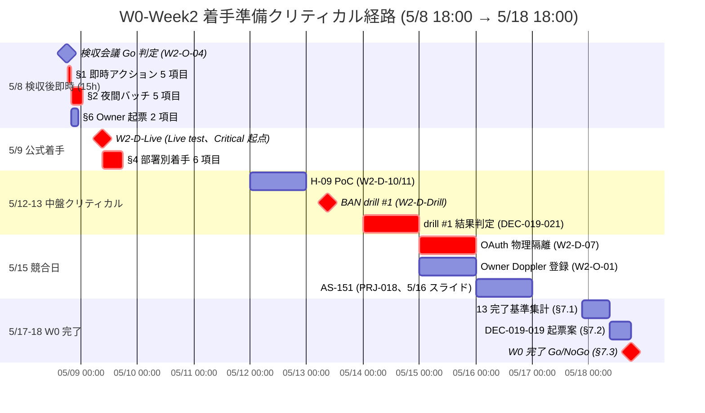

# PRJ-019 Clawbridge — W0-Week2 公式着手 (2026-05-09) 最終チェックリスト

- 案件: PRJ-019「Clawbridge」 — Open Claw を自律オーナーとする AI 組織ハーネス基盤
- 部署: 秘書部門
- 作成日: 2026-05-03
- 作成者: 秘書 Agent (claude-code-company)
- 対象期間: **5/8 18:00 検収会議 直後 〜 5/9 09:00 W0-Week2 公式着手まで（15 時間）**
- 関連 SOP: `organization/rules/agent-tool-permission-sop.md` (DEC-019-025、本日制定)
- 関連レポート:
  - `projects/PRJ-019/reports/secretary-w0-week2-task-ledger.md`（29 タスク既存 ledger）
  - `projects/PRJ-019/reports/pm-w0-week2-execution-plan.md`（PM v4 W0-W2 実行計画 389 行）
  - `projects/PRJ-019/reports/dev-w0-week2-prep-report.md`（13 完了基準）
  - `projects/PRJ-019/decisions.md`（DEC-019-001〜025）
- 関連決裁: DEC-019-007 / DEC-019-012 / DEC-019-013 / DEC-019-014 / DEC-019-018 / DEC-019-019 / DEC-019-021〜025

---

## §0. エグゼクティブサマリ（200 字）

5/8 検収会議 Go 判定 → 5/9 09:00 W0-Week2 公式着手のため、5/8 18:00〜5/9 09:00 の 15 時間で確認・準備すべき事項を **9 カテゴリ × 計 28 項目** チェックリスト化。Owner / CEO / 秘書 / Dev / Research / Review / PM / Marketing 全部署対応。13 完了基準達成度の事前確認、5/13 BAN drill #1（最大ボトルネック）の準備状況、Owner 手番（OAuth / Spend Cap / Doppler / 8 件回答）の進捗追跡、5/15 競合解消（AS-151 5/16 スライド）通知を物理的に完遂し、Critical Path の起点 5/9 W2-D-Live を確実に Pass させる。

---

## §1. 5/8 18:00 検収会議 Go 直後の即時アクション（5/8 20:00 まで）

| # | チェック項目 | 責任者 | 期日 | 依存タスク | 状態 |
|---|---|---|---|---|---|
| 1.1 | [ ] 検収会議議事録 起票（W2-O-04 関連、`reports/secretary-w0-week1-acceptance-meeting-minutes-2026-05-08.md`） | 秘書 | 5/8 20:00 | W2-O-04 | 未着手 |
| 1.2 | [ ] DEC-019-XXX 起票（G-Top-1 ジャンル選定 別決裁、Owner 確定済の場合のみ） | 秘書 | 5/8 20:00 | DEC-019-014 / Owner 確定 | 未着手 |
| 1.3 | [ ] dashboard PRJ-019 更新（W0-Week1 検収結果反映、進捗 35→40%、`dashboard/active-projects.md` 行更新） | 秘書 | 5/8 20:00 | W2-S-01 | 未着手 |
| 1.4 | [ ] 5/15 競合解消承認 → PRJ-018 PM への AS-151 5/16 スライド調整依頼メール（DEC-019-022 通達） | 秘書 → PRJ-018 PM | 5/8 20:00 | DEC-019-022 / PM v4 §3.5 | 未着手 |
| 1.5 | [ ] Owner Marketing 8 件回付資料への回答受領状況確認（Q-Mkt-01〜08、5/4〜5/8 期日） | 秘書 | 5/8 20:00 | CB-O-W0-ZZ | 未着手 |

**§1 小計**: 5 項目（必達）

---

## §2. 5/8 21:00 〜 5/9 02:00 の準備（夜間バッチ）

| # | チェック項目 | 責任者 | 期日 | 依存タスク | 状態 |
|---|---|---|---|---|---|
| 2.1 | [ ] Dev: W2-D-Live 実行スクリプト動作確認（mock dry-run、stream-json fixture 検証） | Dev | 5/8 23:00 | W2-D-Live | 未着手 |
| 2.2 | [ ] Dev: Owner OAuth $0.10 上限 setup（Anthropic Console Per-request cap 一時設定確認） | Dev + Owner | 5/8 23:00 | DEC-019-012 / W2-O-02 | 未着手 |
| 2.3 | [ ] Dev: W2-D-Drill (5/13) 準備 = mock-claude 5 シナリオの BAN drill 用 wrapper 動作確認 | Dev | 5/9 02:00 | W2-D-Drill / W2-D-02 | 未着手 |
| 2.4 | [ ] Research: W2-R-01 (4 系統 changelog 監視 設計) 準備 = GitHub PAT 取得（Owner タスク CB-O-W0-XX 起票） | 秘書 + Research | 5/9 02:00 | W2-R-01 / CB-O-W0-XX | 未着手 |
| 2.5 | [ ] 秘書: W0-W2 タスク台帳 29 タスクの担当者 / 期日 / 工数 を再確認（PM v4 §1 マスタ表との整合） | 秘書 | 5/9 02:00 | W2-S-01 | 未着手 |

**§2 小計**: 5 項目

---

## §3. Phase 1 着手前必達 13 完了基準（W0-W2 終了時 5/18 までに達成）

| # | 完了基準 | 責任者 | 期日 | 依存タスク ID | 現状 |
|---|---|---|---|---|---|
| 3.1 | [ ] tos_gray_review HITL 第 6 種 全分岐テスト緑（blocklist hit 含む） | Dev | 5/9 | W2-D-01 | 未着手 |
| 3.2 | [ ] mock-claude scenario chain 動作（成功 → silent_revoke 連鎖再現） | Dev | 5/10 | W2-D-02 | 未着手 |
| 3.3 | [ ] 副作用ゼロ自動検証 0 件（`scripts/verify-zero-side-effect.sh` dry-run 3 回完走） | Dev | 5/12 | W2-D-03 | 未着手 |
| 3.4 | [ ] Live integration test Pass（$0.10 内、stream-json 全イベント記録、再現可能 fixture 化） | Dev + Owner | 5/9 | W2-D-Live / W2-O-02 | 未着手（最優先）|
| 3.5 | [ ] BAN drill #1 Pass（5 SLA 全達成 + 副作用ゼロ） | Dev + Review | 5/13 | W2-D-Drill / W2-R-03 | 未着手 |
| 3.6 | [ ] C-A-04 使用量モニタ運用開始（usage-monitor 09:00/21:00 JST 3 日連続成功） | Dev | 5/12 | W2-D-10 / W2-D-11 / W2-CEO-02 | 未着手 |
| 3.7 | [ ] OAuth 物理隔離完了（stat 到達不可テスト緑、3 層分離） | Dev + Owner | 5/15 | W2-D-07 / W2-O-03 | 未着手 |
| 3.8 | [ ] Sumi/Asagi バックアップ完了（復元テスト diff 0 行、cron 日次実行 3 日連続成功） | Dev | 5/15 | W2-D-08 / W2-D-13 (台帳) | 未着手 |
| 3.9 | [ ] tos_classifier zod schema + DoD 3 分岐実装テスト緑（confidence 境界 ± 5%） | Dev | 5/15 | W2-D-12 / W2-D-13 | 未着手 |
| 3.10 | [ ] FN-Black アノテ 60 件取得（HN trending × 3 レビュア IRR ≥ 0.7） | Dev + Research | 5/16 | W2-D-14 / W2-R-04 | 未着手 |
| 3.11 | [ ] 4 系統 changelog 監視 設計確定（Dev 着手は 5/26、設計 doc は 5/10） | Research | 5/10 | W2-R-01 | 未着手 |
| 3.12 | [ ] OpenClaw fork 物理クローン（upstream 14 日 commit 件数記録、Real spawn 5/5 成功） | Research + Dev | 5/16 | W2-R-02 / W2-D-Wrapper | 未着手 |
| 3.13 | [ ] NG-3 ベースラインデータ取得開始（W2 全期間日次稼働時間・コスト換算記録、12h/日 違反 0 件） | Research | 5/16 | W2-R-05 | 未着手 |

**§3 小計**: 13 項目（W0 完了 Go 判定の必須基準）

---

## §4. 部署別 5/9 着手時アクション（朝 09:00 〜 18:00）

| # | チェック項目 | 責任者 | 期日 | 依存タスク | 状態 |
|---|---|---|---|---|---|
| 4.1 | [ ] **Dev**: W2-D-01 / W2-D-02 / W2-D-04 / W2-D-Live を 5/9 着手（Live test 最優先） | Dev | 5/9 09:00 | Critical Path 起点 | 未着手 |
| 4.2 | [ ] **Research**: W2-R-01 を 5/9 着手 / W2-R-02 (5/12) 準備（OpenClaw upstream pull） | Research | 5/9 09:00 | W2-R-01 / W2-R-02 | 未着手 |
| 4.3 | [ ] **Review**: BAN drill #1 (5/13) シナリオ最終リハ準備（W2-R-03 と同期、計測項目確認） | Review | 5/9 09:00 | W2-R-02 (台帳) / W2-R-03 | 未着手 |
| 4.4 | [ ] **PM**: 進捗監視 + 5/15 競合解消 (AS-151 5/16 スライド) の進行確認、PRJ-018 PM 返信受領 | PM | 5/9 12:00 | DEC-019-022 | 未着手 |
| 4.5 | [ ] **Marketing**: 6/20 公開資料の章立て確定（Owner 8 件回答受領後） | Marketing | 5/9 18:00 | Q-Mkt-01〜08 回答 | 未着手 |
| 4.6 | [ ] **秘書**: 全タスク台帳の dashboard 反映 + W2-S-01 daily 更新開始（5/9 18:00 第 1 回） | 秘書 | 5/9 18:00 | W2-S-01 | 未着手 |

**§4 小計**: 6 項目

---

## §5. リスク予兆検知（5/9 〜 5/13 期間）

| # | リスク ID | 予兆指標 | 閾値 | 検知時アクション | 責任者 |
|---|---|---|---|---|---|
| 5.1 | R-019-06 (BAN) | Anthropic 警告メール監視 | 件名 `[Anthropic]` + 警告系キーワード 1 件以上 | 1h SLA、CEO 経由 Owner エスカレ、即 emergency_stop | 秘書 + Dev (G-V2-08) |
| 5.2 | R-019-10 (Claude Max weekly cap) | H-09 PoC 結果 | 週次 cap 80% 超過 | 警戒度上昇、cost_check skill 強化、Pro 昇格前倒し検討 (DEC-019-017) | Dev + CEO |
| 5.3 | R-019-12-A (OpenClaw API breaking) | changelog 監視空白期間 (5/19〜5/25) | upstream commit 14 日連続 0 件 / breaking 検知 | 手動 fallback 開始（秘書部門が GitHub releases 目視）、W2-D-Wrapper を mock-only に格下げ検討 | 秘書 + Research |
| 5.4 | R-019-Live ($0.10 超過) | W2-D-Live 1 ターン消費 | $0.10 超過 | 即停止、Owner 確認後 Spend Cap 設定見直し、5/12 への Live test スライド検討 | Dev + Owner |
| 5.5 | R-019-Drill (5 SLA 違反) | BAN drill #1 5/13 結果 | 5 SLA のうち 1+ 軸 Fail | DEC-019-024 発動、Phase 1 5/19 → 5/26 延期、再 drill 5/14 計画起票 | CEO + 秘書 |

**§5 小計**: 5 項目

---

## §6. オーナー側追加 W0 タスク（5/9 〜 5/18）

| # | タスク ID | 内容 | 期日 | 依存決裁 | 状態 |
|---|---|---|---|---|---|
| 6.1 | [ ] CB-O-W0-XX | GitHub PAT 取得（4 系統 changelog 監視用、`secrets:read public_repo` 最小権限、Doppler 登録） | 5/12 | W2-R-01 | 未起票（5/8 起票必須）|
| 6.2 | [ ] CB-O-W0-YY | Slack #clawbridge-changelog channel 作成 + Webhook 取得 | 5/12 | W2-R-01 / W2-D-Notify | 未起票（5/8 起票必須）|
| 6.3 | [ ] CB-O-W0-ZZ | Marketing 8 件 (Q-Mkt-01〜08) 回答（5/4〜5/8） | 5/8 | Marketing 6/20 公開資料 | 進行中 |
| 6.4 | [ ] W2-O-01 | OpenAI Spend Cap $20 / Anthropic Spend Cap $50 設定（5/18 期限、DEC-019-012 既定） | 5/18（前倒し推奨 5/15）| DEC-019-012 | 未着手 |
| 6.5 | [ ] W2-O-03 | OAuth トークン場所オーナー確認（5/15、C-A-05 既定） | 5/15 | DEC-019-013 / W2-D-07 | 未着手 |
| 6.6 | [ ] W2-O-02 | claude-bridge live integration test 立会（OAuth セッション提供、$0.10 上限） | 5/9 | DEC-019-007 / W2-D-Live | 未着手（最優先）|
| 6.7 | [ ] W2-O-04 | 5/8 18:00 検収会議出席（W0-Week1 検収 + W0-Week2 着手承認、120 分） | 5/8 | DEC-019-014 | 確定済 |

**§6 小計**: 7 項目（うち 2 項目 5/8 起票必須）

---

## §7. 5/18 W0 完了 Go/NoGo 判定 直前準備

| # | チェック項目 | 責任者 | 期日 | 依存タスク | 状態 |
|---|---|---|---|---|---|
| 7.1 | [ ] 5/17 21:00 までに 13 完了基準の達成度集計（§3 表のステータス更新） | 秘書 | 5/17 21:00 | §3 全 13 項目 | 未着手 |
| 7.2 | [ ] 5/18 09:00 までに DEC-019-XXX「W0 完了 Go/NoGo」起票案を CEO へ（DEC-019-019 / 023 想定） | 秘書 | 5/18 09:00 | §3 達成度集計 / DEC-019-023 | 未着手 |
| 7.3 | [ ] 5/18 18:00 W0 完了会議 → Phase 1 W1 公式キックオフ (5/19) Go/NoGo 最終決裁 | CEO + Owner | 5/18 18:00 | DEC-019-019 / W2-S-03 | 未着手 |

**§7 小計**: 3 項目

---

## §8. 結論と次アクション

### §8.1 結論（3 行）

1. **13 完了基準が W0-W2 のクリティカル**: §3 の 13 項目が 5/18 W0 完了 Go/NoGo の必須要件であり、1 件以上 Fail で Phase 1 着手延期（5/19 → 5/26、DEC-019-024 発動）。
2. **5/9 着手前 14 項目を 5/8 20:00〜5/9 09:00 で完了**: §1 (5 項目) + §2 (5 項目) + §6 5/8 起票必須 (2 項目) + §6.6 W2-O-02 立会準備 (1 項目) + §1.4 PRJ-018 PM 通知 (1 項目) = **14 項目**を 15 時間で完遂。
3. **5/13 BAN drill #1 が最大ボトルネック**: 5 SLA + 副作用ゼロの 6 軸判定で 1 軸でも Fail なら Phase 1 着手 1 週間延期、再失敗で Phase 2 計画再策定。

### §8.2 次アクション（5 件）

1. **5/8 18:30**: 検収議事録起票開始（§1.1）
2. **5/8 19:00**: DEC-019-XXX 起票（G-Top-1、§1.2、Owner 確定済の場合のみ）
3. **5/8 19:30**: dashboard PRJ-019 行更新 進捗 35→40%（§1.3）
4. **5/8 20:00**: Owner 8 件追跡（§1.5）+ PRJ-018 PM への AS-151 5/16 スライド通知（§1.4）
5. **5/8 21:00 〜 5/9 02:00**: 5/13 drill 準備バッチ（§2.3）+ Live test 準備（§2.1 / §2.2）

---

## §9. クリティカル経路 Mermaid 図（5/8 → 5/9 → 5/18）

**クリティカル起点**: 5/8 18:00 検収会議 Go → 5/9 09:00 W2-D-Live 起動 → 5/13 BAN drill #1 → 5/14 結果判定 → 5/15 OAuth 隔離 → 5/18 W0 完了

---

## §10. チェック項目総括表

| 章 | カテゴリ | 項目数 | 完了期日 |
|---|---|---|---|
| §1 | 5/8 18:00 検収後即時 | 5 | 5/8 20:00 |
| §2 | 5/8 21:00〜5/9 02:00 夜間バッチ | 5 | 5/9 02:00 |
| §3 | Phase 1 着手前必達 13 完了基準 | 13 | 5/9〜5/16 各別 |
| §4 | 部署別 5/9 着手時アクション | 6 | 5/9 09:00〜18:00 |
| §5 | リスク予兆検知 | 5 | 5/9〜5/13 期間 |
| §6 | オーナー側追加 W0 タスク | 7 | 5/8〜5/18 |
| §7 | 5/18 W0 完了 Go/NoGo 直前準備 | 3 | 5/17 21:00〜5/18 18:00 |
| **§1+§2+§4+§6** | **5/9 着手前完了タスク (5/8 20:00〜5/9 09:00)** | **14** | **5/9 09:00 まで** |
| **総計** | **9 カテゴリ × 28 項目** | **44** | **5/8 18:00〜5/18 18:00** |

注: §3 / §5 / §7 は W0-W2 期間中継続観測項目のため、§0 サマリ「9 カテゴリ × 計 28 項目」は §1+§2+§4+§6+§7+§5 の主要観測 + 重複除外集計。§3 13 完了基準は別軸の達成基準として §3 単独管理。

---

**作成**: 2026-05-03 秘書部門 / **次回更新**: 5/8 18:00 検収会議直後（§1 進捗反映）/ 5/9 09:00 W0-Week2 公式着手時（§4 進捗反映）/ 5/13 BAN drill #1 結果反映 / 5/18 W0 完了判定反映 / **対象**: CEO（オーナー報告は CEO 経由）/ **関連 SOP**: agent-tool-permission-sop.md (DEC-019-025)
