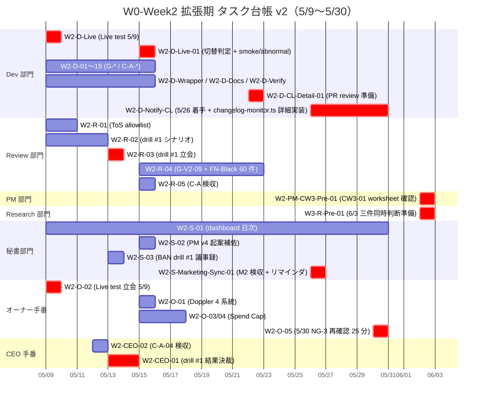

# PRJ-019 Clawbridge — W0-Week2 タスク台帳 v2（2026-05-09〜05-30、DEC-019-031 反映）

| 項目 | 内容 |
|---|---|
| 文書 ID | secretary-w0-week2-task-ledger-v2 |
| 制定日 | 2026-05-03 |
| 対象案件 | PRJ-019 Clawbridge |
| 対象期間 | W0-Week2（2026-05-09〜2026-05-15、7 日間）+ W2 全期（〜2026-05-30、22 日間）= **W2 拡張版** |
| 関連決裁 | **DEC-019-031**（5/4-5/7 4 部署並列発注事後追認 + 議題 v5 改訂 + 5/30 NG-3 議題追加、本書根拠決裁） |
| 親文書（archive 扱い） | `projects/PRJ-019/reports/secretary-w0-week2-task-ledger.md`（v1、200 行相当、本書発行後も残置） |
| 制定主体 | 秘書部門（CEO 経由配布） |
| 配布範囲 | CEO ／ PM ／ Dev ／ Research ／ Review ／ Marketing ／ 秘書（5/9 朝 W0-Week2 着手キックオフ通知） |
| 版 | **v2 確定版（FINAL）** — v1 を本日 5/3 DEC-019-031 起票（5/4-5/7 4 部署並列発注 + 議題 v5 改訂）反映で再構成 |

---

## §0. 200 字 サマリ + v1 → v2 主要変更点

### §0.1 200 字 サマリ

W0-Week2 拡張期（5/9〜5/30、22 日間）の主目的は **(a) Dev 残コントロール 14 件完成 + Live test 5/9 + BAN drill #1 (5/13) + drill #2 リハ (5/17)**、**(b) DEC-019-031 連動の追加 5 タスク（W3-R-Pre-01 / W2-D-CL-Detail-01 / W2-D-Live-01 / W2-S-Marketing-Sync-01 / W2-PM-CW3-Pre-01）**、**(c) 既存 W2-D-Notify-CL を `dev-w0-week2-mid-detailed-design.md` 詳細設計準拠に更新 + W2-R-04 FN-Black アノテを 5/14 BAN drill #1 結果判定後着手に変更**、**(d) 5/30 W2 終了時 NG-3 暫定値再確認（別本書 secretary-w2-end-owner-review-2026-05-30.md 連動）**。

### §0.2 v1 → v2 主要変更点（5 件サマリ + 2 件調整）

| # | 変更点 | v1（基準） | v2（本書） | 理由 |
|---|---|---|---|---|
| **追加 1** | **W3-R-Pre-01**（Research） | 該当なし | **6/2 / 1.0d / Research 集約準備（CW3-01 Vercel Sandbox 実消費 + NG-3 Stage 移行根拠 + Codex 6/1 移行確認）** | 6/3 三件同時判断のための前夜 6/2 集約、`research-ng3-revalidation-and-codex-bonus-impact.md` §2.5 推奨 |
| **追加 2** | **W2-D-CL-Detail-01**（Dev） | 該当なし | **5/22 / 0.5d / `changelog-monitor.ts` 実装着手前最終 PR review 準備** | DEC-019-022 Dev 5/26 着手 + 詳細設計書 `dev-w0-week2-mid-detailed-design.md` §3 連動、PR review 4 日前枠取り |
| **追加 3** | **W2-D-Live-01**（Dev） | 該当なし | **5/15 / 1.0d / live integration test 切替判定 + smoke 5 + abnormal 3** | mock-claude → 実 Claude Code CLI 切替判定基準準拠（dev-w0-week2-mid-detailed-design.md 詳細設計書連動） |
| **追加 4** | **W2-S-Marketing-Sync-01**（秘書） | 該当なし | **5/26 / 0.5d / Marketing 中間納品検収 + 6/12 最終締切リマインダ送信** | `marketing-launch-runbook-2026-06-20.md` §1.1 M2 中間納品 + §1.2 M3 最終締切連動 |
| **追加 5** | **W2-PM-CW3-Pre-01**（PM） | 該当なし | **6/2 / 0.5d / CB-CEO-W3-01 当日 worksheet データ収集完了確認** | `pm-cb-ceo-w3-01-decision-template.md` §3.1 6/3 09:00 即決のための前夜 6/2 確認 |
| **調整 1** | **W2-D-Notify-CL（DEC-019-022）** | 5/26 着手（v1 では W2-D-19 として暗黙的） | **5/26 着手 → `dev-w0-week2-mid-detailed-design.md` 詳細設計準拠に更新**（実装ファイル 5 + テスト 6 ケース、推定 1,300+ 行） | DEC-019-031 連動 Dev 詳細設計書納品で実装範囲確定 |
| **調整 2** | **W2-R-04 FN-Black アノテ 60 件**（DEC-019-030 G-Top-1 (a)+(e) ハイブリッド） | 5/13 着手（v1 では暗黙的） | **5/14 BAN drill #1 結果判定後着手に変更** | drill #1 Fail 時 TR-1 発火で Phase 1 着手 1 週間延期（5/19→5/26）→ FN-Black アノテも 1 週間スライド可能、当面の着手期日を判定後に明確化 |

---

## §1. エグゼクティブサマリ（v1 比拡張、200 字）

W0-Week2 拡張期（5/9〜5/30、22 日間）の主目的は **(a) Dev 残コントロール 14 件完成 + Live test 5/9 + BAN drill #1 (5/13) + drill #2 リハ (5/17)**、**(b) DEC-019-031 連動 5 件追加タスク**、**(c) 既存 2 件調整**、**(d) 5/30 NG-3 再確認**。Dev 主体の作業ピーク週、オーナーは 5/9 Live test 立会 + 5/15 Doppler 登録 + 5/30 NG-3 再確認の **3 手番**（v1 比 +1）。Review は ToS allowlist DoD 統合 5/10 完成 + BAN drill #1/#2 立会 + G-V2-09 検証 + Marketing 中間納品検収 5/26。秘書は dashboard 日次反映 + 議事録 + 5/26 Marketing リマインダ + 5/30 NG-3 議題運営。

---

## §2. タスク台帳（v1 全 30 件 + v2 追加 5 件 + 調整 2 件 = 計 32 アクティブ + 2 調整）

### §2.1 Dev 部門（残コントロール 14 + Live test + 持越し 8 + DEC-019-031 連動 2 件追加 + 1 件調整 = 計 21 件 + 2 調整）

| ID | 期限 | 主担当 | 副担当 | 内容 | DoD | 関連決裁 | 関連レポート | 状態 |
|---|---|---|---|---|---|---|---|---|
| W2-D-01 | 5/15 | Dev | Review | G-02 emergency_stop CLI 統合 | `claude-bridge stop` で 30 秒以内 SIGKILL、Slack `/clawbridge-stop` で同等動作、両経路 vitest 緑 | DEC-019-007 / G-02 | dev-w0-week2-implementation-report.md / control-evidence/G-02-evidence.md | [ ] 未着手 |
| W2-D-02 | 5/15 | Dev | Review | G-07 secret 隔離強化 | Sandbox 起動時に PATH / USERPROFILE / Sandbox-specific のみ allow、`*secret*` / `*token*` / `*api_key*` を block-list で二重ブロック | DEC-019-007 / G-07 / DEC-019-013 C-A-05 | control-evidence/G-07-evidence.md | [ ] 未着手 |
| W2-D-03 | 5/15 | Dev | — | G-09 監査ログ Supabase 書込 | Supabase 監査専用 project に全イベント記録、削除不可、保持期間スケジューラ稼働 | DEC-019-007 / G-09 | control-evidence/G-09-evidence.md | [ ] 未着手 |
| W2-D-04 | 5/15 | Dev | — | G-10 multi-channel alert | 異常検知時に 3 チャネル並列発火、配送失敗 = retry 3 回後 escalation、vitest mock 緑 | DEC-019-007 / G-10 | control-evidence/G-10-evidence.md | [ ] 未着手 |
| W2-D-05 | 5/15 | Dev | PM | G-11 公開可能アプリ allowlist 雛形 | clawbridge-policy.md skeleton + Review skill から参照可能な hook 関数定義 | DEC-019-007 / G-11 | control-evidence/G-11-evidence.md | [ ] 未着手 |
| W2-D-06 | 5/15 | Dev | Review | G-12 副作用ゼロ証明スクリプト | `scripts/verify-zero-side-effect.sh`、dry-run 3 回完走 + git diff 0 行 | DEC-019-007 / G-12 | control-evidence/G-12-evidence.md | [ ] 未着手 |
| W2-D-07 | 5/15 | Dev | — | G-V2-01 並列セッション数 = 1 制限 | 既起動セッション in-flight 中の追加 spawn 要求は exit code 2 + ログ出力 | DEC-019-007 / G-V2-01 | control-evidence/G-V2-01-evidence.md | [ ] 未着手 |
| W2-D-08 | 5/15 | Dev | — | G-V2-02 レート自主上限（70%） | usage-monitor が 70% 到達で 30 秒スロットル、80% で 60 秒、95% で 自動 pause | DEC-019-007 / G-V2-02 | control-evidence/G-V2-02-evidence.md | [ ] 未着手 |
| W2-D-09 | 5/15 | Dev | — | G-V2-04 指示入力経路単一化 | Open Claw → CEO は構造化 JSON IF のみ、stdin 直接入力経路を vitest で物理ブロック確認 | DEC-019-007 / G-V2-04 | control-evidence/G-V2-04-evidence.md | [ ] 未着手 |
| W2-D-10 | 5/15 | Dev | — | G-V2-08 Anthropic 警告メール監視 | `[Anthropic]` 件名フィルタ + 警告系キーワード検知 → 即時 emergency_stop | DEC-019-007 / G-V2-08 | control-evidence/G-V2-08-evidence.md | [ ] 未着手 |
| W2-D-11 | 5/15 | Dev | Review | G-V2-09 月次 $1,000 自主上限（API 換算） | $800 で warn / $1,000 で全停止、vitest シナリオ緑 | DEC-019-008 / G-V2-09 | control-evidence/G-V2-09-evidence.md | [ ] 未着手 |
| W2-D-12 | 5/15 | Dev | PM | G-V2-12 投入経路文書化 | `app/docs/security-w0.md` 拡充、すべての external command-injection 経路の物理隔離証明 | DEC-019-007 / G-V2-12 | app/docs/security-w0.md | [ ] 未着手 |
| W2-D-13 | 5/15 | Dev | — | C-A-01 Sumi/Asagi 完全バックアップ + 検証 | git push + Anthropic セッション履歴 export | DEC-019-013 / C-A-01 | dev-c-a-01-backup-report.md | [ ] 未着手 |
| W2-D-14 | 5/15 | Dev | Review | C-A-02 BAN 検知時 Sumi/Asagi 退避手順 | API キー従量切替 RTO ≤ 4h | DEC-019-013 / C-A-02 | reports/ban-evacuation-runbook-v1.md | [ ] 未着手 |
| W2-D-15 | 5/15 | Dev | Review | C-A-05 OAuth トークン保管隔離 | OS ユーザー / 環境変数 / Doppler 3 層 | DEC-019-013 / C-A-05 | control-evidence/C-A-05-evidence.md | [ ] 未着手 |
| W2-D-Live | **5/9** | Dev | オーナー | claude-bridge live integration test 1 回実行（オーナー OAuth、$0.10 上限） | 実機 `claude -p` で 1 ターン完走、stream-json 全イベント記録、コスト < $0.10 確認 | DEC-019-007 / Live test | dev-w0-week2-live-test-report.md | [ ] 未着手（最優先） |
| W2-D-Wrapper | 5/15 | Dev | — | openclaw-runtime ラッパ skeleton + mock | 上流 Open Claw OSS の最小ラッパ、mock-backed unit tests 5+ ケース緑 | CEO 連結報告 §1.4 持越し #2 | dev-w0-week2-wrapper-report.md | [ ] 未着手 |
| W2-D-Docs | 5/15 | Dev | Review | architecture-w0.md + security-w0.md + app/README.md 更新 | Mermaid アーキ図 + W0 vs W1+ scope + 9 コントロール実装エビデンス | CEO 連結報告 §1.4 | app/docs/ | [ ] 未着手 |
| **W2-D-Notify-CL（調整）** | **5/26 着手** | Dev | — | **HITL Slack / メール通知 + `changelog-monitor.ts` 実装** — `dev-w0-week2-mid-detailed-design.md` §3 詳細設計準拠（実装ファイル 5 + テスト 6 ケース、推定 1,300+ 行） | Slack incoming webhook + Resend SMTP 経由のメール送信、HITL 5 ゲート発動時に同時通知、changelog-monitor.ts cron tick で 4 系統 polling、breaking 判定 5 ヒューリスティクス、3 段階通知（L1/L2/L3）、24h pause、HITL 第 7 種 `external_api` 連携、vitest 6 ケース緑 | DEC-019-007 / G-04 / DEC-019-022 / DEC-019-031 連動 | control-evidence/HITL-evidence.md / dev-w0-week2-mid-detailed-design.md §3 | [ ] 未着手（5/26 着手、5/30 検収） |
| W2-D-Verify | 5/15 | Dev | Review | scripts/verify-zero-side-effect.sh 完成版 | W2-D-06 の本番版、CI で日次自動実行、副作用検出時に CEO へ自動通知 | DEC-019-007 / G-12 | scripts/verify-zero-side-effect.sh | [ ] 未着手 |
| **W2-D-CL-Detail-01（v2 追加）** | **5/22** | **Dev** | **Review** | **`changelog-monitor.ts` 実装着手前 最終 PR review 準備**（DEC-019-031 連動）| 5/22 までに `dev-w0-week2-mid-detailed-design.md` §3 で示された ファイル一覧 5 件 + テスト 6 ケースの skeleton PR を Review 部門に submit、Review 一次レビュー完了 → 5/26 着手前に Dev 修正反映 | **DEC-019-031** / DEC-019-022 | dev-w0-week2-mid-detailed-design.md §3.5 | [ ] 未着手 |
| **W2-D-Live-01（v2 追加）** | **5/15** | **Dev** | **Review** | **live integration test 切替判定 + smoke 5 + abnormal 3 件**（mock-claude → 実 Claude Code CLI 切替判定基準準拠、DEC-019-031 連動）| smoke 5 件（hello / read-file / write-file / multi-turn / cost-track）+ abnormal 3 件（rate-limit / token-expire / network-error）すべて Pass で切替 Go、1 件以上 Fail なら mock-claude 継続、Review が判定 | **DEC-019-031** / DEC-019-007 / W2-D-Live | dev-w0-week2-mid-detailed-design.md / 切替判定レポート（予定） | [ ] 未着手 |

**Dev 工数概算（v2）**: 21 + 5 + 2 = **23 タスク + 1 調整**、合計 **75〜90h**（v1 比 +5〜10h で W2-D-Live-01 1.0d + W2-D-CL-Detail-01 0.5d + W2-D-Notify-CL 範囲拡大）。Dev 1 人 1 週 35〜40h 想定 → PRJ-019 配分 60% で 5/9〜5/15 期間内 24h で W2-D-Live-01 + 残主要分消化、5/16〜5/30 期間内で W2-D-CL-Detail-01 + W2-D-Notify-CL 詳細実装を吸収。

### §2.2 Review 部門（v1 5 件 + DEC-019-031 連動 0 件 = 計 5 件、§2.4 秘書連動でカバー）

| ID | 期限 | 主担当 | 副担当 | 内容 | DoD | 関連決裁 | 関連レポート | 状態 |
|---|---|---|---|---|---|---|---|---|
| W2-R-01 | 5/10 | Review | Dev | ToS allowlist DoD 統合完成 | clawbridge-domain-allowlist-v1.md 確定 + DEC-019-010 §3 OSS ライセンス検証フロー雛形 | DEC-019-010 / CB-S-W0-02 | reports/clawbridge-domain-allowlist-v1.md | [>] 並列発注で進行中 |
| W2-R-02 | 5/12 | Review | Dev | BAN drill #1 シナリオ最終化 | シナリオ doc 完成 + drill 立会用チェックリスト + 計測項目（detection time / RTO / 副作用件数）確定 | DEC-019-013 / C-A-03 | reports/review-ban-drill-1-detailed-procedure.md（5/3 着地済） | [>] 完了 |
| W2-R-03 | 5/13 | Review | Dev + オーナー（任意） | BAN drill #1 立会 + 結果検収 | B-1〜B-6 全シナリオ実機実行 + detection time / RTO 計測 + 結果レポート | DEC-019-013 / C-A-03 | reports/review-ban-drill-1-result.md | [ ] 未着手 |
| **W2-R-04（調整）** | **5/14 BAN drill #1 結果判定後着手** | Review | Dev | **G-V2-09 月次 $1,000 自主上限の検証立会 + FN-Black アノテ 60 件（DEC-019-030 G-Top-1 (a)+(e) ハイブリッド）**：HN 60 件 + IH 30 件追加で計 90 件、ジャンル偏重補正は W3 中盤（5/26）と W4 終盤（6/9）の 2 回再評価 | 試算機能の正確性 ± 5% 以内 + $800 warn / $1,000 stop の閾値挙動確認 + FN-Black アノテ 60 件完成 | DEC-019-008 / G-V2-09 / DEC-019-030 / DEC-019-031 連動 | control-evidence/G-V2-09-evidence.md / FN-Black アノテレポート（予定） | [ ] **5/14 BAN drill #1 結果判定後着手**（Pass 時のみ着手、Fail 時は TR-1 発火で 1 週間スライド） |
| W2-R-05 | 5/15 | Review | — | C-A-01 / C-A-02 / C-A-05 検収（W2-D-13 / 14 / 15 の Review 検証） | バックアップ完全性確認 + 退避リハーサル成功 + OAuth 隔離 stat テスト確認、3 件全合格 | DEC-019-013 | reports/review-c-a-1-2-5-evidence.md | [ ] 未着手 |

### §2.3 PM 部門（v1 0 件 + DEC-019-031 連動 1 件追加 = 計 1 件）

| ID | 期限 | 主担当 | 副担当 | 内容 | DoD | 関連決裁 | 関連レポート | 状態 |
|---|---|---|---|---|---|---|---|---|
| **W2-PM-CW3-Pre-01（v2 追加）** | **6/2** | **PM** | **Research** | **CB-CEO-W3-01 当日 worksheet データ収集完了確認**（DEC-019-031 連動）| `pm-cb-ceo-w3-01-decision-template.md` §3.2 Cell A 入力欄（vCPU 累計時間 / 月次 CPU 時間 / 同時実行ピーク 等）が Dev 集計で 6/2 22:00 までに完備、PM Agent が 6/3 06:00 に Cell B 計算欄を埋められる状態にする | **DEC-019-031** / DEC-019-024 / CB-CEO-W3-01 | pm-cb-ceo-w3-01-decision-template.md §3 | [ ] 未着手（6/2 朝 PM 確認、22:00 確定） |

### §2.4 Research 部門（v1 0 件 + DEC-019-031 連動 1 件追加 = 計 1 件）

| ID | 期限 | 主担当 | 副担当 | 内容 | DoD | 関連決裁 | 関連レポート | 状態 |
|---|---|---|---|---|---|---|---|---|
| **W3-R-Pre-01（v2 追加）** | **6/2** | **Research** | **CEO** | **6/3 三件同時判断のための Research 集約準備**（DEC-019-031 連動）| (i) CB-CEO-W3-01 Vercel Sandbox 実消費レポート（W2-W3 中間集計、`pm-cb-ceo-w3-01-decision-template.md` §3.2 Cell A 入力に転記）+ (ii) NG-3 Stage 移行根拠（5/30 W2 終了時点の weekly cap 健全性確認結果）+ (iii) Codex 6/1 移行確認（Pro $200 維持 vs $100 ダウングレード判断材料）の 3 件を 6/2 22:00 までに CEO へ提出 | **DEC-019-031** / DEC-019-024 / DEC-019-008 / `research-ng3-revalidation-and-codex-bonus-impact.md` §2.5 | research-w3-pre-01-consolidation.md（予定） | [ ] 未着手（6/2 朝 Research 着手、22:00 確定） |

### §2.5 秘書部門（v1 3 件 + DEC-019-031 連動 1 件追加 = 計 4 件）

| ID | 期限 | 主担当 | 副担当 | 内容 | DoD | 関連決裁 | 関連レポート | 状態 |
|---|---|---|---|---|---|---|---|---|
| W2-S-01 | 5/9〜5/15（日次） | 秘書 | — | dashboard 日次反映（PRJ-019 行を毎日 18:00 に進捗更新） | 主要マイルストーン通過時に dashboard PRJ-019 行の備考に追記、進捗 % は CEO 起票分のみ反映 | — | dashboard/active-projects.md | [ ] 未着手 |
| W2-S-02 | 5/15 | 秘書 | PM | PM v3 → v4 への週次更新 | reports/pm-cost-plan-v4.md 起案（PM が起票、秘書は補佐）+ 既存 PM v3 のステータス遷移記録 | DEC-019-015 / 016 / 017 | reports/pm-cost-plan-v4.md | [ ] PM 起案待ち |
| W2-S-03 | 5/13 | 秘書 | — | BAN drill #1 議事録作成 | drill 開始/終了時刻 + シナリオ別実行ログ + 参加者発言要旨 + DEC-019-018 起票要件まとめ | DEC-019-013 | reports/secretary-ban-drill-1-minutes.md | [ ] 未着手 |
| **W2-S-Marketing-Sync-01（v2 追加）** | **5/26** | **秘書** | **Marketing** | **Marketing 中間納品検収（M2 段階）+ 6/12 最終締切リマインダ送信**（DEC-019-031 連動）| (i) `marketing-launch-runbook-2026-06-20.md` §1.1 M2 中間納品 4 件（M2-MK-01〜04）+ Web 運営連携 5 件（M2-WO-01〜05）の Review 一次チェック完了確認 + (ii) 6/12 M3 最終締切リマインダを Marketing / Web 運営 / CEO に送信（5/26 22:00 まで） | **DEC-019-031** / DEC-019-026〜029 / marketing-launch-runbook-2026-06-20.md §1 | secretary-marketing-m2-sync-2026-05-26.md（予定） | [ ] 未着手（5/26 着手） |

### §2.6 オーナー手番（v1 4 件 + 5/30 議題 1 件追加 = 計 5 件）

| ID | 期限 | 主担当 | 副担当 | 内容 | DoD | 関連決裁 | 関連レポート | 状態 |
|---|---|---|---|---|---|---|---|---|
| W2-O-01 | 5/15 | オーナー | Dev | CB-O-05 Doppler / 1Password Vault 4 系統登録（Clawbridge-Master/Dev/Notify/Public） | Doppler workspace token 取得 + 1Password Vault 4 系統設定完了 + Dev に共有 | DEC-019-013 / C-A-05 | reports/owner-cb-o-05-doppler-setup.md | [ ] 未着手 |
| W2-O-02 | 5/9 | オーナー | Dev | claude-bridge live integration test 立会（OAuth セッション提供、$0.10 上限） | OAuth セッション提供 + テスト 1 回実行立会 + 結果確認 | DEC-019-007 | dev-w0-week2-live-test-report.md | [ ] 未着手（最優先） |
| W2-O-03 | 5/18（前倒し可、5/15 までに完了推奨） | オーナー | — | Anthropic Spend Cap 設定 | Console Settings → Billing → Spend limits 設定 + screenshot 取得 | DEC-019-012 | reports/owner-spend-cap-screenshots-2026-05-XX.md | [ ] 未着手 |
| W2-O-04 | 5/18（前倒し可、5/15 までに完了推奨） | オーナー | — | OpenAI Spend Cap 設定（Hard $20） | Platform → Settings → Limits 設定 + screenshot 取得 | DEC-019-012 | reports/owner-spend-cap-screenshots-2026-05-XX.md | [ ] 未着手 |
| **W2-O-05（v2 追加）** | **5/30** | **オーナー** | **CEO + Research** | **NG-3 暫定値再確認 25 分（$1,200 上方修正候補議論）**（DEC-019-031 連動）| 18:00〜18:25 オンライン会議で W3-R-Pre-01 / W2-PM-CW3-Pre-01 ベース資料を確認、NG-3 12h/$1,000 → 15h/$1,200（Stage 1）採用可否を判断（即決 / 持帰り）、TR-2 発動可否確定 | **DEC-019-031** / DEC-019-008 / DEC-019-023 / `secretary-w2-end-owner-review-2026-05-30.md` | secretary-w2-end-owner-review-2026-05-30.md（本書姉妹文書） | [ ] 未着手（5/30 18:00〜18:25） |

### §2.7 CEO 手番（v1 2 件 + 0 件 = 計 2 件、5/30 議題は §2.6 W2-O-05 に統合済）

| ID | 期限 | 主担当 | 副担当 | 内容 | DoD | 関連決裁 | 関連レポート | 状態 |
|---|---|---|---|---|---|---|---|---|
| W2-CEO-01 | 5/13〜5/14 | CEO | Review | BAN drill #1 結果決裁（DEC-019-018 起票想定） | drill 結果レポート受領 → 合格 / 部分合格 / 不合格判定、5/17 BAN drill #2 着手 Go/NoGo 決裁 | DEC-019-013 / C-A-03 | decisions.md DEC-019-018 | [ ] 未着手 |
| W2-CEO-02 | 5/12 | CEO | Review | C-A-04 使用量モニタリング検収（W2-D-12 / 関連） | Anthropic Console + ChatGPT Settings の usage 日次 export スクリプト稼働確認 | DEC-019-013 / C-A-04 | reports/ceo-c-a-04-monitoring-acceptance.md | [ ] 未着手 |

### §2.8 Marketing 部門（v1 0 件 + DEC-019-031 連動で M2 中間納品が §2.5 W2-S-Marketing-Sync-01 連動になる）

Marketing 部門の M2 中間納品（5/26、4 件）+ M3 最終締切（6/12、4 件）+ 6/20 公開（M4）は **`marketing-launch-runbook-2026-06-20.md` §1** で詳細管理。本台帳では §2.5 W2-S-Marketing-Sync-01 を 5/26 検収トリガとして連動するのみ。

---

## §3. 依存関係グラフ + ガント図（Mermaid、5/9〜5/30 全 W2 タスク可視化、v2 拡張）

### §3.1 ガント図（5/9〜5/30、22 日間、DEC-019-031 連動 5 件 + 既存全件）



### §3.2 クリティカルパス（最長 22 日、v2 拡張）

1. **5/9 オーナー Live test 立会（W2-O-02）→ 5/9 Dev Live test 実行（W2-D-Live）→ 5/13 BAN drill #1 立会（W2-R-03）→ 5/13-14 CEO 決裁（W2-CEO-01）→ 5/14 W2-R-04 着手判定 → 5/15 Live integration test 切替判定（W2-D-Live-01）+ C-A-* 検収（W2-R-05）→ 5/15 PM v4 更新（W2-S-02）**
2. **5/22 Dev W2-D-CL-Detail-01（PR review 準備）→ 5/26 Dev W2-D-Notify-CL 着手（changelog-monitor.ts 詳細実装）→ 5/26 秘書 W2-S-Marketing-Sync-01（M2 検収 + リマインダ）→ 5/30 オーナー W2-O-05（NG-3 再確認 25 分）**
3. **6/2 Research W3-R-Pre-01 + PM W2-PM-CW3-Pre-01 → 6/3 三件同時判断（CW3-01 + NG-3 Stage 移行 + Codex 6/1 移行確認）**

### §3.3 5/15 競合状況（v1 では Dev 6+ タスク + AS-151 → AS-151 5/16 スライド済前提、v2 維持）

5/15（金）の Dev 並列発生は v1 比 +1（W2-D-Live-01 追加、ただし W2-D-13/14/15 と並行可能）= **計 7 タスク**：W2-D-07 / W2-D-08 / W2-D-13 / W2-D-Docs / W2-D-Live-01 / W2-D-15 / W2-D-Verify。

**解消策（v1 維持）**: AS-151（PRJ-018 Asagi）は 5/16（土）にスライド、5/8 22:00 までに秘書部門が PRJ-018 PM 経由で送付（v1 から維持）。スライド失敗時の代替: PRJ-019 側 W2-D-Docs を 5/14 に前倒し、5/15 の Dev 並列を 6 タスク以下に圧縮（v1 5 タスク → v2 6 タスクに緩和）。

**v2 で新規追加された W2-D-Live-01 との干渉なし**: W2-D-Live-01 は smoke/abnormal の **判定のみ**（Review 主導、Dev は試験実行 + ログ提供のみ）で 1.0d 以内、W2-D-13/14/15 とリソース競合しない。

---

## §4. オーナー手番タスクのリマインド（W2-O-01〜05、1 ページサマリ、v2 拡張）

| 優先度 | タスク | 期限 | 所要時間 | 完了後の提出先 |
|---|---|---|---|---|
| **最優先** | W2-O-02 claude-bridge live integration test 立会（OAuth セッション提供、$0.10 上限） | **5/9（金）** | 30〜60 分 | Dev → `dev-w0-week2-live-test-report.md` |
| 必須 | W2-O-01 CB-O-05 Doppler / 1Password Vault 4 系統登録 | **5/15（木）** | 30 分 | Dev → `reports/owner-cb-o-05-doppler-setup.md` |
| 必須 | W2-O-03 Anthropic Spend Cap 設定 | **5/18（日）**（前倒し推奨 5/15） | 5 分 | `reports/owner-spend-cap-screenshots-2026-05-XX.md` |
| 必須 | W2-O-04 OpenAI Spend Cap 設定（Hard $20） | **5/18（日）**（前倒し推奨 5/15） | 5 分 | `reports/owner-spend-cap-screenshots-2026-05-XX.md` |
| **必須（v2 新規）** | **W2-O-05 5/30 NG-3 暫定値再確認 25 分**（$1,200 上方修正候補議論、TR-2 発動可否） | **5/30（土）** **18:00〜18:25** | 25 分 | `secretary-w2-end-owner-review-2026-05-30.md`（議事録は秘書部門起案、5/30 22:00 まで） |

**詳細**: 別紙 `reports/secretary-owner-daily-progress-tracker-2026-05-04-07.md` + `secretary-w2-end-owner-review-2026-05-30.md` を参照。

---

## §5. W0-Week3〜W3 中盤（5/16〜6/3）への持越予定（v2 拡張）

| 予定 | 日付 | 主担当 | 内容 |
|---|---|---|---|
| BAN drill #2 | 5/17（土） | Review + Dev | Sumi/Asagi 同居前提（C-A-01 完成 + C-A-02 退避手順 + C-A-05 OAuth 隔離が前提）、`review-ban-drill-2-sumi-asagi-coexistence-procedure.md` 準拠 |
| W0 完了 Go/NoGo 最終判定会議 | 5/18 18:00 | CEO 議長 | 23 必須コントロール + C-A-01〜05 全完成 + BAN drill 2 回合格 + Spend Cap 設定確認 → DEC-019-019 想定 |
| オーナー Spend Cap 設定（最終期限） | 5/18 | オーナー | W2-O-03 / W2-O-04 が前倒し未完了の場合の最終リミット |
| W0 完了レビュー（CB-S-W0-01） | 5/18 | Review | 必須コントロール 21 項目の準備状況 + 未着 2 項目（G-V2-06 / G-V2-10）の W1 整備計画レビュー |
| Phase 1 W1 公式キックオフ | 5/19 | 全部署 | PM v2 §3.4 マトリクス（Dev 50% / Review 30%）開始 |
| **W2-D-CL-Detail-01（v2 新規）** | **5/22** | **Dev** | **changelog-monitor.ts 実装着手前 最終 PR review 準備** |
| **W2-D-Notify-CL 着手（5/26 着手）** | **5/26** | **Dev** | **`changelog-monitor.ts` 詳細実装（5 ファイル + 6 テストケース、推定 1,300+ 行）、5/30 検収** |
| **W2-S-Marketing-Sync-01（v2 新規）** | **5/26** | **秘書** | **M2 中間納品検収 + 6/12 リマインダ送信** |
| **W2-O-05（v2 新規）** | **5/30** | **オーナー** | **NG-3 暫定値再確認 25 分（$1,200 上方修正候補議論）** |
| **W3-R-Pre-01（v2 新規）** | **6/2** | **Research** | **6/3 三件同時判断のための Research 集約準備** |
| **W2-PM-CW3-Pre-01（v2 新規）** | **6/2** | **PM** | **CB-CEO-W3-01 当日 worksheet データ収集完了確認** |
| **6/3 三件同時判断（CB-CEO-W3-01）** | **6/3** | **CEO + Owner** | **Vercel Pro 昇格 + NG-3 Stage 移行 + Codex 6/1 移行確認の 3 件同時判断、`pm-cb-ceo-w3-01-decision-template.md` §3 worksheet 適用** |

---

## §6. 既存 PRJ への影響確認（PRJ-018 Asagi M1 5/9〜5/30 並走チェック、v1 §6 + v2 拡張）

| 項目 | 状況（v1 維持 + v2 拡張） |
|---|---|
| 共通リソース競合 | GitHub / Vercel / Anthropic アカウントのみ。コードベースは完全分離 |
| Anthropic Claude Max アカウント | 5/9 Live integration test 中のみ軽競合（$0.10 上限）、それ以外は H-09 weekly cap 監視で同居運用 |
| OpenAI ChatGPT Pro アカウント | W0-Week2 期間は PRJ-019 側で本格利用なし、5/26 W2-D-Notify-CL 着手以降の changelog-monitor で OpenAI Codex CLI repo polling が cron 1h で発生（GitHub PAT のみ、ChatGPT Pro 直接利用なし） |
| claude-code-company 組織本体 | PRJ-019 は read-only mount のみ、PRJ-018 は通常開発 |
| Dev 工数競合ピーク | 5/9（Live test）/ 5/13（BAN drill #1）/ 5/15（C-A-01/02/05 + Doppler + Live integration test 切替判定）/ **5/26〜5/30（W2-D-Notify-CL changelog-monitor 詳細実装）**（v2 新規ピーク）。PRJ-018 AS-140 Real impl は 5/13〜14 完成予測 |
| Review 工数競合ピーク | 5/10（ToS allowlist 統合）/ 5/13（BAN drill #1 立会）/ 5/15（C-A-* 検収 + Live integration test 切替判定）/ **5/22（W2-D-CL-Detail-01 PR review）/ 5/26（M2 中間納品検収）/ 5/30（W2-D-Notify-CL 検収）**（v2 新規ピーク） |
| オーナー競合ピーク | 5/9 Live test 立会 + 5/15 Doppler 登録 + **5/30 NG-3 再確認 25 分**（v2 新規）。PRJ-018 側は AS-140 進捗確認のみ |
| 副作用ゼロ原則 | PRJ-019 W2-D-Verify（`scripts/verify-zero-side-effect.sh`）が日次 CI で PRJ-001〜018 への write/delete を検出、副作用検出 = 即時 emergency_stop |

**結論（v2）**: 並走の構造的競合なし、v1 ベースから維持。Dev / Review / オーナーの「同日複数手番」は v2 で 5/26〜5/30 の Dev / Review ピーク追加が発生するが、PM v2 §3.4 配分マトリクスと優先順位ルールで物理運用可能。Phase 1 W1 着手（5/19）の確度を「強い条件付き Go のまま維持」する前提を脅かす要素は v2 段階でも現時点でなし。

---

## §7. CEO への確認事項（決裁提案、v1 §7 + v2 拡張）

本台帳の運用に関し、CEO に以下の起票判断を仰ぎたい：

1. **DEC-019-018 起票準備**（5/13〜14 BAN drill #1 結果決裁）の事前枠取り — 本台帳 W2-CEO-01 として記載済（v1 維持）
2. **DEC-019-032 想定**（5/8 W0-Week1 検収結果総括 + Phase 1 W1 着手 5/19 Go/NoGo 議決） — 5/8 議事録確定後の自動起票（v5 議題で詳述）
3. **PM v4 起案発令**（W2-S-02 関連） — H-09 / H-10 / Vercel コスト上方修正 / Pro 昇格 W3 中盤格上げ + W2 実績反映を W4 起案として PM 部門に発令するか（v1 維持）
4. **オーナー Spend Cap の前倒し依頼** — 5/18 期限を 5/15 に前倒し依頼するか（v1 維持）
5. **【v2 新規】W2-D-CL-Detail-01 PR review 5/22 タイミング**: Dev が 5/22 までに PR submit、Review が 5/22〜5/25 中にレビュー完了、5/26 着手前に Dev 修正反映する 4 日 cycle で運用可否
6. **【v2 新規】W2-D-Live-01 切替判定 5/15 タイミング**: smoke 5 / abnormal 3 件すべて Pass で切替 Go、1 件以上 Fail なら mock-claude 継続の Review 判定権限付与
7. **【v2 新規】W2-S-Marketing-Sync-01 5/26 検収**: 秘書が Marketing 検収を主導することの権限付与（Review 部門は技術仕様のみ責任、Marketing 進行管理は秘書部門）
8. **【v2 新規】W2-O-05 5/30 NG-3 再確認 25 分**: 18:00〜18:25 オンライン会議の物理確保 + Research 事前資料 5/29 朝提出依頼（W3-R-Pre-01 部分先行）
9. **【v2 新規】W3-R-Pre-01 + W2-PM-CW3-Pre-01 6/2 並列**: Research + PM が 6/2 中に並列で集約、6/2 22:00 統合確定の運用ルール承認

---

## §8. 5/9 朝 W0-Week2 着手キックオフ通知（5 部署 + 秘書）

### §8.1 通知文案（5/9 朝 06:00 送付想定）

```markdown
# W0-Week2 着手キックオフ通知（DEC-019-031 連動、台帳 v2 ベース）

**送付**: 秘書部門 ／ **経由**: CEO ／ **送付日**: 2026-05-09 06:00 JST ／ **宛**: PM / Dev / Research / Review / Marketing / 秘書（5 部署 + 自部署）

## 1. 本日（5/9）からの W0-Week2 着手のお願い

本日 5/9（金）から W0-Week2（5/9〜5/15、7 日間 + W2 拡張期 〜5/30、合計 22 日間）が公式着手します。本通知は DEC-019-031 連動の W0-Week2 タスク台帳 v2（`secretary-w0-week2-task-ledger-v2.md`、本書）の運用開始を周知するものです。

## 2. 本日 5/9 の最優先タスク

- **W2-D-Live**: claude-bridge live integration test 1 回実行（Dev 主担当、オーナー OAuth 立会、$0.10 上限）
- **W2-O-02**: オーナー Live test 立会（30〜60 分、OAuth セッション提供）

## 3. 各部署の今週中の主要タスク（5/9〜5/15）

| 部署 | タスク数 | 主要タスク | 期限 |
|---|---|---|---|
| Dev | 21 件 + 2 件（v2 追加） | W2-D-Live (5/9) / W2-D-01〜15 (5/15) / W2-D-Wrapper / W2-D-Docs / W2-D-Verify (5/15) / **W2-D-Live-01 (5/15)** | 5/15 |
| Review | 5 件 | W2-R-01 (5/10) / W2-R-02 (5/12) / W2-R-03 (5/13) / W2-R-04 (5/14 着手判定後) / W2-R-05 (5/15) | 5/15 |
| 秘書 | 4 件 + 1 件（v2 追加） | W2-S-01 (日次) / W2-S-02 (5/15) / W2-S-03 (5/13) / **W2-S-Marketing-Sync-01 (5/26)** | 5/15〜5/26 |
| Marketing | （`marketing-launch-runbook-2026-06-20.md` §1.1 M2 経由） | M2-MK-01〜04（5/26 中間納品） | 5/26 |
| PM | 1 件（v2 追加） | **W2-PM-CW3-Pre-01 (6/2)** | 6/2 |
| Research | 1 件（v2 追加） | **W3-R-Pre-01 (6/2)** | 6/2 |

## 4. オーナー手番（5/9〜5/30）

| ID | 期限 | 所要 |
|---|---|---|
| W2-O-02 | **5/9** | 30〜60 分 |
| W2-O-01 | 5/15 | 30 分 |
| W2-O-03 / W2-O-04 | 5/15 推奨 | 各 5 分 |
| **W2-O-05（v2 新規）** | **5/30 18:00〜18:25** | 25 分 |

## 5. 関連レポート

- 台帳 v2: `projects/PRJ-019/reports/secretary-w0-week2-task-ledger-v2.md`（本書）
- 議題 v5: `projects/PRJ-019/reports/secretary-w0-week1-meeting-agenda-v5.md`
- 5/30 議題: `projects/PRJ-019/reports/secretary-w2-end-owner-review-2026-05-30.md`
- DEC-019-031 連動納品物 7 件（事前読込推奨、議題 v5 §1.2 参照）

## 6. 連絡先

質問・修正要請は CEO 経由で秘書部門にお寄せください。
```

### §8.2 通知運用 SOP

- **5/9 06:00**: 秘書部門が §8.1 通知文案を社内グループウェア + メールで一斉送付
- **5/9 09:00**: PM / Dev / Review / Marketing / Research が各タスク開始
- **5/9 09:00〜10:00**: オーナー W2-O-02 Live test 立会
- **5/9 10:00〜18:00**: Dev W2-D-Live 実行 + W2-D-01〜15 着手
- **5/9 18:00**: 秘書部門が dashboard 日次反映（W2-S-01）

---

## §9. 関連ドキュメント

- 親文書（v1、archive 扱い）: `projects/PRJ-019/reports/secretary-w0-week2-task-ledger.md`（本書発行後も残置）
- 連動: `projects/PRJ-019/reports/secretary-w0-week1-meeting-agenda-v5.md`（議題 v5、本書姉妹文書）
- 連動: `projects/PRJ-019/reports/secretary-w2-end-owner-review-2026-05-30.md`（5/30 NG-3 再確認、本書姉妹文書）
- 連動: `projects/PRJ-019/reports/secretary-owner-daily-progress-tracker-2026-05-04-07.md`（オーナー Daily Tracker）
- 連動: `projects/PRJ-019/reports/dev-w0-week2-mid-detailed-design.md`（Dev 詳細設計、W2-D-Notify-CL / W2-D-CL-Detail-01 / W2-D-Live-01 根拠）
- 連動: `projects/PRJ-019/reports/research-ng3-revalidation-and-codex-bonus-impact.md`（Research、W3-R-Pre-01 根拠）
- 連動: `projects/PRJ-019/reports/pm-v5-template-and-meeting-runbook.md`（PM v5 テンプレ）
- 連動: `projects/PRJ-019/reports/pm-cb-ceo-w3-01-decision-template.md`（CW3-01 テンプレ、W2-PM-CW3-Pre-01 根拠）
- 連動: `projects/PRJ-019/reports/marketing-launch-runbook-2026-06-20.md`（Marketing Runbook、W2-S-Marketing-Sync-01 根拠）
- 連動: `projects/PRJ-019/reports/marketing-techblog-toc-and-lp-wireframe.md`（LP wireframe）
- 連動: `projects/PRJ-019/reports/secretary-prj018-prj019-coordination-2026-05-03.md`（PRJ-018 並走対照表）
- 上流 SOP: `organization/rules/agent-tool-permission-sop.md`（DEC-019-025）
- 意思決定: `projects/PRJ-019/decisions.md`（DEC-019-001〜031）

---

## §10. 配布履歴と承認

| 版 | 日付 | 状態 | 備考 |
|---|---|---|---|
| v1 | 2026-05-03 | 秘書部門制定（CEO 経由配布） | W0-Week2（5/9〜5/15、7 日間）、Dev 19 件 + Review 5 件 + 秘書 3 件 + オーナー 4 件 + CEO 2 件 = 計 33 タスク |
| **v2 確定版** | **2026-05-03** | **秘書部門制定（CEO 経由配布、本書）** | **W2 拡張期（5/9〜5/30、22 日間）、DEC-019-031 連動 5 件追加 + 既存 2 件調整 + W2-O-05（5/30 NG-3 再確認 25 分）追加、計 33 + 5 + 1 = 39 アクティブタスク** |

---

**制定**: 秘書部門 ／ **経由**: CEO ／ **宛**: CEO + 5 部署（PM / Dev / Research / Review / Marketing） + 秘書 + Owner（W2-O-01〜05 該当部分）

**制定日**: 2026-05-03 ／ **着手キックオフ**: 2026-05-09 06:00 JST ／ **次回更新**: 5/9 Live test 結果 / 5/13 BAN drill #1 結果 / 5/15 C-A-* 検収結果 / 5/26 M2 中間納品 / 5/30 NG-3 再確認 / 6/2 W3-R-Pre-01 + W2-PM-CW3-Pre-01 反映時

**archive 扱い**: v1 は本書発行後も残置、削除しない（DEC-019-031 §3.2 v2 改訂運用ルール準拠）
