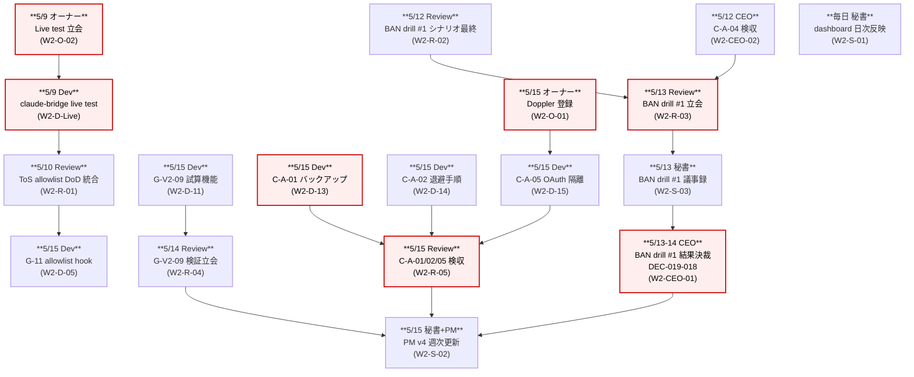

# PRJ-019 Clawbridge — W0-Week2 タスク台帳（2026-05-09〜05-15）

**宛先**: CEO ／ **作成**: 秘書部門 ／ **作成日**: 2026-05-03 ／ **対象期間**: W0-Week2（2026-05-09〜2026-05-15、7 日間）／ **関連連結報告**: `reports/ceo-w0-week1-consolidation.md` §1.4 / §5.2

---

## 1. エグゼクティブサマリ（150 字）

W0-Week2 の主目的は **(a) Dev 残コントロール 14 件完成（v3 23 項目中 G-02 / G-07 / G-09 / G-10 / G-11 / G-12 + G-V2 系 6 件 + C-A-01/02/05）**、**(b) claude-bridge live integration test を 5/9 に最優先で実機実行**、**(c) BAN drill #1（5/13、PRJ-019 単独）の実施と検収**。Dev 主体の作業ピーク週、オーナーは 5/9 Live test 立会 + 5/15 Doppler 登録の 2 手番。Review は ToS allowlist DoD 統合 5/10 完成 + BAN drill #1 立会 + G-V2-09 検証。

---

## 2. タスク台帳（5 主体別）

### 2.1 Dev 部門（残コントロール 14 + Live test + 持越し 8 件）

| ID | 期限 | 主担当 | 副担当 | 内容 | DoD | 関連決裁 | 関連レポート | 状態 |
|---|---|---|---|---|---|---|---|---|
| W2-D-01 | 5/15 | Dev | Review | **G-02 emergency_stop CLI 統合**（PR-3, PR-4 相当、stop コマンド + Slack slash command）| `claude-bridge stop` で 30 秒以内 SIGKILL、Slack `/clawbridge-stop` で同等動作、両経路 vitest 緑 | DEC-019-007 / G-02 | dev-w0-week2-implementation-report.md（予定）/ control-evidence/G-02-evidence.md | [ ] 未着手 |
| W2-D-02 | 5/15 | Dev | Review | **G-07 secret 隔離強化**（Vercel Sandbox env whitelist + `op run` 統合）| Sandbox 起動時に PATH / USERPROFILE / Sandbox-specific のみ allow、`*secret*` / `*token*` / `*api_key*` を block-list で二重ブロック | DEC-019-007 / G-07 / DEC-019-013 C-A-05 | control-evidence/G-07-evidence.md | [ ] 未着手 |
| W2-D-03 | 5/15 | Dev | — | **G-09 監査ログ Supabase 書込**（PR-11, PR-12 相当、append-only スキーマ + stream-json 全 event hook + 90 日保持）| Supabase 監査専用 project（CB-D-03 完成前提）に全イベント記録、削除不可、保持期間スケジューラ稼働 | DEC-019-007 / G-09 | control-evidence/G-09-evidence.md | [ ] 未着手 |
| W2-D-04 | 5/15 | Dev | — | **G-10 multi-channel alert**（PR-13 相当、Slack/TG/Resend）| 異常検知時に 3 チャネル並列発火、配送失敗 = retry 3 回後 escalation、vitest mock 緑 | DEC-019-007 / G-10 | control-evidence/G-10-evidence.md | [ ] 未着手 |
| W2-D-05 | 5/15 | Dev | PM | **G-11 公開可能アプリ allowlist 雛形**（PRJ-019 W3 で本番化、W2 では skeleton + ToS allowlist 統合先 hook）| `clawbridge-policy.md` skeleton + Review skill から参照可能な hook 関数定義、空 allowlist でも全件 deny で正しく動く | DEC-019-007 / G-11 | control-evidence/G-11-evidence.md | [ ] 未着手 |
| W2-D-06 | 5/15 | Dev | Review | **G-12 副作用ゼロ証明スクリプト**（dry-run モード雛形、`scripts/verify-zero-side-effect.sh`）| 既存 PRJ-001〜018 配下に対する write/delete を全件検出 → exit 1、dry-run 3 回完走 + git diff 0 行 | DEC-019-007 / G-12 | control-evidence/G-12-evidence.md | [ ] 未着手 |
| W2-D-07 | 5/15 | Dev | — | **G-V2-01 並列セッション数 = 1 に制限**（claude-bridge spawn 二重起動拒否）| 既起動セッション in-flight 中の追加 spawn 要求は exit code 2 + ログ出力、vitest concurrency test 緑 | DEC-019-007 / G-V2-01 | control-evidence/G-V2-01-evidence.md | [ ] 未着手 |
| W2-D-08 | 5/15 | Dev | — | **G-V2-02 レート自主上限**（Anthropic 公式 rate-limit の 70% 自主キャップ）| usage-monitor が 70% 到達で 30 秒スロットル、80% で 60 秒、95% で 自動 pause | DEC-019-007 / G-V2-02 | control-evidence/G-V2-02-evidence.md | [ ] 未着手 |
| W2-D-09 | 5/15 | Dev | — | **G-V2-04 指示入力経路単一化**（CEO/Secretary skill の非対話モード化、PR-W2-08）| Open Claw → CEO は構造化 JSON IF のみ、stdin 直接入力経路を vitest で物理ブロック確認 | DEC-019-007 / G-V2-04 | control-evidence/G-V2-04-evidence.md | [ ] 未着手 |
| W2-D-10 | 5/15 | Dev | — | **G-V2-08 Anthropic 警告メール監視**（Gmail API 1h polling、PR-W2-09）| `[Anthropic]` 件名フィルタ + 警告系キーワード検知 → 即時 emergency_stop、Gmail API OAuth scope 限定 | DEC-019-007 / G-V2-08 | control-evidence/G-V2-08-evidence.md | [ ] 未着手 |
| W2-D-11 | 5/15 | Dev | Review | **G-V2-09 月次 $1,000 自主上限**（cost_check skill の API 換算試算機能）| サブスク利用中も「もし API 換算でいくらか」を内部試算、$800 で warn / $1,000 で全停止、vitest シナリオ緑 | DEC-019-008 / G-V2-09 | control-evidence/G-V2-09-evidence.md | [ ] 未着手 |
| W2-D-12 | 5/15 | Dev | PM | **G-V2-12 投入経路文書化**（`app/docs/security-w0.md` 拡充、すべての external command-injection 経路の物理隔離証明）| Open Claw が触れない経路の図示 + AppArmor / TCC ルール文書化、Review が査読合格 | DEC-019-007 / G-V2-12 | app/docs/security-w0.md | [ ] 未着手 |
| W2-D-13 | 5/15 | Dev | — | **C-A-01 Sumi/Asagi 完全バックアップ + 検証**（git push + Anthropic セッション履歴 export、5/15 当日完成）| Sumi (PRJ-012) / Asagi (PRJ-018) 全コード push 確認 + セッション履歴 JSON export、Review 検証 OK | DEC-019-013 / C-A-01 | dev-c-a-01-backup-report.md（予定）| [ ] 未着手 |
| W2-D-14 | 5/15 | Dev | Review | **C-A-02 BAN 検知時 Sumi/Asagi 退避手順**（API キー従量切替 RTO ≤ 4h）| 退避コマンド集 + 操作手順 doc + リハーサル 1 回完遂、Review 検収 OK | DEC-019-013 / C-A-02 | reports/ban-evacuation-runbook-v1.md（Review 主導）| [ ] 未着手 |
| W2-D-15 | 5/15 | Dev | Review | **C-A-05 OAuth トークン保管隔離**（OS ユーザー / 環境変数 / Doppler 3 層）| Phase 1 ハーネス層から claude.ai OAuth トークンへの到達経路を物理ブロック、`stat` テストで実証 | DEC-019-013 / C-A-05 | control-evidence/C-A-05-evidence.md | [ ] 未着手 |
| W2-D-Live | **5/9** | Dev | オーナー | **claude-bridge live integration test 1 回実行**（オーナー OAuth、$0.10 上限、stream-json schema 実証）| 実機 `claude -p` で 1 ターン完走、stream-json 全イベント記録、コスト < $0.10 確認、再現可能な test fixture 化 | DEC-019-007 / Live test | dev-w0-week2-live-test-report.md（予定）| [ ] 未着手（最優先）|
| W2-D-Wrapper | 5/15 | Dev | — | **openclaw-runtime ラッパ skeleton + mock**（`packages/openclaw-runtime/src/wrapper.ts` + tests）| 上流 Open Claw OSS の最小ラッパ、mock-backed unit tests 5+ ケース緑 | CEO 連結報告 §1.4 持越し #2 | dev-w0-week2-wrapper-report.md（予定）| [ ] 未着手 |
| W2-D-Docs | 5/15 | Dev | Review | **app/docs/architecture-w0.md + security-w0.md + app/README.md 更新**（CEO 連結報告 §1.4 持越し #3-5）| Mermaid アーキ図 + W0 vs W1+ scope + 9 コントロール実装エビデンス + monorepo セットアップ手順 | CEO 連結報告 §1.4 | app/docs/ | [ ] 未着手 |
| W2-D-Notify | 5/15 | Dev | — | **HITL Slack / メール通知 notify ワークスペース実装**（CEO 連結報告 §1.4 持越し #7）| Slack incoming webhook + Resend SMTP 経由のメール送信、HITL 5 ゲート発動時に同時通知、vitest 緑 | DEC-019-007 / G-04 | control-evidence/HITL-evidence.md | [ ] 未着手 |
| W2-D-Verify | 5/15 | Dev | Review | **scripts/verify-zero-side-effect.sh 完成版**（CEO 連結報告 §1.4 持越し #8）| W2-D-06 の本番版、CI で日次自動実行、副作用検出時に CEO へ自動通知 | DEC-019-007 / G-12 | scripts/verify-zero-side-effect.sh | [ ] 未着手 |

**Dev 工数概算**: 14 + 5 = 19 タスク、合計 70〜80h（Dev 1 人で 1 週 35〜40h 想定 → 並走中 2 週分相当だが PRJ-019 配分 60% で 5 営業日 × 4.8h = 24h で W0-Week2 期間内消化、残はトリガーが先行する優先順位で）。

### 2.2 Review 部門

| ID | 期限 | 主担当 | 副担当 | 内容 | DoD | 関連決裁 | 関連レポート | 状態 |
|---|---|---|---|---|---|---|---|---|
| W2-R-01 | **5/10** | Review | Dev | **ToS allowlist DoD 統合完成**（CB-S-W0-02 並列発注で進行中、5/9 v1 確定 → 5/10 統合）| `clawbridge-domain-allowlist-v1.md` 確定 + DEC-019-010 §3 OSS ライセンス検証フロー雛形 + Phase 1 W3 G-11 へ引継ぎ準備 | DEC-019-010 / CB-S-W0-02 | reports/clawbridge-domain-allowlist-v1.md | [>] 並列発注で進行中 |
| W2-R-02 | 5/12 | Review | Dev | **BAN drill #1 シナリオ最終化**（並列発注で進行中、B-1〜B-6 ペネトレ + 退避シナリオ）| シナリオ doc 完成 + drill 立会用チェックリスト + 計測項目（detection time / RTO / 副作用件数）確定 | DEC-019-013 / C-A-03 | reports/review-w0-week1-pentest-scenarios.md（拡張）| [>] 並列発注で進行中 |
| W2-R-03 | **5/13** | Review | Dev + オーナー（任意）| **BAN drill #1 立会 + 結果検収**（PRJ-019 単独、Sumi/Asagi アイドル前提）| B-1〜B-6 全シナリオ実機実行 + detection time / RTO 計測 + 結果レポート + DEC-019-018 想定の判定材料準備 | DEC-019-013 / C-A-03 | reports/review-ban-drill-1-result.md（予定）| [ ] 未着手 |
| W2-R-04 | 5/14 | Review | Dev | **G-V2-09 月次 $1,000 自主上限の検証立会**（W2-D-11 の検収）| 試算機能の正確性 ± 5% 以内 + $800 warn / $1,000 stop の閾値挙動確認、検収 OK | DEC-019-008 / G-V2-09 | control-evidence/G-V2-09-evidence.md（Review 査読）| [ ] 未着手 |
| W2-R-05 | 5/15 | Review | — | **C-A-01 / C-A-02 / C-A-05 検収**（W2-D-13 / 14 / 15 の Review 検証）| バックアップ完全性確認 + 退避リハーサル成功 + OAuth 隔離 stat テスト確認、3 件全合格 | DEC-019-013 | reports/review-c-a-1-2-5-evidence.md（予定）| [ ] 未着手 |

### 2.3 秘書部門

| ID | 期限 | 主担当 | 副担当 | 内容 | DoD | 関連決裁 | 関連レポート | 状態 |
|---|---|---|---|---|---|---|---|---|
| W2-S-01 | 5/9〜5/15（日次）| 秘書 | — | **dashboard 日次反映**（PRJ-019 行を毎日 18:00 に進捗更新、5/9 / 5/10 / 5/12 / 5/13 / 5/15 の 5 回）| 主要マイルストーン通過時に dashboard PRJ-019 行の備考に追記、進捗 % は CEO 起票分のみ反映 | — | dashboard/active-projects.md | [ ] 未着手 |
| W2-S-02 | 5/15 | 秘書 | PM | **PM v3 → v4 への週次更新**（H-09 / H-10 / Vercel コスト上方修正 / Pro 昇格 W3 中盤格上げを反映）| `reports/pm-cost-plan-v4.md` 起案（PM が起票、秘書は補佐）+ 既存 PM v3 のステータス遷移記録 | DEC-019-015 / 016 / 017 | reports/pm-cost-plan-v4.md | [ ] PM 起案待ち |
| W2-S-03 | 5/13 | 秘書 | — | **BAN drill #1 議事録作成**（W2-R-03 立会記録）| drill 開始/終了時刻 + シナリオ別実行ログ + 参加者発言要旨 + DEC-019-018 起票要件まとめ | DEC-019-013 | reports/secretary-ban-drill-1-minutes.md（予定）| [ ] 未着手 |

### 2.4 オーナー手番

| ID | 期限 | 主担当 | 副担当 | 内容 | DoD | 関連決裁 | 関連レポート | 状態 |
|---|---|---|---|---|---|---|---|---|
| W2-O-01 | **5/15** | オーナー | Dev | **CB-O-05 Doppler / 1Password Vault 4 系統登録**（Clawbridge-Master/Dev/Notify/Public）| Doppler workspace token 取得 + 1Password Vault 4 系統設定完了 + Dev に共有 | DEC-019-013 / C-A-05 | reports/owner-cb-o-05-doppler-setup.md（予定）| [ ] 未着手 |
| W2-O-02 | **5/9** | オーナー | Dev | **claude-bridge live integration test 立会**（OAuth セッション提供、$0.10 上限）| OAuth セッション提供 + テスト 1 回実行立会 + 結果確認 | DEC-019-007 | dev-w0-week2-live-test-report.md（Dev 主担当）| [ ] 未着手（最優先）|
| W2-O-03 | **5/18** （前倒し可、5/15 までに完了推奨）| オーナー | — | **Anthropic Spend Cap 設定**（Hard $50 / Soft $40 / Per-request $0.50）| Console Settings → Billing → Spend limits 設定 + screenshot 取得 | DEC-019-012 | reports/owner-spend-cap-screenshots-2026-05-XX.md | [ ] 未着手 |
| W2-O-04 | **5/18**（前倒し可、5/15 までに完了推奨）| オーナー | — | **OpenAI Spend Cap 設定**（Hard $20）| Platform → Settings → Limits 設定 + screenshot 取得 | DEC-019-012 | reports/owner-spend-cap-screenshots-2026-05-XX.md | [ ] 未着手 |

### 2.5 CEO 手番

| ID | 期限 | 主担当 | 副担当 | 内容 | DoD | 関連決裁 | 関連レポート | 状態 |
|---|---|---|---|---|---|---|---|---|
| W2-CEO-01 | **5/13〜5/14** | CEO | Review | **BAN drill #1 結果決裁**（DEC-019-018 起票想定）| drill 結果レポート受領 → 合格 / 部分合格 / 不合格判定、5/17 BAN drill #2 着手 Go/NoGo 決裁 | DEC-019-013 / C-A-03 | decisions.md DEC-019-018（CEO 起票）| [ ] 未着手 |
| W2-CEO-02 | **5/12** | CEO | Review | **C-A-04 使用量モニタリング検収**（W2-D-12 / 関連）| Anthropic Console + ChatGPT Settings の usage 日次 export スクリプト稼働確認 + 5/12 朝の export 結果確認 | DEC-019-013 / C-A-04 | reports/ceo-c-a-04-monitoring-acceptance.md（予定、CEO が起票）| [ ] 未着手 |

---

## 3. 依存関係グラフ（Mermaid、5 主体間クリティカルパス）

**クリティカルパス（最長 7 日）**:

1. **5/9 オーナー Live test 立会（W2-O-02）→ 5/9 Dev Live test 実行（W2-D-Live）→ 5/10 Review ToS allowlist DoD 統合（W2-R-01）→ 5/15 Dev G-11 hook（W2-D-05）→ 5/15 Review C-A-* 検収（W2-R-05）→ 5/15 PM v4 更新（W2-S-02）**
2. 並列クリティカル: **5/12 Review BAN drill シナリオ最終 + CEO C-A-04 検収 → 5/13 BAN drill 実施 → 5/13-14 CEO 決裁 DEC-019-018**

**遅延が発生すると 5/18 W0 完了判定がスライド** する 3 タスク: W2-D-Live（5/9）/ W2-R-03（5/13）/ W2-O-01（5/15）。

---

## 4. オーナー手番タスクのリマインド（W2-O-01〜04 抜粋、1 ページサマリ）

| 優先度 | タスク | 期限 | 所要時間 | 完了後の提出先 |
|---|---|---|---|---|
| **最優先** | W2-O-02 claude-bridge live integration test 立会（OAuth セッション提供、$0.10 上限）| **5/9（金）** | 30〜60 分 | Dev → `dev-w0-week2-live-test-report.md` |
| 必須 | W2-O-01 CB-O-05 Doppler / 1Password Vault 4 系統登録 | **5/15（木）** | 30 分 | Dev → `reports/owner-cb-o-05-doppler-setup.md`（オーナー記述）|
| 必須 | W2-O-03 Anthropic Spend Cap 設定（Hard $50 / Soft $40 / Per-request $0.50）| **5/18（日）**（前倒し推奨 5/15）| 5 分 | `reports/owner-spend-cap-screenshots-2026-05-XX.md` |
| 必須 | W2-O-04 OpenAI Spend Cap 設定（Hard $20）| **5/18（日）**（前倒し推奨 5/15）| 5 分 | `reports/owner-spend-cap-screenshots-2026-05-XX.md` |

**詳細**: 別紙 `reports/owner-pending-tasks-2026-05-03.md` を参照。

---

## 5. W0-Week3（5/16〜5/18）への持越予定

| 予定 | 日付 | 主担当 | 内容 |
|---|---|---|---|
| **BAN drill #2** | 5/17（土）| Review + Dev | Sumi/Asagi 同居前提（C-A-01 完成 + C-A-02 退避手順 + C-A-05 OAuth 隔離が前提）。失敗時は Phase 1 W1 着手延期検討 |
| **W0 完了 Go/NoGo 最終判定会議** | 5/18 18:00 | CEO 議長 | 23 必須コントロール + C-A-01〜05 全完成 + BAN drill 2 回合格 + Spend Cap 設定確認 → DEC-019-019 想定（W0 完了 + Phase 1 W1 公式キックオフ承認）|
| **オーナー Spend Cap 設定（最終期限）**| 5/18 | オーナー | W2-O-03 / W2-O-04 が前倒し未完了の場合の最終リミット |
| **W0 完了レビュー（CB-S-W0-01）**| 5/18 | Review | 必須コントロール 21 項目の準備状況 + 未着 2 項目（G-V2-06 / G-V2-10）の W1 整備計画レビュー |
| **Phase 1 W1 公式キックオフ** | 5/19 | 全部署 | PM v2 §3.4 マトリクス（Dev 50% / Review 30%）開始 |

---

## 6. 既存 PRJ への影響確認（PRJ-018 Asagi M1 5/9〜5/15 並走チェック）

| 項目 | 状況（並走対照表 `secretary-prj018-prj019-coordination-2026-05-03.md` 参照）|
|---|---|
| **共通リソース競合** | GitHub / Vercel / Anthropic アカウント のみ。コードベースは完全分離（PRJ-018 = `app/asagi-app/`、PRJ-019 = `projects/PRJ-019/app/`）|
| **Anthropic Claude Max アカウント** | 5/9 Live integration test 中のみ軽競合（$0.10 上限、test fixture 化で 1 ターン完走）。それ以外は H-09 weekly cap 監視で同居運用 |
| **OpenAI ChatGPT Pro アカウント** | W0-Week2 期間は PRJ-019 側で本格利用なし（OAuth トークン到達禁止検証のみ）、競合ゼロ |
| **claude-code-company 組織本体** | PRJ-019 は read-only mount のみ（CEO 連結報告 §1.5 副作用ゼロ確認済）、PRJ-018 は通常開発 |
| **Dev 工数競合ピーク** | 5/9（Live test）/ 5/13（BAN drill #1）/ 5/15（C-A-01/02/05 + Doppler）。PRJ-018 AS-140 Real impl は 5/13〜14 完成予測（Critical Path 10.5h、5〜7 営業日） |
| **Review 工数競合ピーク** | 5/10（ToS allowlist 統合）/ 5/13（BAN drill #1 立会）/ 5/15（C-A-* 検収）。PRJ-018 AS-151 self-acceptance は 2h 軽作業のため柔軟スライド可 |
| **オーナー競合ピーク** | 5/9 Live test 立会（OAuth 提供は本人必須）+ 5/15 Doppler 登録。PRJ-018 側は AS-140 進捗確認のみ |
| **副作用ゼロ原則** | PRJ-019 W2-D-Verify（`scripts/verify-zero-side-effect.sh`）が日次 CI で PRJ-001〜018 への write/delete を検出、副作用検出 = 即時 emergency_stop |

**結論**: 並走の構造的競合なし。Dev / Review / オーナーの「同日複数手番」は発生するが、PM v2 §3.4 配分マトリクスと優先順位ルールで物理運用可能。Phase 1 W1 着手（5/19）の確度を「強い条件付き Go のまま維持」する前提を脅かす要素は現時点でなし。

---

## 7. CEO への確認事項（決裁提案）

本台帳の運用に関し、CEO に以下の起票判断を仰ぎたい：

1. **DEC-019-018 起票準備**（5/13〜14 BAN drill #1 結果決裁）の事前枠取り — 本台帳 W2-CEO-01 として記載済、CEO 側の議題リマインド可否
2. **DEC-019-019 想定**（5/18 W0 完了 + Phase 1 W1 公式キックオフ承認） — Spend Cap 設定 screenshot + 23 必須コントロール 100% + BAN drill 2 回合格 を物理確認後の決裁
3. **PM v4 起案発令**（W2-S-02 関連） — H-09 / H-10 / Vercel コスト上方修正 / Pro 昇格 W3 中盤格上げ + W2 実績反映を W4 起案として PM 部門に発令するか
4. **オーナー Spend Cap の前倒し依頼** — 5/18 期限を 5/15 に前倒し依頼するか（Live test 5/9 で誤発動した場合の物理歯止め前倒しメリット）

---

**作成**: 2026-05-03 秘書部門 ／ **次回更新**: 5/9 Live test 結果 / 5/13 BAN drill #1 結果 / 5/15 C-A-* 検収結果 反映時 ／ **対象**: CEO（オーナー報告は CEO 経由）
