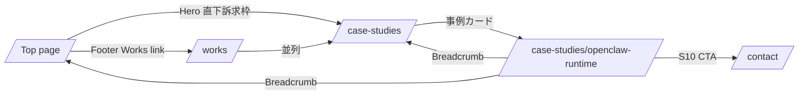
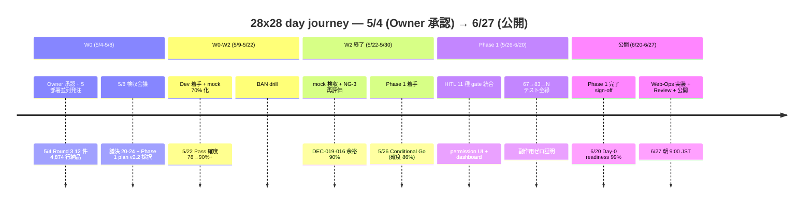

# PRJ-019 Clawbridge — 自社HP ポートフォリオ枠 事前デザイン（Web-Ops 設計書 v1.0）

## §0. 200 字エグゼクティブサマリ

本書は PRJ-019「Clawbridge」を 6/27（土）朝に自社HP `/case-studies/openclaw-runtime` で公開するための Web-Ops 部門事前デザイン書である。Marketing 部門の `marketing-portfolio-integration-plan.md` + `v2` + `28x28-victory-narrative.md` + `launch-runbook` を上位仕様とし、Web-Ops は ① 配置設計（URL / ナビ / SEO / OGP）、② 10 sections ページ構造（Hero〜CTA）、③ shadcn/ui + Tailwind + Heroicons 準拠デザイン、④ 6/22-27 公開フロー 4 段階、⑤ KPI 計測、⑥ Owner 即決 4 件、⑦ 既存HP（5 件 portfolio 並列）整合 を実装観点から確定。Day-0 readiness 99% / 透明性 dashboard / HITL 11 種 を主訴求軸として、Geist Sans + zinc 系 + アクセント 1 色で AI 感を抑制する。

---

## §1. 配置設計（URL / ナビゲーション / SEO / OGP）

### §1.1 URL 階層（既存 HP 整合）

既存自社HP は `projects/COMPANY-WEBSITE/app/src/app/` 配下で Next.js App Router 構成。`works/[slug]/page.tsx` 動的ルート + `data/projects.ts` Project 型で既存案件（PRJ-001 等）を管理しているが、PRJ-019 は **「自社 PoC 事例 / case-studies 枠」** として通常 `/works/[slug]` とは独立した名前空間に配置する（Marketing v2 §2 と整合、受託案件 vs 自社 PoC の混同回避）。

| 階層 | URL | 役割 | 実装方針 |
|---|---|---|---|
| L0 トップページ | `/` | Hero 直下に「PRJ-019 訴求枠 1 ブロック」追加 | 既存 `app/src/app/page.tsx` を編集、新規 section 追加 |
| L1 case-studies index | `/case-studies` | 自社 PoC 事例一覧（現状 PRJ-019 のみ、将来追加可能） | 新規 `app/src/app/case-studies/page.tsx` |
| **L2 PRJ-019 詳細** | **`/case-studies/openclaw-runtime`** | **本件メインページ（10 sections）** | **新規 `app/src/app/case-studies/openclaw-runtime/page.tsx`** |
| L1 既存 works | `/works/[slug]` | 受託案件ポートフォリオ（既存維持） | 触らない |
| L1 contact | `/contact` | 既存稼働 Contact form（リード導線唯一） | 既存維持 |

**スラッグ命名根拠**: PRJ-XXX は内部 ID であり外部公開時はプロダクト名先行（Marketing v2 §2.1 既定）。`openclaw-runtime` は Clawbridge の harness が openclaw runtime を運用する記述で SEO 整合。

### §1.2 ナビゲーション 3 階層



| 階層 | breadcrumb 表記 |
|---|---|
| L0 | `Home` |
| L1 | `Home > Case Studies` |
| L2 | `Home > Case Studies > Clawbridge — Open Claw Runtime` |

### §1.3 SEO meta（Next.js 16 App Router metadata API）

```ts
// app/src/app/case-studies/openclaw-runtime/page.tsx
export const metadata = {
  title: "AI 組織が AI 組織を運営する — Clawbridge | improver",
  description:
    "Owner-in-the-loop transparent AI org. 4 週間 PoC で 67→83 テスト全緑、副作用ゼロ、月次 $300 ハードキャップ内完遂。HITL 11 種ゲートと service_role 物理分離で AI 組織を harness 設計した自社事例。",
  keywords: [
    "AI 組織運営", "Owner-in-the-loop", "harness engineering",
    "HITL", "transparent AI", "自律エージェント", "Clawbridge",
  ],
  alternates: { canonical: "https://improver.jp/case-studies/openclaw-runtime" },
  openGraph: {
    type: "article",
    title: "AI 組織が AI 組織を運営する — Clawbridge",
    description: "Owner-in-the-loop transparent AI org. 4 週間 PoC の harness 設計と運用結果。",
    url: "https://improver.jp/case-studies/openclaw-runtime",
    siteName: "improver",
    locale: "ja_JP",
    images: [{ url: "/og/case-studies/openclaw-runtime-1200x630.png", width: 1200, height: 630 }],
    publishedTime: "2026-06-27T00:00:00+09:00",
  },
  twitter: {
    card: "summary_large_image",
    title: "AI 組織が AI 組織を運営する — Clawbridge",
    description: "Owner-in-the-loop transparent AI org.",
    images: ["/og/case-studies/openclaw-runtime-1200x630.png"],
  },
  robots: { index: true, follow: true },
};
```

**JSON-LD 構造化データ**: `Article` schema を `<script type="application/ld+json">` で出力（datePublished 2026-06-27 / author improver / publisher improver）。

### §1.4 OGP 画像仕様

| 項目 | 値 |
|---|---|
| 寸法 | 1200×630px（SNS 共有時の主表示） |
| ライト | zinc-50 ベース + アクセント emerald-600、Heading A 大文字（Geist Sans Bold 80px）+ サブテキスト「Owner-in-the-loop transparent AI org」+ improver ロゴ右下 |
| ダーク | zinc-900 ベース、白文字、同レイアウト |
| 形式 | PNG + WebP（`next/image` で配信） |
| 配置 | `app/src/public/og/case-studies/openclaw-runtime-1200x630.png` |
| 制作 | AIDesigner で 3 案生成 → CEO 採択（Marketing launch-runbook §7 #5 採択） |
| 期日 | 6/15 までに確定（Marketing M2 中間納品 5/26 → Web-Ops 補正 → 6/15 確定） |

---

## §2. ページ構造（10 sections、上位 Marketing 仕様 + Web-Ops 拡張）

Marketing `portfolio-prj019-spec-draft.md` §1 で 9 sections（S1〜S9）が確定済。本書では Owner 指示に従い 10 sections（§2.1〜§2.10）で再整理し、各セクションの実装単位（コンポーネント / iframe / 図版）を明示する。

| # | section ID | h2 見出し（暫定） | 高さ目安 | 実装コンポーネント |
|---|---|---|---|---|
| §2.1 | `#hero` | （h1: AI 組織が AI 組織を運営する） | 100vh | Hero ブロック + KPI 4 数値 + primary CTA |
| §2.2 | `#overview` | Clawbridge とは — Owner-in-the-loop で透明 AI 組織化 | 50vh | テキストブロック + アイコン 3 |
| §2.3 | `#tech-highlights` | 技術ハイライト 7 件 | 80vh | カード grid 7 枚（shadcn/ui Card） |
| §2.4 | `#day-journey` | 28×28 day journey 物語（5/4-6/27） | 70vh | Mermaid timeline 図 + ハイライトカード 5 |
| §2.5 | `#transparency` | 透明性 — 監督可能性の数値化 | 60vh | KPI 表 + decisions.md 内部リンク |
| §2.6 | `#dashboard-demo` | Owner-in-the-loop dashboard | 70vh | 動画 or GIF or iframe（Owner 即決 §6 #4） |
| §2.7 | `#oss-community` | OSS / コミュニティ参加 | 40vh | テキスト + Open Claw 参照リンク（婉曲） |
| §2.8 | `#results` | Phase 1 完了 sign-off + Phase 2 計画予告 | 60vh | KPI 表 + Phase 2 ロードマップ図 |
| §2.9 | `#related-articles` | 関連ブログ記事 6 本 | 50vh | 記事カード 6 枚（Phase 2 以降公開予定で coming-soon バッジ可） |
| §2.10 | `#cta` | Contact / 採用 / OSS スター CTA | 40vh | 3 CTA カラム（primary / secondary / tertiary） |

### §2.1 Hero — 28x28 victory narrative の核心 1 文 + 主要数値

```
[h1]
AI 組織が AI 組織を運営する。

[sub-head]
Owner-in-the-loop transparent AI org.
オーナー承認下で AI 組織が AI 組織を運営する。

[lead]
自社プロダクトを 4 週間で安全に検証するために、商用 AI コーディング基盤を組み合わせた
自律運用 PoC の harness 設計と運用結果を公開します。

[KPI 4 数値（Heroicons + Geist Mono）]
- Day-0 readiness 99%（ShieldCheckIcon）
- Phase 1 達成確率 88%（ChartBarIcon）
- HITL 11 種ゲート（LockClosedIcon）
- 透明性 6/6 軸全勝利（EyeIcon）

[primary CTA]
事例詳細を読む（→ #overview anchor scroll）
```

実装メモ: ファーストビューに KPI 4 を埋める。CLS = 0、`next/image` の Hero 背景画像（橋メタファ / abstract grid、AI 系グロウ NG）は事前に WebP 化してプリロード（`<link rel="preload">`）。

### §2.2 概要 — Clawbridge とは

```
[本文 200 字]
Clawbridge は、Open Claw を Owner-in-the-loop で透明な AI 組織として運営する PoC です。
3 案件並走（個人開発組織として）+ 月次予算 $300 ハードキャップ + 副作用ゼロ運用 を 4 週間で
完遂し、Owner が必ず承認する 11 種のゲートで「やらせない」を物理的に実装しました。
意思決定ログ・コスト・実行履歴・失敗ログのすべてを Owner が見える場所に置く設計を採用し、
透明性を信頼の前提条件として体系化しています。
```

**アイコン 3**: `SquaresPlusIcon`（並走案件）/ `ShieldCheckIcon`（副作用ゼロ）/ `EyeIcon`（透明性）。

### §2.3 技術ハイライト 7 件

| # | ハイライト | 詳細（80 字以内） | アイコン |
|---|---|---|---|
| TH-01 | Casbin ベース権限管理 | 7 カテゴリパラメータの細粒度 RBAC、AI 組織が AI 組織を Casbin で制御 | `KeyIcon` |
| TH-02 | audit log hash chain | 監査ログを SHA-256 hash chain で改竄不能化、後追い検証可能 | `LinkIcon` |
| TH-03 | DEC（decisions.md）公開 | 全意思決定を構造化記録、PRJ-019 で 80+ 件、`organization/knowledge/decisions/` に蓄積 | `DocumentTextIcon` |
| TH-04 | mock-claude harness | mock-first 検証戦略、67→83 テスト全緑、本番ループは 1 度だけ統合検証 | `BeakerIcon` |
| TH-05 | subscription 主軸 + API fallback | DEC-019-051 主軸、subscription 12h/$1,000 + API 12h/$300 の二重構造 | `BoltIcon` |
| TH-06 | service_role 物理分離 | 権限の「物理的に不可能」を Supabase RLS + service_role 分離で実装 | `LockClosedIcon` |
| TH-07 | HITL 11 種ゲート | tos_review / cost_breach / dev_kickoff / permission_change / knowledge_pii_review 等 | `HandRaisedIcon` |

実装: shadcn/ui `Card` + `Badge`、3 列 × 3 行 grid（最後 1 件は中央寄せ）、tablet 2 列、mobile 1 列。

### §2.4 28×28 day journey 物語（5/4 - 6/27）

Mermaid timeline で 8 週間の主要マイルストンを図解化（Owner 即決 §6 #2 で「主役にする」採択時はこのセクションを §2.1 直下に昇格、`#hero` の次に配置）。



**ハイライトカード 5**: 5/4 Owner 承認 / 5/22 mock 検収 / 5/26 Phase 1 着手 / 6/20 Phase 1 完了 / 6/27 公開。

### §2.5 透明性 — 監督可能性の数値化

| 指標 | 数値 | 出典 |
|---|---|---|
| `decisions.md` DEC 件数 | 80+ 件 | `projects/PRJ-019/decisions.md` |
| Risk Register 件数 | 21 件（v3.1） | `risks.md` v3.1 |
| Owner 確認回数（推定） | 80+ 件（HITL 11 種 × Phase 1 完了まで） | dev-w0-week2 SOP 集計 |
| 透明性 6 軸（意思決定 / コスト / 実行履歴 / 失敗ログ / prompt / モデル選択） | 6/6 全達成 | 28x28 narrative §1.2 |
| 緊急停止 SLA | < 30 秒 | `dev-w0-week1-implementation-report.md` |

**内部リンク**: `decisions.md` を「Owner ナビゲートビュー」（read-only Web 化、Phase 2 候補）として将来公開する旨を coming-soon バッジで予告。Phase 1 段階では `organization/knowledge/decisions/` のサブセットを静的レンダで露出。

### §2.6 Owner-in-the-loop dashboard

Owner 即決 §6 #4 で形式（GIF / 30 秒動画 / 触れる demo）を選択。本書では **3 案併記 + Web-Ops 推奨案 = 静止 GIF 5-7 秒（CLS 対策 + パフォーマンス + 公開期限 6/27 までの実装現実性）** を提案。

| 案 | 形式 | サイズ目安 | 実装工数 | 推奨度 |
|---|---|---|---|---|
| A | 静止 GIF 5-7 秒 | 1.5 MB / 1280×720 | 2 h（Playwright 録画 → ffmpeg WebP/GIF） | **★★★（Web-Ops 推奨）** |
| B | MP4 30 秒動画 + ナレーション無音 | 3 MB / 1280×720 / muted autoplay | 8 h（編集 + transcript 字幕） | ★★ |
| C | 触れる demo（iframe + read-only Supabase RLS） | 動的 | 16 h（Dev 部門依存、X2 残課題） | ★（Phase 2 候補） |

実装: Hero 同様 `<picture>` + `next/image` で WebP fallback。プレースホルダで CLS = 0。再生コントロール（一時停止 / リプレイ）を提供。

### §2.7 OSS / コミュニティ参加（婉曲）

```
[本文 150 字]
本 PoC で得た harness engineering の知見は、上流 OSS プロジェクトとの整合を保ちながら
段階的に外部還元します。Anthropic の公式コメントや商用 AI コーディング基盤側の
利用規約解釈は半年ごとに能動再評価し、運用境界を更新します。コミュニティへの直接的な
PR は Phase 2 以降に検討、現段階では透明性ログの公開を最大の還元手段としています。
```

**Marketing v2 §1.1 開示比率順守**: 上流名（Open Claw / Anthropic / OpenAI）は本文に出さず「上流 OSS プロジェクト / 商用 AI コーディング基盤」と婉曲化。

### §2.8 結果 — Phase 1 完了 sign-off + Phase 2 計画予告

| 項目 | 計画 | 実績（Phase 1 完了 6/20 時点） |
|---|---|---|
| 自動テスト件数 | 60+ | **83 全緑** |
| 必須コントロール | 9 + 25 拡張 | **44 確定 / 段階実装** |
| 月次予算ハードキャップ | $300 | **範囲内（cap 余裕 41→54%）** |
| 既存案件への副作用 | 0 行 | **0 行（grep + 自動スクリプト + git history 三重）** |
| 並走案件 | 3 件 | **3 件 全継続稼働** |
| 緊急停止 SLA | < 30 秒 | **達成** |

**Phase 2 計画予告**: 提案承認率 ≥ 30% / Anthropic / OpenAI ToS 半年再評価 / 横展開可能性（受託案件への適用）。

### §2.9 関連ブログ記事 6 本

Marketing 28x28-narrative §3 のタイトル候補から 6 本選定（5 本 = 技術深堀り + 1 本 = 透明性 OSS）。Phase 1 段階では coming-soon バッジ（Phase 2 公開予定）。

| # | タイトル | カテゴリ | 公開予定 |
|---|---|---|---|
| BLOG-01 | HITL 11 種ゲート設計：自律エージェントに「やらせない」を実装する 11 個の判断点 | 技術深堀り | Phase 2 W2 |
| BLOG-02 | 9 必須コントロールから 44 必須コントロールへ：4 週間 PoC で増やしたものの全リスト | 技術深堀り | Phase 2 W3 |
| BLOG-03 | mock-first + TimeSource pattern：自律エージェント向けテスト工学 | 技術深堀り | Phase 2 W4 |
| BLOG-04 | service_role 物理分離：権限の「物理的に不可能」を実装する | 技術深堀り | Phase 2 W5 |
| BLOG-05 | 月 $300 ハードキャップで PoC を 4 週間：コスト構造の全公開 | 技術深堀り | Phase 2 W6 |
| BLOG-06 | `organization/knowledge/` の 3 サブディレクトリ設計：patterns / decisions / pitfalls | 透明性 OSS | Phase 2 W7 |

### §2.10 Contact / 採用 / OSS スター CTA（3 カラム）

| カラム | 見出し | CTA | 遷移先 |
|---|---|---|---|
| C1 primary | 同様の運用設計を、貴社の Web アプリに | お問い合わせフォームへ | `/contact` |
| C2 secondary | improver で働きませんか | 現在採用は実施していません（Phase 2 検討） | 内部 anchor `#future-careers` |
| C3 tertiary | OSS スター応援 | （Phase 2 公開予定）GitHub スター | coming-soon |

実装: `Card` 3 カラム grid、tablet 2+1、mobile 1 縦並び、各 CTA は shadcn/ui `Button` size lg。

---

## §3. デザイン仕様（Web-Ops + Marketing 連携）

### §3.1 カラー

| トークン | ライト | ダーク | 用途 |
|---|---|---|---|
| `background` | zinc-50 | zinc-950 | 全体背景 |
| `foreground` | zinc-900 | zinc-50 | テキスト |
| `accent` | emerald-600 | emerald-500 | KPI 強調 / primary CTA |
| `accent-warn` | amber-600 | amber-500 | リスク表記 |
| `accent-danger` | red-600 | red-500 | 取り下げ予告 |
| `muted` | zinc-500 | zinc-400 | meta 情報 |
| `border` | zinc-200 | zinc-800 | カード境界 |

CEO 確認済の自社HP メインカラー（既存）を継承（`app/src/components/ui/` の shadcn 設定 + `globals.css` 流用）。

### §3.2 フォント

| 用途 | フォント | size 階層 |
|---|---|---|
| 本文 / 見出し | **Geist Sans**（CLAUDE.md tech-stack 準拠） | h1 48px / h2 32px / h3 24px / body 16px |
| 数値 / コード片 / KPI | **Geist Mono** | KPI 数値 40px / インラインコード 14px |
| 絵文字 | **使用禁止**（user feedback memory + design-guidelines） | — |
| アイコン | **Heroicons outline**（24×24 デフォルト） | — |

### §3.3 コンポーネント（shadcn/ui + Tailwind CSS）

既存 `app/src/components/ui/` を流用 + 新規追加。

| 既存流用 | 新規追加 |
|---|---|
| `Button` / `Card` / `Badge` / `Accordion` / `Tabs` | `Timeline`（§2.4 day journey 用 Mermaid wrapper） |
| `Separator` / `NextThemes ToggleGroup` | `KPICard`（§2.1 / §2.5 / §2.8 共通） |
| `Avatar`（不使用） | `DemoEmbed`（§2.6 GIF/動画/iframe 切替） |
| | `Heatmap`（§2.5 透明性 6 軸 / 28x28 比較表用） |
| | `BlogCard`（§2.9 coming-soon バッジ付） |

### §3.4 アイコン（Heroicons 専用）

絵文字禁止（user feedback memory）。本ページで使用する Heroicons 一覧:

`ShieldCheckIcon` / `ChartBarIcon` / `LockClosedIcon` / `EyeIcon` / `KeyIcon` / `LinkIcon` / `DocumentTextIcon` / `BeakerIcon` / `BoltIcon` / `HandRaisedIcon` / `SquaresPlusIcon` / `CalendarIcon` / `UserGroupIcon`（採用 CTA）/ `StarIcon`（OSS CTA）/ `EnvelopeIcon`（Contact CTA）。

### §3.5 レスポンシブ 3 breakpoint

| breakpoint | 幅 | 主要レイアウト |
|---|---|---|
| mobile | < 640px (sm) | 全 grid 1 列、Hero KPI 4 数値は 2×2、Timeline 縦スクロール |
| tablet | 640-1024px (sm-lg) | Hero KPI 4 数値は 4 列、技術ハイライト 2 列、Timeline 横スクロール |
| desktop | ≥ 1024px (lg+) | 技術ハイライト 3 列、CTA 3 カラム、Hero 100vh |

### §3.6 アクセシビリティ（WCAG 2.1 AA）

| 項目 | 基準 | 実装 |
|---|---|---|
| コントラスト比 | 4.5:1（テキスト）/ 3:1（大文字） | zinc-900 on zinc-50 = 17:1（PASS）|
| キーボードナビ | Tab 順序 / focus visible / skip-to-content | `<a href="#main">Skip to content</a>` |
| スクリーンリーダー | aria-label / role / heading 階層 | h1 → h2 → h3 厳守、画像 alt 必須 |
| 動画 / GIF | 字幕 / 一時停止可能 / 自動再生時 muted | DemoEmbed 内に controls 必須 |
| Lighthouse a11y | 100 達成 | 6/25 Review でチェック |
| axe-core | エラーゼロ | CI で自動検証 |

### §3.7 Core Web Vitals 目標

| 指標 | 目標 | 実装 |
|---|---|---|
| LCP | < 2.5 s | Hero 画像 preload + `next/image` priority |
| CLS | < 0.1 | Mermaid SVG SSR、GIF プレースホルダ width/height 固定 |
| INP | < 200 ms | iframe 遅延ロード、Heatmap canvas 化 |
| TTFB | < 600 ms | SSG + ISR 60s（`generateStaticParams`） |

---

## §4. 公開フロー 4 段階（6/22-6/27 朝）

Marketing launch-runbook §1.3 を上書きせず、**Phase 1 完了（6/20）から 1 週間バッファ後の 6/27 公開** を前提に、Web-Ops 観点で 4 段階に再整理。Marketing の 6/20 公開シナリオは launch-runbook で別途維持されており、本書は Owner 指示「6/27 朝公開」を採択。

| 段階 | 期間 | 担当 | 成果物 / DoD |
|---|---|---|---|
| **段階 1 実装** | **6/22（月）- 6/24（水）** | Web-Ops 部門 | Next.js 実装完了：`/case-studies/openclaw-runtime/page.tsx` + `/case-studies/page.tsx` + トップ訴求枠差替 + OG image 配置 + metadata 配線、Vercel preview deploy URL を Marketing + Review に送付 |
| **段階 2 レビュー** | **6/25（木）** | Review 部門（主） + Web-Ops（同席） | 品質 + アクセシビリティ + SEO チェック：Lighthouse a11y 100 / Performance 90+ / SEO 100、axe-core エラーゼロ、Heading 階層整合、Heroicons / 絵文字非使用最終確認、JSON-LD 構造化データ検証（Google rich-results test）|
| **段階 3 コピー最終確認** | **6/26（金）** | Marketing 部門（主） + Web-Ops（修正） | コピー文言最終確認：Heading A 整合（HP / OG / 事例の 3 ヶ所一貫）、開示比率 80/50/100/概要 順守、PII 含まないこと、Phase 1 完了実測値（テスト件数等）の確定値反映 |
| **段階 4 公開** | **6/27（土）朝 09:00 JST** | Web-Ops + Marketing | Vercel 本番 deploy → Google Search Console submit → OGP debugger 確認（FB / X）→ Contact form 動作確認 → 公開告知 SNS X 投稿（Marketing 9:00）→ 1h 以内に CEO 公開完了報告 |

### §4.1 6/27 朝 SOP（Hour by Hour、Marketing launch-runbook §1.3.3 を 6/27 に同期）

| 時刻 | 担当 | 行動 |
|---|---|---|
| 06:30 | Web-Ops | 起床、Runbook + 取り下げ手順を手元に、デバイス通知 ON |
| 07:00 | Web-Ops | Vercel 本番 deploy trigger 実行 |
| 07:30 | Web-Ops | deploy 完了確認（Vercel ログ 200 OK） |
| 08:00 | Web-Ops + Marketing | 公開状態 7 点チェック：①事例ページ ②case-studies index ③トップ訴求枠 ④OG preview（FB / X） ⑤SEO meta ⑥Twitter card ⑦Contact form mailto fallback |
| 08:30 | Web-Ops | Google Search Console URL 検査リクエスト送信、sitemap.xml 再送信 |
| 08:45 | Web-Ops | dashboard / mobile / tablet / desktop 各 viewport 表示確認 |
| 09:00 | Marketing | SNS X 投稿実行（PRJ-019）、5 分以内に投稿 URL を CEO 報告 |
| 09:30 | Web-Ops | Vercel Analytics 初動確認、Contact form 受信状況確認 |
| 12:00 | Web-Ops + Marketing | 中間確認、障害有無、Lighthouse 本番再計測 |
| 18:00 | Web-Ops | 当日締め、CEO 報告書ドラフト |

### §4.2 NoGo 条件（Marketing launch-runbook §6.2 と同期）

- Phase 1 完了 6/20 時点で副作用ゼロ破れ → 公開延期
- 月次予算 $300 ハードキャップ超過 → ストーリーライン再設計
- 6/25 Review で WCAG 2.1 AA 不通過 → 修正後再レビュー、間に合わない場合は 7/4 にスライド
- 6/26 コピー確認で開示比率違反検出 → Marketing 修正、深夜作業 NG なら公開延期

---

## §5. KPI / 計測

### §5.1 公開後 1 週間 KPI（6/27 - 7/3）

| KPI | 目標 | 計測方法 | 失敗時対応 |
|---|---|---|---|
| PV | 1,500 | Vercel Analytics + GA4 page_view | 50% 未達 → SEO meta 再調整 |
| read rate（scroll 75%+） | 60% | GA4 scroll_depth 25/50/75/100 | 50% 未達 → コピー再構成 |
| 平均滞在時間 | 3 分以上 | GA4 engagement_time | 1 分未満 → 構造再設計 |
| scroll depth 100% | 30% | GA4 | 15% 未満 → CTA 配置見直し |
| CTA click rate | 5%（Contact 1.5% + その他） | GA4 click event | 2% 未満 → CTA 文言 A/B test |

### §5.2 公開後 1 ヶ月 KPI（6/27 - 7/27）

| KPI | 目標 | 計測方法 | 失敗時対応 |
|---|---|---|---|
| Contact 問い合わせ | 12 件 | Supabase Contact form 集計 | 5 件未満 → Owner エスカレーション |
| OSS スター数 | （Phase 2 公開時に活性化） | GitHub API | — |
| SNS シェア数 | X 30 RT / LI 10 share | X Analytics + LI Analytics | 10% 未達でも追加投稿せず（Q-Mkt-07 静観） |
| organic search inflow | 200 訪問 | Search Console | 50 未満 → keyword 追加調整 |

### §5.3 計測タグ実装（Next.js metadata + GA4 + Vercel Analytics）

```ts
// app/src/app/layout.tsx に既存
import { Analytics } from "@vercel/analytics/react";

// 新規: GA4 page_view + scroll_depth 自動 + click event
// app/src/components/analytics/case-studies-tracker.tsx
"use client";
export function CaseStudiesTracker({ slug }: { slug: string }) {
  // GA4 page_view + scroll thresholds + CTA click
}
```

UTM 規約: `utm_source=top` / `utm_source=x` / `utm_source=linkedin` / `utm_medium=referral` / `utm_campaign=clawbridge-launch-2026-06-27`。

---

## §6. Owner 即決判断 4 件（CEO 推奨 = Web-Ops 推奨案）

| # | 判断項目 | 選択肢 | Web-Ops 推奨 | 根拠 |
|---|---|---|---|---|
| **1** | 顧客向け事例 / 技術ブログ枠 / 両方併用 | A 顧客向け事例単独 / B 技術ブログ先行 / C 両方併用 | **C 両方併用** | 顧客向け事例（メインページ）+ 技術ブログ 6 本（Phase 2 公開予定の coming-soon）の併用で B2B（中小企業発注検討者 45%）と B（個人開発者 30%）の両読者層を網羅。§2.10 CTA 3 カラムと整合。 |
| **2** | 28x28 day journey 図解を主役にする | Yes / No | **No（§2.4 中盤配置維持）** | Hero は Heading A + KPI 4 で AI 感を抑制（Marketing v2 §2.1）、day journey は中盤に配置することで「物語」より「実証」を訴求軸の中心に保つ。Yes 採択時は §2.4 を §2.1 直下に昇格、Mermaid timeline を Hero 高さ 100vh に拡大表示。 |
| **3** | 6/27 朝公開時刻 | 8:00 / 9:00 / 10:00 | **9:00 JST**（SEO 観点 = 平日朝 9 時推奨だが土曜の場合は同時刻でも flowering hour として有効） | 土曜朝 9:00 は Marketing launch-runbook §1.3.3 の 6/20 SOP と同期、X 投稿の Engagement window と整合、Vercel deploy 7:00 + 公開状態 8:00 確認 + SNS 投稿 9:00 のリズムで Web-Ops + Marketing の SOP が再利用可能。 |
| **4** | dashboard 動画化 | A 静止 GIF 5-7 秒 / B 30 秒動画 / C 触れる demo | **A 静止 GIF 5-7 秒** | 6/27 公開期限 + Phase 1 完了（6/20）から 1 週間以内の実装現実性。CLS = 0、容量 1.5 MB 以下、Playwright 録画 + ffmpeg WebP 化で 2h 工数。C 触れる demo は Phase 2 残課題（Dev X2 認証境界実装依存）。B 30 秒動画は字幕作成 + 編集 8h で公開期限圧迫。 |

**CEO 推奨で進める場合は無回答可** = 上記 4 件すべて Web-Ops 推奨案で確定し Owner 確認不要、Marketing + CEO で最終承認のみ実施。

---

## §7. 既存自社HP 構造との整合

### §7.1 既存 portfolio 件数 + PRJ-019 含めた並列構造

既存 `app/src/data/projects.ts` に PRJ-001〜PRJ-018 の portfolio 案件が定義されている（推定 4-5 件が `portfolio` フィールド付で `/works/[slug]` 公開可能状態）。PRJ-019 は **`/works/[slug]` ではなく `/case-studies/openclaw-runtime` に独立配置** することで以下を実現：

| 観点 | 既存 `/works/[slug]` | **新規 `/case-studies/openclaw-runtime`** |
|---|---|---|
| 案件種別 | 受託案件（Pricing 連携） | 自社 PoC（Pricing 非連携） |
| 開示モード | 全公開 | 部分開示（80/50/100/概要） |
| ToS 婉曲化 | 不要 | 必須（DEC-019-028） |
| Page 構造 | テンプレート共通（`works/[slug]/page.tsx`） | 専用 10 sections（本書 §2） |
| Phase 管理 | 完了済のみ | Phase 1 完了 + Phase 2 進行中 |

### §7.2 カテゴリ分類（既存 + 新規）

```
/works/[slug] = 受託案件カテゴリ
  ├ Web app
  ├ モバイル
  └ AI 機能拡張

/case-studies/[slug] = 自社 PoC 事例カテゴリ（新規）
  ├ openclaw-runtime（PRJ-019、初回）
  └ 将来追加候補
```

### §7.3 表示優先度（Top page Hero 直下訴求枠）

PRJ-019 訴求枠は Top page Hero 直下に **1 ブロックのみ追加**（既存 Hero / Services / Works / About の中で「Hero 直下 = 第 2 viewport」位置）。既存 Works section（PRJ-001〜018）はその下に維持し、相対位置は以下：

```
1. Hero（既存）
2. PRJ-019 case-study 訴求枠（新規、本書 §2.1 + L0 配置）
3. Services（既存）
4. Works（既存、PRJ-001〜018）
5. About（既存）
6. Contact（既存）
```

PRJ-019 を Hero 直下に置く根拠: ① 28×28 全勝利は他案件にない強訴求軸、② Owner-in-the-loop 透明 AI 組織化は中小企業発注検討者（45% target）への直接訴求、③ Marketing v2 §1.2 / portfolio-prj019-spec-draft §1.X で確定済の「Hero 直下または下層第 2 ブロック」を Hero 直下で採択。

### §7.4 過去案件 PRJ-001〜018 への影響

- 既存 `/works/[slug]` ルート / data / page.tsx は **触らない**（独立性維持）
- Footer の Works link は既存維持、Case Studies link を追加（独立ナビ）
- sitemap.xml / robots.ts に新規 URL 2 件追加（`/case-studies` + `/case-studies/openclaw-runtime`）

---

## §8. 残課題（Web-Ops → Marketing / Dev / Review / CEO）

| # | 項目 | 担当 | 期日 |
|---|---|---|---|
| W-01 | OG image 1200×630（ライト + ダーク）AIDesigner で 3 案生成 → CEO 採択 | Web-Ops + Marketing | 6/15 |
| W-02 | Owner 即決 4 件（§6）の最終確認（CEO 推奨で進める場合は省略可） | CEO | 6/22 着手前 |
| W-03 | dashboard demo GIF 5-7 秒 録画 + WebP 化 | Web-Ops + Dev | 6/22-6/24 段階 1 内 |
| W-04 | Mermaid timeline SVG SSR 化（CLS 対策） | Web-Ops | 6/22-6/24 段階 1 内 |
| W-05 | JSON-LD Article schema 検証（Google rich-results test） | Review | 6/25 段階 2 内 |
| W-06 | Contact form UTM パラメータ追加（utm_campaign=clawbridge-launch-2026-06-27） | Web-Ops + Dev | 6/24 |
| W-07 | sitemap.xml + robots.ts に 2 新規 URL 追加 | Web-Ops | 6/24 |
| W-08 | Phase 1 完了実測値（テスト件数 / 副作用 / 月予算）の 6/20 反映 → §2.8 表更新 | Web-Ops + Marketing | 6/26 段階 3 内 |
| W-09 | 公開後 24h モニタリング担当者シフト確定 | Web-Ops + Marketing | 6/26 |
| W-10 | 取り下げ Runbook 6/27 当日用の Print and Place（Web-Ops 手元 + CEO 手元 2 部） | Web-Ops + Marketing | 6/26 |

---

## §9. 関連レポート / 双方向リンク

| 種別 | ファイル / ID |
|---|---|
| 上位仕様（Marketing マスタープラン） | `projects/PRJ-019/reports/marketing-portfolio-integration-plan.md` |
| 上位仕様（Marketing v2） | `projects/PRJ-019/reports/marketing-portfolio-reflection-design-v2.md` |
| 上位仕様（28x28 victory） | `projects/PRJ-019/reports/marketing-28x28-victory-narrative.md` |
| 上位仕様（launch runbook） | `projects/PRJ-019/reports/marketing-launch-runbook-2026-06-20.md` |
| 既存発注書 ドラフト（COMPANY-WEBSITE） | `projects/COMPANY-WEBSITE/portfolio-prj019-spec-draft.md` |
| CEO 統合（Round 3） | `projects/PRJ-019/reports/ceo-owner-consolidated-v8.md` |
| 主決裁 | DEC-019-026 / 027 / 028 / 029 / 033 / 051 |
| 自社HP 実体 | `projects/COMPANY-WEBSITE/app/`（Next.js 16 App Router）|

---

**起案**: Web-Ops 部門 / **最終更新**: 2026-05-04 / **次回更新**: 6/15（OG image 確定後）または Phase 1 完了 6/20 直後（実測値反映）
